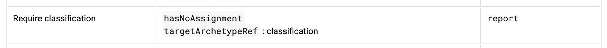

= Writing Evolveum Documentation
:page-toc: top
:page-display-order: 50
:page-description: This document provides overview of how the docs site works, and how to write and maintain Evolveum documentation.
:page-upkeep-status: yellow
:experimental:

// TODO: copyright and trademarks
// TODO: upkeep-status and upkeep-note
// TODO: keywords, description and other "SEO" and indexing thingies



This document provides overview of how the _docs_ site works, and how to write and maintain Evolveum documentation.

== Overview

The "docs" site is built using https://jekyllrb.com/[Jekyll] static site generator, spiced up with https://asciidoctor.org/[Asciidoctor] and other goodies.
The site is generated from the "sources" into static HTML files.
There is no dynamic interpretation of HTTP requests, however there is some client-side JavaScript to improve site presentation.
Everything has to be generated before the first request comes, including headers, footers, navigation and everything else.

Site sources are maintained in the following GitHub locations:

* https://github.com/Evolveum/midpoint/tree/master/docs[`midPoint` repository] - Reference documentation (versioned), i.e., the content you find under xref:/midpoint/reference[MidPoint > Configuration reference].
* https://github.com/Evolveum/docs[`docs` repository] - More general documentation (unversioned), i.e., the rest of the documentation, except for The Book.
* https://github.com/Evolveum/midpoint-book[`midpoint-book` repository] - The Book.

For the `docs` and the `midPoint` repositories, there is an automatic hook in GitHub, that triggers a rebuild of the site when the source code is updated.

[NOTE]
====
xref:/book[The Book] is a special part of midPoint documentation.
It resembles a physical book both in its form and release process. +
The Book is built and released separately from the rest of the documentation. +
Its release intervals are unfixed and infrequent.
This means that while you can contribute to The Book at any time, your changes will not appear on the site immediately.
====

== AsciiDoc

Bulk of the documentation is maintained in https://asciidoc.org/[AsciiDoc] format.
If you are new to AsciiDoc, brief primer follows shortly - but you better also check the https://docs.asciidoctor.org/asciidoc/latest/[official docs].
If you are familiar with AsciiDoc, you can start writing your documents right away.
Please, use the https://asciidoctor.org/docs/asciidoc-recommended-practices/#one-sentence-per-line[one sentence per line] convention.

Use AsciiDoc whenever possible.
Jekyll that runs this site allows also other documentation formats, such as HTML or Markdown.
Use HTML only in case AsciiDoc would not do the job, or it would be very complicated.
Do not use Markdown at all.
We do not like Markdown here.

=== AsciiDoc Primer

AsciiDoc is similar to Markdown, but some of the markup is different.

* Line-breaks are normally treated as any other whitespace.
Multiple whitespaces result in a single space.
But there are sections where the white space matters, such as code sections, etc.

* Paragraphs are easy.
Write senteces one after another - remember, one sentence per line.
You may split longer sentences to more lines, if you can't split them into multiple sentences.
But always start a new sentence on the new line.
And paragraphs?
Just separate them with an empty line.

* If you really want a line brake finish the line with a space and plus. +
It doesn't create real new paragraph as there is no space between the lines - it merely adds the line break. +
As demonstrated here. +
Don't overdo it!

* Headings are made with `=` characters, one character per level.
There should only be one top-level header at the start of the document.
Then use `==` headings, inside such sections use `===` for 3rd level heading, etc.
Don't skip levels, it's considered an error.

* Inline formatting is easy, wrap _italics text_ within a pair of `_` characters, *bold stuff*
is demarcated with `++*++` and `monospace` with `++`++` (backticsks).
If it doesn't work, then the beginning or end is not around words - in that case, just double the
character on each side li**ke th**is: `++li**ke th**is++`

* Sometimes you want to use these chars without their special meanings, just like +*this*+.
Wrap the text with `pass:[++]` to be left alone or use `++pass:[...]++` macro.
See https://docs.asciidoctor.org/asciidoc/latest/pass/pass-macro/[Inline Passthroughs] for more info.

* Create lists with `++*++` as the bullets at the start of the line.
Numbered lists are created with `.`, or you can even write `1.` and so on, but the numbers will be renumbered for you anyway.

This should do it for now, things like code sections, links, tables and much more can be found in the following sections.
And after all, there are tons of `++*.adoc++` examples in this repo.

== Creating Pages

Site source code has almost exactly the same structure as the generated website.
A picture stored as `midpoint/foo/bar.png` in the site source code will be published as `https://docs.evolveum.com/midpoint/foo/bar.png`.
For text documents, Jekyll automatically converts them and hides file extension.
Therefore `midpoint/foo/bar.adoc` becomes `https://docs.evolveum.com/midpoint/foo/bar/`.

AsciiDoc pages can be created in a very straightforward way.
Just place your document in a suitable directory, make sure it has `adoc` extension and that's it.
The document should be well-formatted AsciiDoc document.
In that case Jekyll takes all the data and meta-data from the document itself, properly setting document title, placing it in the navigation and all the other things.
*AsciiDoc is strongly recommended* method of creating and maintaining documents.
https://www.jetbrains.com/idea/[IntelliJ IDEA] has a very convenient plugin for AsciiDoc editing.
Developers and engineers would probably like to clone the site sources from gitlab and open them as a project in the IDEA.

While Jekyll does almost all the work transparently for AsciiDoc documents, other document types need a couple of additional things.
Especially HTML documents usually need a place to specify document title and other meta-data.
This place is called _front matter_, it is located at the beginning of the document:

[source,html]
----
---
layout: page
title: IAM Best Practice
nav-title: Best Practice
display-order: 700
---

    These are the things that work in IAM deployments.

... other HTML elements ...
----

In this case, the front matter sets document title, navigation title and display order.
It also specifies page layout (see later), and it may also specify almost arbitrary data and meta-data for the page.
Front matter is YAML-formatted.
However, the most common form of front matter is just a simple attribute-value list as the one shown above.

AsciiDoc documents may also specify front matter, just as shown in the HTML example above.
Additionally, AsciiDoc has its own https://docs.asciidoctor.org/asciidoc/latest/attributes/attribute-entries/[Document Attributes] mechanism.
When you write front matter attributes using AsciiDoc attributes mechanism, add `page-` prefix to the attribute name.
The front matter above can be rewritten with AsciiDoc attributes like this:

[source,asciidoc]
----
= IAM Best Practice
:page-nav-title: Best Practice
:page-display-order: 700

These are the things that work in IAM deployments.

... other AsciiDoc things ...
----

[NOTE]
AsciiDoc can have both front matter section and AsciiDoc attributes.
Not all AsciiDoc attributes are necessarily meant for the front matter (which is a Jekyll/Liquid mechanism).
Those that target the front matter section (e.g. Page attributes documented lower) must be prefixed with `page-`.

However, AsciiDoc documents usually do not need any front matter or attributes at all.
E.g. in this case we did not even need to specify title and layout.
Title was taken from AsciiDoc title, and `page` layout was applied by default.
Everything is easier with AsciiDoc.

== Directory Structure

Site source code follows closely the resulting site structure, except for some URL translations.
Such translations usually apply to asciidoc documents and index files (`index.html`, `index.adoc`).
It is perhaps best to explain the URL translation on examples:

[%autowidth]
|====
| Source file location | URL | Note

| `index.html`
| `https://docs.evolveum.com/`
| Site home document

| `foo/bar.adoc`
| `https://docs.evolveum.com/foo/bar/`
|

| `foo/bar.html`
| `https://docs.evolveum.com/foo/bar/`
|

| `foo/index.adoc`
| `https://docs.evolveum.com/foo/`
| `index.adoc` is a special name that stands for the entire directory.

| `foo/index.html`
| `https://docs.evolveum.com/foo/`
| `index.html` is a special name that stands for the entire directory.

| `foo/bar.png`
| `https://docs.evolveum.com/foo/bar.png`
| Image files (`*.png`, `*.jpg`), PDFs (`*.pdf`) and similar data files are not translated.

|====

Which means that there are two ways how to store your document:

* `foo.adoc`: This is suitable for simple documents that do not have any embedded data.
It can work well even for long documents.

* `foo/index.adoc`: Good method for documents that contain embedded data, such as pictures.
The best strategy is to place the pictures into the same directory as `index.adoc`.
You will have everything neatly stored in one place.

Both methods will results in the same URL.
URL is all that matters for the web.
You can change `foo.adoc` to `foo/index.adoc` at any time and Jekyll will generate the same URL.
Therefore you can easily start with `foo.adoc` and then switch to `foo/index.adoc` later if needed.

== Links

We love links.
Please, put a lot of links in your documents.
There are two ways how to do it: `link` or `xref`.

=== Xref and Xrefv Macro

Xref macro (`xref`) is intended for cross-referencing in a document and between documents.
We use the `xref` macro for links in our site:

[source,asciidoc]
----
Please see xref:/foo/bar.adoc[FooBar page] for more details.
You can also use simple xref:bar.adoc[], document title will be automatically used as link text.
----

The `xref` macro points to the source file, not to the URL.
In this case Evolveum plugins take care of proper translation of file names to URLs.
However, you can also use directory URLs, just make sure they end with slash (`/`) character:

[source,asciidoc]
----
This is a link to xref:/midpoint/projects/midprivacy/[MidPrivacy initiative].
----

The plugin checks that the xref points to an existing site page.
There will be an error message during the build if the link is broken.

If you use xref for linking a reference page (anything under `/midpoint/reference` is taken from *Evolveum/midpoint* repository), please do not specify the version.
By default, the xref macro automatically adds the current version to the link.
If you copy the link from the URL bar, remove the segment after `reference/`, e.g. `support-4.8/`.
If you want to link a specific version of a page, use our non-standard macro `xrefv`.
Generally, prefer the non-versioned links with `xref` wherever possible.

Links inside a document (links to anchors) can be made with the usual hash (`#`) character:

[source,asciidoc]
----
Please see xref:#_upgrade[Upgrade] section for more details.
----

You can use anchors automatically generated by asciidoctor for each section.
E.g. anchor `#_see_also` is automatically generated for section `See Also`.
Explicit anchors can be placed at the beginning of line, if needed:

[source,asciidoc]
----
[#refs]
== References

The refs anchor applies to this section.

The ref1 anchor is placed [#ref1]#here#, it can be used to reference to this text.
----

.Implementation details
TIP: This is not a default behavior of Asciidoctor or Jekyll.
This functionality was implemented as Asciidoctor extension in link:https://github.com/evolveum/evolveum-jekyll[evolveum-jekyll-plugin] gem.
There is a custom inline macro processor for the `xref` macro that looks up appropriate Jekyll page, determines the URL and (optionally) a link title.

=== Link Macro

AsciiDoc has a `link` macro to do generic HTML linking.

[source,asciidoc]
----
Maybe you wonder link:https://en.wikipedia.org/wiki/Foobar[what foobar is].
----

You may also write links without explicit `link:` prefix, as asciidoctor defined `http` and `https` as macros for convenience:

[source,asciidoc]
----
Maybe you wonder https://en.wikipedia.org/wiki/Foobar[what foobar is].
----

Neither Jekyll nor Asciidoctor checks that the link is valid.
You can link to whatever you want, but you are responsible to make sure that the link is not broken.

Use the `link` macro for external links only (links that point outside of _docs_ site).
For most external links it may be skipped to avoid noise, it may be necessary only for complicated URLs.
For internal links use `xref` macro instead.

=== Bug Macro

Link to an issue can be done using the `bug` macro:

[source,asciidoc]
----
Due to bug:MID-1234[] issue, you are pretty much out of luck.
Also, beware of bug:MID-4321[a particularly nasty issue] in midPoint 1.8.
Maybe it is finally time to upgrade to midPoint 4.3?
----

=== Samples Macro

Including code from midpoint samples can be achieved using the `sampleRef` block macro.
Currently, we are supporting code and CSV files.
When a code file is included, a code block is created.
In the case of a CSV file, it will create a table from the CSV file.

When you want to include only a specific part of the file, you can specify the lines as in the `include` macro: `[{startLine}..{endLine}]`.
The only difference is that with the samples macro, you can omit the name of the attribute - `lines`.
If you want to include a file from a selected line to the end of the file, you can use `-1` as the end of the range.
When importing tables from CSV files from not the first line, you can specify if you want to include the header or not using the `includeHeader` parameter.
The default is to include the header.

You can also use `startPattern` and `endPattern` parameters to include only the part of the file between the specified patterns.
The patterns are regular expressions.

When you want to use only a specific tag from the file, you can specify the tag name using the `includeOnlyTag` parameter.
You must specify the tag name as a string without the `<` characters.
When your tag does include a namespace, you must include it too.
Example of the tag usage: `includeOnlyTag="c:object"`
You can also set the order of this tag if there are multiple tags with the same name not inside of each another (e.g., a query tag inside another query tag).
It can be done using the `includeOnlyTagOrder` parameter.
If there was a situation where there would be the same tag inside another tag, you can specify the order of the tag you want to include using the `includeOnlyTagOrder` parameter.

By default we are removing the first xml declaration line and copyright header from the code files.
You can disable this behavior by setting the `includeCopyrightNotice` parameter to `true`.

NOTE: The `includeCopyrightNotice` parameter causes the plugin to remove also xml declaration if it is the first line of the file.

You can add the `<!-- used in docs -->` comment to the file to indicate that the file is used in the documentation and should be handled with caution.
The plugin will remove this comment from the included file.
It must be placed at the beginning of the file, just after the xml declaration and before any copyright notice comment.
If there is no xml declaration, it must be placed at the beginning of the file.
It must be in the exact same form as shown above.

NOTE: Not all of the parameters are supported at the same time.
If `startPattern`, `endPattern`, and `includeOnlyTag` are specified, the `includeOnlyTag` parameter is ignored.

Here are all of the supported parameters:

|====
| Parameter | Default Value | Example| Description

| `lines`
| `1..-1`
| `lines="2..10" or simply 2..10 at the beggining of the line`
| Range of lines to include.

| `includeHeader`
| `true`
| `false`
| Include header in the table.

| `startPattern`
| `null`
| `startPattern=".*<c:object.*"`
| Regular expression to match the start of the included part.

| `endPattern`
| `null`
| `endPattern=".*</c:object>.*"`
| Regular expression to match the end of the included part.

| `includeOnlyTag`
| `null`
| `includeOnlyTag="c:object"`
| Include only the part of the file that is between the specified tag.

| `includeOnlyTagOrder`
| `0`
| `includeOnlyTagOrder="1"`
| Order of the tag to include.

| `includeOnlyTagLevel`
| `0`
| `includeOnlyTagLevel="1"`
| Level of the tag to include (relative to the previous occurance of the same tag, inside of it, not outside).

| `includeCopyrightNotice`
| `false`
| `includeCopyrightNotice=true`
| Include the first xml declaration line and copyright header.
|====

Here are some examples:

Default behavior—the whole file is included:

[source,asciidoc]
----
sampleRef::samples/demo/hogwarts/objects/003-resource-csv.xml[]
----

[source,asciidoc]
----
sampleRef::samples/demo/hogwarts/accounts.csv[]
----

Including only specific part of the file:

[source,asciidoc]
----
sampleRef::samples/demo/hogwarts/objects/003-resource-csv.xml[2..10]
----

[source,asciidoc]
----
sampleRef::samples/demo/hogwarts/accounts.csv[2..-1]
----

Including only specific part of the csv file without header:

[source,asciidoc]
----
sampleRef::samples/demo/hogwarts/accounts.csv[2..-1, includeHeader=false]
----

WARNING: The `includeHeader` parameter must be specified after the lines range.

=== Midpoint Macro

With `midpointRef` you can include text from the midpoint repository.
The macro is used in the same way as the xref:#samples_macro[Samples Macro].
Only difference is that the first attribute is the branch from which the file should be included.
The default branch is `master`.
Other allowed branches are the ones that are currently used for reference documentation.

Here are some examples:

[source,asciidoc]
----
midpointRef::gui/admin-gui/testng-perf.xml[master, 2..12]

midpointRef::gui/admin-gui/testng-perf.xml[master]

midpointRef::gui/admin-gui/testng-perf.xml[]
----

WARNING: `branch` attribute must be specified as the first attribute, then the lines range can be specified.

=== Feature Macro

Link to midPoint feature can be done using the `feature` macro:

[source,asciidoc]
----
This mechanism is implemented by the arcane magic of feature:meta-role[meta-roles] presented in form of feature:archetype[].
----

The `feature` macro will link to a xref:/midpoint/features/current/[feature pages].
Feature page contains description of the feature and leads to all kinds of documentation about the feature.
Therefore, `feature` link is good for generic links about the feature.
If you want to point out specific aspect of the feature (e.g. specific configuration or example) it is still better to use direct `xref` link to the specific page.

=== Glossary Reference

Link to glossary terms should be done using `glossref` macro:

[source,asciidoc]
----
MidPoint is the best open source glossref:identity-management[identity management] platform.
----

Glossary data are in `_data/glossary.yml`.
Macro parameter is identifier of a glossary term (e.g. `identity-management`).

=== What Linking Macro Should I Use?

The answer is usually `xref`.
The `xref` macro works for almost every kind of link within the site.
It can take path to an `adoc` file or local URL (both relative and absolute).
Following examples are all valid `xref` links:

[source,asciidoc]
----
* xref:/midpoint/projects/midprivacy/[MidPrivacy initiative]
* xref:/midpoint/projects/midprivacy/index.adoc[MidPrivacy initiative]
* xref:../midprivacy/[MidPrivacy initiative]
* xref:../midprivacy/[]

* xref:../foo/bar.adoc[Foo Bar]
* xref:../foo/bar.adoc[]
* xref:../foo/bar/[]
----

Our plugin for asciidoctor adds "smart" functionality to `xref` macro.
The macro is able to figure out correct HTML link, whether it points to source `adoc` file, or to target URL.
Yet, the most important aspect of `xref` is that it *`xref` checks link integrity*.
The `xref` macro will complain if the link is broken, e.g. in case it points to non-existent page.
The `xref` macro also complains if the link contains a specific version of documentation.
When you want to include a specific version of the reference documentation, please use `xrefv` instead.
The `xref` will also automatically use title of the target page in case the link text is empty.
Use `xref` as much as you can.

The `link` macro is mostly for links to external sites, or some special cases.
It works, the result is pretty much the same HTML link as with `xref`.
However, `link` is not very smart, and there is almost no checking.

Rule of the thumb is:

* `xref` should be used for internal links in docs site, pretty much all the time.
For reference documentation included in `Evolveum/midpoint` Git repository, use `xref:/midpoint/reference/<reference-link>`
where the `<reference-link>` is the path after `midpoint/docs`.
By default, the same version is used when linking inside the reference documentation.
When linking from outside the reference docs, latest support branch is used as the version.

* `xrefv` should be used when you want to specify the version of reference documentation.
These links should have format such as `xrefv:/midpoint/reference/<branch>/<reference-link>`.
** `<branch>` part can be `before-4.8` for older materials, or `support-x.y` for concrete version after 4.8.
Avoid using `master` - use plain `xref` instead simply skipping the `<version>` component.
** `<reference-link>` is the rest of the path starting in `midpoint/docs` of the specified branch.

* `link` may be used to external links, links that go outside docs, or outside `evolveum.com` domain.
In most cases (http/https URLs) it can be omitted to avoid unnecessary noise.

Of course, this does not apply to `bug` and `glossref` macros, which are perhaps self-explanatory.
They should be used whenever you can, as much as you can, all the time.

== Table Of Contents

Document table of contents (ToC) can be automatically generated.
This mechanisms if controlled by `page-toc` asciidoc variable:

----
= AsciiDoc Fairy Tale
:page-toc: top

This is a nice short fairy tale ...
----

The variable may contain several values, changing the type of ToC:

|====
| `page-toc` value | description

| `top`
| ToC at the top of the document, right after the main title.

| `float-right`
| ToC floating in a "frame" on the right side.
The document text is wrapped on the left side.
However, if the introduction is too short, the headings may not fit well.

| `float-left`
| ToC floating in a "frame" on the left side.
Experimental.
|====

.Implementation details
TIP: The `page-toc` asciidoc variable translates to `toc` Jekyll variable.
Jekyll is using this variable in the templating engine (`_layouts/page.html`) to ivoke special `tocify_asciidoc` filter on asciidoc document.
The value of this variable is used to set the CSS style.

== Page Warnings

Docs pages may easily include common "warnings" at the top of a page.

If you are using midPoint versions, it is recommended to enclose them in double quotes.
Jekyll interprets variables as JSON/YAML, therefore version `1.10` will be interpreted as number.
It will be considered to be the same as `1.1`.
Specifying the version quoted as `"1.10"` solves the problem.

[#experimental]
=== Experimental

Warns that the page describes an experimental functionality:

[source,asciidoc]
----
= Foo Feature
:page-experimental: true
----

NOTE: Do not confuse the `page-experimental` attribute with `experimental` attribute.
The `experimental` attribute turns on Asciidoctor experimental features (suc as GUI button and menu links),
while `page-experimental` attribute marks page content as experimental.

=== Since

Notice that this functionality is available only from a certain version:

[source,asciidoc]
----
= Foo Feature
:page-since: "4.3"
----

Or in a slightly more complex case:

[source,asciidoc]
----
= Foo Feature
:page-since: "4.0"
:page-since-improved: [ "4.1", "4.2" ]
:page-since-description: This feature is expected to reach its full functionality in version 4.8.
----

This feature was introduced in 4.0, improved in 4.1 and 4.2, and there is additional description that will be added to the notice.

More than one version can be specified if needed:

[source,asciidoc]
----
= Foo Feature
:page-since: [ "4.1", "4.0.2" ]
----

The "since" notice can be included inside the page, e.g. under a specific heading.
This comes handy when describing functionality improvements that came later.
In this case it is required to use Liquid `include` mechanism:

[source,asciidoc]
----
= Foo Feature

Blah blah blah, same old functionality as always ... blah blah blah.

== New Cool Improvement

++++

++++

This is a very cool improvement that changes everything ....
----

The `\\++++` marks are necessary.
Those mark Asciidoc passthrough block.
The Liquid `include` produces HTML, not asciidoc.
We need to tell asciidoc that this block should be "passed through" to output without processing.

In case that the version applies to other project than midPoint, it is recommended to specify project explicitly:

[source,asciidoc]
----
++++

++++
----

=== Deprecated

Notice that this functionality is deprecated:

[source,asciidoc]
----
= Foo Feature
:page-deprecated: true
----

Alternatively, a version may be specified:

[source,asciidoc]
----
= Foo Feature
:page-deprecated-since: "4.3"
----

=== Obsolete

Notice that this functionality is obsolete:

[source,asciidoc]
----
= Foo Feature
:page-obsolete: true
----

Alternatively, a version may be specified:

[source,asciidoc]
----
= Foo Feature
:page-obsolete-since: "4.3"
----

=== Replaced By

Deprecated and obsolete pages may specify an optional replacement URL:

[source,asciidoc]
----
= Foo Feature
:page-replaced-by: /features/bar/
----

=== Outdated

Notice that information on the page is outdated:

[source,asciidoc]
----
= Foo Feature
:page-outdated: true

----

Use this marker in case that the page describes functionality that may still work, yet the description is out of date.

[#referring-to-midpoint-gui-elements]
== Referring to MidPoint GUI Elements

When you describe elements in the midPoint GUI, you can use the `icon` and `btn` macros to help readers better understand which element in the midPoint web GUI you're writing about.
For better presentation on the web, always wrap them into the `nowrap` class using `[.nowrap]\#...#` to keep the icon and label on the same line.

For example:

This code: +
`In [.nowrap]\#\icon:tasks[] \*Server tasks*# > [.nowrap]\#\icon:upload[] \*Import tasks*#, click [.nowrap]\#\icon:upload[role="green"] \btn:[New import task]#.` +
    renders as: +
In [.nowrap]#icon:tasks[] *Server tasks*# > [.nowrap]#icon:upload[] *Import tasks*#, click [.nowrap]#icon:upload[role="green"] btn:[New import task]#.

Although there is the link:https://docs.asciidoctor.org/asciidoc/latest/macros/ui-macros/#menu-macro-syntax[`menu` macro], potentially useful for sequential steps such as those shown above, we don't use it much because it doesn't support nesting the `icon` macro.
This is similar to the `btn` macro which needs to be used outside the `icon` macro.

If you don't need icons, you can use the `menu` macro like this: `\menu:View[Editor > Set Encoding > Greek]`. +
This renders as menu:View[Editor > Set Encoding > Greek]

[WARNING]
====
Add the `:experimental:` flag to the page header when using macros like `btn`.
They do not render without it.
Not to be confused with the xref:#experimental[:page-experimental: flag].
====

We use the free set of link:https://fontawesome.com/search?ic=free[Font Awesome icons].

You can find icon names in the midPoint web GUI using your browser dev tools, such the link:https://firefox-source-docs.mozilla.org/devtools-user/page_inspector/index.html[Page Inspector in Firefox].
For example, in an element `<i class="nav-icon fa-solid fa-flask"></i>`, the icon name is `flask` ( icon:flask[] ), without the `fa-` prefix.

To specify the color of the icon, use the `role` attribute: icon:upload[role="green"] — `\icon:upload[role="green"]`

[NOTE]
====
For icons with the `fe-` prefix, you need to pass through the entire icon element using {plus}{plus}{plus}.

For example, the following code:
[source,xml]
----
This is a role +++<i class="fe fe-role"></i>+++ icon.
----
displays as:

This is a role +++<i class="fe fe-role"></i>+++ icon.
====

Aside macros shown above, another notably useful one is the link:https://docs.asciidoctor.org/asciidoc/latest/macros/keyboard-macro/[the keyboard macro].

=== Considerations and Best Practices

* Use the `btn` macro only for elements that really _are_ buttons.
    That is, for example, confirmation buttons but not navigation menu items.

* Put a non-breaking space (`U+00A0`) between the `icon` and `btn` macros to prevent them from rendering on separate lines.

* The macros can't be nested.
    If there's a button with an icon, use the `icon` macro outside the `btn` macro, as in the example above.

* The triangle (▼) in the dropdown menu button (used, e.g., in the accounts list) isn't an icon.
    Use the triangle Unicode character `U+25BC` in the `btn` macro like this instead: `\btn:[▼]`.

* Specify colors in icons only when there's a risk of confusion. +
    Colors are mostly useful when midPoint uses composite icons that you can't use in documentation, and the composite icon has a specific color.
    When in doubt, don't specify colors, i.e., use icons without the `role` attribute.

== Liquid Templating

Jekyll is using _Liquid_ templating language.
If is very simple templating language that is using "curly bracket" markup: `{{`, `}}`, ``.
Liquid can be used to add basic logic to the documents, such as this:

[source,html]
----
        ...
        <h1>{{ page.title | escape }}</h1>

        
        

            <title>Table of Contents</title>
            {{ page.document | tocify_asciidoc }}
        

        
        ...
----

See https://shopify.github.io/liquid/[Liquid documentation] for the details.

There are some custom Liquid tags that are implemented by Evolveum plugin, such as `{{ children }}`.

NOTE: Liquid is enabled in all AsciiDoc documents by default.
There is a slight chance Liquid may interfere with AsciiDoc formatting.
Therefore, please be careful when using curly brackets in asciidoc documents.
There are rare cases when Liquid interferes with your document, such as this document that needs to include a lot of liquid example code.
In such cases use Liquid tags `raw` and `endraw` to avoid Liquid processing.
You can have a look at the source code of this document for an example.

== Special Files and Directories

Most of the files in the Jekyll project are documents.
But there are some special directories and files:

[%autowidth]
|====
| Directory | Description

| `_config.yml`
| Global configuration of the site.
There are global variables such as site name, base URL and so on.
There is also Jekyll configuration, such as specification of theme and list of plugins.

| `Gemfile`
| Ruby files that specifies _gems_ that are used by this site.
Gems are Ruby components (libraries).
In this case, the gems provide additional functionality to the site.

| `_data`
| Jekyll _data files_.
Data files are small databases that contain structured data.
The data are used in some of the pages that display them in user-friendly form.

| `_layouts`
| Jekyll _layouts_.
Layouts are templates for pages.
If there is a repetitive page, it can be a good idea to set up a template (layout) for it.
The usual layouts are `default` and `page`.
However, these are part of Evoleveum _theme_, therefore they are not present of site `_layouts` directory.

| `_includes`
| Include files.
Small parts of HTML code that are often repeated in pages can be placed here.
This snippets can be included in other pages by using `` Liquid tag.

| `_sass`
| Syntactically Awesome Style Sheets (SASS) files that set up the site look and feel.
SASS files are automatically compiled to CSS files for the website.
Most SASS files are present in the template, the site itself will usually need only to set some variables.

| `assets`
| Website _assets_ such as images, fonts, icons and other decorations.

|====

Generally speaking, the files and directories that start with an underscore (`_`) are not directly translated to website content.
Such files influence the way how the site behaves.
However, many files are transformed to website content indirectly.
E.g. the SASS stylesheets in _sass are transformed to CSS and published on the website.

== Navigation

Navigation is an important aspect of a website that is packed with documents.
There was no ready-made navigation mechanism for Jekyll, therefore we had to develop our own.
It is part of Evolveum Jekyll plugin and supported by Evolveum theme.

The navigation tree generated automatically for all documents on the site.
There is nothing special to do when a new document is added.
It will be automatically added to the navigation tree.
However, you may want to customize the way how the navigation mechanism displays your document.

=== Navigation Title

Navigation tree will take the title of your document by default.
However, your title may be too long and may want to have shorter title in the navigation tree.
You can set the navigation title by using `nav-title` page property, like this:

[source,asciidoc]
----
= IAM Best Practice
:page-nav-title: Best Practice

... page content here ...
----

[source,html]
----
---
layout: page
title: IAM Best Practice
nav-title: Best Practice
---
... page content here ...
----

=== Sorting

Navigation tree is sorted alphabetically based on document title by default.
However, there may be a need to sort the pages explicitly.
This can be achieved by using `display-order` page property.
The `display-order` contains a numeric value.
The pages at the same navigation level will be sorted by the value of `display-order`.
Pages that have the same `display-order` will be sorted alphabetically.
The default value of `display-order` is `100`.

[source,asciidoc]
----
= Foo Bar
:page-display-order: 800

... page content here ...
----

[source,html]
----
---
layout: page
title: Foo Bar
display-order: 800
---
... page content here ...
----

=== Visibility

All the pages are publicly visible by default.
However, there may be a need to hide a page.
Maybe we do not want to complicate the navigation with our page.
Maybe the page is just a draft and we do not want to publicly publish it just yet.
There may be variety of reasons.

Page visibility can be controlled by `visibility` page property (or `page-visibility` AsciiDoc attribute).
The property can take several values:

[%autowidth]
|====
| Visibility | Description | Shown in navigation | Shown in sitemap.xml

| `visible` (default)
| Publicly visible page.
| Yes
| Yes

| `draft`
| Document intended for public publication, but it is not ready yet.
| No
| No

| `hidden`
| Page that we do not want to advertise to the public audience in any way.
Maybe some testing pages.
| No
| No

| `data`
| Public data file.
This is a document, but it is not HTML-presentatble.
Maybe used for PDF presentation slides, binary downloads and so on.
There needs to be some HTML/AsciiDoc page that points to this file.
| No
| Yes

| `auxiliary`
| Auxiliary or helper page, but still public.
Page for special purpose.
| No
| Yes

| `system`
| System object.
Needed for the page to work properly.
Not really a "document".
| No
| No

|====

Set the property like this:

[source,asciidoc]
----
= Foo Bar
:page-visibility: hidden

... page content here ...
----

[source,html]
----
---
layout: page
title: Foo Bar
visibility: hidden
---
... page content here ...
----

.Hidden pages are still public.
WARNING: Everything that is present on the site is ultimately public.
Hiding a page will remove it from the navigation and site maps.
The users will not be able to find the page on the site, and we will do what we can do to hide it from search engines.
But the page will still be accessible if the user knows the URL or looks at source code.
The page is just *hidden*, it is not protected.

=== Child Pages

There may be a need to list your child pages at your page.
This is usually used on various _index_ pages that you do not want to maintain manually.
You can use `` Liquid tag for this:

[source,asciidoc]
----
= Project Foo Documents
:page-liquid:

Blah blah blah ... the pages:

++++

++++

That's it.
----

[source,html]
----
---
layout: page
title: Project Foo Documents
---

Blah blah blah ... the pages:



That's it.

----

The default setting of the `children` tag creates simple bullet list.
There is an option to create nicer table which includes child page descriptions.
You can use `style` parameter, set to `table`:

[source,asciidoc]
----
= Project Foo Documents
:page-liquid:

Blah blah blah ... for more details please see following table:

++++

++++

That's it

----

The description in the second column is taken from the `description` attribute of indivudual subpages.
The description can be set using the usual method in page front matter:

[source,asciidoc]
----
= Project Foo Subdocument Bar
:page-description: This is page about the bar, whatever the bar is.

Blah blah blah ...
----

[source,html]
----
---
layout: page
title: Project Foo Subdocument Bar
description: This is page about the bar, whatever the bar is.
---

Blah blah blah ...

----

Additionally, the `heading` parameter can be used to change the heading of first table column produced by the `children` tag:

[source,asciidoc]
----
= Project Foo Documents
:page-liquid:

Blah blah blah ... check out individual myths in the following table:

++++

++++

That's it

----

=== Aliases

There may be a need to show the same page at several places in the navigation tree.
Aliases can help with that:

[source,asciidoc]
----
= MidPrivacy Initiative
:page-alias: { "parent" : "/midpoint/" }
----

[source,html]
----
---
layout: page
title: MidPrivacy Initiative
---
alias: { "parent" : "/midpoint/" }
----

This specification will make the `MidPrivacy Initiative` appear under the `/midpoint` page, in addition to the normal location of the `MidPrivacy Initiative` page.
The URL link will point to the correct (canonical) page URL.
The alias influences the navigation structure only, it does not influence page URLs.

The alias can specify even more details for the "symlink" in the menu:

[source,asciidoc]
----
= MidPrivacy Initiative
:page-alias: { "parent" : "/midpoint/", "title" : "MidPrivacy", "display-order" : 300 }
----

WARNING: Please do not use aliases to show a page from outside of reference documentation inside of it.

== Stubs

Jekyll (or rather our plugin) will generate "stub" pages for documents that are missing in the tree.
For example, let's assume that we have `foo/bar.adoc` and `/foo/baz.adoc`, but we do not have `foo.adoc` nor `foo/index.adoc`.
In that case Jekyll will automatically generate "stub" for `/foo/`.
The "stub" is a simple page that just lists the children pages.

The stub will have an ugly title, derived from the URL.
In the above example, the title of the stub will be simply `foo`.
Therefore it is still recommended to explicitly create a simple page:

.foo/index.adoc
[source,asciidoc]
----
= Foo Documents
:page-liquid:

++++

++++
----

.foo/index.html
[source,html]
----
---
layout: page
title: Foo Documents
---

----

== Hiding Subtrees

You may want to hide entire subtree.
This can also be achieved with a simple _index_ document:

.foo/index.adoc
[source,asciidoc]
----
= Foo
:page-visibility: hidden
:page-liquid:

++++

++++
----

.foo/index.html
[source,html]
----
---
layout: page
title: Foo
visibility: hidden
---

----

This document hides the entire `foo/*` subtree, as the navigation algorithm will not dive into a hidden page.
However, page breadcrumbs will still work, even in the hidden subtree.
Therefore other documents in the subtree may be discovered using breadcrumbs.

=== Top Navigation Bar

Top navigation bar is special.
There is very little space, therefore only selected pages can appear here.
The content of the navigation bar is controlled by `_data/navbar.yml` file:

._data/navbar.yml
[source,yaml]
----
- label: MidPoint
  url: /midpoint/

- label: IAM Introduction
  url: /iam/

- label: Book
  url: /book/

- label: Identity Connectors
  url: /connectors/

- label: Talks
  url: /talks/
----

=== General Tips and Limitations

* Avoid using newline characters in inline macro parameters:
+
.Bad
[source,asciidoc]
----
xref:other/page.adoc[Some other
page]
----
+
.Good
[source,asciidoc]
----
xref:other/page.adoc[Some other page]
----
+
Inline macros with newline in parameters do not work.
We are not sure why is that, they just don't work.

== Moving Pages

Generally, the pages should not be moved.
Once the page is created on a certain URL, it should stay on that URL.
Of course, it is OK to change `foo.adoc` to `foo/index.adoc`, as the URL stays the same.
But the pages should not be moved in a way that changes the URL.

When the page really needs to be moved, there is a mechanism how to leave behind a redirect from the old URL to new URL:

./support/index.adoc
[source,asciidoc]
----
= MidPoint Support
:page-moved-from: /midpoint/support/

Bla bla
----

./support/index.html
[source,html]
----
---
layout: page
title: MidPoint Support
moved-from: /midpoint/support/
---
Bla bla
----

The `moved-from` attribute specifies the local part of the old URL.
Jekyll will generate a redirect from the old URL to a new URL of the page.
In this case, Jekyll will redirect `/midpoint/support/` to `/support/`.

In a case that an entire subtree needs to be moved, the `*` notation can be used to set up a subtree redirect:

[source,asciidoc]
----
= MidPoint Support
:page-moved-from: /midpoint/support/*

Bla bla
----

[source,html]
----
---
layout: page
title: MidPoint Support
moved-from: /midpoint/support/*
---
Bla bla
----

NOTE: When setting up the `moved-from` attribute in reference documentation, the default branch for which the redirect is set up is the one in which the original page is located.
If you want to set up a redirect for a specific branch, you need to specify the branch explicitly in the `moved-from` attribute.

.Implementation detail
TIP: Jekyll generates the redirects as a series of Apache `RewriteRule` statements in `.htaccess` file.
The code is in the `jekyll-redirect-plugin.rb` file in the `evolveum-jekyll-plugin` project.

== Page Attributes

Various page attributes can be set in page _front matter_.
The attributes usually add meta-data to the page, used for better indexing, and search optimization.

[source,asciidoc]
----
= Project Foo
:page-description: This is page about Project Foo, aimed at exploring the mysterious concept of Foo.
:page-keywords: project foo, exploration, mystery

Lorem ipsum dolor sit amet…
----

[source,html]
----
<!DOCTYPE html>
<html>
    <head>
        <title>Project Foo</title>
        <meta name="description" content="This is page about Project Foo, aimed at exploring the mysterious concept of Foo." />
        <meta name="keywords" content="project foo, exploration, mystery" />
    </head>
    <body>
        
Lorem ipsum dolor sit amet…

    </body
</html>
----

[NOTE]
AsciiDoc file can contain both the front-matter section and AsciiDoc attributes.
Remember include `page-` prefix to all the page attributes from the following table if you use AsciiDoc attribute syntax.

The attributes are summarized in the following table.

[%autowidth]
|====
| Attribute | Description | Use

| `description`
| Short description of page content.
Usually just a couple of short sentences.
| Placed in `description` HTML meta tag, used by search engines.
Can also be used to automatically generate page summaries, such as in `children` liquid tag.

| `keywords`
| List of words that describe the content of the page.
| Placed in `keywords` HTML meta tag, hopefully used by search engines.

| `upkeep-status`
| Internal marker, specifying how the page is maintained.
Value `green` means that the page is fresh, information is well-structured and complete.
Values `yellow` and `orange` mark a page that is not maintained so well.
Pages with `red` status are quite bad, they should be updated as soon as possible.
| Internal use only.
Used to prioritize page updates and documentation maintenance.

| `midpoint-feature`
| Identifier of midPoint feature that the page describes.
The list of features and their identifiers is in https://github.com/Evolveum/docs/blob/master/_data/midpoint-features.yml[midpoint-features.yml] data file.

*Must be explicitly placed in front matter* (see below)
| Used to generate xref:/midpoint/features/current/[feature pages], compliance links and other automatic cross-references.

| `doc-type`
| Documentation type of the page, describing type of the content.
It may contain values `intro`, `guide`, `config`, `example` or `plan`.

*Must be explicitly placed in front matter* (see below)
| Used to generate xref:/midpoint/features/current/[feature pages].
May be used in search.

| `search-alias`
| Phrase or word to help with searching for a given page.
If there is an exact match on this attribute, the internal search will put the page in the first place in the results.
For example, this attribute is used in a book page because in the page there is practically no occurrence of the word "book," but when a user searches using the query "book," we would like to have the book page as the first result.
| Placed in `keywords` HTML meta tag.

| `midpointVersion`
| Used in reference documentation, it stores the latest released version of midpoint that the docs version describes.
The example value is 4.7.4.
| Generated by the versioning plugin; do not include it in the source.

| `midpointBranch`
| Used in reference documentation, it stores the docs version in which the page is located.
The example value is docs/before-4.8.
| Generated by the versioning plugin; do not include it in the source.

| `midpointBranchSlug`
| Used in reference documentation, it stores the optimized docs version used in the url and file structure.
The example value is before-4.8.
| Generated by the versioning plugin; do not include it in the source.

| `midpointBranchDisplayName`
| Used in reference documentation, it stores the display value of docs version used in titles and the version select element.
The example value is 4.7 and earlier.
| Generated by the versioning plugin; do not include it in the source.

| `visibility`
| See xref:#visibility[Visibility] in this document.
| Controls page visibility.

|====

Some attributes must be explicitly placed in front-matter.
This is necessary due to the order of Jekyll operations when building the page.
There is no difference for HTML files, however, asciidoc files need an explicit front matter at the beginning:

.Explicit front matter in asciidoc
[source,asciidoc]
----
---
midpoint-feature: archetype
doc-type: intro
---
= Archetypes
:page-description: Introduction to midPoint archetypes

Blah blah blah ...
----

== Data Files

Jekyll _data files_ are small databases that can be used to hold structured data.
The data files are placed in the `_data` directory.
The files are formatted in YAML, like this:

._data/talks.yml
[source,yaml]
----
- id:  2020-09-data-provenance-workshop
  title: Data Provenance and Metadata Management in IdM
  date: 2020-09
  event: Evolveum on-line workshop
  author: Slávek Licehammer, Radovan Semančík
  slidesFile: 2020-09-data-provenance-workshop.pdf
  videoUrl: /media/2020-09-10-data-provenance-workshop.mp4

- id: 2020-05-whats-new-in-midpoint-4-1
  title: What's New In MidPoint 4.1
  date: 2020-05
  event: Evolveum Webinar
  author: Radovan Semančík
  slidesFile: 2020-05-whats-new-in-midpoint-4-1.pdf
----

The files are usually used in HTML pages, with a help of Liquid tags:

.talks/index.yml (simplified)
[source,html]
----
---
layout: page
title: Talks
---
<dl>

  <dt><a href="files/{{ talk.slidesFile }}">{{ talk.title }}</a>
  </dt>
  <dd>
        {{ talk.date }}, {{ talk.author }},
        <a href="{{ talk.eventUrl }}">{{talk.event}}</a>:
        {{ talk.description }}</dd>

</dl>
----

The `talks.yml` data file will be present in Liquid variable `site.data.talks`.
As the content of `talks.yml` file represents a list, the content of `site.data.talks` can be processed by simple `for` liquid tag.

Liquid tags `` control the flow of the template. The `{{` and `}}` tags are used for displaying data.
The `{{ talk.data }}` and `{{ talk.author }}` refer to the `date` and `author` fields in the `talks.yml` file.

Simple, isn't it?

If you want to create a new database, just create a new `_data/foo.yml` file and fill it with data.
Content of the file will be present in the `site.data.foo` variable.

== Features

MidPoint documentation is big and complex, it is often difficult to navigate.
Therefore we have introduced concept of "feature", which helps to organize the documentation.
It also helps to see what midPoint can do, how it relates to compliance and so on.

List of midPoint features is maintained in https://github.com/Evolveum/docs/blob/master/_data/midpoint-features.yml[midpoint-features.yml] data file.
The file is used to generate xref:/midpoint/features/current/[feature pages] with subpages describing every feature, linking to documentation, compliance frameworks and other parts of midPoint documentation.

Any page in midPoint documentation can be marked as describing a particular feature or features.
The marking can be done in _front matter_:

[source,asciidoc]
----
---
midpoint-feature: archetype
doc-type: intro
---
= Archetypes
:page-description: Introduction to midPoint archetypes

Blah blah blah ...
----

The `midpoint-feature` must reference feature identifier, as it is recorded in https://github.com/Evolveum/docs/blob/master/_data/midpoint-features.yml[midpoint-features.yml].
If the page relates to more than one feature, they all should be mentioned in a form of list:

[source,asciidoc]
----
---
midpoint-feature: [ 'assignment', 'relation' ]
doc-type: config
---
= Configuring Assignment Relations

Blah blah blah ...
----

The `doc-type` attribute can be used to denote documentation type:

* `intro` is used for introductory documents. It is supposed to provide general overview without too much details.

* `guide` is used for tutorials and guides, step-by-step instructions to configure specific functionality, create extension, develop a connector, etc.

* `config` is used for configuration reference documentation.
It is expected that there will be lots of details.

* `example` is used for examples, demonstrations of specific use cases or configurations.

* `plan` description of planned functionality, not yet implemented.

When in doubt, use `config` doc-type.

NOTE: The `midpoint-feature` and `doc-type` must be explicitly placed in _front matter_, as illustrated in the examples above.
Do *not* use asciidoc variables `page-midpoint-feature` and `page-doc-type`, as they will not work properly.

.Impelementation note
TIP: Content of the feature pages is defined by `feature` layout (https://github.com/Evolveum/docs/blob/master/_layouts/feature.html[feature.html]).
Plugin responsible for generating the pages is https://github.com/Evolveum/evolveum-jekyll/blob/master/evolveum-jekyll-plugin/lib/evolveum/jekyll-feature-plugin.rb[jekyll-feature-plugin].

== Layouts

Jekyll _layouts_ are templates to construct particular type of page.
The most common layout is `page`, which is used for vast majority of pages in our sites.
The `page` layout has a pre-set formatting for page title, breadcrumbs, navigation tree and all other necessities.
However, sometimes there is a need for a different layout.
For example, site home page (landing page) usually does not have a title.
Having empty HTML tags for the title can ruin the design.
Therefore, there is special `home` layout that is almost the same as `page` layout, but it does not have a title.

Evolveum theme contains following layouts ready to be used:

[%autowidth]
|====
| Layout | Description

| `page`
| The most common layout.
It has title, breadcrumbs, navigation tree and all the other goodies.

| `home`
| Layout for site home page.
It does not have title and breadcrumbs.
It still has navigation tree to let users access site content.

| `default`
| Barebones layout.
It contains only the most necessary things that all web pages on our site must have, such as header and footer.

|====

You can create your own custom layouts if you need to.
Just place them into the `_layouts` directory.
You can use the `exercise` layout on docs as an inspiration.

== Stylesheets

Site look and feel is given by stylesheets (SASS and CSS) combined with the layouts.
Layouts dictate which HTML elements are used in the page, stylesheets specify how the elements look like.

The design is a living thing.
The design has to be _responsive_, it has to adapt to various devices.
We want to display rich navigation tree on big notebook displays, but we do not have a place for that on mobile phones.
Creating stylesheets for such a design is a difficult work.
Therefore we are not starting from scratch.
We are basing our design on https://getbootstrap.com/[Bootstrap] framework.

The stylesheets are created and maintained in a form of https://sass-lang.com/[Syntactically Awesome Style Sheets (SASS)].
The SASS files are automatically compiled into ordinary CSS files by Jekyll.
Most of the stylesheets are part of Evolveum theme and there is usually no need to change them.
Some look and feel of the site can be adapted by changing values of SASS variables.

There is a special Evolveum theme applied to this site.
The theme specifies basic site design, such as CSS/SASS styles and HTML page templates.
The theme contains stylesheets (SASS), page layouts, fonts, icons, evolveum logo and anything else that is used on all our sites.
The theme has file structure that is almost the same as Jekyll site structure.

The theme is supplemented by Evolveum Jekyll plugin, which adds more complex elements, such as the navigation.
The plugin is a small piece of Ruby code that add some features to Jekyll.

Both the theme and the plugin are designed to be used as Ruby _gems_.
There is a `build.sh` script that builds and installs the gems.

The use of the theme and the plugin is specified in `_config.yml` file in the site.

When the site refers to `page` layout, that layout is taken from the theme, from `_layouts` directory.
Our `page` layout file (`_layouts/page.html`) specifies the structure of pages on our sites.
This layout contains Liquid tags to render navigational elements (``, ``).
These are custom Liquid tags that are implemented in `evolveum-jekyll-plugin`.

== Tables

Asiidoc supports formatting of tables, although the actual markup may look scary at first.
It looks like this:

[source,asciidoc]
----
[%autowidth]
|===
| English | Slovak | Latin

| One
| Jeden
| Uno

| Two
| Dva
| Duo

| Three
| Tri
| Tres
|===
----

Which renders a table:

[%autowidth]
|===
| English | Slovak | Latin

| One
| Jeden
| Uno

| Two
| Dva
| Duo

| Three
| Tri
| Tres
|===

The `|===` delimiters mark table boundaries.
Don't forget to use it also at the end, otherwise an error will be reported during the build of the site.
You may use more `=` characters than three (but at least three!) as long as you use the same number for both opening and closing.

First line specifies table header (`English`, `Slovak` and `Latin`).
These have to be all on the same line, separated by pipes (`|`).
Having them on the same line means that this is a header, otherwise the asciidoc would render it as a plain content.
The header is styled differently if there is no empty line between `|===` and the header, otherwise it's not highlighted.

Each row of the table is specified by a block of lines, each line starting with a pipe (`|`).
There has to be at last one line for each column.
There must be exact number of the lines starting with pipes to fill all the cells of the table.

The `[%autowidth]` at the beginning means that asciidoc will set column widths (and table width) automatically, based on the content of table cells.
It is recommended to use the `[%autowidth]` for all ordinary tables.
If you need a more sophisticated table column layout, there are https://asciidoctor.org/docs/asciidoc-writers-guide/#a-new-perspective-on-tables[many options to choose from].

=== Datatables

To add functionalities like sorting, filtering, and pagination to tables, we use the DataTables library combined with our custom javascript.
To use it with your table, you need to add the `[.datatable-config]` block with the JSON config before the table.
To use the defaults you can either omit the JSON or use empty JSON `{}` as shown below.

[NOTE]
Technically, the specification is stored in a hidden block that is pre-processed by the JavaScript in the browser.
Line `[.datatable-config]` applies the class (`datatable-config`) to the following block - this is a standard AsciiDoc feature.
If you omit the `{}`, the next block is the table itself and the class applied to it hides it.
However, the JavaScript processing the datatable configuration is smart to handle this situation,
it removes the class from the table and applies the default datatable config to it - as you'd expect.

Here is an example of a table with default configuration (with empty JSON, the empty line can be omitted):

----
[.datatable-config]
{}

|===
... your table here ...
|===
----

If you don't want to use the default configuration, you can specify your own configuration using json format.
Here is an example:

----
[.datatable-config]
{
    "paging": true,
    "order-column": 1,
    "order": "desc"
}
|===
... your table here ...
|===
----

If you want to add datatable functionality to a table in HTML, you can add `dataTable` class to the table element and the config as `data-` attributes.
Here is an example:

----
<table class="dataTable" data-paging="true" data-order-column="1" data-order="desc">
... your table here ...
</table>
----

If you want a narrow table, you must set the `auto-width` option in config to `false` and in the adoc file, you must define the table as `[%autowidth]`:

----
[.datatable-config]
{
    "auto-width": false
}

[%autowidth]
|===
... your table here ...
|===
----

//[NOTE]
//Inside HTML (and also in the table below), the options are written with .

The following table lists the available options.

[.datatable-config]
|===
| Option | Description | Default | Possible values

| `paging`
| Enable or disable pagination
| false
| true, false

| `page-length`
| Number of rows per page
| 10 or if `length-menu` is set or if `length-menu-auto` is set, the first value from `length-menu`
| integer

| `length-menu`
| Array of user selectable page lengths
| [10, 25, 50, 100]
| array of integers

| `length-menu-auto`
| Automatically set the user selectable page lengths based on `length-menu-length`, 'length-menu-max', and `length-menu-min` attributes.
| false
| true, false

| `length-menu-length`
| Number of page lengths to be displayed
| 4
| integer

| `length-menu-max`
| Maximum page length value to be displayed in menu
| 100
| integer

| `length-menu-min`
| Minimum page length value to be displayed in menu
| 10
| integer

| `searchable`
| Enable or disable searching in the table
| false
| true, false

| `order`
| Default sorting order
| "asc" - ascending, if both `order` and `order-column` are not set, the table is not sorted.
If at least one of them is set, the table is sorted with the default values.
| "asc", "desc"

| `order-column`
| Default sorting column
| 1 - first column
| integer

| `custom-layout`
| Enable custom layout of the table elements
| false
| true, false

| `layout`
| Layout of the table elements.
The layout is defined as a JSON object.
For more details, see https://datatables.net/reference/option/layout[DataTables library documentation].
Format of this option is identical to the `layout` option in the DataTables library.
To use this option, you need to set `custom-layout` to `true`.
| `{
    topStart: paging ? 'pageLength' : null,
    topEnd: searchable ? 'search' : null,
    bottomStart: paging ? 'info' : null,
    bottomEnd: paging ? 'paging' : null
}`

This layout object is only available in javascript.
When using the `layout` option in an adoc file, you must omit the logical conditions.
| JSON object

| `auto-width`
| Enable or disable automatic column width calculation.
This option is different than `%autowidth` in asciidoc tables.
If enabled, it calculates the column width based on the content of the table cells, but the width is stuck at 100%.
If disabled, the width from asciidoc is used. So when you want to use a narrow table, you must define the table in asciidoc as `[%autowidth]` and set `auto-width` in config to `false`.
| true
| true, false

|===

NOTE: The table is not sorted at initialization only if both `order` and `order-column` attributes are not set.

=== Monospace in tables

Monospace text is rendered correctly in tables, unless you only put a monospace string in a table cell, and nothing more.
In such a case, the entire cell is treated as a literal text, not rich inline content. +
As a result, the following table row:

[source,xml]
----
| Require classification
| `hasNoAssignment` +
`targetArchetypeRef`: classification
| `report`
----

will generate as:

Notice that the monospaced text in the last cell does not have the grey background (as it should).

In order to fix this, prefix the table cell with "a".
This makes sure that the line is treated as normal formatted content, not literal text.

[source,xml]
----
a| `report`
----

== Escaping and passthrouhgs

Sometimes you want to use special characters as if they are not special.
What you need is to avoid the processing and substitutions.
There is a couple of mechanisms to do that, depending on the scope of your need:

* You can https://docs.asciidoctor.org/asciidoc/latest/pass/[escape] a single character using a backslash `\`.
To escape double character (like `**`) use a double backslash `\\`.
To escape the macro name use a single backslash.
Read the https://docs.asciidoctor.org/asciidoc/latest/pass/[docs] for details how to escape more obscure cases.

* Often easier is to use https://docs.asciidoctor.org/asciidoc/latest/pass/[passthroughs].
This comes in a https://docs.asciidoctor.org/asciidoc/latest/pass/pass-block/[block form] for longer content.
This is not needed that often as the typical content that needs it has other dedicated blocks like code,
which already ignore most of the formatting anyway.

* More interesting for our technical documentation is https://docs.asciidoctor.org/asciidoc/latest/pass/pass-macro/[inline passthrough].
This is done by `++pass:[left *alone*]++` which protects anything between `[` and `]`.
If you nest another macro which uses `]` inside, you can use `\` to escape it so it doesn't end the pass macro.

* Pass macro can be used even in the middle of the word, which can be confusing; it is also quite verbose.
Alternatively, you can surround the protected text with `+`, `pass:[++]` or `pass:[+++]` with increasing "strength".
Again, see the https://docs.asciidoctor.org/asciidoc/latest/pass/pass-macro/[docs] for more details.

== Mermaid Diagrams

Mermaid diagrams can be used to create various types of diagrams, such as flowcharts, sequence diagrams, class diagrams, and more.
To create a Mermaid diagram, use the following syntax:

[source, asciidoc]
-----
++++

flowchart LR
Internet -->|HTTPS| WAF/Ingress -->|mTLS| AppCluster[(K8s Cluster)]
AppCluster --> DB[(PostgreSQL)]
DevLaptop -->|VPN| Bastion -->|JIT SSH| AppCluster

++++
-----

or just write the mermaid div block directly:

[source, asciidoc]
-----
++++

flowchart LR
Internet -->|HTTPS| WAF/Ingress -->|mTLS| AppCluster[(K8s Cluster)]
AppCluster --> DB[(PostgreSQL)]
DevLaptop -->|VPN| Bastion -->|JIT SSH| AppCluster

++++
-----

NOTE: More documentation about Mermaid diagrams can be found at official link:https://mermaid.js.org/intro/[Mermaid documentation] site.

== Source code blocks

MidPoint documentation often contains source code snippets.
The code snippets are formatted using AsciiDoc _source code blocks_.
They are introduced by a line with `[source,language]`, where `language` is the programming language of the code snippet.
The code blocks are delimited by lines with four dashes (`----`).

For example, this documentation definition:

[source,asciidoc]
....
[source,java]
----
ObjectFilter filter = prismContext.queryFor(OrgType.class)
    .isChildOf("12345678-1234-1234-1234-0123456789abcd").buildFilter();
----
....

will result in the following formatted code block:

[source,java]
----
ObjectFilter filter = prismContext.queryFor(OrgType.class)
    .isChildOf("12345678-1234-1234-1234-0123456789abcd").buildFilter();
----

{empty}

=== Source code blocks in tabs

You can organize multiple source code blocks into tabs, so that users can switch between them.
This is useful when you want to show the same code snippet in different programming languages or different syntaxes. +
For example:

[source,midpoint-query]
----
. inOrg[ONE_LEVEL] 'c74a7d86-7798-11e2-964e-200000000000'
----

[source,java]
----
ObjectFilter filter = prismContext.queryFor(OrgType.class)
    .isDirectChildOf("12345678-1234-1234-1234-0123456789abcd").buildFilter();
----

This is done by chaining the source code blocks as follows:

[source,asciidoc]
....
[source,midpoint-query]
----
. inOrg[ONE_LEVEL] 'c74a7d86-7798-11e2-964e-200000000000'
----

[source,java]
----
ObjectFilter filter = prismContext.queryFor(OrgType.class)
    .isDirectChildOf("12345678-1234-1234-1234-0123456789abcd").buildFilter();
----
....

[NOTE]
====
The chain of source code blocks must be properly ended so that the parser can render the tabs.
This is usually no problem because a follow-up text closes the chain. +
However, if you place the chain at the end of a section, you need to "finish" it properly.
Do so by inserting `+++{empty}+++` after the chain of source code blocks.

If your chained source code blocks still fail to generate tabs, there may be another source code block that is not correctly terminated preceding the chain.
In such a case, insert `+++{empty}+++` after the preceding source code block to fix the problem.
====

=== Nested source code blocks

If you want to nest a source block inside another source block, you need to use different delimiters for the two blocks.
Replace the outer block delimiters (`----`) with four dots (`+++....+++`).

== Tips, Tricks and Gotchas

=== Mischievous Comma

Comma can be problematic in link macros, such as `xref`:

.Wrong example
[source,asciidoc]
----
This is xref:/about/[xref macro, with comma inside link text].
----

This macro renders as `xref macro`, instead of `xref macro, with comma inside link text`.
The reason is that comma character is used to separate macro parameters, therefore the part of the text after the comma is interpreted as a second parameter of the macro.
The fix is easy, simply quote the text:

.Right example
[source,asciidoc]
----
This is xref:/about/['xref macro, with comma inside link text'].
----

== Copyright and Licensing

Please note that the content of docs site is licensed under the terms of *https://creativecommons.org/licenses/by-nc-nd/4.0/[Creative Commons Attribution-NonCommercial-NoDerivatives 4.0 International (CC BY-NC-ND 4.0) license]*.
There are limitations to the use of both the content of the site, and its source code.
Please also note, that the license does not cover use of trademarks, which may be used on this site.

Generally speaking, Contributor License Agreement (CLA) is needed to contribute to the content of this site.

Please see xref:/copyright/[] for details.

== Legacy

Most of the documentation on this site was migrated from Evolveum Wiki, that was used to maintain the documentation before 2021.
There is some legacy from the old times, such as the pages contain `wiki-name` and Wiki metadata variables.

== See Also

It is a good idea to add a dedicated _See Also_ section - like this one - at the end of your document.
Provide links for the reader to dig deeper, to follow up on related topics.

* https://jekyllrb.com/docs/[Jekyll documentation]

* https://shopify.github.io/liquid/[Liquid documentation]

* https://asciidoctor.org/docs/asciidoc-syntax-quick-reference/[Asciidoc syntax quick reference]

* https://asciidoctor.org/docs/user-manual/[Asciidoctor user manual]

* https://powerman.name/doc/asciidoc[Asciidoc cheatsheet]

* xref:/copyright/[]


