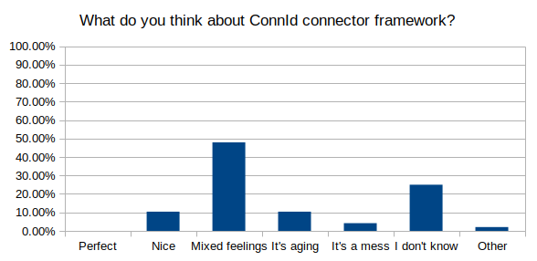
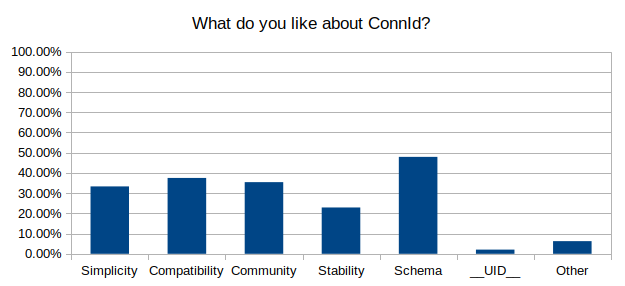
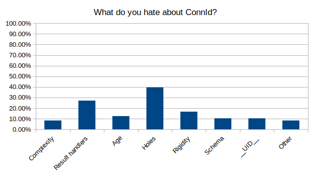
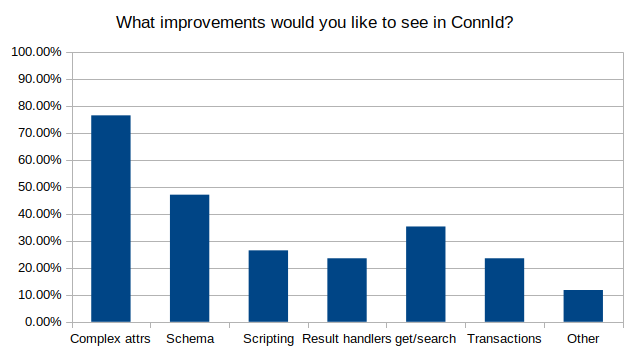
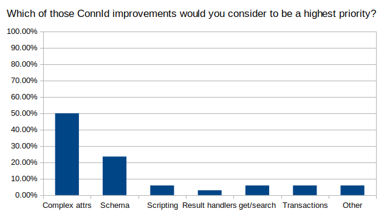
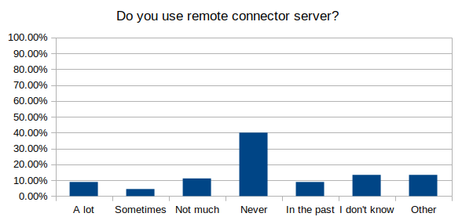
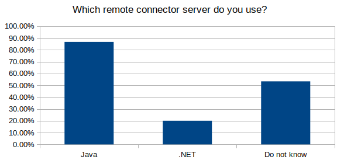

= MidPoint 2019 Survey: ConnId-related results
:page-wiki-name: MidPoint 2019 Surver: ConnId-related results
:page-wiki-id: 44302511
:page-wiki-metadata-create-user: semancik
:page-wiki-metadata-create-date: 2020-01-15T12:02:25.554+01:00
:page-wiki-metadata-modify-user: semancik
:page-wiki-metadata-modify-date: 2020-01-15T12:25:27.314+01:00
:page-nav-title: ConnId-related results

This is a summary of survey that Evolveum has conducted in October-November 2019.
This page shows details about ConnId-related questions.
For the full survey please see wiki:MidPoint+2019+Survey+Results[MidPoint 2019 Survey Results].

Dates: 16.Oct-3.Dec.2019

Approximate number of valid answers in this part of survey: 48

== What do you think about ConnId connector framework?

[%autowidth, cols="1,1"]
|===
| It is perfect! Real engineering marvel.
I love it.
| 0%

| It is quite nice.
It gives me all I need to work with connectors.
| 10.42%

| Mixed feelings.
There are some things that I like, but there are also painful things.
| 47.92%

| It is showing its age.
It works for us, but it will need major improvement in the future.
| 10.42%

| It is a mess.
I do not really like it.
| 4.17%

| I do not know.
I I'm not a connector developer.
| 25.00%

| Other
| 2.08%

|===

== What do you like about ConnId?

Multiple-choice question

[%autowidth, cols="1,1"]
|===
| Simplicity.
ConnId is simple and straightforward.
I can have connector up and running in a couple of days.
| 33.33%

| Compatibility.
I like that 10 year old connectors still work like a charm.
| 37.50%

| Community.
I like that connectors are interchangeable between several IDM products.
| 35.42%

| Stability.
It just works.
It does not change much, therefore it is unlikely that something will break.
| 22.92%

| Schema.
I love it when the connector discovers schema automatically and midPoint adapts to that.
| 47.92%

| \__UID\__ and \__NAME\__.
Those hardcoded attributes make everything easier.
| 2.08%

| Other
| 6.25%

|===

== What do you hate about ConnId?

Multiple-choice question

[%autowidth, cols="1,1"]
|===
| Complexity.
ConnId is too complex.
I cannot really understand how it works.
| 8.33%

| Result handlers.
Those things are enabled by default and they always get into my way.
| 27.08%

| Age.
The framework is too old.
I would like to see something more modern.
Something cooler.
| 12.50%

| Holes.
Some important functionality is missing.
That holds me back.
| 39.58%

| Rigidity.
The development is too slow.
I would like to see faster progress.
| 16.67%

| Schema.
I do not like to deal with that thing.
I just want attributes and values.
No schema in my meal, please.
| 10.42%

| __UID__ and __NAME__.
Why I cannot use "username" or "uid" or "login" as identifiers?
| 10.42%

| Other
| 8.33%

|===

== What improvements would you like to see in ConnId?

Multiple-choice question

[%autowidth, cols="1,1"]
|===
| Support for complex attributes.
I would like to pass structured data in attributes.
| 76.47%

| Better schema support, e.g. ability to specify arbitrary identifiers (avoid the use of \__UID\__ and \__NAME\__).
| 47.06%

| Better support for connectors in scripting languages.
| 26.47%

| Result handlers.
Make those optional or turn them off by default.
| 23.53%

| Split "get" and "search" operations.
Who's idea it was to combine those anyway?
| 35.29%

| Consistency support such as transactions or optimistic locking.
| 23.53%

| Other
| 11.76%

|===

== Which of those ConnId improvements would you consider to be a highest priority?

Single-choice questions, designed to get some information about the hottest problems in ConnId.

[%autowidth, cols="1,1"]
|===
| Support for complex attributes.
I would like to pass structured data in attributes.
| 50.00%

| Better schema support, e.g. ability to specify arbitrary identifiers (avoid the use of \__UID\__ and \__NAME\__).
| 23.53%

| Better support for connectors in scripting languages.
| 5.88%

| Result handlers.
Make those optional or turn them off by default.
| 2.94%

| Split "get" and "search" operations.
Who's idea it was to combine those anyway?
| 5.88%

| Consistency support such as transactions or optimistic locking.
| 5.88%

| Other
| 5.88%

|===

== Do you use remote connector server?

[%autowidth, cols="1,1"]
|===
| Yes! I'm using that a lot.
I really depend on it.
| 8.89%

| Sometimes.
I use it in some deployments.
I quite like it.
| 4.44%

| Not much.
I used it once or twice.
I only use it if there is no other way.
| 11.11%

| Never.
I have never used it and I do not plan to.
| 40.00%

| We have used it in the past, but we are not using it now.
| 8.89%

| I do not know.
| 13.33%

| Other
| 13.33%

|===

== Which remote connector server do you use?

multi-choice question.
This questions got a low number of answers (15), therefore the percentages may be misleading.

[%autowidth, cols="1,1"]
|===
| Questions | Percatege relative to answers to this question | Percentage relative to average answers to other questions

| Java remote connector server
| 86.67%
| 27.08%

| .NET remote connector server
| 20.00%
| 6.25%

| I do not know.
| 53.33%
| 16.66%

|===

== See Also

* wiki:MidPoint+2019+Survey+Results[MidPoint 2019 Survey Results]