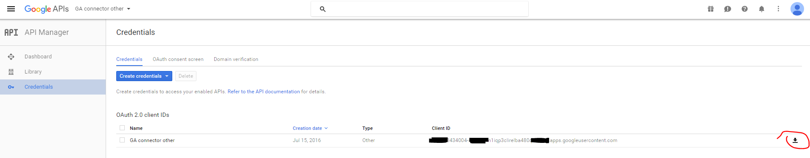

= Google Apps Connector
:page-wiki-name: Google Apps Connector
:page-wiki-id: 23166982
:page-wiki-metadata-create-user: martin.lizner
:page-wiki-metadata-create-date: 2016-08-07T13:15:55.015+02:00
:page-wiki-metadata-modify-user: semancik
:page-wiki-metadata-modify-date: 2019-07-09T13:51:46.829+02:00

== History

Connector was introduced as a contribution to midPoint project by AMI Praha.

Google Apps Connector contains support for ACCOUNT and GROUP (mailing lists entities). However, as the original connector contains support for more entity types, not all of those were fully tested with midPoint. Current focus is on ACCOUNT entity.

== Overview

Google Apps is a Software-as-a-Service platform (SaaS), that provides email, calendar, documents and other services.
This connector uses the Google Apps provisioning APIs to add, modify and delete user accounts and email aliases.

[TIP]
.Premium only
====
Please note that only the Premium (paid) or Educational versions of Google Apps provide access to the provisioning APIs.
====

More information on Google Apps as well as Google user management console can be found link:https://apps.google.com/[here].

=== Supported Operations

The Google Apps connector supports the following operations:

* Create

* Delete

* Get

* Schema

* Search

* Test

* Update

* Validate

=== Configuration

The following table lists all the configuration properties you can specify when setting up the Google Apps connector:

[%autowidth]
|===
| Configuration Property | Required | Type | Default Value | Description

| domain
| X
| String
|
| Internet domain name.
Seelink:https://support.google.com/a/answer/177483?hl=en[https://support.google.com/a/answer/177483?hl=en]

| clientId
| X
| String
|
| Client identifier issued to the client during the registration process.

| clientSecret
| X
| GuardedString
|
| Client secret issued to the client during the registration process.

| refreshToken
| X
| GuardedString
|
| The refresh token allows you to get a new access token that is good for another hour.
Refresh tokens never expire, they can only be revoked by the user or programatically by your app.

| skuid
|
| String
|
| Stock Keeping Units (SKU) ID.
Typical value: `Google-Apps-For-Business`. For more information see link:https://developers.google.com/admin-sdk/licensing/v1/how-tos/products[https://developers.google.com/admin-sdk/licensing/v1/how-tos/products]

| autoaddlic
|
| Boolean
| False
| Automatically add license to user after create

| productid
| X
| String
|
| Product ID.
Typical value: `Google-Apps`. For more information see link:https://developers.google.com/admin-sdk/licensing/v1/how-tos/products[https://developers.google.com/admin-sdk/licensing/v1/how-tos/products]

|===

=== Getting started

==== Building the connector

link:https://github.com/Evolveum/connector-googleapps[Download] and build the project with usual:

[source]
----
mvn clean install
----

Import connector JAR file to one of these locations:

* midPoint WEB-INF/lib

* application server (e.g. Tomcat) lib directory

* icf-connectors directory in midPoint home

==== Creating resource

Sample resource XML can be found link:https://github.com/Evolveum/midpoint/blob/master/samples/resources/googleapps/googleapps-resource.xml[here].

==== Configuring resource

. Obtain credential codes for Google API.
Log in to link:https://console.developers.google.com[Google API Manager] with your Google admin account.

. If you have not done already - create new project and then create new credentials for "OAuth client ID" (and "other" option).

. Make sure API access is enabled for at least: Admin SDK and Enterprise License Manager API.

. Retrieve credentials in JSON by click on the icon as follows:
+

. Open JSON file and make note of following properties: `client_id":"XXXX434004-XXXu8jrm1iqp3clirelba480qXXX.apps.googleusercontent.com``client_secret":"48zv5mfYZZZZw3QTcb8RBXXX"` +

. In order to authenticate with Google you will also need refreshToken. To retrieve it, go to your connector-googleapps java project, run the main and confirm requested action in your web browser.
+
[source]
----
connector-googleapps> mvn exec:java -Dexec.mainClass="com.evolveum.polygon.connector.googleapps.Main"
-------------------------------------------------------------------------------------------
Generate credentials for GoogleApps Connector
-------------------------------------------------------------------------------------------
You have to created and registered App in Google API and Google API enabled.
Add these credentials into configuration fields in Google Apps Connector. See readme.txt.
-------------------------------------------------------------------------------------------
Enter Client ID: <censored>
Enter Client Secret: <censored>

Please open the following address in your browser:
  https://accounts.google.com/o/oauth2/auth?<censored>
Generated credentials:
{
  "clientId" : "<censored>",
  "clientSecret" : "<censored>",
  "refreshToken" : "<censored>"
}
----

. You now have all the information you need to configure the connector resource in the midPoint.