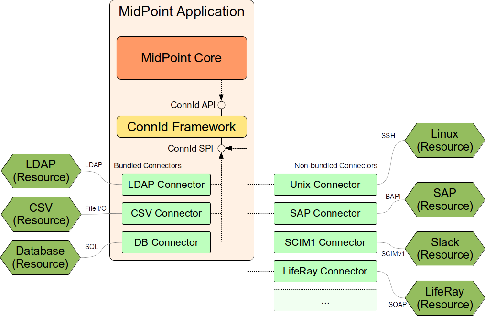

= ConnId 1.x Connector Development Guide
:page-wiki-name: Connector Development Guide
:page-wiki-id: 23167461
:page-wiki-metadata-create-user: semancik
:page-wiki-metadata-create-date: 2016-09-08T11:06:46.689+02:00
:page-wiki-metadata-modify-user: semancik
:page-wiki-metadata-modify-date: 2020-02-24T10:40:41.260+01:00
:page-upkeep-status: green
:page-toc: top

== Introduction

This guide describes the principles and method used to develop the ConnId connectors for midPoint.

== ConnId and Polygon

MidPoint is using the xref:/connectors/connid/1.x/framework/[ConnId framework] as a connector layer.
The use of ConnId as a connector framework has several advantages:

* The connectors are not midPoint-specific.
These connectors are supposed to be interoperable for all the products that use ConnId framework.

* The framework provide convenient services such as connector instance management and isolation.
E.g. two different versions of the same connector can be active at the same time, the framework will take care of creating and destroying connector instances, pooling the instances and so on.

* There is already a lot of existing (open source) connectors that can be used as examples when creating new connector.

This guide is applicable for development of connectors that are based on ConnId framework version 1.x.
The ConnId 1.x framework is a continuation of Identity Connector Framework (ICF) originally developed by Sun Microsystems.
However, the ConnId framework is significantly extended and evolved when compared to the original ICF.
Some of the xref:/connectors/connid/1.x/icf-issues/[issues] of the original framework were fixed and many new features were added.
However, ConnId is a project developed by several (competing) companies, therefore obviously there is some rigidity and friction.
Therefore we have created _Polygon_, which is in fact a very small project that adds some convenience features to the ConnId framework.
There are utility classes, maven parent projects, connector archetype and so on.
But polygon is just a convenience.
This guide will use the polygon tools to make developer's life easier.
But the use of polygon is optional.
Any pure ConnId connector should work in midPoint without any problems.

== Architecture

Following diagram illustrates how the ConnId framework and the connectors are used by midPoint.

The central part of the architecture is the ConnId framework.
The framework provides two interfaces:

* *ConnId API* is the interface that is used by midPoint.
This interface is used by midPoint to control the connectors.
Connector code does not need to deal with this interface at all.
Connectors do not have access to this interface.

* *ConnId SPI* is the interface to which a connector must adapt to work with the ConnId framework.
This interface dictates how the connector should look like and how it should behave.
This is the basic building block of any connector.
This interface is located in package `org.identityconnectors.framework.spi`.

Connectors are distributed in "bundles".
The bundle is essentially a JAR file that contains one or more connectors.
The connectors that are used in almost all deployments are bundled with midPoint.
This means that these connectors are already part of the midPoint application and they can be used without any additional deployment.
Currently there are three "bundled connector bundles":

* *LDAP connector bundle* which contains LDAP connector, Active Directory connector and eDirectory connector.

* *CSV connector bundle* that contains connector which works with data stored in the CSV-formatted files.

* *DatabaseTable connector bundle* that contains a connector that works with data stored in a single relational database table.

Additional connectors can be deployed as needed.
Deploying a connector simply means copying the bundle (JAR file) to an appropriate place in xref:/midpoint/reference/deployment/midpoint-home-directory/[midPoint home directory] and restarting midPoint.

== Basic Principles

Connector is essentially just a protocol translator.
The responsibility of a connector is to get a command from the ConnId SPI and execute it using any protocol which is appropriate for the connected resource.
E.g. LDAP protocol will react to the invocation of the create(...) operation by sending LDAP add request to the LDAP server.
This request will contain data about a new account that the connector translates from the ConnId representation (`Set<Attribute>`) to LDAP representation (LDAP entry).
And that's basically it.
The connector usually has very little logic.
And even the logic that the connector has will only deal with handling of the communication protocol and protocol data formats.
Except for a few special-purpose attributes the connector usually do not understand the meaning of the data that are passed through it.
Vast majority of the IDM logic is implemented in midPoint, such as xref:/midpoint/reference/expressions/mappings/[Mappings], handling of resource capabilities, xref:/midpoint/reference/synchronization/introduction/[Synchronization], etc.
The connector does not need to deal with that.
The connector just translates protocols and data formats.

The connector works with instances of `ConnectorObject` class.
Confusingly enough these `ConnectorObject` instances represent *objects on the resource*: accounts, groups, roles, privileges, organizational units and so on.
The `ConnectorObject` class contains a set of ``Attribute``s. Each `Attribute` has a name and one or more values.
The values can be of several primitive types (see below).
Each `ConnectorObject` also has its `ObjectClass`. The `ObjectClass` is essentially a string value that define the type of the resource object.
It defines whether the object represents an account, group, role, organizational unit or anything else.
The `ObjectClass` also refers to object schema: it determines what attributes the object can have, what are attribute types and so on.

Following example is a symbolic representation of `ConnectorObject` class that represents (slightly simplified) LDAP account:

[source,java]
----
ConnectorObject(
    objectClass: inetOrgPerson
    attributes: (
        "__UID__" => "85d5e79e-75b6-11e6-b1df-eb22fcca7766"
        "__NAME__" => "uid=foobar,ou=People,dc=example,dc=com"
        "uid" => "foobar"
        "cn" => "Foo Bar"
        "givenName" => "Foo"
        "sn" => "Bar"
        "telephoneNumber" => [ "+421123456789", "+421987654321" ]
        ...
    )
)
----

In ConnId all attributes are equal, but some are more equal than others.
There are special-purpose attributes that have a specially formatted names `pass:[__LIKE_THIS__]`.
There are two very special identifiers `pass:[__UID__]` and `pass:[__NAME__]`, but there are also other attributes such as `pass:[__PASSWORD__]`, `pass:[__ENABLED__]` and so on.
These attributes are supposed to have special meaning and we will deal with them later.
The other attributes are just normal attributes that the objects on the resource have.
The names can be chosen by the connector developer.
However it is best practice to use names that are used by the resource and do not transform them unless really necessary.

Each connector object should be identified by two identifiers: `pass:[__UID__]` and `pass:[__NAME__]`:

[cols="h,1,1"]
|===
|  | Description | Examples

| `pass:[__UID__]`
| Primary identifier of an object.
This identifier is assigned by the resource when an object is created.
It should be immutable if possible.
It is often non-human-readable.
| LDAP entryUUID, autoincrement column in databases, randomly-assigned identifier, sequence number, hash, ...

| `pass:[__NAME__]`
| Secondary identifier of an object.
This identifier is chosen by the user or determined by an algorithm in midPoint.
This is usually human-readable identifier and as such it is often mutable.
| username, LDAP distinguished name, group name, e-mail address, ...

|===

Both `pass:[__NAME__]` and `pass:[__UID__]` are hardcoded as single-valued string attributes.
Both are supposed to be unique identifiers of the object.
That means that there should not be two objects that have the same `pass:[__UID__]` or the same `pass:[__NAME__]` in one `ObjectClass`.

[NOTE]
Strictly speaking, ConnId mandates uniqueness for `+__UID__+` but not for `+__NAME__+`.
You may encounter resources where the names are not unique - it's important to let midPoint know.
This problem is discussed later in the "Gotchas" section.

The `pass:[__NAME__]` is specified by midPoint when a new object is created.
The connector is supposed to return `pass:[__UID__]` as a result of the `create(...)` operation.
The `pass:[__UID__]` is then used as an identifier for almost all other operations.

Even though both `pass:[__NAME__]` and `pass:[__UID__]` are just strings, ConnId framework provides special classes for these attributes.
These are `org.identityconnectors.framework.common.objects.Uid` and `org.identityconnectors.framework.common.objects.Name`.
These classes provide the constants for the `pass:[__NAME__]` and `pass:[__UID__]` attribute names and schema definitions ("info").
The `Uid` class is also often used in the code for type safety.

The `pass:[__NAME__]` and `pass:[__UID__]` can be in fact representations of the same attribute on the resource side.
But they still needs to be presented as two different attributes by the connector as they are hardcoded in he ConnId framework.
This is one of the confusing aspects of ConnId.
But it works well.
See the "Gotchas" section below for an explanation.

Each connector has to implement several basic operations to be of any use.
These are ConnId SPI operations and they are explained in details later.
But these are the basic operations that most connectors will need to implement:

* `init(...)` and `dispose()` operations control connector life cycle.
They usually open and close connections.

* `test()` operations checks if connector configuration is OK and whether the connector can be established.

* `schema()` operation provides schema that describes how the `ConnectorObject`s used by the connector look like.

* `executeQuery(...)` operation executes a search query that returns a subset of objects from the resource

* `create(...)` operation creates a new object on the resource.

* `updateDelta(...)` operation modifies existing objects on the resource.

* `delete(...)` operation deletes an object on the resource.

This is basically CRUD (create-read-update-delete) semantics spiced up with lifecycle and utility methods.

== Connector Bundle Structure

The connector is basically just a usual JAR file with some extensions and conventions in place.
This JAR file is called connector _bundle_. All the classes and resource files are compiled and packaged into the JAR in a usual way.
The connector bundle should contain:

* *Connector class* is the "main" class that implements the connector functionality.
It usually implements `Connector` or `PoolableConnector` interface and the SPI operation interfaces.
This is the class that contains implementation of the ConnId SPI operations or that acts as a facade for the implementation.

* *Configuration class* is simple Java bean that contains connector configuration variables.
As a Java bean it needs to have getter and setter methods for each configuration property.
The configuration class is initialized by the ConnId framework using the data that midPoint takes from the `connectorConfiguration` part of midPoint resource definition.

* There may be any number of *other classes* or resource files that are needed for the connector to work.
There is no need to place the whole implementation into a single class.
Quite the contrary.
You should properly structure the connector code to as many classes as needed.

* The connectors usually have their *dependencies*. These are usually protocol libraries used by the connector.
E.g. the LDAP connector needs Apache Directory API as a library that provides support for the LDAP protocol.
These dependencies can be packaged together with the connector.
Simply put the required JAR files into the `lib/` subdirectory of the connector bundle (yes, this means having JAR inside a JAR).
The ConnId framework will load these dependencies when it will be initializing the connector.

* The connector must contain a *manifest file* (`META-INF/MANIFEST.MF`). This file should contain the usual meta-data (build versions, usernames).
But for the JAR to work as a valid connector bundle the manifest must also contain: +
** `ConnectorBundle-Version`: Version of the connector.

** `ConnectorBundle-Name`: Name of the connector bundle.

** `ConnectorBundle-FrameworkVersion`: The oldest version of the ConnId framework that is required by this connector to work properly.
If this connector is deployed into midPoint instance which has an older version, the connector will refuse to work.
If this connector is deployed to midPoint which has newer framework version the connector will work normally.

* *Localization properties* are also part of almost every connector.
The connector configuration properties needs human-readable names and help texts to be presented in the midPoint GUI.
These obviously need to be localized.
Therefore almost every bundle contains `*.properties` files that list the localized strings for connector configuration.

There may be more than one connector classes in any bundle, although the usual practice is to have just one connector class.
If there are multiple connector classes than there is usually one configuration class for each of the connector classes.

== Implementing the Connector

There are two good ways how to start implementation of a new connector.

First option is to start from other existing connector.
There is couple dozen existing connectors and almost all are open source.
So simply take the code of an existing connector, strip it down and that will provide a skeleton for your new connector.
You can find source code of many connectors in their projects on github.
The Evolveum connectors are here:

* link:https://github.com/Evolveum[https://github.com/Evolveum]

Second option is to start from scratch.
There is a convenient archetype in the Polygon project that can be used to create a new connector.
The process of setting up a new connector project is described here:

* xref:/connectors/connid/1.x/connector-development-guide/setting-up-new-connector-project/[Setting Up New Connector Project]

=== Connector Conventions and Metadata

You will have to choose some meta-data when creating the connector:

* *Connector package* is a regular Java package that will hold the connector classes.
Simply choose the appropriate package name according to usual Java package name conventions.
E.g. we use `com.evolveum.polygon.connector.ldap`. You should choose something that represents your organization.

* *Connector class name* usually ends with "Connector" suffix.
E.g. `LdapConnector`, `CsvFileConnector`, ...

* *Configuration class name* usually has the same prefix as connector class, but ends with "Configuration".
E.g. `LdapConfiguration`, `CsvFileConfiguration`, ...

* *Connection class name* (optional): sometimes there is a need for a class that will hold all the things that are needed for connecting to the resource.
This class is usually initialized when the connector is initialized, destroyed when the connector is destroyed and re-initialized when connection test is requested.
This class is sometimes provided by the protocol library used by the connector and it can be conveniently reused.
But if it is not provided by the library then the usual convention is to the "Connection" suffix for this class.
E.g. `LdapConnection`, `CsvFileConnection`, ...

* *Connector name* as shown in midPoint is simply the fully qualified name of the connector class, e.g. `com.evolveum.polygon.connector.ldap.LdapConnector`.

* *Connector version* is a simple string that tracks the progress of connector development.
link:http://semver.org/[Semantic versioning] is recommended.
Some connectors that have longer history are deriving their versions from the ConnId framework version that they are using.
However this practice is generally deprecated.
Simply start from version 1.0.0-SNAPSHOT.

* *Bundle name* is the name of the connector bundle.
E.g. `com.evolveum.polygon.connector-ldap`

* *Framework version* is the version of the framework that was used to compile the connector for distribution.
It is also the oldest version of ConnId framework with which the connector can work properly (it can work with any newer version as ConnId is backward compatible).

* *groupId and artifactId* are the usual "maven coordinates".
Choose them accordingly to your conventions.
What we use is `com.evolveum.polygon` for groupId and project name as artifactId.
E.g. `connector-ldap`, `connector-csv`, ...

=== Connector Class

The connector class is (almost) simple Java class.
For the class to work as a connector it must have:

* *ConnectorClass annotation* that specifies the connector display name key and configuration class.

* Implement *Connector or PoolableConnector interfaces*.

* Implement *SPI operation interfaces* according to the operations that the connector supports (`TestOp`, `SchemaOp`, `SearchOp`, `CreateOp` and others in `org.identityconnectors.framework.spi.operations` package).

ConnId annotations and connector interfaces are in `org.identityconnectors.framework.spi` package.

The connector class should look like this:

.Connector class example
[source,java]
----
package com.evolveum.polygon.connector.foo;

import ...;

@ConnectorClass(displayNameKey = "connector.foo.display", configurationClass = FooConfiguration.class)
public class FooConnector implements PoolableConnector, TestOp, SchemaOp, SearchOp<String>, CreateOp, DeleteOp,
        UpdateDeltaOp, SyncOp {

    // method implementation here
}
----

=== Configuration Class

Configuration class is mostly simple Java bean.
It should extend the `org.identityconnectors.framework.spi.AbstractConfiguration` abstract class.
Every bean property in this class is a connector configuration property.
Even a very simple Java bean will work.
However there are usually annotations on the getter methods that provide additional meta-data.
The usual configuration class looks like this:

The connector class should look like this:

.Configuration class example
[source,java]
----
package com.evolveum.polygon.connector.foo;

import ...;

public class FooConfiguration extends AbstractConfiguration {

    private String host;

    @ConfigurationProperty(required = true, order = 1)
    public String getHost() {
        return host;
    }

    public void setHost(String host) {
        this.host = host;
    }

    @Override
    public void validate() {
        // TODO
    }
}
----

== Connector Lifecycle

Connector lifecycle is completely controlled by the ConnId framework.
The framework creates connector instances and destroys them as needed.
It is assumed that each connector instance will have its own connection to the resource.
The connection should be created when connector is initialized and it should be closed when the connector is "disposed".
Therefore if the ConnId framework pools connector instances it also indirectly pools connections to the resources.

=== Connector Initialization

When a new connector instance is needed the ConnId framework creates a new instance of connector class and configuration class.
It then invokes the `init(...)` method of the connector class.

The `init(...)` method should open the connection to the resource and initialize it (e.g. authenticate).
Or this may be done in a lazy way and the connection can be initialized on the first invocation of any other method.
But opening the connection directly in the init(...) method is often easier and it seems not to a problem as invocation of "normal" operation will follow immediately after the invocation of init(...).

The initialized connection should be stored in a private field of the connector class.
Other operations should use the connection stored in this private field.
Other operations should not open a new connection unless the connection fails (e.g. due to timeout).

=== Connection Test

The `TestOp` interface defines `test()` operation.
This is an operation that absolutely every connector should support if it can.
This operation is very important for diagnosing connector configuration issues.
This operation should try to use the connection and ideally execute some harmless operation (NOOP).
The purpose is to make sure that the connector configuration is correct, so that the connector can connect to the resource, that there are no network obstacles (e.g. firewalls), that the connector can authenticate and that the authorizations are roughly OK.
If there is existing open connection when the `test()` operation is invoked such connection should be closed and re-opened from scratch.
This is important as a network conditions might have changed since the connection was opened.
E.g. the username/password used to authenticate the existing connection may not work any more because someone have changed the password in the meantime.

Good error reporting is very important in this operation.
Try hard to make messages in the exceptions meaningful.
Any effort invested into this will pay off later when the connector will get deployed.

=== Connector Disposal

When connector instance is no longer needed then the ConnId framework invokes the `dispose()` method.
The `dispose()` method should close all connections and release any other resources that the connector has allocated.
Be very careful and make sure that everything is closed.
Neglecting this connector disposal will lead to memory or resource leak.
This kind of bugs is extremely difficult to diagnose.
Therefore it is better to avoid creating such bugs in the first place.

=== Connector Pooling

There are two types of connectors: poolable and non-poolable.
Non-poolable connectors implement the `Connector` interface.
In this case the ConnId framework will always initialize new connector instance, execute the operations and the destroy the instance.
This is fine for prototyping or for very simple cases.
But in reality connection setup is usually quite an expensive operation.
Therefore it is better to create a connection and then keep it ready to be used for a longer time.
This is exactly what poolable connectors are supposed to do.

Poolable connectors implements the `PoolableConnector` interface.
In this case the ConnId framework will create connector instance when needed, execute the operations, but it will *not* destroy the instance immediately.
The framework will put the initialized instance into the pool.
When a new request for a new operation comes the ConnId framework will take the initialized connector instance from the pool, execute another operation and then put it back to the pool.
This is usually much more efficient behavior.

However, this means that the connector instance may remain in the pool for a long time.
The connection that the connector instance maintains may time out or it may be closed by the remote peer in the meantime.
Therefore the `PoolableConnector` interface defines `checkAlive()` method.
The framework will invoke this method every time a connector instance is taken out of the pool.
The `checkAlive()` method should check whether the connection is still alive.
This should be a very fast and efficient check - as opposed to the `test()` method in which the check has to be thorough and can be slow.
But the `checkAlive()` method should be fast because it is called often.
If the connection is OK then the `checkAlive()` method returns normally.
If the connection is not OK then the `checkAlive()` method should throw an exception.
In that case the framework will destroy the connector instance and create a new one.

=== Connector State

Connector instances are independent of each other.
The connectors are designed just to keep the connection to the resource.
This is easy to do when the connection is stored in the private field of the connector class.
However if there is a need how to share information between connector instances then the options are very limited.
Some information can be stored in static fields and this is shared among all the connectors of the specified type and version.
This is given by the way how connector classloaders work.
E.g. if LdapConnector 1.2.3 stores something in a static field, it will be shared by all the instances of LdapConnector version 1.2.3. But this is really shared by all the instances, even those that connect do different servers (connectors working for different LDAP resources).
Therefore if there is a need to share a cached LDAP schema between all the instances that work with the same LDAP server there is currently no easy way how to do it.

== Connector Operations

The capabilities of resources that we need to connect to midPoint may be quite different.
Some resource may be read-only.
Some resource may be able to list recent changes in objects other may not be able to do it.
Some resource can manipulate attribute values with a fine granularity, other may only provide ability to replace everything with a new value.
Some resource may be able to delete accounts, but other may be able only to disable them.
Therefore the ConnId framework has quite a flexible support for different connector capabilities.
Each capability set is defined as a ConnId SPI operation interface such as `CreateOp`, `SyncOp` and so on.
If the resource supports such operation then the connector will implement that interface.
If the resource does not support it then the connector will not implement that specific interface.
Following table summarizes the interfaces and the operations:

|===
| Interface | Operations | Description

| `TestOp`
| `test()`
| Test the connection to the resource.

| `SchemaOp`
| `schema()`
| Retrieves resource schema.

| `SearchOp`
| `createFilterTranslator(...)` +
`executeQuery(...)`
| Searching for objects on the resource.
This operation is used for all the operations that read anything from the resource  - even if just a single object is needed.

| `CreateOp`
| `create(...)`
| Create new object on the resource.

| `UpdateOp`
| `update(...)`
| Updates attribute values on the resource.
This is the update mechanism that replaces all previous values of an attribute with new set of values. +
*OBSOLETE*: this operation is obsolete.
Since midPoint 3.9 it is recommended to use delta update operation (see below).

| `UpdateAttributeValuesOp`
| `addAttributeValues(...)` +
`removeAttributeValues(...)`
| Updates attribute values on the resource by adding or removing specific values.
These operations are leaving other attribute values unaffected therefore provide better chance of maintaining consistency. +
*OBSOLETE*: this operation is obsolete.
Since midPoint 3.9 it is recommended to use delta update operation (see below).

| `UpdateDeltaOp`
| `updateDelta(...)`
| Updates attribute values on the resource using a complex atribute delta. +
This is a new operaiton that combines UpdateOp and UpdateAttributeValuesOp into one operation.
It is available since ConnId framework release 1.4.3, but it is fully suppoted only in midPoint 3.9 or later. +
This is now a *recommended* way to implement update operation.

| `DeleteOp`
| `delete(...)`
| Deletes existing object on the resource.

| `SyncOp`
| `sync(...)` +
`getLatestSyncToken(...)`
| Returns objects that have recently changed on the resource.
This is used to implement xref:/midpoint/reference/synchronization/introduction/[live synchronization]. This method will be invoked in short time intervals to check what has happened on the resource.
Therefore the changes can be detected by midPoint with quite a short delay - in almost-real-time.

| `ScriptOnResourceOp`
| `runScriptOnResource(...)`
| Executes generic script on the resource.
This usually means that the connector is able to (remotely) execute command or script on the remote machine.
This is often used for various set-up actions, such as set up home directories or mailboxes after an account is created.

| `ScriptOnConnectorOp`
| `runScriptOnConnector(...)`
| Executes generic script in the environment of the connector.
This operation is rarely used because it means that the script will be typically executed at the midPoint machine.
The connectors usually do not implement this operation.

| `AuthenticateOp`
| `authenticate(...)`
| Tries to authenticate specified user with a specified password using the native authentication provided by the resource.
This could be used to implement "pass-through" authentication when users will log in to midPoint but they will use credentials stored on the resource.

| `ResolveUsernameOp`
| `resolveUsername(...)`
| Returns Uid for a specified username.
This operation can be used in addition to authenticate(...) for the "pass-through" authentication functionality.

|===

All these operations except for `test()` (and maybe` authenticate()`) are supposed to reuse the connection that was set up in the `init()` method.

== Schema

Schema describes how the objects on the resource look like.
E.g. the schema may define, that the resource supports account and group _object classes_. Account objects have `fullName` and `homeDir` attributes, while `fullName` is mandatory and `homeDir` is optional.
Group objects have multi-value attribute `members`.

Every resource may have different schema.
Some resources have fixed schema.
I.e. the schema will always be the same whether the connector talks to this resource or that resource.
In that case the schema may be hardcoded in the connector and the connector will always return the same schema.

But many resource are quite flexible.
The schema can be influenced by the resource configuration.
E.g. LDAP server may have schema extensions that define completely custom attributes.
Active Directory schema varies in case if Exchange is installed.
Schema of database resources depends on the structure of the database table that they talk to.
And so on.
In those cases the connector must talk to the resource, try to figure out how it is configured, retrieve the schema and translate it to the ConnId form.

Simply speaking the schema (`Schema`) is a set of object class definitions (`ObjectClassInfo`). Each object class defines one type of objects that the resource supports.
The object class definition (`ObjectClassInfo`) contains set of attribute definitions (`AttributeInfo`). This defines which attributes the objects may have, what is the type of the attributes, whether the attributes are optional or mandatory and so on.

[TIP]
.Immutables and Builders
====
ConnId framework is full of design patterns.
The patterns that is used all the time is the link:https://en.wikipedia.org/wiki/Builder_pattern[builder pattern]. Most ConnId objects are designed to be immutable.
But they are not simple.
Therefore almost for each ConnId object there is a companion builder object.
Therefore the `Schema` is created using `SchemaBuilder`, `ObjectClassInfo` is created by `ObjectClassInfoBuilder`, `AttributeInfo` is created by ... I'm sure you get the idea.

====

Each object class definition implicitly contains the definitions of `pass:[__UID__]` and `pass:[__NAME__]` identifiers.
Strictly speaking you do not need to add these definitions to schema directly.
But when creating connectors for midPoint these definitions are often added explicitly for the purpose of overriding the ugly `pass:[__UID__]` and `pass:[__NAME__]` names with native names for these identifiers (see below).

The code that generates simple hardcoded schema looks like this:

[source,java]
----
    public Schema schema() {
        ObjectClassInfoBuilder objectClassBuilder = new ObjectClassInfoBuilder();
        objectClassBuilder.setType("myAccount");
        objectClassBuilder.addAttributeInfo(
            AttributeInfoBuilder.build("fullName", String.class));
        objectClassBuilder.addAttributeInfo(
            AttributeInfoBuilder.build("homeDir", String.class));

        SchemaBuilder schemaBuilder = new SchemaBuilder(FooConnector.class);
        schemaBuilder.defineObjectClass(objectClassBuilder.build());
        return schemaBuilder.build();
    }
----

In real cases the schema needs to be fetched from the resource first and then translated.
This is not difficult to do in principle.
But devil is in the details.
Plan your schema well.

[NOTE]
.Schema is important
====
Although `schema()` operation is formally optional and strictly speaking the connector may not support it, it is generally not a good idea to skip that.
Schema is very important for midPoint.
MidPoint is a dynamic system, it will retrieve the schema from the resource and then adapt to that.
If midPoint knows the schema then it can do automatic type conversion.
It can easily detect configuration issue.
And most importantly of all: the midPoint user interface will automatically adapt.
It will naturally show all the attributes that the account has and that it may have.
And those attributes will be displayed using correct types.
MidPoint will know which are single-valued and which are multi-valued, whether they are optional or mandatory.
And all of this will make the user interaction much better experience.
In fact, midPoint will not work correctly without the schema.

====

=== Attributes

The most important part of the schema are the attribute definitions (`AttributeInfo`) stored inside object class definitions (`ObjectClassInfo`). These significantly influence the way how midPoint will work with the attribute.
Each attribute definition contains definition of:

* *name*: this is a simple string the defines the name.
The best strategy is to simply use the names that the resource is used - to avoid confusion.
So if resource is using names like fullName, homeDir then use that.
If the resource is using names like FULL_NAME, HOME_DIR then use that format.
Resist the temptation to "normalize" the names to some common convention.
MidPoint can easily do the mapping with (almost) any attribute names in (almost) any convention.

* *type*: defines the type of the attribute: string, number, binary, etc.
This is one of several selected Java data types:

** `String`

** `long` and `Long`

** `char` and `Character`

** `double` and `Double`

** `float` and `Float`

** `int` and `Integer`

** `boolean` and `Boolean`

** `byte` and `Byte`

** `byte[]`

** `BigDecimal`

** `BigInteger`

** `GuardedByteArray`

** `GuardedString`

** `ZonedDateTime` (since ConnId version 1.5.0.0, midPoint version 3.9)

* *subtype*: Optional subtype of the attribute.
This defines a subformat or provides more specific definition what the attribute contains.
E.g. it may define that the attribute contains case-insensitive string, URL, LDAP distinguished name and so on.
The subtype may contain one of the pre-defined subtypes (a value form the Subtype enumeration) or custom URI.

* *nativeName*: Optional definition of the real name that the attribute has in the resource.
This is a very useful field to get rid of those ugly `pass:[__UID__]` and `pass:[__NAME__]` things (see below).
But it may also be useful if the original attribute name is too "fancy" and despite all effort needs to be normalized.
E.g. if it contains national characters or something else that breaks ConnId or midPoint.
In such a case this field can be used to store the original name.

* *flags*: set of flags that define how the attribute should be used:

** `REQUIRED`: this is required attribute (not optional)

** `MULTIVALUED`: attribute may have more than one value

** `NOT_CREATABLE`: attribute cannot be present when creating new object

** `NOT_UPDATEABLE`: attribute value cannot be modified

** `NOT_READABLE`: attribute value cannot be retrieved.
It will not be returned from search operations.

** `NOT_RETURNED_BY_DEFAULT`: attribute will not be present in search results unless it is explicitly requested

=== Special-Purpose Attributes

ConnId framework has several pre-defined attributes that can be used in the schema.
Some of these attributes are useful, as they define both attribute name and behavior.
MidPoint will automatically recognize these attributes and use them in their proper place (e.g. as xref:/midpoint/reference/concepts/activation/[activation properties] or credentials).
It is recommended to use such attributes whenever possible:

|===
| Name | Type | Defined in | Description | Mapped to midPoint

| `pass:[__ENABLE__]`
| `boolean`
| `OperationalAttributeInfos`
| Flag indicating that the object is (administratively) enabled.
| `activation/administrativeStatus`

| `pass:[__ENABLE_DATE__]`
| `long`
| `OperationalAttributeInfos`
| Date when the account should be enabled (in millis).
| `activation/validFrom`

| `pass:[__DISABLE_DATE__]`
| `long`
| `OperationalAttributeInfos`
| Date when the account should be disabled (in millis).
| `activation/validTo`

| `pass:[__LOCK_OUT__]`
| `boolean`
| `OperationalAttributeInfos`
| Flag indicating that the object is locked-out, e.g. because of entering wrong password too many time.
| `activation/lockoutStatus`

| `pass:[__PASSWORD_EXPIRATION_DATE__]`
| `long`
| `OperationalAttributeInfos`
| Date when the password expires (in millis).
| not used yet

| `pass:[__PASSWORD__]`
| `GuardedString`
| `OperationalAttributeInfos`
| Password value
| `credentials/password/value`

| `pass:[__PASSWORD_EXPIRED__]`
| `boolean`
| `OperationalAttributeInfos`
| Flag indicating that the password is currently expired
| not used yet

| `pass:[__LAST_PASSWORD_CHANGE_DATE__]`
| `long`
| `PredefinedAttributeInfos`
| Timestamp of last password change (in millis).
| not used yet

| `pass:[__PASSWORD_CHANGE_INTERVAL__]`
| `long`
| `PredefinedAttributeInfos`
| Interval how often the password has to be changed (in millis).
| not used yet

| `pass:[__LAST_LOGIN_DATE__]`
| `long`
| `PredefinedAttributeInfos`
| Timestamp of last login (in millis). Available since MidPoint (4.9.1).
| `shadow/behavior/lastLoginTimestamp`

| `pass:[__AUXILIARY_OBJECT_CLASS__]`
| `String`
| `PredefinedAttributeInfos`
| Set of xref:/midpoint/reference/resources/auxiliary-object-classes/[auxiliary object classes] that the object has (see below).
| `auxiliaryObjectClass`

| `pass:[__FORCE_PASSWORD_CHANGE__]`
| boolean
| `OperationalAttributeInfos`
| Flag indicating that the password change should be forced at next login. +
Since ConnId framework 1.5.0.0, midPoint 3.9
| `credentials/password/forceChange`

|===

There are also other pre-defined attributes in ConnId, namely `pass:[__SHORT_NAME__]`, `pass:[__DESCRIPTION__]` and `pass:[__GROUPS__]`.
These attributes should not be used.
They have very vague definition and they usually duplicate other existing attributes in the schema.

=== Subtypes

The concept of subtypes was introduced in the framework quite recently.
Subtype is an optional property of attribute definition (`AttributeInfo`). It defines a subformat or provides more specific definition what the attribute contains.
E.g. it may define that the attribute contains case-insensitive string, URL, LDAP distinguished name and so on.

The subtype may contain one of the pre-defined subtypes (a value form the Subtype enumeration).
The subtype may also contain a URI that specifies a custom subtype that the connector recognizes and it is not defined in the pre-defined subtype enumeration.
Predefined subtypes are:

|===
| Subtype | Applicable to | Description

| STRING_CASE_IGNORE
| String
| Case-ignore (case-insensitive) string.

| STRING_URI
| String
| Unique Resource Identifier (RFC 3986)

| STRING_LDAP_DN
| String
| LDAP Distinguished Name (RFC 4511)

| STRING_UUID
| String
| Universally unique identifier (UUID)

| STRING_XML
| String
| XML-formatted string (link:https://www.w3.org/TR/REC-xml/[https://www.w3.org/TR/REC-xml/])

| STRING_JSON
| String
| JSON-formatted string

|===

The subtypes are translated to xref:/midpoint/reference/concepts/matching-rules/[Matching Rules] in midPoint.

=== Schema Best Practices

The schema can be designed in many ways.
Some of these are smarter than others.
This section contains several suggestions how to create a schema that works well with midPoint.

ConnId has a couple of special names for object classes, such as `pass:[__ACCOUNT__]` and `pass:[__GROUP__]`. In fact the `pass:[__ACCOUNT__]` object class is the default one that the `ObjectClassInfoBuilder` creates.
This is a legacy approach that we have inherited from the Sun Microsystems past.
We generally do not recommend to use these object classes - unless your resource is extremely simple and it does have only one or two object classes.
But if the resource has any more object classes than just account and groups then use the object class names in the same format as they are used by the resource.
E.g. LDAP connector is using LDAP object class names (`inetOrgPerson`, `groupOfNames`, etc.). Good database connector may names of the tables or views (`USERS`, `GROUPS`, etc.). Use the terminology that is used by the resource whenever possible.

The ConnId framework is hardcoded to use `pass:[__UID__]` and `pass:[__NAME__]` for all objects.
This is something that is very difficult to change.
It also means, that identifiers in midPoint appear as `icfs:uid` and `icfs:name`. Which is ugly, inconvenient and easy to confuse with native attribute names (e.g. in LDAP there is also `uid` attribute which is quite different from `pass:[__UID__]`).
Fortunately, there is relatively simple way how to fix that.
Just add the definitions of `pass:[__UID__]` and `pass:[__NAME__]` explicitly to the schema and set their nativeName.

E.g. in LDAP the `pass:[__UID__]` maps to `entryUUID` and `pass:[__NAME__]` maps to `dn`. The following code wil make sure that midPoint will use entryUUID and dn instead of `icfs:uid` and `icfs:name`:

[source,java]
----
...
ObjectClassInfoBuilder objectClassBuilder = new ObjectClassInfoBuilder();
objectClassBuilder.setType(objectClassName);

AttributeInfoBuilder uidAib = new AttributeInfoBuilder(Uid.NAME);
uidAib.setNativeName("entryUUID");
uidAib.setType(String.class);
uidAib.setRequired(false); // Must be optional. It is not present for create operations
uidAib.setCreateable(false);
uidAib.setUpdateable(false);
uidAib.setReadable(true);
objectClassBuilder.addAttributeInfo(uidAib.build());

AttributeInfoBuilder nameAib = new AttributeInfoBuilder(Name.NAME);
nameAib.setType(String.class);
nameAib.setNativeName("dn");
nameAib.setRequired(true);
objectClassBuilder.addAttributeInfo(nameAib.build());

// add other attribute definitions here
----

=== Limitations

The ConnId framework schema was designed to work only with primitive data types.
Although there is some support for `Map` as an attribute data type, this is not a systematic solution.
There is no way how to describe what the map contains, what are the keys, what type are the keys, what type are the values and so on.
As complete knowledge about a schema is very important for a proper operation of midPoint this `Map` data type is not supported by midPoint.
To work around this limitation simply convert the complex attributes to simple attributes with  composite attribute names.
E.g. a complex attribute `telephoneNumber` that can have a number for `home`, `work` and `mobile` can be represented as three attributes: `telephoneNumber.home`, `telephoneNumber.work` and `telephoneNumber.mobile`.

Currently there is also no support for timestamp (date/time) data type in ConnId.
The timestamps are usually represented as `long`, which is quite unfortunate.
The support for better timestamp data type in ConnId is planned.

== Logging

Logging is the primary mechanism for visibility and diagnostics that the connectors have.
It is strongly recommended to use appropriate logging statements in the connector to make sure that the connector issues can be diagnosed in production environment.

=== Logging in Connector

ConnId provides a logging facility that the connectors can use.
The `org.identityconnectors.common.logging.Log` should be used as a logger.
It can be used like this:

[source,java]
----
import org.identityconnectors.common.logging.Log;

public class FooConnector implements ... {

    private static final Log LOG = Log.getLog(FooConnector.class);

   private myMethod(String what, String where) {
       ...
       LOG.info("{0} did something on {1}", what, where);
       ...
   }
}
----

Connector logs are processed in the same way as any other midPoint log.
The log levels are configured in system configuration, and the output goes to `idm.log` by default.

However, the connector log levels defined in `org.identityconnectors.common.logging.Log.Level` do not make much sense for a connector.
MidPoint maps the log levels in a more sensible way.
Therefore, we recommend following usage of the log levels:

|====
| ConnId log level (seen by connector) | Mapped to SLF4J log level (seen by midPoint) | Should be used for

| `OK`
| `TRACE`
| Fine diagnostic messages, usually traces for connector developer.
Such messages are usually useful for diagnostics and bugfixing of connector code.
There may be high volume of messages and it may severely affect performance.
It is not intended to be used in production use, except for short-term cases that require development-level diagnostics.

| `INFO`
| `DEBUG`
| Usual diagnostic messages intended for system administrators.
Such as information about established connections, closed connections, high-level information about operations and so on.
The purpose of the messages is to diagnose connector or resource configuration issues.
The volume of these messages should be limited, but it still may slightly affect performance.
It is not intended to be continuously used in production use, except for short-term cases that require configuration diagnostics.

| `WARN`
| `WARN`
| Warnings, intended for system administrator.
For example information about incomplete operations, insecure connections and so on.
There should be very low volume of messages.
This level may or may not be used continuously in production environments, depending on usage pattern.

| `ERROR`
| `ERROR`
| Errors, intended for system administrator.
Connection errors, timeouts of critical operations and access-denied situations should be logged on this level.
Only non-recoverable errors should be logged on this level.
Re-tried operations that result in a successful operation should use lower log levels.
There should be very low volume of messages.
This level is intended to be used continuously in production environments.
|====

=== Logging in Connector Dependencies

Connector code has its own special logging facility to record log messages.
However, the connectors often have dependencies, such as client or utility libraries.
The dependencies may, in theory, be built to use any logging system.
It is usually not feasible (and not even desirable) to rewrite the library to use ConnId logging facility.
This is further complicated by the fact, that there are several established logging mechanisms in Java community.
SLF4J and java.util.logging (JUL) are perhaps the two most widely known logging mechanisms.

MidPoint tries to set up ConnId framework in such a way, that logging in the connector is aligned with midPoint internal logging mechanism.
MidPoint logging is based in SLF4J logging interface, implemented by logback on the back end.
Native ConnId logging facility is bridged to SLF4J.
Therefore, connectors that use ConnId logging and their dependencies that use SLF4J should work without problems.
However, dependencies that use other logging mechanisms are usually problematic.
Particularly libraries that rely on java.util.logging (JUL) and its variants, such as Tomcat "JULI".
MidPoints sets up JUL-to-SLF4J logging bridge as part of its initialization.
However, the JUL logging is ofter classloader-dependent.
As connectors are using their own classloaders, JUL logging setup may not be properly applied to the connector and its dependencies.

In case of problems, it is often needed to explicitly set up logging bridge in the connector itself.
In case of JUL and JULI, the simplest way to do this is to place `logging.properties` file in your connector package:

.logging.properties
[source,properties]
----
// register SLF4JBridgeHandler as handler for the j.u.l. root logger
handlers = org.slf4j.bridge.SLF4JBridgeHandler
----

The `logging.properties` file needs to be placed in a root directory of the connector package (not in `lib` or any other directory) for the classloader to be able to locate it.
This configuration will route all the JUL/JULI logging records to SLF4J interface.
Strictly speaking, this is not entirely correct method.
The correct method would be to bridge JUL/JULI logging to ConnId logging facade, which in turn will be bridged to SLF4J by midPoint.
However, this would result in double bridging, and the JUL-to-ConnId bridge is not readily available anyway.
The direct bridging method may not be entirely portable, but it works acceptably well for midPoint.

Ultimately, it is your responsibility as a connector developer to make sure log messages from your entire connector code properly routed to ConnId logging facility or SLF4J.
That includes log messages from your dependencies.
MidPoint tries to make it easier for you, but the ultimate responsibility is yours.

=== Framework Logging

ConnId framework itself logs all connector operations.
This can be easily enabled by using the following log configuration:

....
org.identityconnectors.framework: TRACE
....

Or more specifically (with less logging noise - applicable only in midPoint 3.9 and later):

....
org.identityconnectors.framework.api.operations: TRACE
org.identityconnectors.framework.spi.operations: TRACE
org.identityconnectors.framework.common.objects.ResultsHandler: TRACE
....

The ConnId operation traces look like this:

[source]
----
TRACE (org.identityconnectors.framework.api.operations.SearchApiOp): method: search msg:Enter: search(ObjectClass: inetOrgPerson, null, com.evolveum.midpoint.provisioning.ucf.impl.ConnectorInstanceIcfImpl$2@643dc940, OperationOptions: {ALLOW_PARTIAL_ATTRIBUTE_VALUES:true,PAGED_RESULTS_OFFSET:1,PAGE_SIZE:20})
...
TRACE (org.identityconnectors.framework.api.operations.SearchApiOp): method: search msg:Return: org.identityconnectors.framework.common.objects.SearchResult@a90221a
----

This is a very useful mechanism.
It will log every operation of every connector.
If you suspect that the connector is not executing the right operation this is the right place to check it.
You can see what is the operation that the midPoint is passing to the connector.

See xref:/midpoint/reference/diag/troubleshooting/connectors/[Troubleshooting Connectors page] for more details about framework logging and log interpretation.

== Miscellaneous

This section describes various details that are useful when implementing the connector.

The connector instances seems to be always executed in a single thread.
The framework takes care of that.
Thread safety is not required (or at least so it seems).

=== Connector Versioning

We recommend to use link:http://semver.org/[semantic versioning] for the connector.
In short we recommend to use connector version in the form of 1.2.3:

* The first number is *major version*. It is increased after big changes in the connector structure and functionality.
Increase of major version usually indicated *non-compatible change*.

* The second number is *minor version*. It is increased when a new functionality is added.
It indicates *compatible change*: connector configuration that was used with the previous connector version will still work reliably.

* The third number is *patch version*. It is increased when there is only a small change in the connector that does not change it functionality in any significant way.
It is usually incremented after series of bugfixes.

 +

[TIP]
====
Some of the older Evolveum connectors have used versioning scheme that was bound to the versions of the ConnId framework that they depended on.
This turned out to be a bad practice.
It was difficult to predict connector behavior and compatibility.
And the version numbers got complicated because the connectors are generally developed more rapidly than the framework.
We have abandoned this practice.
Semantic versioning is recommended.

====

=== GuardedString

GuardedString data type is used by ConnId whenever there is a sensitive value that needs to be protected.
This usually applies to passwords.
The GuardedString is quite a strange animal.
It will store the sensitive values in an encrypted form.
However the key is stored in the same memory, therefore the encryption does not really make sense.
The original purpose of the GuardedString seems to be to avoid accidental dump of the cleartext passwords into system logs - which is a very valid purpose.
However, the GuardedString has gone a bit too far and it is one of the major nuisances while working with ConnId.

The value stored in the GuardedString can be accessed by using the access(...) method that needs an instance of Accessor inner class.
Use of anonymous class is probably the best way how to use it:

[source,java]
----
GuardedString guardedString = ...;
guardedString.access(new GuardedString.Accessor() {
    @Override
    public void access(char[] clearChars) {
        // I have the password here
    }
});
----

However it is difficult to get the clear value back from the anonymous class.
The idea was probably to use the clear value only in the access(...) method to avoid exposure.
But the protocol libraries usually need the password in the cleartext and they do not have a trivial initialization.
Therefore the Polygon project provides `com.evolveum.polygon.common.GuardedStringAccessor` class to make this easier.

=== Error handling

Proper error handling is a very important aspect of the connector.
Firstly a lot of issues with midPoint deployment is caused not by midPoint itself, but by network communication issues, protocol incompatibility, wrong permissions on the resource side and so on.
If the connector correctly and clearly reports these issues then the problem diagnostics gets much easier.

But there is also another very important factor.
MidPoint has a self-healing consistency mechanism. MidPoint can react a variety of situation and automatically "heal" it.
E.g. if midpoint tries to modify an account that was accidentally deleted, midPoint can re-create the account and then re-try the modify operation.
It can similarly react when it tries to create an account that is already there, when it does not find an account that was supposed to be there and so on.
But for this to work the connector needs to properly indicate the nature of every problem.
The connector must distinguish between a communication error, "object already exist" situation and a schema violation.
This is not always a trivial task and it requires a lot of focused work and patience.

The key to proper error handling are the exceptions.
The most important thing is to know which exception to throw in which situation.
There is a set of pre-defined exceptions in `org.identityconnectors.framework.common.exceptions` package.
And this is exactly the place where the original design done by Sun Microsystems makes it a bit difficult.
The Sun engineers defined all the exceptions as runtime exceptions.
Therefore it is not clear when to throw which exception and what it means.
Therefore the following table provides a summary:

|===
| Exception | Thrown from | Description

| *AlreadyExistsException*
| create(...)
| Object with the specified `pass:[__NAME__]` already exists.
Or there is a similar violation in any of the object attributes that cannot be distinguished from AlreadyExists situation.
Also see xref:/connectors/connid/1.x/connector-development-guide/#identity-discovery-support[Discovery Support].

| *AlreadyExistsException*
| update(...)
| Attempt to rename object to a conflicting `pass:[__NAME__]` (or other identifier).

| ConfigurationException
| any
| Indicates configuration problem that is not recoverable.
E.g. connector configuration does not make sense.

| *ConnectionBrokenException*
| any
| We have tried to execute an operation, but the connection to the resource was interrupted.
We have no idea whether the operation succeeded or failed.
See also OperationTimeoutException.

| *ConnectionFailedException*
| any (but usually init(...) and similar)
| The connector cannot connect to the resource.
The operation was not even attempted.
+
This is usually thrown from init(...), test() or checkAlive() methods.
But it may happen almost any time. +
*Note:* Use this exception every time when the connector fails to connect.
Do not use other exceptions, such as InvalidPasswordException or InvalidAttributeValueException.
The reason is that midPoint needs to clearly distinguish between connection problems (e.g. wrong password in connector configuration) and problems with the operation (e.g. user-supplied password does not comply with password policy).
MidPoint can prompt user to correct the data in the later case.
But there is no point in prompting the user in the former case.

| ConnectorException
| any (but not recommended)
| Very generic exception thrown when there is no exception that would provide better description of the situation.
Or thrown in cases where we simply have no idea what is going on.

| ConnectorIOException
| any (but not recommended)
| Generic exception that indicates there some kind of I/O or network failure, but we have no better idea what it is.

| ConnectorSecurityException
| any (but not recommended)
| Generic exception that indicates there some kind of security issue, but we have no better idea what it is.

| *InvalidAttributeValueException*
| any
| Schema violation or a similar situation.
Attempt to store value in an attribute that cannot have that value (e.g. attempt to store many values in a single-value attribute).
Missing mandatory value.
Wrong value type.
That sort of things. +
Since framework version 1.5.0.0 this exception has a list of affected attribute values.
This can be used to indicate which specific attributes caused the error.
This is important espeially for password policy failures.
In that case make sure that password attibute is included in `affectedAttributeNames`. This is the way how to tell midPoint that this is a password policy problem.

| InvalidCredentialException
| authenticate()
| The connector cannot authenticate because there are wrong credentials.
+
This exception should be thrown from authenticate() method only. +
*WARNING:* Do *not* use this exception to indicate connection errors.
E.g. do not use it in case that connector cannot connect to the resource because the password configured in the connector is wrong.
Use ConnectionFailedException in that case.
MidPoint needs to know the difference between errors during establishing the connection and password policy errors. +
Also, do *not* use this exception to indicate password policy errors.
In that case use InvalidAttributeValueException and indicate password attribute in `affectedAttributeNames.`

| InvalidPasswordException
| authenticate()
| The connector cannot authenticate because there was wrong password.
The same as InvalidCredentialException but we know that the credential in question was a password. +
This exception should be thrown from authenticate() method only. +
*WARNING:* Do *not* use this exception to indicate connection errors.
E.g. do not use it in case that connector cannot connect to the resource because the password configured in the connector is wrong.
Use ConnectionFailedException in that case.
MidPoint needs to know the difference between errors during establishing the connection and password policy errors. +
Also, do *not* use this exception to indicate password policy errors.
In that case use InvalidAttributeValueException and indicate password attribute in `affectedAttributeNames.`

| *OperationTimeoutException*
| any
| We have tried to execute an operation, but the connection to the resource timed out or the response to the operation simply took too long to arive.
We have no idea whether the operation succeeded or failed.
See also ConnectionBrokenException.

| PasswordExpiredException
| authenticate()
| Cannot authenticate because the password has expired. +
This exception should be thrown from authenticate() method only.

| PermissionDeniedException
| any
| The resource has denied the operation.
We positively know that the operation was not successful.

| PreconditionFailedException
| any
| Used for resources that have optimistic locking or MVCC support.
Indicates that the operation cannot proceed because the precondition (version number) does not match current situation.
The operation needs to be restarted and re-tried.

| PreconditionRequiredException
| any
| Used for resources that have optimistic locking or MVCC support.
Indicates that the operation cannot proceed because there was no "precondition" (version number).

| RetryableException
| any
| Indicates generic error for which we do not have any better description.
But we positively know that it makes sense to re-try the operation.
E.g. that this is not a configuration error.

| *UnknownUidException*
| any
| Indicates that the object on which we have tried to execute an operation was not found.
*NOTE:* see note about search operation below.

|===

Those exception that are emphasized by bold font are those that are important for correct operation of midPoint consistency mechanism.
If you are going to cut corners and only handle some situations that handle those.
If it is still too much then handle only *AlreadyExistsException* and *UnknownUidException*. These are absolutely essential.

It is also very important to put good message in the exceptions thrown from the connector.
There are somehow complex interactions with connector classloaders and exceptions, which may cause that the inner (wrapped) exceptions may not be accessible.
Therefore make sure that the top-level exception throw from your code has a good message that clearly indicates what is the problem.
That message may be the only thing that the administrator or user see and they will have to figure out what's going on just from that message.

It is also good idea to throw certain provisoning exceptions as "soft" errors.
Soft error will not block (unlike fatal error) processing of whole focus.
Errors that are not harmful to the system and origin from data inconsistency (e.g. new department number is refused by the target system during user update) can throw InvalidAttributeValueException. This particular exception is recognized as "schema" problem by midPoint. In resource definition, you may label such problems as not critical (soft error):

[source,xml]
----
<consistency>
	<connectorErrorCriticality>
		<network>partial</network>
		<schema>partial</schema>
	</connectorErrorCriticality>
</consistency>
----

=== Exceptions in the Search (executeQuery) Operations

The normal behavior of the `executeQuery(...)` operation is to return all the objects that satisfy the query.
If there is no such object than the `executeQuery(...)` should not return any object (i.e. do not invoke the handler).
In other words, *the executeQuery(...) operation should not throw any exception in case object was not found on the resource.* MidPoint will see empty result set and it will figure out that there is no such object.

However, there are situations in which the `executeQuery(...)` should throw exceptions. It may throw exceptions such as ConnectionBrokenException or ConnectionFailedException if the resource returns an error during the query operation. A rarer case is UnknownUidException: this can occur when the container (base context) option is present in the operation arguments but the container object cannot be found. In such a situation, the search query cannot be executed, and we cannot determine whether the target objects exist. This condition is indicated by throwing UnknownUidException, and it should be interpreted differently from simply returning no results.

=== Search and Filter Translation

All read and search operations are implemented in the connector by the `executeQuery(...)` operation.
The crucial argument to this operation is the `filter` (query).
The ConnId framework has its own "language" for filters.
These are trees of Java objects that are located in the `org.identityconnectors.framework.common.objects.filter`. However, resources typically have their own query language, such as SQL or LDAP filters.
Therefore there is FilterTranslator interface that can be used to translate the ConnId filter to the resource-native query.
There is also an AbstractFilterTranslator abstract class that can be used as base class for filter translators.
This abstract class is prepared mostly for SQL-like query translation.
The `createFilterTranslator(...)` method is a factory method for the filter translator.

Resources sometimes have two different operations: one for read/get and one for search/list.
However ConnId has just one `executeQuery(...)` operation.
If this is the case then the only option is to programmatically analyze the ConnId query filter.
If it is a simple equals query for one of the identifiers then use read/get.
Use search/list in other cases.

=== Search Result

Sometimes there is a need to indicate some conditions that affect the entire search operation, e.g. whether all results were returned, paging cookie, etc.
(see Advanced Features below).
However the executeQuery(...) operation has no return value.
This is a historic issue.
The Sun Microsystems engineer haven't thought of that.
As the ConnId SPI has to be backward compatible, we cannot add a return value there.
The old connectors will break.
Therefore there is a slightly inconvenient but compatible way how to indicate the search result.

Normally the object is returned from the search by invoking the `handle(...)` method of `ResultsHandler` interface.
The ConnId client (midPoint) that is capable of receiving an extended search result will pass an object that implements the `SearchResultsHandler` interface instead.
This interface has additional method `handleResult(...)` to indicate the result of the whole search operation.
This method should be invoked at the end of the search:

[source,java]
----
SearchResult searchResult = new SearchResult(cookie, remainingResults, completeResultSet);
((SearchResultsHandler)handler).handleResult(searchResult);
----

=== Password Change and Password Reset

There are two relared, but slightly distinct password operations:

[cols="h,1,1,1,1"]
|===
| Operation | Usually initiated by | Needs old password | Description | Delta

| Password reset
| Administrator
| no
| Administrator changing password of another user. +
Or end user using "forgot password" functionality.
| AttributeDelta(pass:[__PASSWORD__]) +
replace: _new password value_

| Password change
| End user
| yes
| End user changing his own password. +
This operation often needs runAsUser and runWithPassword options to work properly.
| AttributeDelta(pass:[__PASSWORD__]) +
add: _new password value_    remove: _old password value_

|===

=== Maintaining the Project

We usually maintain each connector bundle as a separate project on github.
This is quite easy, as connectors are simple single-module projects.
We strongly recommend to publish the connectors under an open source license.
Out choice is Apache License 2.0, but any OSI-approved license would do.

== Gotchas

This section describes some of the tricky issues when working with ConnId.

=== Renames

There is no special rename operation in the connector.
Rename is just a simple `update(...)` operation.
However, the resources often handle renames in a special way.
If that is the case then you have to detect that situation in the `update()` operation implementation and behave in a special way.

It is usually a change of the `pass:[__NAME__]` attribute that is considered to be a rename.
But theoretically any attribute change may trigger rename.

The rename operation may in fact change `pass:[__UID__]`.
The `pass:[__UID__]` should be immutable in an ideal situation.
But the situation is not always ideal.
Therefore if `pass:[__UID__]` is changed during a rename then simply return new `pass:[__UID__]` value from the update(...) operation.

=== `pass:[__UID__]` and `pass:[__NAME__]` are the same

There are resources that do not have `pass:[__UID__]` or any similar identifier.
They just have a single mutable identifier (`pass:[__NAME__]`). But ConnId framework insist that there has to be an `pass:[__UID__]`.
It is hardcoded into the framework.
The `pass:[__NAME__]` also cannot be skipped as it is a mandatory attribute for `create(...)` operations.

The solution is to formally present both `pass:[__UID__]` and `pass:[__NAME__]` attributes.
But return the same value for them.
This can be a bit confusing, but it works.
MidPoint is designed to handle that situation.
Ideally you should also put both the `pass:[__UID__]` and `pass:[__NAME__]` attribute definitions to the schema and use the same `nativeName` for them.
That is an additional indication that these two attributes are the same and midPoint will handle them as a single attribute.

=== Name is not unique

Some systems use names without enforcing their uniqueness, as from their perspective a single unique ID (used for `+__UID__+`) is enough.
This situation is not a problem from ConnId perspective, as it does not mandate the `+__NAME__+` to be unique.
But for midPoint, the name is a secondary identifier - unless we instruct it otherwise.
So this Gotcha is more about midPoint and resources than ConnId and connectors, but let's talk about it.

Sometimes you can find another good unique name-like attribute on the system and use that one.
Other times, even if there is a unique attribute, it may be unusable as a "name".
For instance, opaque UUID or some Base64 encoded string is not a useful name that you'd like to see in midPoint when listing the resource objects.
In that case, go with the non-unique name and let midPoint know that it should not use it as a secondary identifier.

This requires some resource configuration.
At first, it may seem like the solution is to rewrite `ra:secondaryIdentifier` in the schema definition.
But schema definition may be overwritten anytime when the schema is refreshed - so don't bother changing it.
Instead, go to the `schemaHandling` and inside the relevant `objectType` (the one with non-unique name)
define the `attribute` for `icfs:name` like this:

[source,xml]
----
<attribute>
    <ref>icfs:name</ref>
    <!-- Name is not unique, so we need to disable this as a secondary identifier. -->
    <secondaryIdentifier>false</secondaryIdentifier>
    ... the rest of the attribute config, mappings, etc.
</attribute>
----

// TODO later reference === Secondary Identifier section in midpoint's docs/resources/resource-configuration/schema-handling/index.adoc

=== Framework Handlers

The ConnId framework has several "handlers" that can be used to pre-process or post-process the data inside the framework: between midPoint and the connectors.
The handlers are:

* `NormalizingResultsHandler` normalizes attribute values.
This filter is not necessary to use with midPoint as midPoint has its own mechanism of matching rules that works even better.

* `FilteredResultsHandler` can filter the search results.
If this handler is used, then the connector can ignore the search filter and return all the objects from the `executeQuery(...)` operation.
The framework will filter out all the entries that do not match the query.
This seems like a very convenient way, but it is extremely inefficient.
It also completely breaks the concept of paging.
Do not use this approach unless absolutely necessary.

* `AttributesToGetSearchResultsHandler` can filter out the attributes from the objects that are not supposed to be there.
If this handler is used then the connector may ignore the `ATTRS_TO_GET` operation option and it can simply return all the attibutes.
This handler is very rarely used (if used at all) as it goes against the very purpose of `ATTRS_TO_GET` option.
If the connector already retrieved a certain attribute it does not make much sense to ignore it.
MidPoint can handle attributes that are returned even if they were not requested (as long as they are in the schema).

.Strongly discouraged
WARNING: Generally, the use of handlers is *strongly discouraged*.
Handlers add additional overhead, does not really solve any issues and even break some functionality.
Some handlers are enabled by default in the ConnId framework.
In the past, midPoint has honored this default setting.
However, since midPoint 4.6, all handlers are disabled by default.
This needs to be taken into account when developing the connector.
It is strongly recomended to avoid any reliance on the handlers.
The handlers are generally considered to be deprecated functionality.
The plan for ConnId 2 includes complete removal of the handler functionality.

The handlers can be explicitly switched off in midPoint in resource configuration:

[source,xml]
----
<resource>
    ...
    <connectorConfiguration>
        ...
        <icfc:resultsHandlerConfiguration>
            <icfc:enableNormalizingResultsHandler>false</icfc:enableNormalizingResultsHandler>
            <icfc:enableFilteredResultsHandler>false</icfc:enableFilteredResultsHandler>
            <icfc:enableAttributesToGetSearchResultsHandler>false</icfc:enableAttributesToGetSearchResultsHandler>
        </icfc:resultsHandlerConfiguration>
    </connectorConfiguration>
    ...
</resource>
----

This is usually necessary in midPoint 4.5 and earlier.
In midPoint 4.6 and later the handlers are turned off by default.

See also xref:/faq/connid-result-handlers/[What are ConnId result handlers? FAQ] and the xref:/connectors/connid/1.x/icf-issues/[ICF Issues] page for more details about result handlers.

=== Proprietary Dependencies

Some connectors need proprietary libraries to operate.
These are often SDK libraries that come with the applications.
These libraries cannot be distributed together with the connector because the library license does not allow it.
In that case simply distribute the connector without the proprietary library and include instructions where the library needs to be placed for the connector to work.

== Advanced Features

This section describes features that are optional.
However these features are often needed for the connector to work efficiently.

=== Operation Options

The primary mechanism SPI for all the advanced features is the use of OperationOptions.
OperationOptions is the last parameter to almost all connector operations.
Simply speaking the OperationOptions is just a set of optional parameters for the operation.

The connector should indicate the support for operation options in the schema.
E.g. the following code will indicate support for `PAGE_SIZE` option in the `executeQuery(...)` operation (defined in the `SearchOp` SPI operation interface).

[source,java]
----
schemaBuilder.defineOperationOption(OperationOptionInfoBuilder.buildPageSize(), SearchOp.class);
----

=== Attributes To Get

The `ATTRS_TO_GET` option specifies the attributes that the connector should return from the search operations.
The reason is that some of the attributes may be expensive to retrieve (e.g. photo).
Or maybe the resource is hardwired not to return all the attributes unless they are explicitly enumerated (e.g. LDAP operational attributes).
If `ATTRS_TO_GET` option is not present, then the connector should return only those attributes that the resource returns by default.
This is usually a set of attributes that can be retrieved efficiently.
If `ATTRS_TO_GET` option is present then connector should return all the attributes specified in that set.

There is an companion option `RETURN_DEFAULT_ATTRIBUTES`. If this option is set, then the connector should return all the default attribute in addition to the attributes defined by `ATTRS_TO_GET` option.
I.e. in this case the `ATTRS_TO_GET` option defines only the attributes that are "on top of" the default attributes.
This is necessary to properly support searches over polymorphic data, e.g. data that use hierarchical object classes or data that are mixing several object classes in one search (e.g. LDAP directories).

The list of attributes that are returned by default is indicated in the schema:

[source,java]
----
attributeInfoBuilder.setReturnedByDefault(false);
----

Please take care to mark the attributes that are not returned by default properly in the schema.
MidPoint depends on that.
E.g. if midPoint gets an object that does not have an attribute which is supposed to be present by default then midPoint will assume that the attribute does not have any value.
However that assumption may be wrong if the attribute in fact has an value but it was simply not returned from the search.
If the attribute is properly marked in the schema then midPoint will not make such an assumption and it will explicitly request the value when needed.

=== Partial Results

Some resources returns only a limited number of results when searching for objects.
E.g. LDAP servers typically have a size limit for searches.
So if the search would return more than 3000 objects such search is stopped when that limit is reached.
The alternative is to use paging (see below).
But paging is usually quite a costly operation.
And in fact vast majority of searches are below that limit and they are even OK with incomplete results.
Therefore there is an `ALLOW_PARTIAL_RESULTS` option that can indicate, that it is OK to return partial results.
I.e. this option indicates that we prefer efficient and fast search and we are willing to sacrifice completeness.

If the search results are incomplete the connector should indicate that by setting the appropriate flag in the `SearchResult` class and pass that as a result using the `SearchResultsHandler` interface (see above).

=== Paging and Sorting

Paging and sorting options are very important to make the connector usable and scalable.
The paging options limit the query to return the results page-by-page.
This is very important for GUI.
There is no point for GUI to display thousands of objects at once.
Also the GUI cannot store all the results in memory.
Therefore it needs to get the results page-by-page.
For most resource such search would be very inefficient or they will not even allow to list all the objects without paging.
There are two supported methods for paging:

* Specify _offset_ and _page size_. In this case the connector is supposed to return the objects starting from offset.
E.g. if offset=100 and pageSize=20 then the connector is supposed to return 20 objects starting with the 100th object in the list.

* Specify _cookie_ and _page size_. This is method where paging always starts from the beginning.
The first search request specifies just the page size.
After the search returns the object it also returns cookie value.
This cookie has to be specified in the next search request.
If it is specified then the next request will return objects that immediately follow after the objects returned by the first request.

The offset/pageSize method is used by the GUI as the user may randomly skip from page to page, list the pages backwards and so on.
The cookie/pageSize method is not used often and midPoint support for this feature is not yet completed.
Therefore we recommend to support the offset/pageSize method.

Please note that if there are *no paging options* at all then it is expected that the connector returns *all the objects*. This is important, because this is what the xref:/midpoint/reference/synchronization/introduction/[reconciliation and import] do.
They simply list all the objects and they rely on the fact that all of the objects will be in the search results.
Therefore if the resource has search limits for non-paged searches (such as LDAP servers) then the connector must internally execute paged search even if no paging was explicitly requested.

For offset-based paging to work properly the results must be sorted.
If they are not sorted then the results may be returned in arbitrary order and therefore the offset numbers may not match between search queries.
For the user it will look like the search results moving randomly between GUI pages.
Therefore it is recommended to always use (server-side) sorting when doing offset-based paging.
There is an `SORT_KEYS` option that midPoint can use to indicate sorting by a specific attribute, e.g. if users wants to sort the results by a specific column in the GUI.
However even if no `SORT_KEYS` option is specified then the connector should use some default sorting mechanism to ensure continuity of the offsets.

=== Configuration Discovery

Connectors have an option to discover additional configuration properties from the connected system at runtime.
The discovery usually works like this:

. Administrator enter a very minimal set of configuration properties.
This is usually a hostname, username and password.

. The connector connects to the target system, which also checks that the hostname, username and password are correct.
Then the connector can probe the system for probable configuration or configuration options.
For example:

** The connector can try several ports, several SSL/TLS options and so on.

** LDAP connector can fetch root DSE, determining base contexts supported by the server, paging options, synchronization strategies and so on.

** Database connector can list all database tables and provide that as possible option for a configuration property specifying database table name.

** CSV connector can analyze the CSV file, determining the most likely separator character, quotation mark, line ending and so on.

. The connector returns a collection of discovered configuration options, each with a list of suggested values.

. IDM system can display the options to system administrator, allowing administrator to choose values rather than entering them manually.

. The selected values are used to create a complete connector configuration.

Configuration discovery is mediated by `DiscoverConfigurationOp` interface.
Connectors implementing this interface have to implement two methods:

* `testPartialConfiguration()` tests the minimal configuration provided to the connector.
For example the method can test that a connection to the specified host can be established, and provided username and password can be used for authentication.
The method is very similar to well-known `test()` method.
Returning from the method without an exception is an indication of succeess.

* `discoverConfiguration()` method attempts to discover additional configuration properties.
It returns a map of discovered configuration properties and their suggested values.

Please see documentation (javadoc) of the `DiscoverConfigurationOp` interface for further details.

.Since midPoint 4.6
TIP: `DiscoverConfigurationOp` interface is available since ConnId 1.5.1.3 (Evolveum release), which is part of midPoint 4.6.

While `DiscoverConfigurationOp` is an optional operation, it brings significant ease-of-use for system administration.
It is more than recommended to consider implementation of this interface in your connector.

=== Incomplete Attribute Values

Sometimes the resource returns only a subset of values in the object.
E.g. an object that represents a big group only returns a partial list of members, because the fill list of members is too long.
It is important for midPoint to know about this situation, so midPoint will not interpret that value as a full value.
E.g. if Active Directory return only first 1000 members of the group, midPoint could interpret that as the members beyond 1000 were removed from the group.
And this is obviously wrong.

Therefore there is an `ALLOW_PARTIAL_ATTRIBUTE_VALUES` option that allows connector to return partial attribute values.
Similarly to the `ALLOW_PARTIAL_RESULTS` option it indicates that we prefer efficiency over completeness.
If the `ALLOW_PARTIAL_ATTRIBUTE_VALUES` option is set then the connector can use efficient operation and only return partial attribute values.
If the option is not set then the connector must use even inefficient operation but it has to make sure that all the attribute values are returned.

If case that some attribute value is not complete then the connector should use the `attributeValueCompleteness` property of the `Attribute` class that the connector can use to indicate that the value is not complete.
If the connector knows that the `Attribute` contains only a partial list of values then it should set this property to `INCOMPLETE`.

This functionality allows to have an efficient GUI.
E.g. if midPoint GUI just lists the groups, it will set the `ALLOW_PARTIAL_ATTRIBUTE_VALUES` flag.
There is no need to fetch complete attribute values if all we want is just render a single line in group list in the GUI.
And we want that operation to be very fast.
Getting all members of large groups will certainly slow that down.
But when user clicks on the group details then we do *not* set `ALLOW_PARTIAL_ATTRIBUTE_VALUES` flag.
Therefore a complete list of group members is displayed.

=== Auxiliary Object Classes

Every ConnId object belongs to exactly one (structural) object class.
This object class defines the basic structure of the object: whether it is account, group or organizational unit.
But some resources also have additional object classes that can extend the objects with additional attributes.
We refer to these additional object classes as xref:/midpoint/reference/resources/auxiliary-object-classes/[auxiliary object classes].
ConnId object must have exactly one structural (primary) object class, but it may have any number of auxiliary object classes.
The normal behaviour is that the objects have zero auxiliary object classes and vast majority of connectors do not need to deal with them at all.
But there are some connectors where auxiliary object classes are really useful, e.g. LDAP and Active Directory connectors.

There is a pre-defined attribute `pass:[__AUXILIARY_OBJECT_CLASS__]` in the `PredefinedAttributeInfos` class.
This attribute can be used to indicate auxiliary object classes in create and update operations.
The same attribute is used when reading the auxiliary object classes.
Auxiliary object classes should be specified in the schema and marked as auxiliary.
But that's all that is needed to use auxiliary object classes in midPoint.

=== Advanced Search Options

Some resources do not have a flat representation of the data with object classes completely separated.
E.g. there are directory servers that have hierarchical representation of data and individual object classes may be mixed together in the same part of the tree.
To support these resources there are advanced search options:

* `CONTAINER` option defines the "base" object that the search should start from.
This is can be used is only a part of the entire hierarchy needs to be searched.
MidPoint is using this option when using the `baseContext` setting in resource schemaHandling.

* `SCOPE` option defines how deep the search should be.
This defines whether to look at the whole subtree, look just one level below, or look just at the "base" object.
MidPoint is not using this option yet.

=== Identity Discovery Support

Identity discovery is midPoint's feature to automatically detect and link existing account in certain situations.
Good example is situation when account already exists in the resource but midPoint is unaware of it.
MidPoint does not have shadow and if user is assigned with the resource, reconciliation tries to create account with very same name/identifier.
When discovery is configured properly, provisioning ends with handled error, account being linked to focus and shadow created in midPoint.
If discovery is not configured properly, provisioning usually ends with fatal error (account name duplicity).
Support for discovery increases robustness of the connector and comes very handy in various maintenance and data migration tasks.

To support discovery in your custom connector and ResourceType, make sure:

* Connector create method is able to detect (e.g. from resource call result code) that duplicit account is being created and throws AlreadyExistsException
** Optionally raise AlreadyExistsException in update method too (in rename).

* Connector createFilterTranslator<filter> method createEqualsExpression returns valid filter for both Uid and Name query attributes.
Or any other attribute that is used as account name/identifier when creating new account.
** Optionally implement createContainsExpression method as well, so you have support for account searches in midPoint's resource GUI (Resource - Accounts - Resource button and icfs:name search)

* Resource schema/complexType/../secondaryIdentifier is set (e.g. icfs:name).

To test discovery feature, pick focus (user) with existing account and resource assigned.
Then go to Repository Objects and delete account shadow for the user, remember its OID, go to user xml and delete linkref to this OID.
Then go to user profile, you should not see any account projection.
Turn reconcile checkbox ON and click Save, you should see handled error on the resource and projection being linked.
If something goes wrong try debugging your connector, create operation should raise AlreadyExistsException, and is followed by executeQuery method call (with query set on username).

=== Connector Instance Name

Connectors have their configuration and in the common case that is all that the connector needs to do its job.
But sometimes it is useful for a connector to know more about the environment in which it operates.
For example it is useful for a connector to know human-readable name of the system that it connects to.
This can be used in the logfiles and other diagnostic output.
However, ConnId framework haven't had any mechanism for that.
Such mechanism was added in ConnId framework 1.5.0.0. Now the connector can simply implement `InstanceNameAware` interface.
In that case the framework will invoke setInstanceName(...) method on the connector to set a human-readable name of the connector instance.
In midPoint this is used to set name of the resource to the connector.
Then connector can use it in log messages and other diagnostic output.

== Testing and Using the Connector

Connector deployment is simple: just put it in appropriate subdirectory of xref:/midpoint/reference/deployment/midpoint-home-directory/[midPoint home directory] and restart midPoint.
The connector should be detected during the restart and appropriate `ConnectorType` object should automatically appear in midPoint repository.
This object refers to the connector by using connector bundle name, connector type and connector version.
These are the tree essential "coordinates" that ConnId uses to locate the connector.
The `ConnectorType` object should also contains connector schema that defines the configuration variables of your connector.

Then you can use the connector to define a new resource.
Have a look at configuration samples to see how the connector configuration is used.
The important thing here is to use the appropriate connector schema namespace when defining the connector configuration attributes.
The namespace is a safety mechanism.
It may happen that configuration for one connector is my mistake applied to a different connector (e.g. typo in the connectorRef reference).
But if the connector namespace does not match the connector will not accept the configuration and it will refuse to work rather than causing a damage (remember, there are administrative usernames and passwords there).
You can get the right connector configuration namespace by looking at the targetNamespace attribute in the connector schema definition in the `ConnectorType` object.

See also xref:/midpoint/reference/diag/troubleshooting/connectors/[Troubleshooting Connectors] page for more details.

=== Special test cases

* create disabled account & check if is really disabled in target system

* test discovery - try creating account that already exists in target system (and midPoint is not aware of it)

* try getting account that does not exist in the target system, midPoint should delete respective ShadowType from its repository

* find account with whitespaces in his name/login (ideally in GET URL)

* find account with diacritics (ideally in GET URL)

* try to update fields over midPoint user edit and Projection tab (multivalue and read only attributes test)

* try to delete shadow and linkref to shadow over debug pages & reconcile user what happened (correlation rule test)

* *TBD*

== Common Problems

=== Result Handlers

Vast majority of connectors do not need ConnId framework result handlers.
However the handlers are turned on by default.
The handlers may affect performance and may interfere with normal operation.
The handlers are especially nasty with case-insensitive resources.
Simply turn the handlers off (see above).

Those "result handlers" are an artifact of an original Identity Connector Framework over-engineering.
The handlers are supposed to assist connectors by implementing "mechanism" that the connector or resource does not support - such as search result filtering, data normalization and so on.
However, those handler are generic and they know nothing about the particulars of the resource that the connector connects to.
Therefore in vast majority of cases those handlers just get into the way and they distort the data.
Good connectors usually do not need those handlers at all.
Unfortunately, these handler are enabled by default and there is no way for a connector to tell the framework to turn them off.
The handlers needs to be explicitly disabled in the resource configuration.

=== Large Number of Sync Events

There are cases when we have a large number of changed objects in our sync(...) method executions. When there
are no issues with the data, the IAM handles the objects and updates its "SyncToken" value based on the
last successfully processed object, next execution of the method would start with tokens "younger" than this one.

But there are situations when this does not happen. When an error occurs among the processed objects, midPoint re-tries
the sync operation based on the SyncToken value with which it originally executed the operation. So even if there
were successfully processed objects in the first execution.

The reason is, to ensure consistency in cases when the SyncToken value could be potentially same for multiple objects.
(i.e. timestamp is the same for more objects than one, because they were changed at the "same time").

Yet if we know that our system returns unique token values (consistency is assured), or we will assure consistency
via additional ad-hoc checks (Reconciliation) we can persuade midPoint via the "preciseTokenValue" configuration
option to rather than re-try the whole bulk, continue from the last successfully processed token.

For an example please see:
link:https://docs.evolveum.com/midpoint/reference/master/resources/resource-configuration/capabilities/[Resource Capabilities]

=== Latency of Create Operations and Rate Limits

A specific problem might occur in the case of distributed systems.
Quite often create operations might be executed successfully yet a subsequent get of the created object might return empty because of delays in the propagation of changes between the nodes of a distributed system (e.q. a read from nodes where the data was not yet written).
In this case, midPoint does not know if the missing object is such a delayed create operation or if the object was deleted right after it was created.
If the connector can reliably decide that the case is a delayed create operation, for instance, a remote system indicates this via an exception, the reaction could be wrapping the original exception and throwing a RetryableException.
MidPoint handles this exception as a communication exception, not marking the previously created shadow as “dead”.
A subsequent reconciliation would fix any consistency issues.

There are also cases when the get operation might be postponed because of some rate limit (e.g. throttling).
If the limit is lifted in a reasonable amount of time (a remote system might communicate this as a part of the returned exception) implementing a loop might be a possible solution.
In such a case, you should make sure that the connector configuration contains fields for the maximum wait period and the maximum number of attempts of such operation (with reasonable defaults set up).

In general the connector should communicate with the same node of the target system or some sort of session stickiness should be used in case of multiple nodes of an application cluster (load balancing).

== Additional Information

Unfortunately there is not much information about the ConnId framework.
The framework javadoc also leaves much to be desired.
Therefore, the best documentation is the ConnId framework source code:

* link:https://github.com/Tirasa/ConnId[https://github.com/Tirasa/ConnId]

You can also try you luck on ConnId mailing lists:

* link:https://groups.google.com/g/connid-users[connid-users - Google Groups]

* link:https://groups.google.com/g/connid-dev[connid-dev - Google Groups]

or midPoint mailing list:

* link:http://lists.evolveum.com/[Mailing Lists]

There are additional guides for using your new connector in midPoint:

* xref:/midpoint/reference/resources/connid/[] is aimed at connector developers, trying to use their new connector in midPoint.

* xref:/midpoint/reference/resources/connector-setup/[] provides generic information on using stock connectors with midPoint.

== Contribution

If you have developed a connector you would like to share with others, midPoint community will very much appreciate if you do so. Please mailto:info@evolveum.com[contact us] to learn how you can contribute your work and broaden midPoint connector list.

== See Also

* xref:/midpoint/reference/resources/connid/[]

* xref:/connectors/connid/1.x/framework/[ConnId 1.x framework]

* xref:/connectors/connid/1.x/connector-development-guide/setting-up-new-connector-project/[Setting Up New Connector Project]

* xref:/connectors/connid/1.x/rest-connector-superclass/[REST Connector Superclass]

* xref:/midpoint/reference/diag/troubleshooting/connectors/[Troubleshooting Connectors]