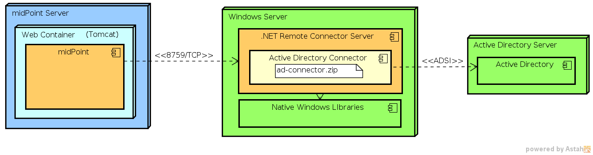

= .NET Connector Server
:page-wiki-name: .NET Connector Server
:page-wiki-id: 7307546
:page-wiki-metadata-create-user: semancik
:page-wiki-metadata-create-date: 2013-01-30T13:30:39.308+01:00
:page-wiki-metadata-modify-user: semancik
:page-wiki-metadata-modify-date: 2020-02-13T10:31:01.937+01:00
:page-obsolete: true
:page-obsolete-since: "4.2"
:page-upkeep-status: green

.NET Remote Connector Server is a xref:/connectors/connid/1.x/connector-server/[Connector Server] that runs on Windows machines using the .NET framework.

Perhaps the only practical purpose of this connector server is to provide environment for Windows-specific connectors.
Connectors such as xref:/connectors/connectors/Org.IdentityConnectors.ActiveDirectory.ActiveDirectoryConnector/[Legacy Active Directory Connector (.NET)] require proprietary libraries that are only available on Microsoft platforms (.NET) and cannot be used from Java.
Therefore midPoint cannot use such libraries in a local connector (or remote Java connector for that matter) and a .NET-based remote connector server is required.

== Requirements

* Windows 2003, Windows 2008, Windows 2012, Windows 2012 R2

* .NET Framework 4.0 or later

* approx. 20MB of free disk space

* approx. 200MB of available RAM

== Download

[%autowidth]
|===
| Version | Download | Sources | Note

| 1.4.0.84
| https://nexus.evolveum.com/nexus/repository/openicf-releases/org/connid/connid/1.4.0.84/connid-1.4.0.84-dotnet.zip[ZIP]https://nexus.evolveum.com/nexus/repository/openicf-releases/org/connid/connid/1.4.0.84/connid-1.4.0.84-dotnet.msi[MSI]
| github Evolveum/ConnId (branch master)
| Experimental.
Adds support for filtering results handler validation mode and paged searches in AD connector.

| 1.4.0.76
| https://nexus.evolveum.com/nexus/repository/openicf-releases/org/connid/connid/1.4.0.76/connid-1.4.0.76-dotnet.zip[ZIP]https://nexus.evolveum.com/nexus/repository/openicf-releases/org/connid/connid/1.4.0.76/connid-1.4.0.76-dotnet.msi[MSI]
| link:https://github.com/Evolveum/ConnId/commit/e183e83d0e5e1bcec297b7676ca6305cb85ad9b6[github Evolveum/ConnId] (branch master)
| Seems to be quite stable.
We recommend to use this one.

| 1.1.0.20128
| https://nexus.evolveum.com/nexus/repository/openicf-releases/org/forgerock/openicf/framework/framework/1.1.0.20128/framework-1.1.0.20128-dotnet.zip[ZIP]https://nexus.evolveum.com/nexus/repository/openicf-releases/org/forgerock/openicf/framework/framework/1.1.0.20128/framework-1.1.0.20128-dotnet.msi[MSI]
| link:https://github.com/Evolveum/ConnId/commit/fc420dd32fe69f59b36f457cf2e95d7348f74158[github Evolveum/ConnId] (branch openicf-1.1)
| Obsolete - to be used with pre-3.0 versions of midPoint.

|===

== Installation

Execute `ServiceInstall-*.msi` and follow the wizard.
When it completes the Connector Server will be installed as a Windows service.

The default install location is `C:\Program Files\Identity Connectors\Connector Server or `C:\Program Files (x86)\Identity Connectors\Connector Server` +
`

== Configuration

Start the Windows Services Console to check whether the Connector Server is currently running (look for `Connector Server` service).
If it is running then stop it.

From a command prompt set the key for the connector Server.
This is done by changing to the directory where the connector server was installed (by default: `C:\Program Files\Identity Connectors\Connector Server`) and executing the following command in shell (or Power shell):

[source]
----
ConnectorServer /setkey <newkey>
----

where _newkey_ is the value for the connector server key.
The same key must be configured in corresponding xref:/midpoint/architecture/archive/data-model/midpoint-common-schema/connectorhosttype/[ConnectorHostType] object in midPoint repository.

The configuration file of the connector server is `ConnectorServer.exe.Config` and it is located in the connector server directory.
It is an XML-formatted file.
The most common things to change in the configuration file would be the port, trace, and ssl settings located inside the `appSettings` section.

[NOTE]
====
You may need to change the identity of the Connector Server service.
Local user account may not be sufficient for some operations.
Open the Services console, edit properties of "ConnectorServerService".
Specify a valid domain account in the "Log On" tab.
====

=== Configuring SSL

The Connector Server is a SSL server.
Therefore is needs a keypair (private key + certificate).
.NET Connector Serve is using Windows certificate stores to keep the certificates and keys.

Make sure that the server is stopped before making any configuration change.

==== Import Keypair to a Certificate Store

The keypair is usually distributed in a PKCS#12 format (a file with `p12` or `pfx` extension).
This needs to be imported into a certificate store.
Use `certutil` tool for this purpose executed in privileged ("Run as administrator") shell or Powershell:

[source]
----
certutil -v -p changeit -importPFX mykeycert.pfx
----

The PKCS#12 files are usually protected by passwords therefore the password needs to be supplied using `-p` option or it will be asked in terminal if this option is omitted.
If the tool complaints that the certificate already exists you can use `-f` option to overwrite it.

The certificate part of the keypair also needs to be added to a separate certificate store so the connector server can find it.
Again use the `certutil` tool in the privileged shell or Powershell to do it.

[source]
----
certutil -addstore ConnectorServerSSLStore cert.pem
----

The certificate must be in PEM or DER format for this tool to work.
If you do not have certificate in that format you can use tools such as OpenSSL to convert it.
The `ConnectorServerSSLStore` is a name of a certificate store that will be used by the connector server.

If the store (ConnectorServerSSLStore) does not exist, `certutil` will ask you to use -f switch.

It *seems* that the Connector Server user must be member of local "Administrators" group to be able to access the certificate store! (If you are not using "Domain Admins" group for security reasons.)

[NOTE]
.Is this OK?
====
Details in this section may not be absolutely correct.
If you know better please contact us to improve it.
====

==== Configuring SSL in Connector Server

Edit the `ConnectorServer.exe.Config` file.
Change the `connectorserver.certificatestorename` property to `ConnectorServerSSLStore`. Also switch the `connectorserver.usessl` property to `true`. The file should look like this:

[source,xml]
----
<configuration>
...
<appSettings>
<add key="connectorserver.port" value="8759" />
<add key="connectorserver.usessl" value="true" />
<add key="connectorserver.certificatestorename" value="ConnectorServerSSLStore" />
<add key="connectorserver.ifaddress" value="0.0.0.0" />
<add key="logging.proxy" value="false" />
<add key="connectorserver.key" value="..." />
</appSettings>
...
</configuration>

----

You can start the server now.
Please do not forget to xref:/connectors/connid/1.x/connector-server/[configure the midPoint side as well].

== Connector Deployment

. Stop the Connector Server.

. Extract the ZIP archive of the connector and copy all the connector files to the connector server directory which is usually `C:\Program Files\Identity Connectors\Connector Server`. Yes, right there.
Yes, it is messy.
But it works for now.
We are planning to improve it in the future.

. Start the Connector Server.

== Logging

Connector server is using a standard .NET trace mechanism for logging.
Logging configuration is in the `ConnectorServer.exe.Config` file in the `system.diagnostics` section.
Following XML snippet provides an example of the logging configuration.
The two most important items to configure are the logfile and log level.
Both are configured in the `initializedData` XML attributes as is illustrated in the example below.
The example sets log level to `All` which is quite a verbose log level.
The possible values are `Error`, `Warning`, `Verbose` and `All`. Connector server needs to be restarted after logging setting is changed.

.Sample of logging setup
[source,xml]
----
<system.diagnostics>
    <trace autoflush="true" indentsize="4">
      <listeners>
        <remove name="Default" />
        <add name="myListener"  type="System.Diagnostics.TextWriterTraceListener"  initializeData="C:\Program Files (x86)\Identity Connectors\Connector Server\connectorserver.log" traceOutputOptions="DateTime">
          <filter type="System.Diagnostics.EventTypeFilter" initializeData="All"/>
        </add>
      </listeners>
    </trace>
</system.diagnostics>
----

== Notes

The MSI installs files by default to `C:\Program Files\Identity Connectors\Connector Server`. On 64-bit systems, the default installation directory is `C:\Program Files (x86)\Identity Connectors\Connector Server`.

The configuration file is located in `C:\Program Files\Identity Connectors\Connector Server\ConnectorServer.exe.Config`. By default, the logging is configured to log to `C:\ConnectorServer.log` file.

To use ConnectorServer 1.1.0.1 and above requiring .NET 4 framework, please update the configuration file as below or ConnectorServer won't start:

.ConnectorServer.exe.Config
[source,xml]
----
<configuration>
  <runtime>
    <loadFromRemoteSources enabled="true"/>
  </runtime>
...
</configuration>

----

To increase logging while debugging, please update the configuration file as below:

.ConnectorServer.exe.Config
[source,xml]
----
<configuration>
...
  <filter type="System.Diagnostics.EventTypeFilter" initializeData="All"/>
...
----

Please make sure that you allow TCP port 8759 on the Windows machine (or custom port if you changed the configuration file).

[TIP]
====
If the Connector Server Service is configured to run as specific user (not LocalSystem) and it does not start automatically although it is configured to do so, and Event Viewer complains that "The account name is invalid or does not exist, or the password is invalid for the account name specified", please try if you can start the service manually to check if the user/password are ok.
If you are perfectly able to start the service manually, but automatic start does not work, please set the startup for the service to "*Automatic (Delayed)*".
====

== See Also

* xref:/connectors/connid/1.x/connector-server/[Connector Server]

* xref:/connectors/connectors/Org.IdentityConnectors.ActiveDirectory.ActiveDirectoryConnector/[Legacy Active Directory Connector (.NET)]

* link:https://github.com/OpenIdentityPlatform/OpenICF[GitHub: OpenIdentityPlatform/OpenICF]