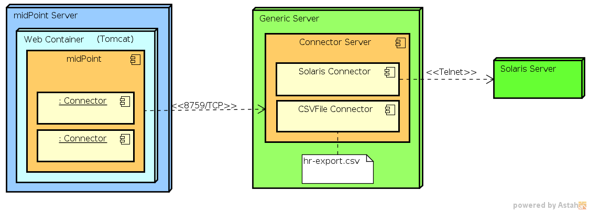

= Connector Server
:page-wiki-name: Connector Server
:page-wiki-id: 7307568
:page-wiki-metadata-create-user: semancik
:page-wiki-metadata-create-date: 2013-01-31T10:18:37.324+01:00
:page-wiki-metadata-modify-user: semancik
:page-wiki-metadata-modify-date: 2020-02-13T10:31:58.750+01:00
:page-upkeep-status: yellow
:page-toc: top
:page-description: Deploy a connector server to enable midPoint manage resources it cannot access directly.
:page-keywords: connector server, proxy, security, non-java environment, legacy resources

== Introduction

Connector server is a container that simply holds connectors.
It is a very lightweight component that can be installed on a different node that is used to run midPoint.
MidPoint then connects to the connector server and uses it as a proxy (or a gateway) to access systems that it otherwise could not access.

== Why Use a Connector Server?

. *Non-Java environment* +
    MidPoint is built in Java, and its connectors are also Java-based.
    However, some connectors are developed for non-Java environments, such as .NET-based systems.
    For example, xref:/connectors/connectors/Org.IdentityConnectors.ActiveDirectory.ActiveDirectoryConnector/[the legacy .NET-based Active Directory connector] could not run directly in midPoint
    because it required the .NET runtime environment, which is not natively supported within midPoint's Java-based architecture.
    These connectors must run in a separate Connector Server that supports their specific runtime environment.

. *Legacy or proprietary systems* +
    Some systems or resources may only provide access through proprietary protocols or APIs that are not accessible from Java.
    In such cases, a connector must be implemented in a language or framework that can interact with those systems.
    This often necessitates the use of a separate connector server to host the connector.

. *Security and isolation* +
    You may also want to use a connector server for security reasons.
    The connection between midPoint and connector server is protected by shared secret and may also be protected by SSL.
    Therefore it may be more secure than the native protocol used by the resource.
    Placing a connector server near the target resource may provide better security than a direct communication.

. *Remote resources* +
    Connectors that interact with resources that are not directly accessible from the midPoint server (e.g., due to network restrictions or firewall rules) may need to run on a connector server located closer to the target resource.
    This allows midPoint to communicate with the resource through the connector server, which acts as a proxy.

. *Performance and resource constraints* +
    Some connectors may be resource-intensive or require specific configurations that are better managed in a separate process.
    By running in a connector server, these connectors can be isolated from the midPoint process, preventing potential performance issues or instability of the main midPoint server.

In summary, connectors are unable to run inside midPoint when they require a different runtime environment or specific configurations that are not feasible to achieve on the main midPoint server.
In these cases, a connector server provides the necessary environment to host the connectors, enabling midPoint to interact with the external systems through the proxy.

== Installing and Configuring Connector Servers

There are two kinds of a ICF connector server:

* xref:/connectors/connid/1.x/connector-server/java/[Java Connector Server] is used for ordinary Java-based connectors.
It is useful if a connector needs to run on a different host than that where midPoint is running.
This is useful mostly for file-based connectors such as CSVFile.
It avoids the need to copy or FTP the file to a midPoint host.

* Obsolete xref:/connectors/connid/1.x/connector-server/dotnet/[.NET Connector Server] was used for .NET-based connectors.
It was usually used only for Active Directory connector or similar connectors to Microsoft-proprietary technologies.
.NET connector server is *OBSOLETE*.
The connector server is no longer developed, maintained or supported.

Please refer to the specific pages of the connector servers for download, installation and configuration instructions.

== Configuring midPoint

Once the connector server is running its parameters needs to be configured in midPoint.
MidPoint can discover *local* connectors automatically but the situation is a bit more complex for remote connectors.
First of all midPoint needs to know that a connector server exists.
It also needs to know connection and security parameters.
This is configured in a xref:/midpoint/architecture/archive/data-model/midpoint-common-schema/connectorhosttype/[Connector Host] object.

=== Connector Host

The xref:/midpoint/architecture/archive/data-model/midpoint-common-schema/connectorhosttype/[Connector Host] object contains description of a remote connector server.
It contains name of the host where the connector server is installed, port number that is used for connection, shared secret and other security properties.
The connector host definition does *not* contain information about individual connectors that are deployed on a connector host.
This information is contained in the individual xref:/midpoint/architecture/archive/data-model/midpoint-common-schema/connectortype/[connector objects]. These are usually created semi-automatically using a remote connector discovery process.
Such connector object then refer back to the xref:/midpoint/architecture/archive/data-model/midpoint-common-schema/connectorhosttype/[Connector Host] object.

.Example of a ConnectorHostType definition
[source,xml]
----
<!-- This configuration is valid for midPoint 3.x. For previous versions, see earlier versions of this page. -->

<connectorHost xmlns="http://midpoint.evolveum.com/xml/ns/public/common/common-3" xmlns:t="http://prism.evolveum.com/xml/ns/public/types-3">
	<name>ICF Connector server on foobar.example.com:8759</name>
	<hostname>foobar.example.com</hostname> 			<!-- hostname/IP where is remote connector server installed -->
	<port>8759</port>						<!-- port where is remote connector server installed -->
	<sharedSecret>							<!-- shared secret between midPoint and remote connector server-->
		<t:clearValue>secret</t:clearValue>
	</sharedSecret>
</connectorHost>

----

=== Configuring SSL

The communication between MidPoint and Connector Server may be protected by SSL.
In this case the connector server is a SSL server, midPoint is SSL client.
Setup of appropriate cryptographic material needs to be done on both sides.

[%autowidth,cols="h,1,1"]
|===
|  | MidPoint | Connector Server

| Role
| SSL Client
| SSL Server

| Crypto material
| CA certificate
| Keypair (private key and server certificate)

| Purpose
| Validate Connector Server certificate
| Authorize the connector server to midPoint

| How to set up crypto material
| Add trusted root CA certificate to xref:/midpoint/reference/security/crypto/keystore-configuration/[midPoint keystore]
| Configure keypair on connector server SSL: xref:/connectors/connid/1.x/connector-server/java/[Java], xref:/connectors/connid/1.x/connector-server/dotnet/[.NET]

| How to enable SSL
| Set `protectConnection` property in xref:/midpoint/architecture/archive/data-model/midpoint-common-schema/connectorhosttype/[ConnectorHostType] to `true`
| Set `connectorserver.usessl` option to `true` in the connector server configuration file

|===

The connector server needs any kind of valid SSL server certificate.
It does *not* need to be a "public" certificate, i.e. it does not need to be issues by the public trusted certificate authority.
Certificates from a private CA work just fine.
There are numerous primers how to set up a private CA for this purpose, e.g. by using OpenSSL tool.

=== Troubleshooting

* `java.security.InvalidAlgorithmParameterException: the trustAnchors parameter must be non-empty`

** This strange message usually indicates a missing keystore or a missing trusted root CA certificate in the keystore.
See xref:/midpoint/reference/security/crypto/keystore-configuration/[Keystore Configuration].

== See Also

* xref:/connectors/connid/1.x/connector-server/java/[Java Connector Server]

* xref:/connectors/connid/1.x/connector-server/dotnet/[.NET Connector Server]

* xref:/midpoint/reference/security/crypto/keystore-configuration/[Keystore Configuration]
