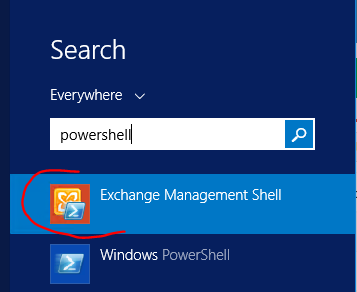

= Powershell Support in AD/LDAP Connector - WinRM
:page-nav-title: Powershell (WinRM)
:page-wiki-name: Powershell Support in AD/LDAP Connector - WinRM
:page-wiki-id: 52003345
:page-wiki-metadata-create-user: semancik
:page-wiki-metadata-create-date: 2020-11-03T15:15:00.221+01:00
:page-wiki-metadata-modify-user: semancik
:page-wiki-metadata-modify-date: 2020-11-03T15:16:51.027+01:00
:page-toc: top
:page-deprecated: true
:page-replaced-by: /connectors/connectors/com.evolveum.polygon.connector.ssh.SshConnector/
:page-upkeep-status: green

[TIP]
.Use SSH instead of WinRM
====
This page is about WinRM method of executing scripts on Windows servers.
This method is now *DEPRECATED* in favor of xref:/connectors/connectors/com.evolveum.polygon.connector.ssh.SshConnector/[].
====

== Introduction

The AD/LDAP connector has ability to execute remote commands and PowerShell scripts on Windows machines using the Windows remote management interfaces (WinRM/WS-Man).

[NOTE]
====
This feature is only available in AD/LDAP connector version 1.4.2.18 and later.
====

== Configuration

The WinRM access needs additional configuration:

[source]
----
<icfcldap:winRmUsername>administrator</icfcldap:winRmUsername>
<icfcldap:winRmHost>mailserver.lab.evolveum.com</icfcldap:winRmHost>
<icfcldap:winRmPassword><t:clearValue>.....</t:clearValue></icfcldap:winRmPassword> <!-- optional -->
<icfcldap:winRmPort>5985</icfcldap:winRmPort> <!-- optional -->
<icfcldap:winRmUseHttps>false</icfcldap:winRmUseHttps> <!-- optional -->
<icfcldap:powershellArgumentStyle>variables</icfcldap:powershellArgumentStyle> <!-- optional -->
----

== Executing the Scripts

This ability is implemented as usual connector scripting capability.
Therefore it is possible to use provisioning scripts before and after any provisioning operations:

[source,xml]
----
    <scripts>
        
    </scripts>
----

== Supported languages

There are currently two "languages" supported by the connector scripting capability:

[%autowidth]
|===
| Language name | Interpreted by | Description

| cmd
| cmd.exe
| Executing simple Windows commands.

| powershell
| PowerShell
| PowerShell commands, each executed separately in its own PowerShell instance.
This requires additional overhead to execute powershell.

| powerhell
| PowerShell
| PowerShell commans executed in one PowerShell instance.
This forms a quasi-session.
The PowerShell interpreter is executed and initialized only once.
Then the commands are sent to the PowerShell one by one.
+
WARNING: All the commands share the same PowerShell, so they can influence each other (e.g. they are using the same variables).
Be careful.

| exchange
| PowerShell (Exchange)
| PowerShell commans executed in one PowerShell instance which has been initialized with Exchange snap-ins. +
WARNING: All the commands share the same PowerShell, so they can influence each other (e.g. they are using the same variables).
Be careful.

|===

== Script arguments

Passing arguments to the script can have two different formats.
Which of the formats is used is based upon AD resource attribute powershellArgumentStyle.

[%autowidth]
|===
| powershellArgumentStyle | Format | Description

| dashed (default)
| command -arg1 val1 -arg2 val2
| The arguments are encoded in the commands in a windows-like dashed form.Final command example: "jump.bat -height 100 -distance 200"

| variables
| $arg1 = 'val1'; command
| This option is convenient for more complex commands, where arguments are used inline.Connector sets arguments as powershell variables, that can be then read with $ notation.Example: see bellow

|===

Please note that command represents <code></code> part of the script.

Example how powershell command with arguments may be invoked in midPoint:

.powershellArgumentStyle=variables
[source,xml]
----

----

== Windows Server Setup

Remote powershell is executed using WinRM service which is using the WS-Management standard web services.
The server side is controlled with `winrm` tool.

Using HTTP and basic authentication:

[source]
----
winrm set winrm/config/client/auth '@{Basic="true"}'
winrm set winrm/config/service '@{AllowUnencrypted="true"}'
----

Using CredSSP:

[source]
----
winrm set winrm/config/client/auth '@{CredSSP="true"}'
winrm set winrm/config/service/auth '@{CredSSP="true"}'
----

Enabling HTTPS:

[source]
----
winrm create winrm/config/listener?Address=*+Transport=HTTPS '@{Port="5986"}'
----

*Do not forget to add firewall rule to allow connection to the port.*

For a user to be able to use WinRM, the user must be member of` Remote Management Users` group.

Computer Management > Services and Applications > WMI Control > Security (select Root) > Security: add the `Remote Management Users` group, allow `Execute Methods` and `Remote Enable` permission.
Click Advanced button and change the application of the permission to "This namespace and subnamespaces".
For more details see here: link:https://www.sevecek.com/Lists/Posts/Post.aspx?ID=280[https://www.sevecek.com/Lists/Posts/Post.aspx?ID=280]

This works in some cases but it does not for other.
If it does not work then there is another way.
Use the command:

[source]
----
winrm configSDDL default
----

And set read and execute rights for the `Remote Management Users` group.

To enable access to the WinRM service in a subdomain use the following command on the target computer:

[source]
----
Set-PSSessionConfiguration Microsoft.PowerShell -ShowSecurityDescriptorUI
----

List winrm configuration and listeners form elevated command prompt:

[source]
----
winrm get winrm/config
winrm enumerate winrm/config/listener
----

== Quota

[source]
----
winrm set winrm/config/winrs '@{MaxShellsPerUser="100"}'
----

== Microsoft Exchange

This method is recommended for midPoint 3.6 and later (connector version 1.4.4 and later)

Connector is capable of provisioning mailboxes to Microsoft Exchange mail server via invoking powershell interface of the Exchange server.
The connector provides a special `exchange` scripting language, which is in a fact a PowerShell initialized with Exchange snap-ins.
Other scripting languages (e.g. cmd, powershell) may also be used and they are supposed to work even in midPoint 3.5 and earlier (connector versions before 1.4.4).
However, those languages may suffer performance hit from Exchange snap-in initialization on every command.
The "exchange" language was designed to overcome this limitation.

Connector is capable of provisioning mailboxes to Microsoft Exchange mail server via invoking powershell interface of the Exchange server.

* Make sure winrm is enabled as described in above section or consult Troubleshooting.

* User specified in winRmUsername needs to have sufficient Exchange access rights - e.g. "Organization Management" AD group assigned.

* CredSSP Authentication is required to authorize user to Exchange commands:

** On Exchange server run: powershell -command Enable-WSManCredSSP Server

** On winRmHost (Exchange server or other domain computer): powershell -command Enable-WSManCredSSP Client -DelegateComputer <exchange_server_hostname>

[TIP]
.Exchange Powershell
====
We recommend pointing the winRmHost property to Exchange server hostname rather than to AD controller server. Host server needs to have special Exchange powershell installed, which consumes quite a lot of resources.
====

AD/LDAP connector 1.4.4 or later supports CredSSP protocol.
In that case the use of CredSSP is easy, it just need setting for authentication mechanism and domain:

[source,xml]
----
<resource>
    ...
    <connectorConfiguration>
        <configurationProperties>
            ...
            <winRmDomain>foo</winRmDomain>
            <winRmAuthenticationScheme>credssp</winRmAuthenticationScheme>
        </configurationProperties>
----

TODO: complete sample

=== Prerequisites

The are few things that you need to setup/check first.
In case your winRmHost points to other computer in the domain than Exchange server, you need to set this computer as well.

* Make sure winrm is enabled as described in above section or consult Troubleshooting.

* User specified in winRmUsername needs to have sufficient Exchange access rights - e.g. "Organization Management" AD group assigned.

* CredSSP Authentication is required to authorize user to Exchange commands:

** On Exchange server run: powershell -command Enable-WSManCredSSP Server

** On winRmHost (Exchange server or other domain computer): powershell -command Enable-WSManCredSSP Client -DelegateComputer <exchange_server_hostname> +

[TIP]
.Exchange Powershell
====
We recommend pointing the winRmHost property to Exchange server hostname rather than to AD controller server. Host server needs to have special Exchange powershell installed, which consumes quite a lot of resources.
====

=== Creating resource from sample

Sample resource XML can be found link:https://github.com/Evolveum/midpoint/blob/master/samples/resources/ad-ldap/ad-ldap-medusa-exchange.xml[here].

Sample resource is set to invoke enable-mailbox command in Exchange powershell after new AD user has been created.

For connectors prior to version 1.4.4 the integration is not straightforward due to the lack of CredSSP  in the connector.
Various workarounds have to be used.
Basically winrs is launched on the remote machine to connect locally with -a[llow]d[elegate].

After sample resource is imported into midPoint, please set your actual hostnames and passwords, save the resource and click "Refresh schema" button.
There are some Exchange attributes preset in the sample, however if you need more, you have to set them as operational and add to schema manually.
Connector does not see all Exchange attributes - bug:MID-3379[]

== Troubleshooting

=== General TIP

If you encounter any WinRM problem where you are not sure if your remote WinRM interface is configured correctly or reachable via network.
I suggest using winrs command from (preferably different) Windows machine.
Following simple command executes "hostname" command on remote machine via WinRM HTTPs:

[source]
----
winrs -r:https://test001.testad.cz:5986 -u:midpoint -p:password12345 hostname
----

[TIP]
====
Using elevated cmd.exe is recommended.
====

=== java.io.IOException: Authorization loop detected on Conduit

This usually means user authentication to WinRM failed.
Check that your user and password are correct and that you are connecting to enabled interface - e.g. when using basic HTTP, make sure winrm/config is set properly (see above).

As for winRmUsername, its usually best to use just simple username, not DN.
But feel free to try all forms, e.g. "cd=midpoint, ou=..., dc=domain, dc=com" or "domain.com\midpoint" or best: "midpoint".

=== Script action takes long time to finish

Well.. this can mean any general problem. Try running winrs tool to simulate problem right in the Windows first. There are few tips:

* When using HTTPs, make sure your environment (Java, Tomcat) trusts certificate that is used on remote machine.

* Also make sure that HTTPs port (e.g. 5986) is enabled on the Windows Firewall for inbound connections (by default it is NOT).

* When using HTTPs make sure your resource "AD host" is specified via hostname (matching certificate CN) rather than IP.

=== Exchange - The term 'enable-mailbox' is not recognized as the name of a cmdlet

Make sure that winRmHost points to Windows server that has special Exchange power shell installed.

=== Exchange - ADInvalidCredentialException

Apart from obvious meaning (bad username/password) this could also mean that CredSSP Authentication (winrs -ad) is not used.
If you are not sure whether this is the case, try running some simple command like "hostname" instead of Exchange command.
If this is the case, check Prerequisites chapter on how to allow CredSSP on both client and server.

=== HTTP 500 from WinRM Service

If you are getting HTTP/500 error messages in CredSSP setup from your WinRM calls, it might be because WinRM proxy user that midPoint is using does not have enought privileges to read MachineKeys on Windows hosts. Details here.

=== Troubleshooting WinRM webservice calls

[source]
----
org.apache.http.wire: TRACE
----

== Windows 2008

Windows 2008 support only TLSv1 protocol by default.
There are several problems and incompatibilities with that protocol.
Therefore midPoint cannot work with stock Windows 2008.
Windows 2008 need to be updated to support TLSv1.2 to make midPoint work with Windows 2008.

== See Also

* xref:/connectors/resources/active-directory/active-directory-ldap/[Active Directory with LDAP connector]

* xref:/connectors/connectors/com.evolveum.polygon.connector.ssh.SshConnector/[]

* xref:/connectors/resources/active-directory/tips-tricks/#enabling-ldaps[Enabling LDAPS]

* link:https://stackoverflow.com/questions/40756032/the-ws-management-service-cannot-find-the-certificate-that-was-requested[WS-Management service cannot find the certificate that was requested]

* link:https://practical365.com/exchange-server/manually-configuring-email-addresses-for-exchange-server-2013-recipients-using-powershell/[Manually Configuring Email Addresses (proxyAddresses) using PowerShell]
