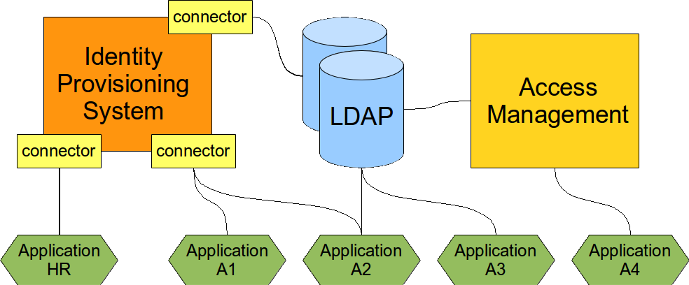

= Management, Directory, Access

link:/iam/[Identity and Access Management (IAM)] is not a single technology.
It is a combination of several technologies that work together to create solution to a specific set of problems.
There is no "silver bullet" combination that can magically solve all the identity management problems.
But there is one combination that is effective in a very large proportion of Identity and Access Management solutions.
It is a combination of a identity management system, directory service and access management system.

== Situation

Almost any identity-related solution needs to implement three basic features:

* *Data storage:* Ability to store and retrieve identity data, in large numbers and for a large number of requests

* *Integration:* Ability to transform the data from the form which one system understands to the form that other system understands

* *Access:* Ability to authenticate users, maintain session, make authorization decisions, etc.

It is very difficult to implement all three services in a single component because there are significant trade-offs: Integration requires complex logic which is almost impossible to implement in high-performance environments.
Scalable access management requires very efficient session store that needs to be (at least partially) kept in memory and failed over to another node if needed.
Data store needs to be very simple to allow efficient storage and retrieval of vast amount of data.
And so on.

== Solution

Therefore there are three basic components to the solution.
Each of the components is focused on delivering a particular service or systemic quality.
Therefore each of the components can be relatively simple, focused, independently developed and combined to address the needs of a particular solution.
The tree components are:

* *Directory service* for high-performance and scalable storage of data.

* *Identity management* for identity data integration, complex logic, data policies and administration.

* *Access management* system for authentication, authorization, session management and access auditing.

The setup of the three components is illustrated in the following diagram.

A complex Identity and Access Management solution usually needs all the three components.
It is in fact possible to link:wiki://Everything in LDAP/[start with just one component] and it may work quite well for some time.
But sooner or later the other components will be needed to complete the solution.

== Directory Service

Directory Service is the data storage component.
It is scalable high-performance and cheap storage.
The most frequently used access protocol is LDAP.
The LDAP schemas are partially standardized therefore it is usually easy to connect applications to LDAP-enabled directory service.
This makes it an ideal solution for identity management deployments, both large and small.

However, directory service is just a database.
It has a very limited integration logic.
Therefore it link:wiki://Everything in LDAP/[it needs other components to work efficiently]. Perhaps the most important question is: how the data get into the directory service in the first place? How are they maintained?

The rule of the thumb is: If you can integrate your application using just LDAP then do so.
It is the cheapest and fastest way.
Even if this integration is later replaced than it is still worth doing as a prototype or as a first deployment step.

But be aware that there may be link:wiki://Everything in LDAP/[drawbacks to LDAP integration]: the application may need to maintain a local copy of the profile, need to maintain session and there is almost always a question of deprovisioning.

== Identity Management

Identity management (IDM) system contains logic to synchronize identity data in various databases and remote systems.
IDM system is usually quite a complex beast that can be customized by setting up mappings, data transformation rules, policies and various pieces of scripts and even custom code.
This kind of flexibility is really necessary because application data models can be very "innovative" and "demanding".
The IDM system must be able to convert almost anything to almost anything else.

There are two primary responsibilities of IDM system in the solution:

* Handle *data sources* and *populate* the directory service.
The primary source of identity data is usually HR or CRM system.
These system are very seldom LDAP-enabled in a way that they can publish the data to the directory service in an acceptable form.
Therefore IDM system is needed to get the data from the sources (HR, CRM), transform them to a usable form and publish them in directory service.
This is a recurring task as the synchronization needs to be done continually.

* *Provision* and *deprovision* data to the system that either do not support LDAP or systems that needs to maintain a local copy of the data.
The later case is link:wiki://Everything in LDAP/[surprisingly frequent]. And in this case the most important part of the process is deprovisioning.
Leaving a an active account around is always a security risk even if the LDAP authentication was disabled.
Too many applications have alternative authentication schemes and misconfiguration very common.
Therefore a severe security vulnerability may exist in a system for years without any systematic way to detect it.

IDM system is designed to handle complex logic.
But this also means it is *not* built for performance.
But if it is used properly it does not need a record-breaking performance.
It is essentially a back-end system that is only invoked when something changes.
It is also *not* a mission-critical system.
Short outages or overloads of IDM system are usually harmless as it is not directly connected in user authentication and access path.

== Access Management

Access management system does what its name tells that it does: it manages access.
It takes care of user authentication.
Once the user is authenticated it maintains user sessions, propagates it to other system and thus effectively creates a Single Sign-On (SSO) system.
It may process authorization of user requests, mediate access to the user profile and so on.

The access management system is built for high throughput.
It is designed to handle a lot of authentication and access requests per second.
Many access management systems are built on top of directory services because this is a very good match.

Unlike directory services the access management system are specialists for authentication and authorization.
Pluggable authentication systems and flexible authorization policies are almost the norm.
This is what LDAP cannot efficiently do.

== Deployment

The solution is usually deployed in steps:

. *Directory service deployment.* Use any kind of suitable directory service to store identity data.
Active Directory is a natural choice or environments based on Microsoft technology.
For the non-Microsoft folk there is a couple of good open source LDAP servers.
It is cheap and efficient first step.
But it link:wiki://Everything in LDAP/[starts to hit the limits surprisingly quickly] as the complexity of the information systems grows.

. *Identity management system* is a must have for any non-trivial deployment.
Usually when the number of identities goes over several hundreds and the number of system goes over a dozen it is no longer efficient to manage them manually and the directory service just won't do it any more.
Automated provisioning is needed.
You do not need to be a heavyweight and very expensive commercial monster.
It is often difficult to get a reasonable return of investment (ROI) with closed-source approach.
This has efficiently prohibited the use of IDM technology in many environments during early years of IDM deployments.
However good open source alternatives has been developed in 2010s.
The ROI calculation is much better for these products and it means that IDM can now be used almost everywhere.

. *Access management* in a "nice to have" step.
This may bring Single Sign-On (SSO), unify the authorization policies and so on.
But deployment of access management is expensive.
First of all it needs a unified user database.
This usually has to be stored in the directory service, so a directory service needs to exist first.
Then the database must be unified: every account must exist in the directory service before it can be used in access management.
And the account needs to have a correct for for the access management system to understand it.
IDM system is usually needed to create and maintain this database.
But the most expensive part is integration of the applications.
Each application that takes part in the access management needs to be modified.
Native authentication needs to be disabled and replaced by access management agent.
This is relatively easy for some applications but extremely expensive for other applications.
Therefore it is usually not possible to get anywhere close to 100% coverage.
This step needs to be planned with care.

== Notes

This approach was link:https://dracones.ideosystem.com/work/papers/2006-infosecon-semancik.pdf[described in 2006 by Radovan Semančík] but it has undoubtedly existed even before that time.
It is a frequently used set-up that is well proven by practical deployments.

== See Also

* link:/iam/[Identity and Access Management]

* link:/iam/antipatterns/everything-in-ldap/[Everything in LDAP]

* link:/iam/antipatterns/provisioning-interface-abuse/[Provisioning Interface Abuse]
