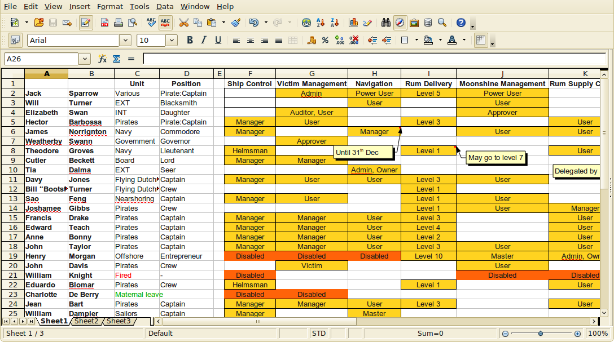
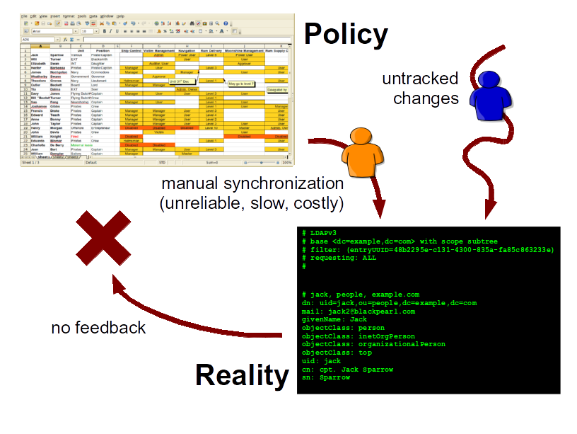
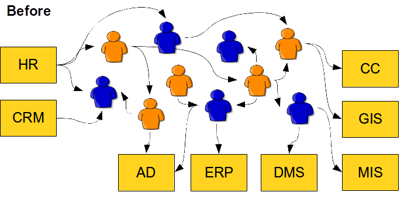
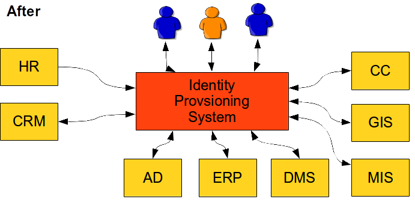

= Business Benefits of Identity Management
:page-wiki-name: Business Benefits of Identity Provisioning
:page-wiki-metadata-create-user: semancik
:page-wiki-metadata-create-date: 2014-03-24T11:42:00.353+01:00
:page-wiki-metadata-modify-user: semancik
:page-wiki-metadata-modify-date: 2020-02-14T19:56:36.369+01:00

== Identity Management

Every corporation, small enterprise, agency, university or almost any kind of organization needs some kind of _order and security_ to operate efficiently.
Also the primary concern of every organization is dealing with _people_: employees, contractors, partners, customers, and so on.
link:/iam/[Identity Management] is a field of information technology where these two critical concerns combine: Identity management is about order and security with respect to managing people.
Identity management technologies deal with the processes of hiring people, organization structure changes, lay-offs, partner enrolment and customer management.
Identity management technologies try to automate many aspects of these processes starting with password management to automation of security reviews, audits and risk management assessments.

== Simple Start

Before a company becomes a big enterprise it usually starts small and simple.
It has tens of hundreds of employees, a couple of partners and just a handful of information systems.
Even such a small company needs some kind of order and security.
Therefore it needs processes how to manage _identities_. But these processes are very simple when a company is small.
In fact a single spreadsheet is usually the right tool for this job:

The principle is straightforward: security personnel and/or system administrators maintain a spreadsheet that defines access rights that each individual employee should have.
This is a simple and very efficient way how to manage identities in a small organization.
It also easily understandable.
It is in fact so simple that most small companies do not maintain this spreadsheet at all and only rely on the actual information from each individual information system.
Which is a very easy, efficient and cost-effective way if the information systems are simple and their number is small.

== First Obstacles

However organizations have natural tendency to grow.
As the organization grows then also the number of identities increases.
But what is more important is that also the number of information systems get higher and they become very complex.
It may take only a few months and the spreadsheet starts to look a bit scary:

There are many reasons for this unexpected complication:

* *Complexity of information systems*. Simple binary notion of "full access" versus "no access" is not enough.
The access rights of individual employees takes many shades of grey between these two extremes.
The structure of access rights of many Internet-enabled and cloud applications are even multi-dimensional.
There is no way for this to be efficiently represented in a spreadsheet.

* *Security practices*. There are many security guidelines, regulations, standards and best practices that an organization needs to comply with.
They almost always make a very good sense from the perspective of a security officer.
But the downside is that they are very difficult to implement.
E.g. a generally accepted practice of _least privilege_ states that each person should have only the minimum access rights needed for his job.
And nothing more.
This is easier said than done.
Security best practices tend to complicate the system so much that it almost always beyond a comprehension of a unaided human mind.
This is definitely beyond the power of a simple spreadsheet.

* *HR practices*. There are maternal leaves, sabbaticals, temporary transfers, contracts with fixed termination date, employees with several contracts at once and so on.
It is quite obvious that this is not an easy task to handle.

* *Organizational practices*. The days of organizational structure that looked like a tree are gone forever.
Organizational structures of new dynamic organizations are more alike to a labyrinth rather than a tree.
An assistant for section A is also a part-time assistant for section B and also works on project X. Portion of bank tellers are in a re-assignable pool and their work position changes daily to compensate for days off and sick leaves of regular staff.
Re-organizations are not an exception but rather a regular practice.

* *Consumerization.* The new "consumerised" market opened up an entire Pandora's Box of possibilities.
Employees can now also be customers and partners at the same time.
Partners can also be contractors and in some cases even become temporary employees.
And so on.
And every one of them expects a single identity because he is bringing his own device (BYOD) and software into the game.
This may be a challenge from information security perspective.
But it is a "mission impossible" for manual identity management.

The hard fact is this cannot be really changed.
Not in any substantial ways.
This dynamic and fluid approach to managing people is given by business practice.
The organization needs to do this to bring new products to market quickly, to keep the cost down and to stay competitive.
_Business first_. The identity management processes must adapt the business reality.
There is no other way around this.
And this just cannot be done manually any more.

== Policy Versus Reality

Even if there would be a possibility how to maintain the "spreadsheet of identity management" it is still not enough.
The spreadsheet represents the policy.
In theory the policy should be perfectly reflected to the reality.
But the practice is entirely different.
The policy is not always reflected to reality perfects.
There are also untracked manual changes that are not synchronized back to the policy.
This means that the policy and reality diverge all the time.

That's the reason we need audits.
Especially security audits.
And this is a good reason.
The problem is that the audits are expensive.
Very expensive.
The audit needs to retrieve data from all information system, process them into a common format, correlate the identities and evaluate whether the identities are in accord with the policy.
This is extremely expensive to do manually.

Audits are not just good idea.
Activities related to security and identity audits are mandated by the number of regulations such as SarbanesOxley Act (SOX), Basel II, HIPAA and so on. Therefore almost any major corporation or agency needs to conduct a security and identity audits in regular intervals. Therefore the cost of the audits come back every year.

== Overall Cost of Manual Processes

The overall cost of manual identity management is huge.
And even worse aspect of the problem is that any attempt to enumerate the cost will reveal only a part of the entire cost.
The reason is that the cost of the slow and unreliable processes is spread across many areas and very large parts of the cost are hidden.
Following list provides a partial lists of the costs:

* *Cost of manual work to manage identities*. It includes the cost of IT staff that creates and maintains user accounts, roles and access privileges.
This is what is perceived as the primary or direct cost of identity management.
But it is usually only a very small fraction of the overall cost.
In fact it is almost negligible when compared to other costs.

* *Cost of work interruption*. Workers that do not have appropriate access rights cannot efficiently work.
Even short delays in access rights management can cause huge damage when the number of identities is high.
This cost is especially harmful in case of re-organizations or employee transfers.

* *Helpdesk overload*. A lot of enterprise helpdesk usage statistics suggest that identity-related issues cause a huge impact on helpdesk load.
These include password reset requests, requests for appropriate access rights, authentication problems and so on.

* *Time to market impact*. Design and implementation of new products and services is a creative work.
And it needs to be done quickly.
But it just cannot be efficient enough if a request to create a shared folder and a discussion group for a new project takes two weeks! The future belongs to dynamic organization that can leverage the power of ad-hoc teams and processes that support creative thinking.
But this just cannot be done efficiently in an environment where every single identity-related operation takes ages to complete.

* *Security-related costs*. There are of course direct costs related to security incidents.
However major security incidents are relatively rare.
Yet there is another very significant cost related to minor incidents, suspicious activities and security-related investigation.
These activities are very costly to do also because the data about identities are unreliable and difficult to correlate with incidents.
The user also tend to work around a cumbersome security measures which makes the investigation even more difficult.
There is also an issues known as deprovisioning problem: accounts that are created and never deleted.
This creates ongoing security risk.

* *Audits*. Security audits are mandated by regulations.
However they are very expensive when done manually.

* *Licence overuse*. The typical behavior of enterprise employee is to ask for as many access rights as he can get.
No matter if he needs it or not.
And that makes sense - especially in an organization where any access request takes weeks to compete.
Asking for everything in advance saves a lot of time.
But this means that all the information systems are full of accounts that are never used.
However this means an enormous waste of money as many software products have user-based licensed.
The company is paying the license and support costs for accounts that are never used.

This list is inherently incomplete.
Identity management goes deep inside the very fabric of each organization.
Therefore the cost is widely spread.
It may not be possible to exactly compute the overall cost but it is very clear that this cost is substantial.
Which means there is enormous potential for savings and improvements.

== The Solution

The solution is both simple and complex.
But the essence of the solution can be described by a single word: *automation*. This principle can be easily explained by looking at two simple diagrams.
The following diagram illustrates the current state of identity management in many organizations:

The processes are governed by people.
The people are sending each other e-mail messages, giving each other action items on meetings, reassigning trouble tickets and so on.
This process is rarely formalized and it is somehow guiding itself.
It means that the execution of this manual identity management often ends up in a dead end, travels in cycles and goes back and forth until it luckily reaches its end.
Which means this process is quite slow, very unreliable and almost unpredictable.
This is the primary cause of problems.

The interesting fact is that vast majority of steps in this process are just a routine.
The people do the same thing over and over.
This can be easily automated.
Computers can do quickly and reliably what people do slowly and chaotically.
Identity management systems are designed just for that purpose.
This is illustrated in the following diagram:

Identity management system automates the routine parts of the process.
There is a number of methods that can be utilized to do the automation efficiently.
Role-Based Access Control (RBAC) and Attribute-Based Access Control (ABAC) are well-known security models that can significantly help to carve order out of the seemingly chaotic access right structures.
Business Process Management Notation (BPMN) is a specification for business process automation.
If these methods are applied to the identity management and coupled with a great deal of domain expertise the result is quite sophisticated and very useful system.
A system that can be configured to speed up the processes, simplify them and make them more manageable.

It works like this:

. A new employee is hired.
The human resource (HR) staff enters the data of the new employee into the HR system.
These are basic data such as employee given name, surname, work position, hiring date and so on.

. Identity management system pick up the record from the HR system.
IDM system runs a set of rules to determine what to do with the new identity.
E.g. it may use the HR value of work position to determine that the new employee is a junior assistant.
Therefore the IDM system assigns a Junior Assistant role to the new employee.

. The definition of the Junior Assistant role says that holder of this role should have access to the AD, ERP, DMS and MIS systems.
IDM system computes how these systems should look like.

. IDM system uses connectors to automatically create the accounts in each of the individual systems.

. The employee is now provisioned.
All the accounts are prepared, all necessary access rights are assigned.
Everything is prepared to work.

In practice majority of the provisioning steps can be automated.
However there are usually steps that require human decision.
IDM systems are well prepared to handle such processes.
Approval steps can be configured as necessary.
People cannot be taken entirely out of the process.
But their work can be made more efficient.
Much more efficient.

The IDM connectors are usually bi-directional.
They can read information as well as they can write it.
It means that the data in the IDM system can always be up-to-date.
IDM system can provide data for much more efficient automated audits.
IDM system can also produce efficient reports about various aspects of identity data.

IDM system usually also provide self-service to users.
Users are able to reset their passwords, review access rights, request new rights and so on.

There are more benefits than just automation of existing processes.
As IDM systems are very fast and efficient they enable many new possibilities.
IDM system can efficiently manage ad-hoc groups and other dynamic organizational structures.
Teams and workgroups can be set up and deleted with almost no overhead.
IDM system can tear down many barriers to creativity and progress and therefore allow new business opportunities.

== The Effect

There are many benefits of identity management.
Some of them are obvious and measurable others are more subtle.
There are two major measurable benefits: cost saving and security.
And there is large number of less obvious but very important benefits.

IDM system reduces cost in many areas:

* Manual provisioning work is dramatically reduced.

* Work interruptions in minimized.
The people are getting the access rights they need almost immediately.

* Helpdesk load is significantly reduced.
Self-service interface provided by IDM system is faster and better service therefore users naturally prefer it.
It is also much cost-efficient.

* Time-to-market is greatly improved by removing obstacles in the work process.

* Provisioning automation naturally improve security therefore the security-related cost is reduced.

* Audit cost is significantly reduced.
IDM system provides vast majority of data required for audits.

* Licence use can be efficiently managed and therefore licencing cost can be kept under control.

Following data are based on several IDM deployments.
The data illustrate the substance of savings that IDM systems provide:

|===
| Metric | Before | After

| Time to get new access for an employee
| 3 weeks
| 1 day

| Time to reset a password
| 4 hours
| 10 minutes

| Call centre load reduction
| -
| 10-50%

|===

IDM system deployments provide a very good return of investment (ROI) assumed that a correct product is used and it is deployed properly.

== Market Synopsis

First generation of identity management technology was popularized in early 2000s.
Second generation of IDM systems was born in 2010s.
Therefore there are many products to choose from.
The products can be sorted into three broad categories:

* *Leaders*: Well established products of the renowned software vendors.
These products were usually integrated into technology stacks through merges and acquisitions.
The leading products usually have two things in common: they are the first-generation products and they are quite expensive.

* *Challengers*: Products from smaller companies or companies that acquired their products later.
These are often a niche products specialized on or two aspects of identity management and governance.
This is a mix of first-generation and second-generation products.
The price range varies but it is still close to the expensive end.

* *Open source*: Open source is still quite a new concept in identity management.
It is a completely different paradigm which may be slightly difficult to grasp.
But as IDM products are often customized on deployment open source approach brings benefits that just cannot be provided by their commercial counterparts.
Open source products are much more feasible to deploy, provide better ROI and all of them are second-generation products.