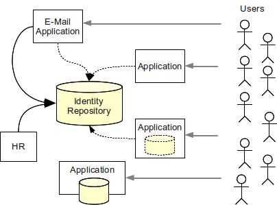

= Enterprise Identity and Access Management
:page-wiki-name: Enterprise Identity Management
:page-toc: float-right

== Introduction

What is Identity and Access Management (IAM)? Answer to that question is both easy and very complex.
The easy part is: IAM is everything that deals with managing identities in the cyberspace.
The complex part of the answers takes the rest of this document.

This paper deals with _Enterprise Identity and Access Management_ which is identity and access management applied to larger organizations such as enterprises, financial institutions, government agencies, universities, health care, etc.
The focus is on managing employees, contractors, partners, students and other people that cooperate with the organization.
Although some concepts are applicable generally this paper is *not* focused on Internet identity (a.k.a. user-centric or consumer-oriented identity) or government identity (in the G2C sense).

== User Accounts

The central concept of identity and access management is usually a data record that contains a collection of data about a person.
This concept has many names but the most common are: account, persona, user record, user identity.
Accounts usually hold the information that describes the real-world person such as person's given name and family name.
But probably the most important part is the technical information that relates to operation of an information system for which the account is created.
This includes specification of home directory, wide variety of permission information such as group and role membership, system resource limits, etc.
User accounts may be centralized and unified, distributed and unaligned or anywhere between these two extremes.
But regardless of the architecture the aim of identity management is the management of accounts.

== Identity and Access Management Technologies

Identity and access management is not a single technology.
In fact it is a wild mix of various technologies that both complement and overlap each other.
There are at least three main technological branches in the identity management:

* *Identity Stores* store user account information.
It is usually assumed that the identity store is exposed to other systems over the network and that it is shared among many applications but that is not always the case.
LDAP directory servers, Active Directory and portions of relational databases are examples of identity stores.

* *Identity Management* (IDM) is a branch of IAM technolgies that focuses on management of identity stores.
IDM systems are complex mechanisms that synchronize account data across broad range of data formats, models, meanings and purposes.
IDM systems usually contain sophisticated expression and rule engines, workflow mechanisms, policy evaluation and enforcement and so on.
*Identity governance* is an extension of identity management that focuses on business aspects of identity management.

* *Access Management* (AM) deals with user authentication and (partially) authorization.
The goal of access management is to unify the security mechanisms that take place when a user is accessing a specific system or functionality.
Single Sign-On (SSO) is sometimes considered to be a part of access management.

Although these technologies formally form a single field of identity management, their purpose and approach is significantly different.
Any complex identity management solution will need at least a bit of each of them.
These technologies are explained below in much more details.

== Identity Store

Accounts are stored in databases called _identity stores_. Underlying technologies of these databases vary, ranging from flat text files through relational database to directory servers.
Especially directory servers accessed by LDAP protocol are very popular because of their scalability.
Identity store may be integrated with the application that is using it or it may be a shared stand-alone system.

Shared identity store is making user management easier.
An account needs to be created and managed in one place only.
Authentication happens in each application separately.
But as the applications use the same credentials from the shared store, the user may use the same password for all the connected applications.

Identity management solutions based on shared identity stores are simple and quite cost-efficient.
But capabilities of such solutions are considerably limited.

Identity stores are just that: storage of information.
The protocols and APIs used to access such databases are primarily designed to be database interfaces.
It means that they are excellent for storing, searching and retrieving data.
While the data in account may contain entitlement information (permissions, groups, roles, etc.), identity stores are not well suited to evaluate them.
I.e. identity store can provide information what permissions an account has but it cannot make a _decision_ whether to allow or deny specific operation.
Identity stores also do not contain data about user _sessions_. It means that identity stores do not know whether user is currently logged in or not.
Some identity stores are frequently used for basic authentication and even authorization, especially LDAP-based directory systems.
But the stores were not designed to do it and therefore provide only the very basic capabilities.
Identity stores are databases, not authentication or authorization servers.

=== Meta-Directory and Virtual Directory

Meta-directory is a special directory system that synchronizes several "normal" directory systems.
Meta-directory copies data.
Therefore the performance of the original synchronized directory systems is mostly unaffected.

Virtual directory is a proxy and a protocol converter.
Virtual directory creates unified view from several "normal" directory servers.
Unlike meta-directory the data are *not* copied.
Virtual directory fetches the data from the original directory on each request and converts them to the the unified view.

Some meta-directories and virtual directories can reach beyond common concept of directory, e.g. they can fetch data from relational database tables.
Both meta-directory and virtual directories can convert data.
However the data conversion ability of both meta-directory and virtual directory is very limited.
E.g. it can convert number or date formats but usually cannot execute complex routines.
They also cannot synchronize records that use a significantly differing data models.
Entry correlation abilities are limited even more.
Therefore meta-directories and virtual directories are suitable only for a very simple deployments.
That might be one of the reasons that these directories are not used much any more.

IDM systems can usually do all that a meta-directory can do and are much more flexible.
IDM systems can also act as virtual directories under some circumstances.
However the performance of IDM system is usually worse than that of a meta-directory or a virtual directory.

=== Single Identity Store Myth

Shared identity store is making user management easier but this is not a complete solution and there are serious limitations to this approach.
The heterogeneity of information systems in the common medium-to-large enterprise environment makes it nearly impossible to implement single directory system for the following reasons:

* *Lack of a single, coherent source of information.* There are usually several sources of information for a single user.
For example, a HR system is authoritative for the existence of a user in the enterprise and for assignment of employee identifier.
The Management Information System is responsible for determination of user's roles (e.g. in project-oriented organizational structure).
The inventory management system is responsible for assigning telephone number to the user.
The groupware system is authoritative source of the user's e-mail address and other electronic contact data.
There are usually 2 to 20 systems that provide authoritative information for a single user.

* *Need for a local user database.* Some systems must store the copies of user records in local databases to operate efficiently.
For example, large billing systems cannot work efficiently with external data (e.g. because relational database _join_ is not possible).
Legacy systems usually cannot access the external data at all (e.g. they do not support LDAP protocol).

* *Stateful services.* Some services need to keep state for each user to operate.
For example file servers usually create home directories for users.
While the automation of state creation can usually be done on-demand (e.g. at first user log-on), the modification and deletion of state is much more difficult.

* *Inconsistent policies.* Role names and access control attributes may not have the same meaning in all systems.
Different systems usually have different authorization algorithms that are not mutually compatible.
While this issue can be solved with per-application access control attributes, the maintenance of these attributes may not be trivial.
A complex tool for transformation and maintenance of access control attributes (usually roles) may be needed.

Even using meta-directory or virtual directory mechanisms may not provide expected results, as such systems only provide the data and protocol transformation, but do not change the basic principle of directory services.
A more complex approach is needed to manage the users' records in heterogeneous systems, especially in large enterprise environment.

Single directory approach is feasible only in very simple environments or almost entirely homogeneous environments.
In all other cases there is a need to use also other identity management technologies.

=== Identity Store Implementations

Open source identity store implementations include:

* OpenLDAP: Fast LDAP directory server written in C.

* 389 Directory Server (a.k.a Fedora Directory Server): Directory server written in C based on former iPlanet directory servers from 2000s.

* Apache Directory Server: Directory server written in Java.

* OpenDJ: LDAP directory server written in Java. This project is *not maintained* any more.

* wren:DS: Fork of OpenDJ server. It seems to be maintained, but there is no new feature development.

== Identity Management

IDM systems integrate many different identity stores.
The goal of IDM systems is to keep the identity stores as synchronized as possible (and practical).
Priority of IDM systems is to be non-intrusive.
IDM systems do not try to change existing account data models in the applications.
IDM system tries to adapt its own mechanisms to match the data model of each connected system.
IDM systems are therefore quite complex and need to be customizable and programmable.
Adaptation of the data models is frequently done by using complex rules and expressions.

IDM system is just managing existing data stores.
It is *not* doing any authentication or authorization on behalf of the application; that is a job of access management.
Therefore IDM system affects the enforcement of security policies indirectly by manipulating data in other systems.
IDM technologies are focused on application back-end without affecting the front-end in any significant way.

=== IDM Connectors and Agents

IDM systems can communicate with each application using application's own protocol or interface.
There are two basic approaches:

* *Connectors* are pieces of code running on the side of IDM system.
In this aspect they are similar to the database drivers.
Connectors expose application's objects (accounts, groups, ACLs, ...) to the IDM system.
Connectors use various kinds of remote protocols or APIs for that purpose.
Connectors are non-intrusive and do not requite any installation on the application side.

* *Agents* run on the application side.
Similarly to connectors, agents are exposing application's objects to the IDM system.
Agents are intrusive and require installation (and integration) on the application side.
However, agents can use also local APIs and may be much more powerful than connectors.

=== Policies and Processes: Governance

IDM systems do not deal only with the technical aspects of the integration.
Policies and processes are almost always part of IDM system deployment projects.
Most IDM systems include its own version of workflow subsystem customized for identity management applications.
It is usually quite easy to set up rules that automatically determine the basic accounts for a new hire and let system administrators approve the creation of such accounts.
Users may also request additional privileges or permissions which may go through an approval process before it is granted.
Some IDM system also allow re-certification of access privileges.

This is a unique aspect of IDM systems when compared to other IAM technologies.
Other technologies usually focus only on the technical side of the problem, not the business side.
IDM systems are the glue that connects business and technical sides of identity management.

=== Why Do We Need Identity Management?

Why do we even need IDM systems? Isn't is easier to just deploy one single unified identity store such as LDAP server? Yes, it is easier.
But it is possible only in a very simple situations.
Even if technical architecture favors the single identity store approach, there are still non-technical issues.
E.g. the single identity store will not appear in a day.
Its deployment and integration may take a long time.
IDM system is needed in the meantime.
Also the applications cannot adapt quickly.
E.g. many applications support LDAP authentication out of the box.
But LDAP authentication is sufficient only for very simple applications.
Complex applications usually needs local data records: accounts.
Even if such accounts do not contain credentials (passwords) they still contain authorization data (roles, privileges, organization unit membership) that are not stored in the central identity store.
Other applications need local data records to be able to do database _join_ e.g. for the purpose of reporting.
And even if the application can theoretically work with single identity store it may take years to make it work practically.
In such cases, IDM system can provide solution much faster and often also less costly.

The support of processes in the IDM system is yet another reason in favor of such solution.
Identity stores present static data.
But IDM systems often deals with data changes.
Therefore IDM system may enforce an approval of the change before it is applied.
IDM system may send a notification after the data are changed.
IDM system can also integrate manual processes into the identity management solution (e.g. legacy systems where identity management cannot be automated).

=== RBAC in Identity Management

RBAC stands for Role-Based Access Control.
It is a way how to sort permissions and privileges into roles and assign roles to users.
The model was formally defined in 1990s and many information systems support RBAC internally.
But that RBAC model is confined inside a single application and it is not easy to make it work across several applications.
IDM system is a tool to do that.
IDM system can create roles that spread several applications.

Although RBAC may seem like an easy an elegant solution there are some drawbacks.
These issues are especially problematic in an enterprise-wide RBAC modeling which is a common task done during IDM solution deployment.

Usually the first obstacle that is encountered during an IDM deployment is *incompatibility in RBAC models*. RBAC model is simple, perhaps too simple for a complex deployment.
Therefore applications frequently extend the basic RBAC idea with additional mechanisms, e.g. combining roles with work positions, locations and other parameters.
RBAC extensions of one application is seldom directly compatible with other applications therefore a common data model is not feasible.
Perhaps the most efficient way how to at least partially align the RBAC models is to the integration power of a IDM system.

When basic incompatibilities are handled there is another obstacle: link:/iam/role-explosion/[role explosion]. The number of roles required to define all the necessary permission combinations grows rapidly.
If a static RBAC model is used to implement a least-privilege approach using a hierarchical RBAC model then it is quite common that the number of roles will be higher than the number of managed users.

Static RBAC model is not well suited for identity management applications.
It needs to be extended with more logic inside the roles, e.g. conditions, expressions, etc.
But even though there are drawbacks roles are usually necessary anyway.
More generic models such as Attribute-Based Access Control (ABAC) are even more difficult to use in IDM.
Such models rely on fact that permission is decided at the moment when a _subject_ is _accessing_ an _object_ and that the entire context of the operation is known.
However IDM system must decide long before that when account is created or modified.
IDM system works more with _instructions_ for decisions not with authorization decisions per se.
Roles fit into that definition quite well because they are not evaluated in the IDM system.
Roles are rather transformed to other authorization concepts that the systems understand: groups, permissions, ACLs, system-local groups or even system-local ABAC policy definitions.
Such system-local concepts are in turn evaluated by the end systems at the time of user access.

=== Deployment of Identity Management System

The deployment of IDM system is usually quite a complex project.
Not because the technology itself is complex but because the problem that the project solves is complex.
If you need to deploy IDM system it s very likely that you have many identity stores to integrate, several sources of information that are only partially authoritative, messy business processes and so on.
Even though IDM deployments are complex, it is the best solution to these problems that we know of.

IDM systems are always customized during deployment.
This may be a small customization or a huge one, but some customization is always there.
The most important difference between IDM products is the approach to customization.
Some products are little more than a platform that requires to develop almost everything during deployment (e.g. OpenIDMv2).
Such products are extremely flexible but may be relatively costly to deploy especially if your environment is quite the usual one.
Other products implement many common IDM scenarios out of the box while still allowing some space for customization (e.g. midPoint).
These products are generally easier and less costly do deploy but may not be suitable if your environment is miles away from the usual thing.
There is no "one size fits all" when it comes to identity management.
It is important to select the right tool for the job.

=== Limitations of Identity Management

IDM systems are essentially complex data synchronization tools.
Therefore there are several limitations that should be kept in mind when designing a deploying IDM solution:

. *Delays:* Data propagation is not immediate.
There are delays.
These can range from few seconds (if live data feed is used) to days or even weeks (if reconciliation is used).

. *Consistency:* As there are multiple copies of data and there are delays, data consistency might be a serious problem.
Make sure that the link:/iam/idm-consistency/[consistency mechanism] of your IDM system is designed to handle that.

. *Performance:* IDM systems are customizable using expressions and plugins and other custom code.
This limits the amounts of data formalization and therefore also optimizations.
There is usually trade-off between system flexibility and performance.
The more flexible the IDM system is the worse is its performance.
But generally all IDM systems perform significantly worse then other identity management technologies (e.g. identity repository or access management).

. A real Achilles' heel that combines all the limitations above is a change that affects massive number of accounts.
That may be a change in the expression that is used by almost all accounts, change in a definition of a role assigned to most users, etc.
Such changes are very slow to propagate and pose a significant consistency risk.

And finally one obvious limitation which seems not to be obvious enough:

* IDM *cannot* change the way how applications authenticate users, authorize access and how they do audit.
IDM system just is not in that loop.
IDM system has no idea how the user authenticates - unless the application stores the relevant data for IDM system to see.
IDM system cannot do SSO.
It can make sure that all passwords are set to the same value, but user will need to enter the password every time, again and again.
That's not SSO.
IDM system cannot make application to do ABAC unless the _application_ already knows how to do it.
IDM system cannot lock user out of an application after three failed login attempts unless the _application_ makes that information available to the provisioning system.
IDM is just working with the data.
It does not change the application itself.

=== IDM System Implementations

Open source IDM system implementations include:

* MidPoint: complex and efficient complete identity management system with many identity governance features.

* Syncope: provisioning system built on top of relational database.

* OpenIDM: flexible and programmable provisioning platform. This product is *not maintained* any more.

* wren:IDM: Fork of OpenIDM. It seems to be maintained, but no new features are developed.

== Access Management

Access Management deals with user authentication and (partially) authorization.
The goal of access management is to unify the security mechanisms that take place when a user is accessing a specific system or functionality.
Access management technologies are focused on application front-end as opposed to identity management which is focused at back-end.
Access management changes how is the user authenticated and authorized to access the applications.

The following figure illustrates theoretical case of the access management deployment.
The access management systems acts as a mediator to all access to all applications.
Access management system authenticates and authorizes the user based on the identity information stored in the identity repository.
In case that all access checks pass the user is allowed to access the application.

Access management should provide all necessary access control mechanisms to the application.
It can also easily provide single (or simplified) sign-on as user session data are stored in the access management system and therefore can be shared across applications.
That's the theoretical case.
But the practice is slightly different.

=== Practical Access Management

Access management system should theoretically simplify the applications as they do not need to implement their own access management mechanisms and no other identity management mechanism should be required.
However there are practical problems:

* Almost all applications already implement authentication and authorization mechanisms so almost no simplification is applicable in a common case.
It may even be quite difficult to replace existing mechanism with access management, which may significantly complicate the system.

* Access management system assumes an existence of a single unified identity repository.
But that is seldom the case unless the repository is a result of other identity management mechanisms (e.g. provisioning).

* Access management system knows very little about internal structure of the applications.
Therefore the ability to decide and enforce authorization is severely limited.
E.g. the access management system can decide if a user can access application `A` or not.
But it cannot decide if the user is authorized to modify property `foo` in a record number `1234` in that application.
Therefore applications must very often implement their own additional authorization mechanisms.
For that reason the applications must maintain their own user records (accounts) or must have back-end access to the identity repository.

* Access management can provide authorization services only if a user is accessing the system.
While that is usually the case there is still significant number of cases when an operation has to be executed on behalf of the user while user is not online.
E.g. scheduled tasks, asynchronous invocation, automated reaction to external messages, etc.
Access management technology cannot handle these cases by its own.

Access management is an umbrella term for quite a wide range of mechanisms.
Some access management systems deal only with authentication or single sign-on (SSO), others also deal with authorization, some are focused mostly on web applications, while other work only in enterprise environment where client machines can be strictly under control.
Individual access management systems provide partial solutions to the identity management problems and they almost always must be combined with other identity management technologies.

=== Authentication

Typical access management system tries to do user authentication instead of the applications.
The access management system authenticates the user and creates a user session.
It then forwards or proxies the connection to the application.
Application must be at least partially aware of that so it will not authenticate the user again.

==== Single Sign-On (SSO)

If the access management is applied to all applications it effectively creates a single sign-on mechanism.
User that logs into one of the application in fact logs into an access management system and therefore is logged into all the applications.
There are many variants and flavors of SSO mechanisms but the two most widespread are:

* *Web SSO* works by using HTTP redirects.
The user is first redirected to the access management system where he logs in.
The access management system verifies the credentials and checks authorization.
If everything is OK then the user is redirected back to the application with an SSO token.
Application can use the SSO token to check that user is logged in.
Web SSO does not require any support on the client side (in the browser).

* *True SSO*. Client first logs into an SSO server system.
The client acquires a token (ticket) that acts as an proof of authentication.
The client presents the ticket on each connection to the application.
True SSO systems are *not* transparent to clients, client takes active part on the protocol.
Perhaps the most well known example of this approach is Kerberos.

Typical SSO systems work on an assumption that everybody trusts the SSO system.
This works well in typical enterprise environment and it allows efficient SSO protocols, e.g. based on shared secrets.
This is of course not applicable to the Internet in general therefore this type of SSO system is not used in the "big" Internet.
Federation technologies are used instead (see below).

==== Enterprise Single Sign-On (ESSO)

Although Enterprise Single Sign-On (ESSO) has SSO in its name, it has very little in common with other SSO mechanisms.
ESSO is in fact just a very simple agent that is silently waiting for login dialog to appear.
When the dialog appears the ESSO agent fills in username and password and submits that dialog.
User usually notices nothing of this and therefore he thinks that he was already logged in.
This creates an illusion of SSO.

ESSO requires an agent on every workstation, therefore it can only be applied in a strictly controlled environments.
It may also be security vulnerability as the agent needs to know all user's (cleartext) passwords.
Some ESSO systems try to overcome this by simulating a one-time password mechanisms by changing the password right before or after the login.
But this creates a password management nightmare and it practically feasible only in quite homogeneous environments.
And it also changes nothing on the fact that the agent must know or be able to obtain current password for any application.

=== Authorization

Access management systems usually do at least some kind of authorization.
However the ability of the access management system to provide authorization services is significantly limited.
The access management system knows who is accessing the system (_subject_) but has only very rough idea about the _operation_ and knows almost nothing about the _object_ that the operation affects.
Yet, knowing all three parts of the authorization triple is essential requirement for good authorization decisions.
Therefore access management systems can do only a rough authorization decisions such as: "allow (any) access to system ``Foo``", "allow HTTP POST operations to URLs that match the pattern ``/private/*``", etc.

If a finer authorization is required that that must usually be done by the application itself.
The application knows all the details about _operation_ and _object_ but does not have the details about _subject_. Therefore an application must be able to get the details of the authenticated user from the access management system.

=== Federation

Simply speaking, Identity Federation is just an SSO over the Internet.
SSO usually assumes that both identity repository and the applications are in a single organization.
Therefore the trust is implicit and the protocols may be proprietary.
Federation goes a step further and makes no such assumption.
Therefore there needs to be explicit trust and strong authentication of the communicating parties.
Also the federation protocols must be open and the mechanism must be designed for the Internet use (e.g. must be robust and scalable).
But otherwise the technical principles of SSO and federation are almost the same.

A simple federation scenario is illustrated in the following figure.
Each color means a different organization connected over the Internet.
One of the organizations is an Identity Provider.
This organization maintains an identity repository that is used to authenticate users.
After user logs in Identity Provider issues an _assertion_ (federation token) to the user.
This assertion is used as a proof of authentication.
It may be presented to other organizations (Service Providers) that will let the user in.
The assertion may be quite rich, e.g. containing also user attributes, privileges, roles, authorization decisions, etc.
This may be used for further authorization by the Service Providers.

Probably the most popular federation protocol is SAML.
There is also a mechanism called _Cross-Domain SSO (CDSSO)_ which may seem as identical to federation as it is also spanning several Internet domains.
But CDSSO is mostly used as a workaround to propagate usual SSO cookie across Internet domains and does not have other features of federation (openness, trust, robustness, scalability).

=== Application Side

Access Management is a _front-end_ identity integration technology.
It means that it is changing the way how user interacts with the application.
Even though the only aspect that changes is usually the way how user authenticates to the application there needs to be a change.
The application or its supporting framework needs to have support access management solution.
This least intrusive case is to configure the framework (e.g. Java EE application servers) or install a special-purpose agent.
This way may be almost transparent for application when it comes to authentication and coarse-grain authorization.
But if the access management needs to be integrated more tightly then the modification of the application is almost unavoidable.

The need to modify the applications to add access management support will come sooner or later.
Access management system usually provide APIs and libraries to make such task easier but it is non-trivial task nevertheless.
Such need will be come very soon especially if fine-grained authorization is needed.
This may be further complicated if the security models of the applications and the access management system are not well aligned.

This requirement to modify the applications makes access management somehow intrusive technology.
And also quite expensive to deploy.

=== Access Management and IDM

Access management technologies usually require single, consistent and authoritative identity repository.
This requirement is especially important if a Single Sign-On solution is being deployed.
But how to get such a repository? Usernames are often not synchronized among applications.
Therefore taking the identity repository of one of the applications does not usually work.
That's one of the reason why full-scale access management deployments usually fail.

Access management technologies seldom care about local state of the application.
Therefore if an application needs a local user record the application must create it _on demand_ when a user is first accessing the system.
This is a common case especially in federated deployments.
So the user gets _provisioned_ automatically, on demand.
But the user never gets _deprovisioned_. If the user account is deleted in the Identity Provider repository it just disappears.
Service Providers are not notified.
The user data remains on Service Provider side indefinitely.
This is a potential risk of data exposure especially if additional (local) authentication or credentials reset was configured.
But in any case it wastes resources and may cause unnecessary cost e.g. if per-user service pricing model is used.

IDM system is usually a prerequisite to an access management deployment.
The IDM system has an ability and flexibility to create unified identity repository that can be used by the access management system.
It is also well suited to keep several identity repositories synchronized.
Therefore it can efficiently solve the deprovisioning problem.
Large-scale deployment of an access management solution that lacks the identity management aspect can hardly be successful.

=== Access Management Implementations

There is a large number of implementations that might fall into the access management category.
To name just a few:

* Keycloak

* GLUU

* CAS is an SSO protocol and an implementation.

* Shibboleth is a SAML-based protocol and an implementation used mostly in the academic applications.

* OpenAM is an access manager implementation in Java.
It is using domain cookies as well as other protocols.
It is a continuation of OpenSSO project.
This project is *not maintained* any more.

* wren:AM: Form of OpenAM.

== Mix It Up

None of the identity management technologies provide a solution of its own.
Perhaps except for the smallest and simplest identity management projects any practical solution requires a combination of several technologies.

=== The Systems

The key to the project is to know what needs to be integrated.
When it comes to the identity management there are several types of systems:

[cols="h,1,1"]
|===
|   | Description | Solution

| Simple stateless system
| Does not maintain any identity information of its own.
Such systems may not even need to know user's identity.
Simple allow all/deny all authorization decision is all that is needed.
| Trivial to integrate just by access management system.
If the system needs any identity data then the easiest way is to inject them into cookies or HTTP parameters.

| Stateful system with identity repository integration
| Needs access to identity information but it is able to use shared identity repository (e.g. by LDAP).
May support complex authorization decisions based on the content of the shared identity repository (e.g. by evaluating account attributes).
| Connect to a shared identity repository (e.g. a directory service).
Replace authentication with access management if possible.
The only thing that the system usually needs is user identifier (e.g. username) which can usually be conveyed by the platform (e.g. Java EE security subsystem).
The system can then fetch the rest of the profile directly from the identity repository

| Stateful system that requires local data
| Needs to maintain its own copy of user records (accounts) because of performance reasons (e.g. ability to `join` data for reporting), lack of shared repository support, data model incompatibility, etc.
| Synchronize local data with the shared identity repository.
The best approach is usually deployment of IDM system.
It still may be able to integrate with access management system.

| Legacy system
| Cannot integrate with shared identity repository, keeps its own local accounts.
Cannot integrate with access management, implements its own hard-coded authentication.
We are lucky that it still works.
| Not too many options.
Probably the best we can do is to synchronize its account records with the shared identity repository.
IDM system is really the best solution here.
The only thing that can be done about convenience of authentication is to synchronize the password from the shared identity repository to this system using the provisioning mechanism.

|===

Then there are systems that are sources of the data.
The typical one is a Human Resources (HR) system which is usually an authoritative source of employee data.
Then there is CRM which is a source of customer and partner data.
And usually there are also contractors, independent agents, volunteers and many other types of users that do not have any authoritative source.
And even if the source is authoritative for existence and status of an employee record it may not be entirely authoritative when it comes to the e-mail address or placement of the user in the organizational structure.
The larger, more flexible and business-oriented is the organization the more complex is the resulting situation.
Probably the only practical solution that can handle such situation is a IDM system.

=== The Solution

Practical IAM solution requires combination of identity repository, identity management and access management mechanisms at the very least.
These technologies complement each other as illustrated in the following figure.

*IDM system* is synchronizing accounts and user records through the organization.
It pulls data from various data sources such as HR and CRM systems and creates an unified view of such data.
It keeps the databases of legacy and stateful systems in sync.
However its most important responsibility is to maintain shared *identity repository*. The identity repository is used by applications that are able to do so.
It is also used by the access management system as a coherent and authoritative user database.

=== The Project

Identity management projects fail frequently.
The typical identity management project is a big all-or-nothing waterfall-like project.
That is not a project but a plan for a disaster and a huge waste of money.
There are many reasons for that, but probably the most important is the lack of knowledge:

* Identity management technologies are complex.
An IDM engineer cannot be trained in a year.
It takes at least 5 years to gain the necessary experience.

* Environment is complex.
A customer may claim that he knows everything about his system and support that claim by 1000 pages of analysis.
But the reality is quite different.
There will be surprises.

* Requirements are complex.
The requirements are not that clear as it may look at the beginning of the project.

* The work is hard.
Identity management project takes much more effort than it may seem.
Even experienced engineers tend to under-estimate the total effort.

Waterfall-like project will not work.
It may succeed to meet project goals but it will not bring expected value to the customer.

Divide the project into smaller steps and proceed in iterations and increments.
Bring value in each step.
Proceed only as far as it is efficient to proceed.
Some tasks are still most efficient when done manually by a human.
Set the basic structure and improve it in each step as needed.
Avoid paying high licensing cost at the beginning of the project as this efficiently kills all value and ruins TCO.
Either negotiate with the vendor or simply use open-source software.

The usual order of identity management technology implementation is:

. *IDM system* to improve password reset procedures, speed up user management, make audits more efficient and save a lot of operational costs.
While the incentive to deploy IDM system is mostly economic, there is a significant technical incentive as well: IDM system will clean up the data.
The data will be ready for the next step.

. *Identity repository* that is shared among applications and provides an unified view for employee, customer, contractor, partner and similar records.
IDM system may populate and (most importantly) maintain the data.

. *Access management* that is using the repository to provide SSO and somehow centralized rough authorization for the services that are able to integrate with it.

The order is not simple IDM, repository, AM.
It is iterative.
Therefore it looks more like this:

. Basic provisioning: connect the systems to IDM system.
Do everything manually but from a single place.
This saves a lot of time for help desk (password resets from a single place or even self-service password resets).
And the reports to support audits will be quite easy.

. Basic repository: publish data from IDM system to the central identity repository.
Just take standard schema, no customizations yet.
Connect simple applications to the repository (e.g. LDAP-enabled web applications).

. Basic access: use the repository data to deploy a simple Web SSO system.

. Improved identity management: automate some IDM tasks (e.g. "new hire" process).
Create basic roles.
Set up request-and-approval process for roles and other privileges.

. Improved repository: extend the schema to expose more necessary data.
Improve applications to use them for better authorization.

. Improved access: extend the SSO to other applications.
Modify some of the applications for finer-grain authorization.

. ...

Some steps may be reordered or even skipped.
E.g. the first "Basic provisioning" step may be skipped if there is already a solid repository (e.g. Active Directory instance populated with employees).
But that task will come back.
The next iteration over identity management will be more difficult (e.g. if customers and partners also need to be in the repository).
The effort might be slightly optimized but it will not change much on the overall project shape.

=== Tips

* Integrate the systems to the shared identity repository if possible, especially if it is accessible by a standard protocol (e.g. LDAP).
This is the most cost efficient way.

* Create a schema that suits most applications.
Use a standard schema as a baseline (e.g. LDAP `inetOrgPerson`). Almost all deployments will need some schema extension and customization.

* Do not over-complicate the schema.
However hard you try the schema cannot suit all the applications at the same time.
Special cases and complex data models are better handled by IDM system.

* Resist the attractiveness of *forcing* a single directory server approach to all systems, e.g. by way of security requirements or purchasing rules.
If the system supports the right protocol (e.g. LDAP) and the schema is a good fit for the system then connect the system to the central repository.
If it does not then do not force it.
Common shared identity schema is inevitably a compromise.
Forcing everybody to use a compromise creates a mediocre solution that brings little value.
And it creates severe problems.
Individual applications will still need to maintain their own accounts to store data that are not in the shared schema (e.g. fine-grained privileges, locations, access zones, etc.) You cannot avoid problems caused by extra state if you just hide the state behind a paper screen of policies and purchasing requirements.
The state will be still there.
The applications will just try to synchronize their own accounts and the central repository to comply with the policy.
But this in fact creates a special-purpose IDM system for each application.
Such synchronization is extremely difficult to do well and it is almost never done well.
Therefore it creates constant operational problems and it is a nightmare to maintain.
And at the end of the day it is all very expensive because the same work is done over and over again for each system.
Use central IDM system instead.
It is cheaper, easier to maintain and it keeps the data under control.

* Prioritize your requirements.
This is software and almost anything is possible.
But some things take too long and cost too much.
Use the technology to solve problems that it can solve efficiently.
The technology evolves.
What cannot be efficiently solved today may become an easy task next year.

* Think 80:20.
80% of result should be achieved by 20% of work.
It may be possible to automate 100% of all identity management tasks but it might be extremely expensive.
Aim at economic efficiency not technical excellence.
80% automation that costs just 20% may be exactly what you need.

* Do not over-complicate the roles (RBAC).
link:/iam/role-explosion/[Role explosion] is a common problem and definitely a dead end for an RBAC program.

* Consider to home-brew a solution.
It makes no sense to reinvent existing products so use them instead.
Take a couple of existing complementary products and try to customize them and put them together yourself.
This DIY approach provides surprisingly good results especially if it is implemented in iterations.
Nobody knows your requirements better than you do.
The lack of IDM expertise may be somehow compensated by advice from product vendors, developers or partners.

* When choosing or implementing a solution make sure you consider a link:/iam/idm-consistency/[consistency mechanism]. It may seem as an implementation detail from the distance, but this little detail may ruin entire project.
And there are too many products, mechanisms, APIs and protocols that have it completely wrong.

== Conclusion

Identity management is a mix of many technologies, a mix that can create both healing and deadly elixirs.
The best approach seems to be pragmatic: to avoid big expectations, to improve the system where an improvement is needed and where it is economically and technically feasible.
Identity management is no magic, it is just technology.
And quite a young one.

This paper provides description of various identity management mechanisms, techniques and their combinations.
It also warns against dead ends and debunks myths.
But it does not provide a single correct approach to identity management implementation - as there is no such thing.
Every environment is different, requirements vary and resources are limited.
Every deployment is different.
Every solution is different.

== See Also

* link:/iam/[IAM Introduction documents]
