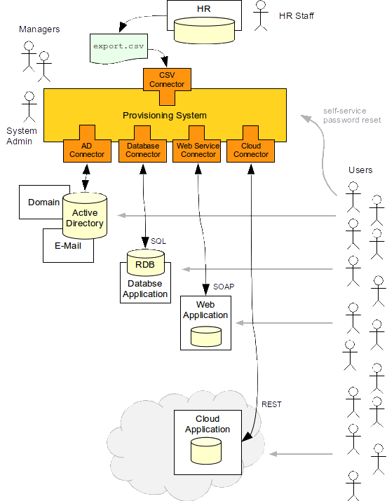

= Identity Management for Dummies
:page-wiki-name: Identity Provisioning for Dummies

== What is this "Identity Management" thing?

Identity Management (IDM) is a subfield of link:/iam/[Identity and Access Management (IAM)].
Identity management software takes care of technical (IT) tasks that happen when a new employee joins a company, when his responsibilities change, when he leaves the company, when a new contractor is enrolled and so on.
This is called "Identity Lifecycle": the set of events and tasks that make sure that every "identity" has what it needs.
Identity management takes care of the "technical details" of identity lifecycle such as creating accounts, assigning correct groups and permissions, setting and resetting passwords and so on.
The goal of identity management is to automate as much as possible therefore reducing operational costs and improving security.

Identity management is usually very useful in medium-to-large enterprises.
The IDM system usually takes information about employees from the Human Resource (HR) system.
E.g. is a new employee is entered into the HR system the IDM system detects that and pulls the information.
This information is processed to determine a set of roles that each user should have.
The roles determine which accounts the user should have and such accounts are created.
All of that usually happens in a matter of seconds.
Therefore everything is prepared for the user to work on the very first day.
Similar processes also apply when user is transferred to another department, when his responsibilities change and when he leaves the company.
Especially the later case is important.
IDM system remembers all the accounts that were created for an employee.
When employee leaves, the IDM system makes sure that all the accounts are deleted or disabled.

Although identity management was born in enterprise environment it can also be applied in wide variety of other environments.
It can take data from Customer Relationship Management (CRM) system and create accounts for customers.
As IDM system can also maintain passwords this usually reduces the load of customer support centres.
IDM system can synchronize user accounts in portal and service provider environments.
IDM is especially useful in cloud environments to manage very large number of accounts in many applications - something that is not feasible to do manually.
Identity management is without any doubt a foundation of Identity and Access Management.

== That's cool, but how it really works?

IDM system is something like a robot.
It continually watches the information sources such as HR system.
If something changes in the information source then the IDM system pulls the new information, recomputes it, applies policies and then pushes that information to other systems.
Let's explain that using an example:

.

The HR staff enters employee data into an HR as they normally do.
HR system has a process that exports the list of all the employees to a text file every day.
This is usually very easy to do even in the most cumbersome HR systems.
The IDM system is using a connector to continually monitor the file for changes.
Therefore it finds a new line describing the new employee and reads the data from the file.
Typical IDM system has a set of rules and scripts that is used to process the data.
E.g. the rules may take the field "organization unit" from the HR record and used that to determine which business roles should this user have.
It also usually applies some roles to all the ordinary users such as a role that gives each employee an access to e-mail service.
This logic is different in each organization and the IDM systems are built to be efficiently customizable.

Once the IDM system determines what the new user is and what roles he should have then the really interesting bit starts.
The IDM system will compute what accounts the user should have.
This is usually computed from the roles that the user has.
Account attributes and entitlements are computed as well, e.g. the list of groups that user should belong to.
Once the IDM system knows how the accounts should look like it can use _connectors_ to automatically create them.
Connectors are simple pieces of code that communicate to the target systems.
The connector knows how to read, create, modify and delete an account.
Therefore the IDM system can automatically create all the accounts that a user needs.
Automatically.
In a couple of seconds.

The connectors usually communicate using a protocol that is native to the target system.
Therefore it talks to Active Directory using LDAP interface, modifies the database using SQL, invoke a SOAP web service or provision to the cloud service by using REST.
This means that the IDM system is _non-intrusive_: the target applications do *not* need to be modified.
They stay exactly as they are.
This is crucial feature that makes the IDM system such efficient and practical tools.
It is much easier to adapt a couple of simple connectors than to modify dozens of information systems (especially if too many of them still remember 20th century).

== Is that it? Nothing else?

Of course not.
IDM system takes care of the whole identity lifecycle:

* IDM system keeps an *audit trail* of all the changes.
Therefore it can be traced who has changed what, when and why.

* IDM system can generate *reports* that provide information about user privileges and access to the systems.
This is a priceless information for security audits.
IDM system is the only system that can provide a list of the systems that a specific user can access.
No other system has that information.

* IDM system can drive *approval* processes. This ability is usually used to request an access to the system and to approve it.

* Users can be *notified* about the changes in their privileges or accounts.
E.g. an employee can receive mail or SMS when his access request is approved and the account is created.

* Many IDM systems provide a *self-service* interface that can be used by users to reset their passwords, request for access, review their accounts to check usernames and so on.
This considerably reduces helpdesk load.

* Sophisticated IDM systems are capable of creating *groups*, replicating *organizational structure* and even provision and deprovision *services* (such as virtual sites).

== I don't think this stupid robot can replace a sysadmin!

That's right, it cannot.
There is always a need for a human brain.
That one aspect cannot be efficiently replaced.
What IDM system does is the automation of routine mundane tasks that everybody hates to do.
Such tasks are automated using scripting, rules and policies.
But a good IDM system does *not* disable native system administration tools.
These are still available for system administrators to use, e.g. for an emergency system recovery.
System administrators may also stay completely in power, e.g. approving the accounts that are to be created.
But the IDM system allows a significant reduction of mundane work: only approve or refuse the operation.
Just one click instead of half an hour of connecting to all the systems, running scripts, checking the result and so on.
Also the approvals can be configured to work only for unusual accounts, e.g. accounts with elevated privileges.
One way or another the system administrator always remain in control of the system.
But he can do it much more efficiently.
Get rid of the routine tasks and have more time for the important issues.

== And what's the benefit for me?

There are two huge benefits of identity management:

* *Money saving:* It may look that the cost of manual identity management is quite small.
But it is not.
Not even close.
The thing is that most of the cost is actually hidden.
What managers perceive as the "cost of identity management" is usually only the time of system administrators that create the accounts.
But there is much more: There are help desk agents that handle password resets, access requests, calls of people that cannot access a system because an access was accidentally revoked and so on.
The common employees need to waste a lot of time to figure out how to request an access, to whom the request should be sent, what it needs to contain, and actually they need to even figure out what exactly they need to request to get the access they need.
And once the request is sent then they need to wait.
And wait even more.
There is usually no automatic escalation of the requests so the requests can easily be forgotten.
There is almost no visibility into the process so the requestor does not even know who to ask.
And so on.
This is a reliable recipe for inefficiency and huge waste of time for all the employees.
Good identity management system can dramatically improve that.
The results from real deployments show that the password resets go down from an hour to few seconds and the help-desk load is considerably reduced.
It also shows that the average time to process an access request goes down from more than a week to two hours.
The overall time saving though the entire organization is enormous.

* *Improved security*: Every security professional knows that security is not that much about firewalls and cryptography than it is about information, processes and people.
If a security officer does not have reliable information about the people then he just cannot have security.
It is as simple as that.
How is a security officer supposed to investigate a security incident if he does not know who had access to what? Security incidents are not isolated to a single system.
But it is a Herculean task for a security officer to combine information from several systems.
Just imagine how "easy" is to compile a list of all privileges in all the systems for a group of suspected employees.
It is in fact quite easy to get a list of accounts that have access to a single specific system.
But it is almost impossible to get a list of all access privileges of any single person in all the systems.
And how can one possibly investigate anything without this crucial information? Security officers that do this without a help of a provisioning system should be considered nothing less than a heroes.
But there is a way out of this: IDM system correlates user accounts in many systems.
IDM system can provide all the information easily.
Good IDM system will not only tell who has account where but also provide information about the privileges such as group membership and special permissions.
The reports from the IDM system can be used to improve investigation of security incidents.
But it can also dramatically improve security audits.
A single report from IDM system will save a lot of days wasted on collecting the data from the systems and manually correlating them in spreadsheets.
But there is even more significant benefit: IDM system can enforce policies in all the information system.
And it can make sure that the policies make sense all together for the organization as a whole.
This can reduce the chance of any security incident happening in the first place.

== How identity management relates to LDAP and SSO?

IDM is just one piece of the Identity and Access Management (IAM) puzzle.
The other two crucial parts are Identity Store and Access Management.
Each part has a very different role to play in the overall IAM solution:

* *Identity Store* is a big, scalable and efficient database that contains user records.
It is usually shared among several applications.
This is usually implemented by LDAP directory services or Active Directory.
This is a fascinating technology but it is still just a database.
Therefore it has its limits.
It can basically only store and retrieve data.
If you need to convert data to another format, create and maintain a copy of the data or synchronize them with other databases then that what identity stores usually *cannot* do.
Identity store is a *static part of the IAM solution*: it just stores the data.

* *Identity Management* system replicates the data all around.
It transforms the data, applies policies, make sure that all the data are up-to-date, drives approvals, keeps audit logs and so on.
It can do the identity administration tasks that the identity stores are not capable of.
IDM system implement *integration part of the IAM solution*: it moves the data around.

* *Access management* system takes care of authentication, authorization, access auditing (often referred to as "AAA"), session management and so on.
This is where the Single Sign-On (SSO) happens.
The primary purpose of this technology is to interact with user and/or to manage the user access to the systems in real time.
This is the proverbial cherry on the cake.
But it usually cannot be implemented without the other two components.
And even then the implementation may be very expensive.
The reason is that the access management has to manage user access to the system.
Therefore it needs to get into the way how user interacts with the system.
It has to modify user interfaces and/or authentication mechanisms, introduce proxies and other intermediaries, install agents and so on.
Unlike the identity store and IDM that are inherently back-end systems the access management is entwined into the application front-end.
Access management is a *dynamic part of the IAM solution*: it works with the data in the real time.

== So, what should I do now?

You are probably reading this because you want to build a somehow complete IAM solution.
There are many ways to do it.
But perhaps the easiest and more universal way is this:

. Deploy a *directory service* if you do not have one yet.
Or reuse the one you have.
Active Directory is a prime choice in Microsoft-oriented environments.
Other environments will benefit from a native LDAP directory service.
There is a very good choice of products on the market from over-priced commercial monsters to lean and elegant open source servers.

. *Connect the applications to the directory service*. All applications that are easy to connect.
But take care not to overdo this step.
Keep in mind that directory service is just a database.
If the application is lightweight and simple then it probably will be happy with LDAP.
Don't think twice and connect such application to LDAP.
But the situation is quite different for more heavyweight and complex applications.
These may have an LDAP authentication option but they frequently copy the user profile for internal use.
You can connect them to LDAP as a temporary hack.
But you need to go the next step to get a really satisfactory solution.

. Deploy *IDM system*. Use the IDM system to maintain data in directory service, e.g. by using HR or CRM as a source.
Also use IDM system to fully integrate heavyweight applications.
You may want to start using Role-Based Access Control (RBAC) mechanism in the IDM system to clean up and automate you account management.
Some basic self-service may be also a good idea at this stage.
But do not push the project too far yet.
Do just the most obvious steps that clearly bring immediate benefits.

. *Think*. And re-think.
Now you are at the stage where the situation is mostly under control.
The most pressing concerns were already addressed.
You are probably not under any immediate pressure now therefore you have time to decide what to do next.
Perhaps the best strategy is to use the data from the IDM system to analyze the real situation.
The reports from the IDM system can show how many accounts you really have, what proportion of them is active, what specific privileges they have, whether you can automatically link them together, how many orphaned accounts do we have or not and so on.
This is the real data.
This is what you need to make a responsible informed decision about the next steps.
Also listen to the users.
What is the most severe problem for them? Password management? Access requests? Too many username/password prompts? Based on this data you may want to do some of the following steps: +

.. Continue building a more formal RBAC structure and more automation (policies, workflows) in the IDM system.

.. Deploy access management solution, e.g. for SSO.

.. Extend the self-service interface.

.. Integrate more applications.

.. Do nothing.

Surprisingly this may be a very efficient option at this stage.
The combination of directory and basic provisioning is perhaps the most efficient part of IAM solution when it comes to cost/benefit ratio.
Whatever you do beyond this point costs more and delivers less benefit than the previous steps.
Think of 80-20 Pareto rule.
It is important to know when to stop.

== How do I choose identity management product?

This is quite difficult part.
There is a lot of IDM products on the market.
Their features, cost and suitability varies a lot.
But basically there are three options:

* *Big guns*: If you choose a product from any "big name" company then you will get a very rich functionality, world-wide support and a huge pile of marketing brochures.
But all of this comes with a price tag.
It is important to consider price of the entire solution not just the cost of licenses.
Support and especially professional services are even more important than licensing cost.
Our experience shows that the "big name" products are quite elaborate and they have a long development history.
But that also makes them quite difficult to use.
Any engineer that can efficiently work with these products is not likely to ask for a low daily rate.
The complexity and age of these products also mean that typical IDM project will take a long time (9-18 months) and needs a lot of skilled engineers.
This can significantly affect the cost/benefit ratio of the entire IAM project.

* *Challengers*: There is a bunch of smaller companies that offer alternative products.
The price and quality differs a lot in this area.
Also the availability of support and professional services may be an issue.
It may be difficult to get an engineer that have sufficient knowledge of a product from this category.
Yet another issue is a future of the product itself.
Acquisitions are quite common.
And there is at least one precedent case of a technologically excellent product reaching end of life because of an acquisition.
As these products are closed-source there is no practical step that a customer can take to avoid wasting his investment in such a case.

* *Open source*: This is still relatively new option.
Back in 2000s there was no practical open-source IDM system.
But that changed a lot in 2010s.
Now there are at least two reasonably mature open source identity management products to choose from.
These products are comparable with commercial alternatives.
These products are also based on newer technologies and are somehow easier to understand and use.
Open source products are backed by companies that offer commercial support services.
