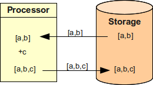
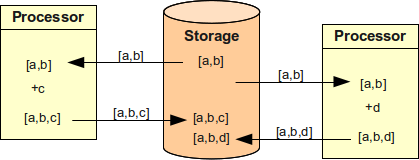
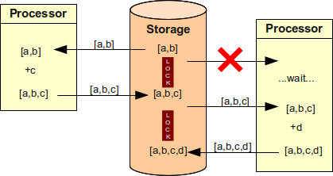
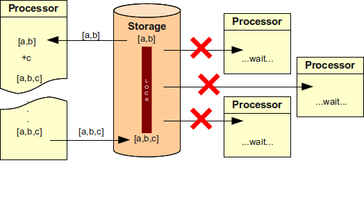
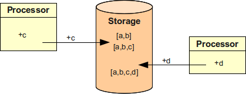

= IDM Consistency

== The Consistency Problem

Vast majority of current systems work on a read-compute-write principle:

. Read: the value is read from the data store to the local memory

. Compute: the value is modified in the local memory

. Write: new value is written to the data store

This approach is illustrated in the following figure.
Let's assume we want to assign user to a new group `c`. User already have groups `a` and `b`. So, the processor reads values `[a,b]`, adds value `c` and then writes back new values `[a,b,c]`. It works fine.
Mostly.

The problem is if more than one processor is working with the data store.
The situation is illustrated in the following figure.
Two processors try to add group `c` and `d` respectively and they try to do it simultaneously.
The resulting value is incorrect.
One of the operation efficiently disappeared.

Software engineers know about this problems and designed several ways how to work around this.
The most common way is locking, which is illustrated in the following diagram.
It describes the same situation as the previous one but now the value is locked after the first read.
Second processor cannot read it and must wait until the first processor finishes the operation.
Although the system is less efficient the result is correct.
A variation on this approach called _optimistic locking_ (part of MVCC) is utilising a lighter version of the lock that allows read-only operations to proceed without waiting for the lock.
Nevertheless, it has very similar properties when it comes to write operations.
This works well in tightly coupled systems and it is currently the "best practice".

However, this approach has a several critical drawbacks.
If the system is loosely coupled then an external client can influence the operation of the system by locking out the data.
Then even a non-business-critical client can impact a business-critical system.
This can be improved by good error handling and/or switch to optimistic locking, but it makes the system more complex.
Optimistic locking is also unsuitable for systems with high modification rates.
But the real Achilles heel of the locking approach are long-running processes such as approvals.

Let's assume that assignment of a group to a user needs to be approved by security officer.
This case is illustrated in the following figure.
Processor is adding a group to a user and asks for an approval.
But as the security officer is currently on vacation the request is sent in, sent back, queried, lost, found, subjected to public inquiry, escalated, delegated and finally approved.
All the other processors need to wait until this simple business process is over.
Which may take some time.

The use of optimistic locking does not make that situation considerably better.
If optimistic locking is used then the other processors will not wait and will carry out their own operations.
But when the first request is finally approved it cannot be reflected to the data store because the state of the store changed in the meantime.
Therefore the entire business process need to re-start from the very beginning.

There are also other issues that make this "absolute" change model unpractical in IDM systems.
E.g. if a resource communication to the resource fails the operations such as adding a user to a group should be queued.
However, the system may be inaccessible for days and there might be local changes when it comes online again.
The queued operations may overwrite such changes (or will fail).
Similar problem occurs if the system state was rolled back, e.g. as consequence of system restore after a failure.
Forcing a complete new state may impact system integrity.

This type of issues have been known for quite some time.
In 2000 professor Brewer suspected that the consistency of distributed systems is inherently limited (what became known as "Brewer's conjecture").
This was in fact formally proven two years later and it is now known as link:https://en.wikipedia.org/wiki/CAP_theorem[CAP theorem].
The consequence of the CAP theorem is that it is not possible to have strong consistency in a practical distributed system without sacrificing availability of such system.

IDM systems based on the read-compute-write model are fundamentally doomed to suffer from all sorts of operational problems.

== Eventual Consistency

The only practical solution is to weaken the consistency of the system to get both availability and reasonable consistency.
We still care about consistency, but we do not require the data to be consistent at every moment.
What we require is that the data end up in the consistent state, sooner or later.
This is now known as link:http://en.wikipedia.org/wiki/Eventual_consistency[eventual consistency]. However this approach have been used for almost two decades in LDAP replication mechanisms and also in other systems.

Adoption of eventual consistency as a guiding principle gives a reasonable trade-off: we can have available system that gives mostly correct information about the data.
And in the rare case of incorrect (stale) data the situation will be eventually correct.
We just need to wait a bit.
This is good enough for vast majority of integration systems including identity management systems.

The drawback of eventual consistency is that the locks are practically useless.
There is no practical way how to get any piece of data and be sure that everybody else will get the same value.
Therefore the data cannot be locked (not even by optimistic locking) without sacrificing at least a bit of availability or risking critical system failure.
Therefore a different approach needs to be taken to make sure that eventually consistent system will work well.

== Relative Changes

The basic idea is to get rid of the read-compute-write cycle or at least reduce is to the very minimum.
The key to do it is an introduction of _relative changes_, data structures that describe how a new value should be constructed without relying on the old value.
E.g. a relative change may describe what values are to be added or removed without mentioning existing value.
Such changes can be applied to the original data without a need to lock the data.
We call such relative change a _delta_.

A simple case of working with relative changes is illustrated in the following figure.
It shows similar scenario than the previous figures.
But in this case the processors are not reading existing value, computing the new result and writing it back.
The processors are simply passing the operation to the data store.
Data store executes the operation using actual data.
The data store may actually lock the data for a short while, but that locking is not seen by the processors.
As the lock is just for a short while it also does not cause significant starvation beyond the natural performance limits of the storage itself.

However, there are few limitations.
The ordering of data values must be insignificant (values must be unordered).
Eventually consistent systems cannot guarantee ordering of the operations therefore operations may "land" in the data stores in arbitrary order.
If ordering of the values is significant then the results of the operations may be just too unpredictable to be useful.
By making data unordered is significantly improving the situation.
In this case it does not matter if value `c` was added before `d` or vice versa, the result is still the same.
However, that does not entirely solve the ordering issues.
E.g. it still matters in which order was `add` and `delete` operation for a value executed by data store.
Therefore there still may be conflicts and incorrect results.
But such situations are very rare and it is not difficult to address such situations in practice (e.g. operation timestamping, manual intervention, strongly consistent storage for critical data, etc.)

The other issue is that the method of data computation must be changed.
The result of the computation is not a new set of values but rather a change to the new set of values.
E.g. instead of `[a,b,c]` the computation must produce `+c`. This is quite difficult to implement unless the system is designed from the very beginning with this approach in mind.

== Reconciliation

Relative changes works well for loosely coupled systems but there are still some situations that this approach cannot handle.
Although such situations are quite rare the system must be able to handle them and recover from them.
The reconciliation process is a mechanisms that is designed to catch all eventual inconsistencies and reliably bring system back to the consistent state.
Reconciliation is comparing absolute states of the data how they _should be_ and how they really _are_. Reconciliation is quite a slow and demanding process.
But because the inconsistencies does not happen often the reconciliation also do not need to run often.

There is one additional benefit to reconciliation: it can detect changes that were never reported (or changes for whose the notification message was lost).
Therefore reconciliation should be part of any IDM deployment anyway.
Adding an extra check for inconsistencies caused by incorrect application of relative changes is almost negligible.

