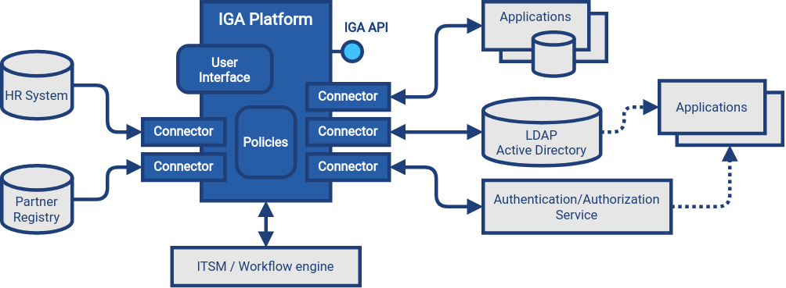

= Identity Governance and Administration
:page-keywords: [ 'IGA' ]
:page-toc: top
:page-upkeep-status: orange
:page-visibility: hidden

== Introduction

Identity governance and administration (IGA) is a subfield of xref:/iam[identity and access management (IAM)] dealing with management and governance of identity-related information.
Simply speaking, IGA deals with all the details concerning maintenance of identity information, ranging from low-level technical details to high-level business policies.

On the lower level, IGA systems store, synchronize and manage digital identity information, such as user accounts and profiles.
IGA mechanisms combine the low-level identity information to create a unified view of digital identity, compiled from many individual fragments.
Policies, access control models and business rules are applied on top of unified identity, maintaining consistency and security.

== Identity

Before we delve deep into identity governance and administration (IGA), we need to discuss _identity_.
_Identity_ is a very abstract concept.
We all have an intuitive understanding of _identity_ in the real world.
However, it turns out that such intuitive understanding is not easy to apply to cyberspace.
There are many definitions of _identity_ in the cyberspace, as well as many synonyms and alternative terms, featuring many degrees of exactness and shades of meaning: digital identity, network identity, virtual entity, user account, user profile and many more.
Even worse, such terms are frequently confused with related terms such as _identifier_ and _personally identifiable information (PII)_.
For our purposes, will use term "glossref:digital-identity[digital identity]" or just "identity" when the digital aspect is obvious from the context.
// Book: When it comes to tech implementation, specific terms can be used, "account" or "user (identity)".

Moreover, identity is inherently subjective - it takes different forms depending on your point of view.
There are often _personas_, e.g. different aspects of identity for private and business use.
Identities form relations, participate in groups and organizations, evolve over time, aspects of identity can be hidden, revealed, verified, proven to third parties, suspended, resumed, archived and erased at the very end.
Overall, identity is complex.
It is a primary responsibility of IGA technologies to deal with that complexity.

From IGA point of view, "digital identity" is a set of information that describe characteristics of some glossref:entity[entity], such as person, application or device.
Digital identity comes in many forms: database record, directory entry, user account, or row in a spreadsheet.
Identity is often seen as a set of _attributes_.
This is a common convention to simplify model of digital identity.
However, identity also includes relations to other identities and objects, behavioral characteristics and other aspects, which are not easy to represent in a form of attributes.
Regardless of the specific form of digital identity, IGA platforms see digital identity as a bunch of data describing a specific entity.

// DO NOT OVERCOMPLICATE this section! It is just an intro. Details should be elsewhere.

== Identity Sprawl

Digital identity comes in many shapes and forms.
Even if we simplify identity as a set of attributes, it does not help much to align various forms of identity into a unified view.
Many systems identify users by using a short user-friendly usernames, such as `aanderson`.
Other systems use e-mail address, such as `alice.anderson@example.com`.
Human resource systems often use employee numbers, such as `035431217`.
Some systems use pseudo-random globally-unique identifiers, such as UUID (`74ddc2f7-5c2b-4f80-ab15-cb757d21ae86`), even resorting to binary identifiers altogether.
There are structures identifier formats, such as LDAP distinguished name (`uid=aanderson,ou=People,dc=example,dc=com`), various internal and legacy formats.
There are unified resource names (URNs), locators (URLs) and identifiers (URIs) which are not that unified after all.
Some systems use a combination of several identifiers.
This is a wilderness - and we are still talking just about identifiers.

Unifying shards of digital identity into a consistent unified view is no easy task.
TODO: such a simple thing as a name of a person: single string, structured, middle names, honorific titles, national mutations, character sets (japanese vs latinized).

== Unified View of Identity

// TODO: picture: accounts and user, star topology

TODO: Common data model, schema, synchronization
Account links
TODO: star topology
TODO: visibility: IGA platform must provide visibility, this is a starting point

== Identity Administration

TODO: manage identity sprawl
TODO: inventory, orphaned accounts
TODO: access control, access control models, entitlements
TODO: hygiene, posture

== Identity Governance

TODO: policies, rules
TODO: processes (access request, certification)
TODO: policy maintenance, reviews, responsibilities
TODO: compliance
TODO: resilience
IGA system are responsible for evaluating the policies, making sure the data are compliant, addressing policy violations.

== Identity and Access Management

TODO:
IGA covers a very broad area of IAM, however, it does not cover it all.
IGA is not concerned with authentication, security tokens, or the way how user is accessing the application.
That is a concern of glossref:access-management[access management (AM)].
IGA is not directly concerned with authorization either, although management of entitlements that influence authorization is part of IGA.

== OLD CONTENT

== Terminology

// Move to separate page, leave just a note here

TODO: IGA is often considered an umbrella term covering glossref:identity-management[identity management], glossref:identity-governance[identity governance], compliance management, identity-based risk management and other aspects related to management of identities.

Identity professionals, often motivated by marketing needs, like to invent new names and use them to describe the same thing.
Therefore there are many overlapping, overloaded and similar terms in use.
_Identity management_ (IDM) is used to describe the low-level parts (technology), while _identity governance_ is used to describe the high-level parts (business). Yet the boundary is very fuzzy and many IDM systems provide governance capabilities, and many governance systems provide low-level functions.
_Governance, risk management and compliance (GRC)_ is a terms that was mostly used in the past to represent the high-level identity governance functionality, later known simply as _identity governance_.
_Identity security_ is a marketing term that roughly covers IGA functionality.

Overall, the terminology is very fluid.
Vendors use their own terms, often choosing overloaded or confusing terminology.
Marketing terms are invented faster than the documentation can adapt, making the situation quite confusing.
We have tried to compile the terminology as precisely as we could, while still making the terms understandable.
We have chosen to follow established industry terminology when possible, even though many terms are overloaded and ambiguous.
However, we did not want to increase the confusion by re-inventing the terminology.
We are pointing out the ambiguities in the text as needed.
When in doubt, please refer to the xref:/glossary/[glossary].

== Architecture

// Move to separate page

Identity governance and administration (IGA) systems are part of IT infrastructure layer.
They provide essential services, managing and monitoring identity-related information in applications and glossref:identity-data-store[identity data stores].
IGA systems are policing identity data, making sure that they are up-to-date and consistent, applying policies, detecting identity-related security issues, assessing identity-related risk and provide essential visibility and analytics functions.

IGA platform has two primary functions, which result in two primary data flows:

. *Identity administration* (identity management) is focused on management of user accounts and entitlements, often based on authoritative data, such as data from the human resource (HR) system.
In order to fulfill this function, IGA platform has to read data from source systems (e.g. HR), process them, and write data to target systems (e.g LDAP, Active Directory and applications).

. *Identity governance* is focused on application of policies on identity data, driving identity-related processes, gathering identity and entitlement information, analyzing it, assessing the risks and suggesting policy improvements.
In order to fulfill this function, IGA platform needs (direct) read access to all connected systems, retrieving and analysing all identity-related data (accounts, groups, roles and other entitlements, organizational structures and so on).
IGA platform occasionally writes the information, e.g. in order to remedy policy violations (e.g. disabling access for orphaned account).

In order to fulfill its functions, the IGA platform needs to access identity data throughout the organization.
IGA platform has to access all the databases and data stores that contain identity information.
The access is usually implemented by using glossref:identity-connector[connectors], accessing applications and data stores using their native communication mechanisms.
IGA platform relies on access to reliable identity information, without any filtering or deformations.
_Direct_ connection to applications and data stores is almost always essential for IGA platform to function properly (see xref:/iam/myths/indirect-access.adoc[indirect access antipattern] for more details).
Applications that store identity data in their own databases should be always connected to the IGA platform directly.
Applications that use identity data located in glossref:identity-data-store[identity data store] (such as LDAP servers or Active Directory) and do not make a persistent local copy of the information does not need to be connected to IGA platform.
However, IGA platform should be aware of an existence of such application, and relation of data store entitlements (such as LDAP groups) to the application.

IGA platform is processing various policies in its policy engines, including glossref:rbac[role-based policies], governance policies, organizational policies and so on.
Policy engine is usually one of the most complex parts of the platform.
Most parts of the policy is processed in full-automatic mode, however, some parts require interaction with users and administrators.
For that purpose, and also for other purposes almost all IGA platforms provide comprehensive user interface.
User interface usually provides several functions:

* Self-service user interface for ordinary users.
This part of user interface informs user about accounts and entitlements, allows management of selected parts of user profile, provides means to manage credentials (e.g. passwords), allows submission of access requests.

* Identity and policy administration functions allow modification od identity information and configuration of policies, such as definition of roles.
This part of user interface is also used to manage reporting and analytic capabilities, and to access results of reports, analyses and operational information (e.g. dashboards).

* Business process interactions are necessary for users (usually managers) to take part of identity-related business processes, such as access request approvals, certification campaigns and remediation tasks.
Some parts of this interface may be delegated to a third-party ITSM or workflow system.

* System configuration interface is used to set up low-level system functions, usually used during initial deployment and for customization purposes.
It is usually accessible to system administrators only.

IGA platform usually provides an glossref:api[API], usually in a form of glossref:restful-service[RESTful service].
The API exposes data processed by the IGA platform, such as identity data, policies and configuration.
The API usually provides access to IGA functions, however, capabilities of the API vastly differs from product to product.

As IGA platform usually takes part in identity-related business processes, there is usually a requirement to manage the processes in cooperation with systems, that are used for organization-wide process and task management.
There are usually IT service management (ITSM) systems and/or enterprise workflow engines.
Many IGA platforms have a capability to integrate with such systems, delegating approval processes, remediation and similar tasks.
ITSM systems are often used to mediate glossref:manual-fulfillment[manual fulfillment operations].

== Capabilities

Identity governance and administration (IGA) is driven by both the needs of business and technology.
While each organization is different, there are many requirements and functions that are used in many organizations in a very similar way.
The basic capabilities common to many IGA products are:

* xref:../capabilities/lifecycle.adoc[Identity Lifecycle Management]

* xref:../capabilities/entitlement-management.adoc[Entitlement Management]

* xref:../capabilities/fulfillment.adoc[Fulfillment]

* xref:../capabilities/synchronization.adoc[Synchronization]

* xref:../capabilities/policy-and-role-management.adoc[Policy and Role Management]

* xref:../capabilities/access-request.adoc[Access Requests]

* xref:../capabilities/workflow.adoc[Identity Workflow Automation]

* xref:../capabilities/certification.adoc[Access Certification]

* xref:../capabilities/auditing.adoc[Auditing]

* xref:../capabilities/identity-analytics.adoc[Identity Analytics and Reporting]

xref:../capabilities/[Read more ...]

== Generic Mechanisms and Infrastructure

IGA capabilities described above provide "tangible" functions, functionality that is obvious to users of the system.
However, there are many mechanisms and underlying infrastructure that is used to implement such functions.
Following mechanisms are difficult to categorize to any specific capability, as they are almost always reused by many capabilities.

* *Attribute mapping* mechanism is responsible for moving and transforming attribute values.
For example, it takes care that value of attribute `LAST_NAME` taken from the HR is copied to user property 'familyName' in the IGA platform, which is in turn written to LDAP attribute `sn`.
Attribute mapping mechanism takes care of attribute name mapping, data format conversion, value translation all the low-level details of data integration.
This mechanism is used all the time: during initial migration, for real-time synchronization, reconciliation, fulfillment, analytics, and entitlement management.

* *Expressions* are used whenever there is a need to transform a value, or influence an execution of an algorithm.
Expressions are usually very short pieces of scripting code, using well-known scripting languages such as JavaScript, Groovy or Python.
Most common use of expressions is to customize behavior of _attribute mapping_, transforming attribute values as they are mapped from/to glossref:identity-resource[identity resources].
However, expressions are versatile mechanism, used at various places in IGA platform.
Expressions may determine the entitlements that a role grants, implementing ABAC-like behavior.
Expressions can be used to determine approvers or certifiers, dynamically set configuration, take part in smart policy definitions, customize data presentation and reports and do variety of other things.

* *Schema management* mechanism maintains definition of data models in each connected system (glossref:identity-resource[identity resource]).
It is a responsibility of schema management to know, that LDAP servers use multi-value string attributes `cn` and `sn`, that our HR system has a single-value string attribute `LAST_NAME` and so on.
Schema of such glossref:identity-resource[identity resources] is usually discovered automatically, by the means of glossref:identity-connector[identity connector].
Schema management also maintains _extension_ attributes, attributes that were defined in IGA platform as part of data model customization.
While some IGA platforms are completely "schemaless" and lack schema management altogether, schema management is usually essential to build a consistent and maintainable system.

* *Identity connectors* are small pieces of integration code that facilitate the connection to glossref:identity-resource[identity resources] (source and target systems).
Identity connectors are usually running on the IGA platform, accessing glossref:identity-resource[identity resource] remotely over the network, although some IGA platforms are still using agents that have to be installed on glossref:identity-resource[identity resource] systems.
The connectors are responsible to initiate operations to read, create, updated and delete (CRUD) objects such as accounts and groups.
Connectors also mediate schema discovery process, cooperate in synchronization mechanisms, execute provisioning scripts and take part in similar auxiliary operations.
In their pure form, identity connectors are essentially protocol adapters, interpreting operations of IGA platforms, executing them on glossref:identity-resource[identity resources] using their native protocol (LDAP, SQL, HTTP, etc.)
The connectors are usually accessing the systems _directly_, retrieving and interpreting unfiltered information in their native form.
This direct access is important to maintain data fidelity, to make sure that the data are authentic and complete.
Such authenticity is an essential aspect for detection of orphan accounts, for entitlement management, role mining and so on.

* Customization mechanisms are necessary part of almost every IGA deployment.
While the current trend is leaning towards adapting business processes to technology, there is still a need to customize IGA deployments for every organization.
Every organization is different, and identity management goes deep into organizational fabric.
While it is generally a good idea to standardize the processes, some customization of IGA platform cannot be avoided.
Therefore, all IGA platforms are more-or-less customizable.
Their behavior can be adapted, policies can be configured, data flow adjusted, data models extended, and most IGA platforms often some customization of the user interface as well.

* *Services (API) and integration* is essential mechanism for IGA platform to cooperate with other IT infrastructure systems.
Almost all IGA platforms expose the functionality in a form of network-accessible interface (glossref:api[API]), usually in a form of HTTP-based glossref:restful-service[RESTful service].
Capabilities of the exposed API vary from IGA product to product.
Some products are based on _API-first_ approach, exposing all the functionality in the glossref:api[API].
On the other hand, some products are not exposing almost any functionality at all.
Most IGA products are somewhere in between.
The API is an essential part of the platform.
IGA a part of the infrastructure, it is not an application.
Therefore IGA needs to be integrated into the IT platform.
One "side" of the integration is facilitated by IGA platform itself, in a form of identity connectors.
However, there is also other "side", other applications and services accessing functionality of IGA platform by using the API.
Therefore, the API has to be available, reasonable feature-complete, stable and well documented.

* *Logging and diagnostics* is essential for operation of IGA platform.
IGA platforms have to adapt to many requirements, support diverse policies and configuration and connect to plethora of third-party systems.
Therefore, the platform itself, and especially platform configuration is almost certain to be complex.
It is almost impossible to get the configuration working at a first try, and the configuration needs to change and adapt to new requirements all the time.
Therefore, good diagnostic and troubleshooting capabilities of an IGA platform are absolutely essential for a long-term maintenance of the solution.
Comprehensive logging capability, structured both at component level and severity level is absolutely essential.
Capabilities to simulate (or "preview") effects of particular change in data, or simulate the effect of a policy change is also a very welcome capability, as are various performance probes and counters.
Sadly, many IGA platforms provide only very limited diagnostic capabilities, which makes IGA deployment and maintenance extremely demanding.

== Related Capabilities

* *Access control evaluation and enforcement* (e.g RBAC/ABAC evaluation and enforcement).
IGA is concerned with definition and maintenance of access control policies, such as glossref:rbac[role-based access control (RBAC)] or glossref:abac[attribute-based access control (ABAC)].
Definition of roles, role structure, even definition of attribute-based policies are usually considered an important part of IGA.
IGA platforms usually implement glossref:pap[policy administration point (PAP)] functionality.
However, evaluation and enforcement of the policies is, strictly speaking, not part of IGA.
Enforcement of policies (ABAC, RBAC) is usually done by glossref:pep[policy decision points (PDP)] and glossref:pep[policy enforcement points (PEP)] in applications and infrastructure components.

* *Organizational structure management* is a crucial function of almost any organization, both small and big.
Organizational structure information is essential for many IGA functions and processes.
Strictly speaking, organizational management is *not* part of IGA, IGA solution should only _use_ organizational information.
Organizational structure information should be created and maintained in dedicated systems, such as human resource (HR) systems.
However, too many organizations do not have complete, consistent and machine-processable information on organizational structure.
Even in cases that organizational structure information is maintained in dedicated systems, appropriate feedback cycle is missing.
Organizational structure information is usually used only within the systems that it was created, it is not subject to real-world validation in business processes and functions.
Other information systems that require organizational structure data often need only partial information, often in a format different that provided by the official organizational structure source.
Therefore, organizational structure information is often maintained in applications manually.
IGA platform is probably the first system that attempts to synchronize, compare and validate the information, completing feedback cycle, effectively taking part in organizational structure management.

* *Personal data protection* is closely related to identity governance.
Although it is not formally recognized as a part of identity governance and administration yet, it permeates many aspects of IGA.
Data protection and privacy frameworks such as GDPR mandate that personal data can only be processes if there is a glossref:personal-data-processing-basis[lawful basis] for the processing.
Therefore, the processing bases has to be tracked, individually for each identity and even for each data item.
This is no easy task in flexible information environments, where various identity types mix, where one identity is often used for many purposes and roles.
glossref:consent-for-personal-data-processing[Consent] is one of possible processing bases.
Even though it is often misused, consent information needs to be strictly tracked, considering the possibility of the user to revoke the consent any time.
In addition to processing basis, provenance of personal data has to be tracked as well, transfer of personal data needs to be controlled, especially transfer to other organizations and countries.
The data must be glossref:personal-data-erasure[erased] when no longer needed.

// TODO: functions to document:
//
// Application management (lifecycle), creating/deleting app accounts, managing passwords.
// a.k.a. "service account management"
//
// Infrastructure/built-in accounts (root, administrator, etc.)
// May not even have password, but we need to account for them.
//
// Progressive profiling
//
// TODO: Where to put it?
// Account ownership management (linking)

== See Also

* xref:/iam/[]

* xref:/glossary/[]
