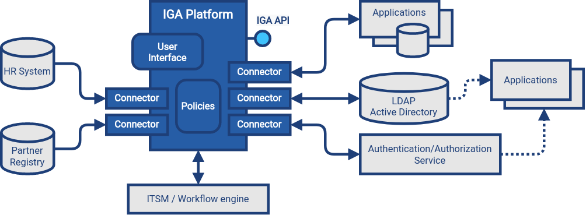

= Identity Governance and Administration
:page-keywords: [ 'IGA' ]
:page-toc: top
:page-upkeep-status: green

== Introduction

Identity governance and administration (IGA) is a subfield of xref:/iam[identity and access management (IAM)] dealing with management and governance of identity-related information.
Simply speaking, IGA deals with all the details concerning maintenance of identity information, ranging from low-level technical details to high-level business policies.

IGA systems store, synchronize and manage identity information, such as user profiles.
Complex data, entitlement and governance polices can be defined, applied to identity data.
IGA system are responsible for evaluating the policies, making sure the data are compliant, addressing policy violations.
IGA is often considered an umbrella term covering glossref:identity-management[identity management], glossref:identity-governance[identity governance], compliance management, identity-based risk management and other aspects related to management of identities.

IGA covers a very broad area of IAM, however, it does not cover it all.
IGA is not concerned with authentication, security tokens, or the way how user is accessing the application.
That is a concern of glossref:access-management[access management (AM)].
IGA is not directly concerned with authorization either, although management of entitlements that influence authorization is part of IGA.

== Terminology

Identity professionals, often motivated by marketing needs, like to invent new names and use them to describe the same thing.
Therefore there are many overlapping, overloaded and similar terms in use.
_Identity management_ (IDM) is used to describe the low-level parts (technology), while _identity governance_ is used to describe the high-level parts (business). Yet the boundary is very fuzzy and many IDM systems provide governance capabilities, and many governance systems provide low-level functions.
_Governance, risk management and compliance (GRC)_ is a terms that was mostly used in the past to represent the high-level identity governance functionality, later known simply as _identity governance_.
_Identity security_ is a marketing term that roughly covers IGA functionality.

Overall, the terminology is very fluid.
Vendors use their own terms, often choosing overloaded or confusing terminology.
Marketing terms are invented faster than the documentation can adapt, making the situation quite confusing.
We have tried to compile the terminology as precisely as we could, while still making the terms understandable.
We have chosen to follow established industry terminology when possible, even though many terms are overloaded and ambiguous.
However, we did not want to increase the confusion by re-inventing the terminology.
We are pointing out the ambiguities in the text as needed.
When in doubt, please refer to the xref:/glossary/[glossary].

== Architecture

Identity governance and administration (IGA) systems are part of IT infrastructure layer.
They provide essential services, managing and monitoring identity-related information in applications and glossref:identity-data-store[identity data stores].
IGA systems are policing identity data, making sure that they are up-to-date and consistent, applying policies, detecting identity-related security issues, assessing identity-related risk and provide essential visibility and analytics functions.

In order to fulfill its functions, the IGA platform needs to access identity data throughout the organization.
IGA platform has to access all the databases and data stores that contain identity information.
The access is usually implemented by using connectors, accessing applications and data stores using their native communication mechanisms.
IGA platform relies on access to reliable identity information, without any filtering or deformations.
_Direct_ connection to applications and data stores is almost always essential for IGA platform to function properly (see xref:../antipatterns/indirect-access.adoc[indirect access antipattern] for more details).

// See antipatterns

// TODO: User interface: admin, self-service

// TODO: IGA API

== Capabilities

Identity governance and administration (IGA) is driven by both the needs of business and technology.
While each organization is different, there are many requirements and functions that are used in many organizations in a very similar way.
This section describes the IGA functionality in a structured, semi-formalized way, unifying the terminology and description of capabilities and functions.
Description of IGA capabilities and functions can be useful for evaluations, gap analyses, maturity models and similar purposes.

=== Identity Lifecycle Management

*Alternative names:* Lifecycle management, Identity lifecycle

*Functions:* Identity lifecycle state model, Maintenance of identity attributes, Identifier management, Credential management, Support for diverse identity types, Organizational structure, Personas

Identity lifecycle management deals with maintenance of digital identities.
It maintains state of digital identities through various lifecycle changes, such as creation, modification, archival and deletion.

xref:lifecycle.adoc[Read more ...]

=== Entitlement Management

*Alternative names:* Group management, Privilege management

*Functions:* Entitlement lifecycle management, Maintenance of entitlement associations

Entitlement management deals with association between identities and entitlements.
Entitlements are assigned to an identity, giving an identity access to a particular asset or an operation.
These are usually groups, permissions, associations to access control lists, low-level system roles and so on.
Simply speaking, entitlement management deals with a question: Who has access to what?

xref:entitlement-management.adoc[Read more ...]

=== Fulfillment

*Alternative names:* Provisioning/deprovisioning, Change propagation

*Functions:* Identity resource management, Communication with remote systems, Handling of fulfilment failures, Identity state tracking, Management of manual fulfillment operations

Simply speaking, fulfilment is a capability that deals with propagation of changes to target systems.
Fulfilment creates, modifies and deletes user accounts.
Strictly speaking, this capability fulfils the policy, e.g. by creating an account when such an account is mandated by the policy.

xref:fulfillment.adoc[Read more ...]

=== Synchronization

*Alternative names:* Reconciliation, Correlation

*Functions:* Data feed management, Reconciliation, Data consistency management, Identity correlation, Orphan detection

Synchronization capability provides functions that keep identity data consistent across all the connected systems.
While fulfilment can make sure that the account is created in accord with the policy, it is synchronization that makes sure that it stays compliant with the policy all the time.
This makes synchronization perhaps the most important infrastructural capability of any IGA platform.

xref:synchronization.adoc[Read more ...]

=== Policy and Role Management

*Alternative names:* Role management, Role governance, Role modeling, Role lifecycle management, Policy management

*Functions:* Role-based policies, Role structure, Role modeling and governance, Certification of role definitions, Segregation of Duties, Automatic role assignment, Compliance management, Deputy management

The heart of identity governance is about the policies.
Policies specify how things _should_ be, what is the ideal state of all the systems and data.
As organizations and regulations tend to be quite complex, policies are often complex too.
Moreover, policies tend to change in reaction to changed regulations or organizational needs.
All of that makes policy management quite a challenging thing to do.

xref:policy-and-role-management.adoc[Read more ...]

=== Access Requests

*Alternative names:* Role request and approval, Role request process, Approvals

*Functions:* Access request user interface, Management of approval schemes, Execution of approval processes, Maintenance of approval accountability record, Immediate fulfillment of approved requests

_Access request_ is a process for controlled, user-driven assignment of roles and entitlements to users.
It is usually implemented as request-and-approval process to assign roles to users.
The roles are usually requested by the user using a self-service user interface.
The request is then driven through a series of approval steps.
When approved, the roles are automatically assigned to the user.

xref:access-request.adoc[Read more ...]

=== Identity Workflow Automation

*Alternative names:* Workflow, Identity workflow management, Remediation

*Functions:* Remediation of policy violations, Case management, Process management, Escalation, Notifications

While identity management strives for automation, there are still tasks in identity management and governance that must be done by humans.
These are usually decisions that cannot be made automatically, tasks that do not have algorithmic description, or just a simple notification, letting users know about the progress of a task.

xref:workflow.adoc[Read more ...]

=== Access Certification

*Alternative names:* Re-certification, Attestation

*Functions:* Full certification campaign, Microcertification, Certification of role definitions

Access privileges have a tendency to grow and accumulate.
There are many ways to efficiently grant a privilege: formal _access request_ processes, privileges are granted manually by system administrators and various informal side channels.
However, privilege accumulation is a risk, as people often keep their privileges forever.
Access certification is a process to remove privileges that are no longer necessary.
During access certification process, responsible persons must _certify_ that users still need the privileges that were granted to them.

xref:certification.adoc[Read more ...]

=== Auditing

*Alternative names:* Audit trail, Audit logging

*Functions:* Recording audit trail, Basic audit trail access, Complex audit reporting, Audit integration, Metadata maintenance

Auditing capability is responsible for recording identity-related operations and events.
The operations are recorded on _business level_, containing business-relevant information in the records.
Audit data may be used for variety of reports.
At least a basic reporting engine capable of searching and displaying audit records is usually included.

xref:auditing.adoc[Read more ...]

=== Identity Analytics and Reporting

*Alternative names:* Identity analytics, IdA, Identity analytics and intelligence, Identity intelligence

*Functions:* Customizable reports and visualizations, Risk assessment, Risk-based triggers, Anomaly detection, Compliance management, Simulation, Role mining

Responsibility of identity analytics and reporting capability lies mostly with analysis of identity data, summarizing and extracting relevant information, providing reports and dashboards, visualising identity information.
Identity analytics dive deep into the data, considering identity data in context, using complex models to extract information.
One of the most important information extracted from identity data is estimate of risk levels.
The information extracted from identity data is used to initiate actions, such as starting remediation processes and triggering microcertifications.

xref:identity-analytics.adoc[Read more ...]

== Generic Mechanisms and Infrastructure

IGA capabilities described above provide "tangible" functions, functionality that is obvious to users of the system.
However, there are many mechanisms and underlying infrastructure that is used to implement such functions.
Following mechanisms are difficult to categorize to any specific capability, as they are almost always reused by many capabilities.

* *Attribute mapping* mechanism is responsible for moving and transforming attribute values.
For example, it takes care that value of attribute `LAST_NAME` taken from the HR is copied to user property 'familyName' in the IGA platform, which is in turn written to LDAP attribute `sn`.
Attribute mapping mechanism takes care of attribute name mapping, data format conversion, value translation all the low-level details of data integration.
This mechanism is used all the time: during initial migration, for real-time synchronization, reconciliation, fulfillment, analytics, and entitlement management.

* *Expressions* are used whenever there is a need to transform a value, or influence an execution of an algorithm.
Expressions are usually very short pieces of scripting code, using well-known scripting languages such as JavaScript, Groovy or Python.
Most common use of expressions is to customize behavior of _attribute mapping_, transforming attribute values as they are mapped from/to glossref:identity-resource[identity resources].
However, expressions are versatile mechanism, used at various places in IGA platform.
Expressions may determine the entitlements that a role grants, implementing ABAC-like behavior.
Expressions can be used to determine approvers or certifiers, dynamically set configuration, take part in smart policy definitions, customize data presentation and reports and do variety of other things.

* *Schema management* mechanism maintains definition of data models in each connected system (glossref:identity-resource[identity resource]).
It is a responsibility of schema management to know, that LDAP servers use multi-value string attributes `cn` and `sn`, that our HR system has a single-value string attribute `LAST_NAME` and so on.
Schema of such glossref:identity-resource[identity resources] is usually discovered automatically, by the means of glossref:identity-connector[identity connector].
Schema management also maintains _extension_ attributes, attributes that were defined in IGA platform as part of data model customization.
While some IGA platforms are completely "schemaless" and lack schema management altogether, schema management is usually essential to build a consistent and maintainable system.

* *Identity connectors* are small pieces of integration code that facilitate the connection to glossref:identity-resource[identity resources] (source and target systems).
Identity connectors are usually running on the IGA platform, accessing glossref:identity-resource[identity resource] remotely over the network, although some IGA platforms are still using agents that have to be installed on glossref:identity-resource[identity resource] systems.
The connectors are responsible to initiate operations to read, create, updated and delete (CRUD) objects such as accounts and groups.
Connectors also mediate schema discovery process, cooperate in synchronization mechanisms, execute provisioning scripts and take part in similar auxiliary operations.
In their pure form, identity connectors are essentially protocol adapters, interpreting operations of IGA platforms, executing them on glossref:identity-resource[identity resources] using their native protocol (LDAP, SQL, HTTP, etc.)
The connectors are usually accessing the systems _directly_, retrieving and interpreting unfiltered information in their native form.
This direct access is important to maintain data fidelity, to make sure that the data are authentic and complete.
Such authenticity is an essential aspect for detection of orphan accounts, for entitlement management, role mining and so on.

* Customization mechanisms are necessary part of almost every IGA deployment.
While the current trend is leaning towards adapting business processes to technology, there is still a need to customize IGA deployments for every organization.
Every organization is different, and identity management goes deep into organizational fabric.
While it is generally a good idea to standardize the processes, some customization of IGA platform cannot be avoided.
Therefore, all IGA platforms are more-or-less customizable.
Their behavior can be adapted, policies can be configured, data flow adjusted, data models extended, and most IGA platforms often some customization of the user interface as well.

* *Services (API) and integration* is essential mechanism for IGA platform to cooperate with other IT infrastructure systems.
Almost all IGA platforms expose the functionality in a form of network-accessible interface (glossref:api[API]), usually in a form of HTTP-based glossref:restful-service[RESTful service].
Capabilities of the exposed API vary from IGA product to product.
Some products are based on _API-first_ approach, exposing all the functionality in the glossref:api[API].
On the other hand, some products are not exposing almost any functionality at all.
Most IGA products are somewhere in between.
The API is an essential part of the platform.
IGA a part of the infrastructure, it is not an application.
Therefore IGA needs to be integrated into the IT platform.
One "side" of the integration is facilitated by IGA platform itself, in a form of identity connectors.
However, there is also other "side", other applications and services accessing functionality of IGA platform by using the API.
Therefore, the API has to be available, reasonable feature-complete, stable and well documented.

* *Logging and diagnostics* is essential for operation of IGA platform.
IGA platforms have to adapt to many requirements, support diverse policies and configuration and connect to plethora of third-party systems.
Therefore, the platform itself, and especially platform configuration is almost certain to be complex.
It is almost impossible to get the configuration working at a first try, and the configuration needs to change and adapt to new requirements all the time.
Therefore, good diagnostic and troubleshooting capabilities of an IGA platform are absolutely essential for a long-term maintenance of the solution.
Comprehensive logging capability, structured both at component level and severity level is absolutely essential.
Capabilities to simulate (or "preview") effects of particular change in data, or simulate the effect of a policy change is also a very welcome capability, as are various performance probes and counters.
Sadly, many IGA platforms provide only very limited diagnostic capabilities, which makes IGA deployment and maintenance extremely demanding.

== Related Capabilities

* *Access control evaluation and enforcement* (e.g RBAC/ABAC evaluation and enforcement).
IGA is concerned with definition and maintenance of access control policies, such as glossref:rbac[role-based access control (RBAC)] or glossref:abac[attribute-based access control (ABAC)].
Definition of roles, role structure, even definition of attribute-based policies are usually considered an important part of IGA.
IGA platforms usually implement glossref:pmp[policy management point (PMP)] functionality.
However, evaluation and enforcement of the policies is, strictly speaking, not part of IGA.
Enforcement of policies (ABAC, RBAC) is usually done by glossref:pep[policy decision points (PDP)] and glossref:pep[policy enforcement points (PEP)] in applications and infrastructure components.

* *Organizational structure management* is a crucial function of almost any organization, both small and big.
Organizational structure information is essential for many IGA functions and processes.
Strictly speaking, organizational management is *not* part of IGA, IGA solution should only _use_ organizational information.
Organizational structure information should be created and maintained in dedicated systems, such as human resource (HR) systems.
However, too many organizations do not have complete, consistent and machine-processable information on organizational structure.
Even in cases that organizational structure information is maintained in dedicated systems, appropriate feedback cycle is missing.
Organizational structure information is usually used only within the systems that it was created, it is not subject to real-world validation in business processes and functions.
Other information systems that require organizational structure data often need only partial information, often in a format different that provided by the official organizational structure source.
Therefore, organizational structure information is often maintained in applications manually.
IGA platform is probably the first system that attempts to synchronize, compare and validate the information, completing feedback cycle, effectively taking part in organizational structure management.

* *Personal data protection* is closely related to identity governance.
Although it is not formally recognized as a part of identity governance and administration yet, it permeates many aspects of IGA.
Data protection and privacy frameworks such as GDPR mandate that personal data can only be processes if there is a glossref:personal-data-processing-basis[lawful basis] for the processing.
Therefore, the processing bases has to be tracked, individually for each identity and even for each data item.
This is no easy task in flexible information environments, where various identity types mix, where one identity is often used for many purposes and roles.
glossref:consent-for-personal-data-processing[Consent] is one of possible processing bases.
Even though it is often misused, consent information needs to be strictly tracked, considering the possibility of the user to revoke the consent any time.
In addition to processing basis, provenance of personal data has to be tracked as well, transfer of personal data needs to be controlled, especially transfer to other organizations and countries.
The data must be glossref:personal-data-erasure[erased] when no longer needed.

// TODO: functions to document:
//
// Application management (lifecycle), creating/deleting app accounts, managing passwords.
// a.k.a. "service account management"
//
// Infrastructure/built-in accounts (root, administrator, etc.)
// May not even have password, but we need to account for them.
//
// Progressive profiling
//
// TODO: Where to put it?
// Account ownership management (linking)

== See Also

* xref:/iam/[]

* xref:/glossary/[]
