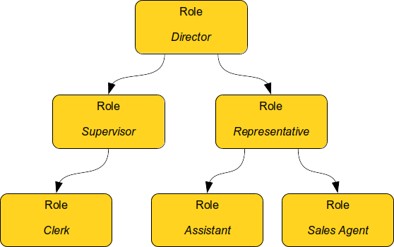
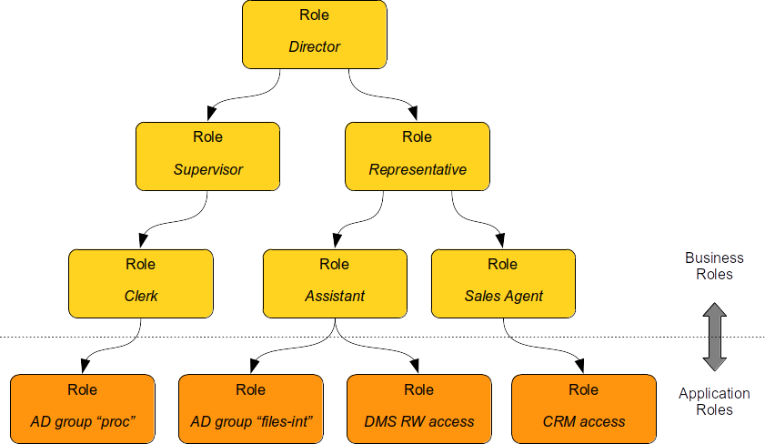
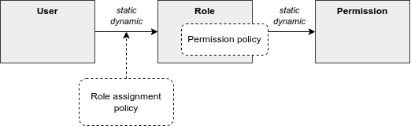

= Role-Based Access Control in IGA
:page-nav-title: RBAC
:page-keywords: [ 'RBAC', 'RBAC in IGA' ]
:page-toc: top
:page-moved-from: /iam/rbac/
:page-upkeep-status: green

== Introduction

As the name suggests, role-based access control (RBAC) is an access control mechanism based on concept of _roles_.
In many organizations there are groups of permissions that are assigned to users over and over again.
Users that are doing the same job are likely to have the same permissions.
The idea of RBAC is simple: let's group this permissions into a _role_ and assign the role to the users.
This means that there are _less_ things to assign: instead of assigning a handful of permissions we assign a single role.
Less things to manage means less administration effort.
At least in theory.

// TODO: picture: Alice,Bob,Carol assigned to role "Sales Manager" which gives access to AD, ERP and CRM

As usual, the practice is slightly different.
RBAC works very well for organizations that are quite _regular_ and _static_ - organizations in which many people are doing the same job, and that job rarely changes.
In that case we need just a handful of roles, we will be assigning them to many users, and we will not need to update role definitions often.
Unfortunately, we are in 21^st^ century reality.
Organizations are not very _regular_ or _static_ anymore, they need to be flexible and efficient to survive.
Employees usually have several responsibilities which tend to change quite often.
This is not an ideal environment for RBAC.
Organizations need to manage large number of roles and role assignments, in a very dynamic environment.
Yet, RBAC can still bring a lot of value if used correctly.

Let's start with the basics first.

.Terminology
NOTE: The term _RBAC_ is many things to many people.
We use the term _RBAC_ in quite a broad sense.
We do not strictly mean NIST RBAC model.
What me mean by _RBAC_ is a generic mechanism that is based on the concept of roles.
Although the basic principles of midPoint RBAC are very similar to NIST RBAC model, we take the liberty to deviate from NIST model when needed.

.IGA-specific
NOTE: This text describes use of RBAC in identity governance and administration (IGA) systems, previously known as identity management (IDM) systems or provisioning systems.
It is *not* focused on use of RBAC for fine-grained access control within applications.

== Basic Role Hierarchy

Ability to group permissions into roles is quite useful.
However, it is still not good enough unless your access control policy is extremely simple.
Most practical policies require placing roles into roles, thus creating role hierarchy.

Let’s consider two work positions: clerk and supervisor.
Clerk has some basic set of permissions.
Supervisor can do everything that a clerk can do, but supervisor has some additional permissions.
A naive way would be to simply copy all the clerk’s permissions in supervisor’s role.
However, permissions are seldom static.
Access control policies tend to change and evolve as much as the environment changes.
It is likely that a clerk’s permissions will change.
In that case we will need to update the supervisor’s role as well.
This would be a maintenance burden.
Now imagine hundreds or thousands of related roles that need constant maintenance.
Any person maintaining such a structure will need superhuman precision and patience to do that.

A more natural idea would be to include clerk’s role into a supervisor’s role.
If clerk’s permissions change, then also supervisor’s permissions are automatically updated.
Maintenance is much easier.
This is the basic idea of role hierarchy.
Basic permissions are placed into low-level roles.
Low-level roles are combined to create a higher-level roles.
Then those roles may be combined as well.

== Role Types

Not all roles are created equal.
In ideal case all the roles from the example above should be treated equally.
All of them should represent business position or responsibility, all of them should be assigned to users, all of them should be created and maintained using the same process and so on.
All the roles should contain the permissions necessary for that business position or responsibility.
However, that is usually not the case in the real world.

In "pure" RBAC theory, roles are supposed to represent business concepts.
This is indeed a good approach.
Roles work best when they represent something that business people can understand, work position, responsibility, organizational unit and so on.
It is all fine so far.
However, it gets complicated when we look inside the roles.
The roles are supposed to contain permissions, privileges that map to a real IT world.
However, it is difficult to construct roles that have both the business meaning and all the messy IT details.
Business people need to cooperate very closely with IT people to create roles like that.
However, cooperation of business with IT usually leaves much to be desired.
They use different concept and language, the cooperation is not entirely smooth.
Therefore, the common practice is to have (at least) two types of roles:

* *Business roles* represent business concepts, such as job or responsibility.

* *Application roles* represent IT concepts, usually technical access to particular application (hence the name).

Business roles can be composed of other business roles.
However, at the very bottom of hierarchy there are application roles.

*Application roles* are created by IT people.
They represent _technical_ concepts, such as `Active Directory account`, `Active Directory group "files-int"`, `DMS access to internal files (read-write)`, `CRM account with access to customer database`.
Application roles are the building blocks of the role hierarchy.

The recommended way is to "bind" application roles to the thing that they represent.
For example, application roles may be created by importing all Active Directory groups, creating application role from every group.
Even better, Active Directory groups should be created as a "projection" of application role.
IT staff creates an application role in IGA system, then the IGA system creates corresponding group in Active Directory.
This is a good method to maintain governance over the groups, e.g. make sure that every group has a responsible person nominated.
Unfortunately, application roles are too often maintained manually, which is labor-intensive, and it leaves significant room for errors.

*Business roles* should be created by business people.
They represent _business_ concepts, such as responsibilities required by a specific job, work position, business process or workgroup activity.
Examples include `Marketing Manager`, `Branch Supervisor`, `Claim Reviewer` and `Innovation Task Force Member`.
Business roles are usually _composites_, are built from application roles or other business roles.

There are several ways to construct business roles.
The classical method is to create business roles on a green field.
This includes business analysis of responsibilities of individual jobs, work positions and teams, formally specifying the permissions/privileges required to carry out the activities and grouping the permissions into business roles.
This is quite an exact method, however it is usually very slow, tedious and labour-intensive.
Other methods focus on discovering or _mining_ business roles definitions from existing data.
This method is not entirely exact, however it can provide results much faster.
Real-world practice often combines both methods together.

Sometimes there are also more types of role, not just _application_ and _business_ roles.
The other roles are much less common, yet they are used from time to time.
The table below summarizes role types:

|===
|Role type |Description |Content |Should be assigned to users? |Example

|Application role
|Role describing access to a single application.
Usually represents one specific _entitlement_ in the application, such as application group, privilege or role.
It is bound to one specific application (hence the name).

Application roles are often created automatically by importing/synchronizing entitlements, e.g. by importing Active Directory groups.
|Access to a single application.
| No.

Yet, they are quite often assigned to users.
|Active Directory Domain Administrators

Company Website Editors

Database `foo` read-only access

|Technical role

IT role
|Combines several application roles or low-level privileges into one unit that is easier to manage.
Often used for application roles that depend on each other, e.g. when operating system access is needed to perform database administration.
They are considered to be somewhere between application roles and business roles.
They are not application roles, as they can give access to several applications.
They are not business role either, as they do not describe a complete business responsibility, and they often use very technical and non-business-friendly terminology, which makes them a separate species on their own.
They are not used very often.
|Access to a couple of application that depend on each other, or make sense together.
| In exceptional cases, e.g. very specific and complex IT responsibility.
| Database `bar` administration with OS access

Backup/restore management

|Authorization role
|Provides internal authorizations or privileges in the system where it is defined.
In IGA platform, these are roles that provide access to parts of the platform itself.
Authorization roles do not grant access to any other systems.
|Authorization statements (grants).
|No.

Yet, some roles may be assigned to users in early stages of the deployment when business roles are not fully formed yet.
Especially superuser roles.
|`Superuser` role

Internal `Approver` role in IGA platform

|Business role
|Business role represent a business responsibility, function in a business process, business-related work position or similar business concept.
Business roles are supposed to be a combination of smaller "elemental" roles.
|Any other role type, including other business roles.
|Yes
|`Clerk`

`Branch Supervisor`

`Marketing Assistant`

`Call Center Operator`

|===

== Role Hierarchy

RBAC is hierarchical: there may be roles within roles.
When it comes to IGA, almost all role structures are, technically, hierarchical.
There are _application_ roles at the bottom of the hierarchy.
_Business_ roles are constructed from application roles.
While this is technically a role hierarchy, it does not have the benefits of role hierarchy as intended by the RBAC model.

Full benefits of the hierarchy are achieved when business roles are placed within other business roles.
For example `Sales Manager` role can contain `Sales Agent` role, including all the permissions of the agent into the permissions of the manager.
Such approach can, theoretically, reduce role maintenance.
In case of change in `Sales Agent` permissions, such change is automatically applied to permissions of `Sales Manager` as well.
However, this benefit is achieved only in cases where the role hierarchy is well constructed, avoiding role duplication or misuse.

== Access Request Process

Ideally, roles should be assigned to users automatically.
Business roles are supposed to correspond to business concepts.
Therefore, it should be straightforward to automatically assign business roles based on user's attributes, such as location, job code or project membership.
However, there are practical obstacles.
Job codes or locations may not be available, or may not be precise.
Similar problems may apply to other business data as well.
Overall data quality may be too low for such automation.
Also, not all the relevant business concepts may be covered by business roles yet.
Moreover, the mapping between business _data_ (e.g. location or job code) and business _roles_ may not be obvious.
In other words, nobody really knows what access a user should have.
This issue is, in fact, quite common.

Practical IGA deployments often resort to _xref:/iam/iga/capabilities/access-request/[access request]_ process.
The process goes like this:

. User _requests_ a role.
IGA systems provide a special-purpose user interface for requesting roles.
The user is selecting a roles from _role catalog_.

. The request is submitted for _approval_.

. The role is _assigned_ to the user.
Access is provisioned, privileges are granted.

This is a universal process that can have many variations.
The user may request role for herself/himself, or a manager may request a role for user's behalf.
The approval step may be multi-stage, e.g. requiring approval from a line manager and application owner.
High-privilege roles may require additional approval by security office.

In an idea case, the _role catalog_ should contain only a selected set of _business_ roles.
However, the catalogs usually contain all business roles - and _application_ roles too.
Too many organizations do not know what access users _should_ have, which is usually the primary motivation to deploy of _access request_ process.
As nobody knows what access users should have, it also means that nobody knows how business roles should look like.
Therefore, users are requesting application roles instead.
This approach is way too common.
Such process is not right, it goes against best practices - and common sense as well.
However, it is often the only feasible process to apply any kind of semi-systemic access control policy.

The bottom line is that the _access request_ process often leads to _over-provisioning_ - granting more access that the users need.
Reasons for this problem are quite obvious.
It is very easy to get access, and there is no motivation to remove access.
Over-provisioning is usually addressed with _xref:/iam/iga/capabilities/certification/[certification]_ mechanism.
Simply speaking, certification is a process in which responsible persons must _certify_ that users still need the access that they requested.
The usual approach is to set up _certification campaigns_, regularly certifying access (e.g. annually).

== Role Governance

It is no easy task to define the roles, creating a practical RBAC model.
However, it is even harder to _maintain_ the model in good working condition.

The world around us is changing all the time.
Organizations change as well, including jobs and responsibilities of the users.
Applications are upgraded, new applications are introduced, old applications are decommissioned.
There are re-organizations, mergers, spin-offs and numerous unforeseen changes.
RBAC model has to adapt, updating role definitions.

Role management can be centralized, putting responsibility for RBAC model maintenance to a single team.
This approach is quite obvious, and it is quite wrong.
RBAC model works best when role definitions are aligned with the things that they represent.
Application roles should be aligned with application privileges, business roles should be aligned with business needs.
Except for very rare cases, there is no single team that can cover both the IT intricacies and business complexities across the entire organization.

Practical approach is to distribute role management effort.

*Application roles* should be management by the IT department.
They should be aligned with IT concepts.
Ideally, application roles should be managed automatically or semi-automatically.
The roles can be automatically synchronized from application entitlements, e.g. Active Directory application roles can be automatically created from Active Directory groups.
The other way around is also feasible: Active Directory groups are automatically created when a new application role is defined in the IGA platform.
Either way, application roles are _IT_ domain, they are good candidates for automated maintenance.

*Business roles* should be managed by business units.
As business role describe business concepts, they should be managed by business people.
There is nobody else to know the concepts and needs of the business well enough to define the roles - and to keep them updated.
It is possible to maintain business roles as a cooperative effort of business and IT, however the engagement of business people is crucial.

Unlike application roles, maintenance of business roles is very difficult to automate.
It requires a lot of effort, especially to keep the role definitions updated.
The usual practice is to assign _role owners_, especially for business roles.
Role _owner_ is a person responsible for the role definition.
For business roles, role owner is usually a business person responsible for the job or process that the role relates to.
It is expected that role owner updates role definition whenever business needs change.
Many IGA platforms allow specification of role _owners_ within the IGA platform itself.

Role owners are essential for maintenance of _business_ roles.
However, the owners may be necessary for _application_ roles as well, especially if application roles are often assigned to users directly.

Similarly to owners, IGA systems usually allow specifications of role _approvers_.
Approvers are persons responsible for approving role requests in _access request_ process.

== RBAC Policies

Role-based access control (RBAC) model formed in the 1990s and 2000s.
This is the "traditional" form of RBAC.
This form of RBAC is entirely _static_.
Assignment of roles are static, set of permissions in roles is static, access granted by the model does not change unless it is manually changed by an administrator.
This approach might be useful back in the 2000s.
However, we live in a very dynamic world now, two decades later.
Static access control model does not work very well any longer.
There are numerous problems of _static_ RBAC models, such as xref:/iam/iga/rbac/role-explosion/[role explosion] and role abuse.

Despite all its drawbacks, traditional _static_ RBAC model was, and still is, quite popular.
However, static RBAC was criticised almost since its inception.
The critique resulted in mechanisms for making RBAC more dynamic, that were introduced as early as the 2000s.
Some identity management systems of the era supported dynamic assignment of roles to the user, based on simple rules.
However, this functionality was still quite rare.
Identity management systems matured in the 2010s and became known as identity governance and administration (IGA) systems.
At least a partial support for dynamic RBAC is now a part of many IGA platforms.
However, capabilities of individual products still significantly vary, and the dynamic functionality is not very popular outside the IGA field.
Despite that, dynamic RBAC approach provide numerous advantages, not only over static RBAC, but also over other access control models, such as ABAC or PBAC.
Now, in the 2020s, dynamic RBAC features are absolutely essential for any IGA platform to efficiently handle complex access control requirements.

One of the most practical and flexible approaches to dynamic RBAC is xref:/midpoint/reference/roles-policies/roles/pdrbac/[Policy-Driven RBAC] as implemented in xref:/midpoint/[midPoint IGA platform].
Policy-driven RBAC provides flexibility at three levels:

* *Dynamic user-role assignment*.
Assignment (and unassignment) of roles to users can be controlled by rules.
The rules usually work with user attributes, such as job code or location.
Roles can be dynamically and automatically assigned to users based on business data stored in user attributes.
+
Moreover, in midPoint, roles can be directly linked to xref:/midpoint/reference/org/[organizational structure].
In such a case, membership in an organizational unit, team or project automatically implies certain roles or privileges.
+
Dynamic user-role assignment significantly reduces RBAC administrative burden, as significant part of role assignments can be managed automatically without explicit action of an administrator.

* *User-role assignment parameters*.
User-role assignment is not a simple binary relation as it was in traditional RBAC.
It is a rich data structure that can be parametrized.
For example, assignment can be parametrized, providing access only for a limited time period, or limit the access to a certain organization.
Special parameters (such as _relation_ parameter in midPoint) can be used to determine user's relation to a role.
This can be used to distinguish ordinary role member from role owner, read-only access to resources from read-write access and so on.
+
Moreover, in midPoint, other object types that roles can be assigned, with functionality similar to roles.
For example, xref:/midpoint/reference/org/[organizational units] can directly model access provided to departments, teams and projects, even distinguishing access to team members and managers using the _relation_ parameter.
Furthermore, concept of xref:/midpoint/reference/misc/services/[services] can model applications, mobile devices, APIs and similar entities, all behaving like roles.
+
Parametric role assignment is a very efficient tool to fight xref:/iam/iga/rbac/role-explosion/[role explosion] problem.
Single role can be used under various circumstances, distinguished by assignment parameters.
Where traditional RBAC needs many roles, policy-based RBAC needs just one.

* *Dynamic role permissions*.
Roles are no longer just a static set of permissions.
While static permission sets can still be used, there is now an additional mechanism to determine permissions using dynamic _expressions_.
Such expressions take parameters from the user, role, role-user assignment and evaluation _context_.
The parameters are used to determine permissions granted by the role.
This is an efficient mechanism to determine various situation, usually based on assignment parameters.
For example, the expressions can be used to grant different permissions to ordinary role member, and different permissions to role owner.
Even more common case would be an expression that is using _location_ parameter to limit permissions only to specific physical location or country.
+
Moreover, in midPoint, the expressions can be used to set up entitlements and attributes of accounts provisioned by midPoint.
For example, it can be programmed to follow naming conventions for groups, automatically choosing correct group among `foo-reader`, `foo-writer`, `foo-admin`, all handled by a single role.
As midPoint treats organizational units as roles, this mechanism can be used to distinguish access of project members and managers without a need for complex policy definitions.
The possibilities are nearly endless.
+
Dynamic role expressions provide functionality that is very similar to dynamic access control models, such as ABAC or PBAC.
However, policy-based RBAC still maintains most of the benefits of RBAC.
Policies are neatly divided to roles, encapsulated in them.
Many roles can be maintained and updated independently of others, reducing the policy maintenance nightmare common to ABAC/PBAC models.

Policy-driven RBAC is a natural evolution of the RBAC concepts.
It still provides the advantages of RBAC, addressing the problems of traditional static RBAC models.
It brings the flexibility of dynamic access control models to the RBAC world.

== Role Engineering

.Organizational role engineering
NOTE: Most of the concepts provided in this section apply to _organizational_ role engineering: role engineering for organizational identities in enterprise, academia or government, such as _employees_, _students_, _staff_, _contractors_ and so on.
It may not entirely apply to _customer_, _business partner_ or _citizen_ identities.
Such identities have their specific characteristics, such as large number of identities, and simpler policies which are known and applied consistently.
Other methods are likely to be more suitable for such environments.
There is no silver bullet in IGA.

Role engineering is a process of creating and maintaining RBAC model.
It is all abound creating and updating the roles, as well as all associated rules and policies.
Strictly speaking, assignment of roles to users is not part of role engineering.
However, it is closely related to role engineering, and it is very difficult to separate from role engineering.

Fundamentally, there are two approaches to role engineering:

* *Top-down approach* starts with business concepts and tries to express them in ever finer role definitions, down to permissions.
For example, role engineering starts with analysis of organizational structure, jobs, work positions and processes.
Top-level business roles are created for individual jobs, the roles are divided to individual responsibilities, which form a lower-level business roles.
Lower-level business roles are filled with permissions (usually indirectly through application roles).

* *Bottom-up approach* starts with permissions, grouping them to roles, matching roles to business concepts.
The process starts with permissions, usually in a form of application roles.
Application roles are grouped together, to form IT/technical roles or lower-level business roles.
Higher-level business roles are formed from lower-level roles.
Business roles are mapped to business concepts, such as jobs, work positions and organizational units.

Both approaches are used in practice, and both have their pluses and minuses.

The top-down approach is the one that would be recognized as the "correct" approach from the business analysis point of view.
Indeed, top-down approach tend to give exact and reliable results, provided that the analysis is based on up-to-date and complete business data.
Top-down approach can, theoretically, uncover and remedy many hidden issues in access control practice, such as over-provisioning.
However, top-down approach is very labour-intensive.
It requires very intensive cooperation of top-tier business people, which is difficult to secure.
Slow and costly progress of top-down approach is usually a major obstacle, which often makes the approach infeasible for large-scale use.

Moreover, reliance on exact business data may be a critical problem of top-down approach.
It is a public secret that in too many organizations nobody really knows what access the employees _should_ have.
Business processes, jobs and responsibilities are poorly documented.
Formal organizational structure is not aligned with real business practices.
There are many work positions with combined and temporary responsibilities, many exceptions to rules, practices stemming from undocumented management decisions, informal communication back-channels and so on.
Top-down approach can easily turn into a futile exercise in such environment.
Top-down approach often ends up with under-provisioned access, as it is very easy to miss undocumented intricacies that are necessary to access real-world applications.

Identity management does not start on a green field.
There are always pre-existing data.
The organization had to operate without identity management or IGA platform for quite some time as it was growing.
There will be Active Directory full of users and groups.
Perhaps there will be central LDAP directory server, with many connected applications.
There may be business applications with large user bases, roles and policies customized to business needs.
One way or another, there will be existing user base, with permissions, entitlements and application access already provisioned.
This may be seen as obstacle to IGA deployment, an existing state that has to be imported, processed and aligned.
However, it is also an advantage, a precious data set.
Access to existing applications was (mostly) based on existing access control policy.
Information about the policy is still there, hidden in the data, waiting to be discovered.
Discovery of policy information from existing data is the basic idea o bottom-up approach to role engineering.

The usual practice is to start with central directory service, such as Active Directory or LDAP.
Such systems usually have reasonably complete user databases, as they are used as a basis and authentication sources for many applications.
It is also very likely that there will be groups that represent application-specific permissions.
Groups can be imported to IGA platform, automatically creating application roles.
This approach has several benefits.
Firstly, is provides a base for _access request_ process.
Group membership does not need to be managed manually.
Users can request membership in application roles using the _access request_ process, which grants membership in Active Directory or LDAP groups when finished.
Secondly, assignment of users to application roles provides starting data for bottom-up role engineering.
The obvious starting point are popular groups: groups that have large number of members.
These are prime candidates for policy automation.
Membership overlap is a good indicator of hidden policy fragments.
Look for application roles that have similar set of members, it is likely that they can be combined into a business role.

However, analysis of application roles is quite difficult to do by hand.
Some patterns and membership overlaps are obvious, but most of them are not.
Business roles have to be _mined_ from the data.
Several IGA tools provide _role mining_ mechanisms for this purpose.
_Role mining_ is usually based on mathematical algorithms that detect similarity of application roles, such as clustering, pattern detection or even advanced machine learning and artificial intelligence (AI) methods.
The mechanisms analyze application roles, detect groups of similar permissions and suggests new business roles.

Role mining mechanisms can be extremely useful.
However, they must not be used blindly.
Role mining is almost always _approximate_.
It processes roles with _similar_ permissions, often suggesting business roles that slightly increase or reduce original permissions.
Moreover, the algorithms have no information about business context.
Role mining may suggest a business role which includes a lot of permissions and users with high similarity.
However, the role may mix up two independent user groups which have similar permissions by chance, or where a deeper role hierarchy would be more appropriate.
Role mining always requires human supervision.
Business role suggestions must be reviewed by a person who is aware of the business context, who can judge whether the suggestion makes sense from business and organizational perspective.
Simply speaking, there has to be a natural intelligence and context awareness to supplement the artificial intelligence algorithms.

Bottom-up approach is usually very practical in real-world situations, when policy is not completely known.
Bottom-up approach has several big advantages.
It is a very feasible approach, especially when role mining mechanisms can be used to speed up the process.
It can be applied in a smooth, continuous fashion, along with existing access control processes (e.g. _access request_ process).
Unlike top-down approach, bottom-up approach is analyzing real _practical_ policy, not a formal rubber-stamped specification of a policy.
However, there are also disadvantages.
Bottom-up approach has to be _approximate_.
It works with the data where policy-based decisions are mixed with policy exceptions, decisions based on outdated policies and so on.
Input data are not clean, it cannot be expected that the outputs will be perfect.
Bottom-up approach tends to legalize _status quo_, which usually means over-provisioned access.
If the over-provisioning was systemic, bottom-up approach reflects over-provisioned access to business roles.
This could be addressed at the time when business role suggestion is reviewed.
However, at that time it is usually not a priority, and the broader business context may not be known.
Therefore, bottom-up role engineering should be followed by role consolidation and clean-up step.

Overall, top-down approach prioritizes security and compliance, with major risk of business disruptions and high cost.
On the other hand, bottom-up approach prioritizes business continuity, with major risk of embedding _status quo_ without any significant improvement to security.
In practice, both top-down and bottom-up approaches are useful - and needed.
Our recommendation is to combine them:

* Use *top-down* approach to process the "whales": roles with lots of members, high-impact roles and/or sensitive roles.
Keep the number of such roles relatively low, as the top-down approach can be slow, costly and disrupting.

* Use *bottom-up* approach to process the "fish": ordinary mid-size roles.
Use role mining as the primary analysis tool, which allows to process quite a large number of roles quickly.
Select roles with reasonably high similarity which also have business meaning.
However, do not overdo it.
Do not try to force your way through low-similarity roles or roles that do not have any business sense.
It is not required to process every single privilege into business roles.

* Do not try to precess the "plankton": policy exceptions, very small roles and historical leftovers.
Keep such application roles directly assigned to users.
Do not forget about these completely, just do not try to process them to business roles.
It is not worth the effort.
Set up reviews and certification campaigns to gradually remove them, or keep them under control.

There is one thing to keep in mind at all stages of the role engineering process: always seek assistance of business people.
The roles must make business sense in the first place.
That is the primary idea of role-based access control.
Cooperation of business people is absolutely essential for top-down approach.
However, even bottom-up approach will not work without business knowledge.
Business people are essential.

Role _engineering_ is just one steps in role _management_.
Roles must be assigned to users to be useful.
As we have seen before, static assignment of roles to users is not desirable.
Definition of _policy_ for automated assignment of roles to users should be an integral part of _role management_ effort.

== Long-Term Sustainability

It is hard enough to make RBAC work.
It is even harder to keep it working well.
_Sustainability_ of access control models in general is not an easy problem, and it is not entirely solved yet.
RBAC is no exception.

Access control model should be strictly based on policy - in theory.
However, as we have seen, such a strict approach is usually not feasible.
There are always discrepancies: policy exceptions, data errors, outdated data, historical baggage, leftovers and numerous other small issues.
Due to its nature, RBAC model tends to be quite robust, it can tolerate a lot of discrepancies and still operate.
That is probably one of the reasons for RBAC popularity.
However, such discrepancies are undesirable, they complicate life for everybody.
How can we reduce the number of discrepancies over time, instead of piling them up?

There is no definitive answer to that question - at least for now.
All we can provide is a set of ideas and suggestions.

* First and foremost: *apply policy and automation* as far and as broad as you can.
Roles _should_ be assigned automatically.
Even more importantly, they should be automatically unassigned when not needed.
Integrate RBAC with organizational structure.
Review role definitions and policies, instead of re-certification of every role assignment.

* *Avoid duplication* of policy and role definitions.
"Don't Repeat Yourself" (DRY) is one of the basic mantras of information technologies.
Use one parametric role with expressions rather than making ten copies that are almost, but not entirely similar to each other.
Avoid duplication of role _assignments_ as well.
Use business roles or technical/IT roles to reduce the number of user-role assignments.

* Keep policies *encapsulated* within roles.
Role definition should contain all that is important for expressing the policy that the role represent.
Keep set of privileges (or expressions) within the role, keep rules or data for automatic assignment within the role, also keep description (intended for users) and documentation (intended for role engineers) in the role.
Keep roles independent of each other as much as possible.
Make sure that update of one role does not have unforeseeable cascading side effects to other parts of the system.

* *Follow the risk*.
Focus on high-risk areas in access request approvals and reviews.
Prioritize certification of high-risk role assignments.
Monitor cumulative risk trends.
Of course, you have to know where the risk is to apply risk-based approach.
This requires automated risk modeling as a built-in feature of your IGA platform.

* *Do not hide problems* under the carpet.
Clearly mark policy exceptions, temporary hacks and historical baggage.
Report them, show them on dashboards, make sure their number is not unreasonably raising.
Set up a process to continually process them, slowly sorting them out.

* *Align IT and business* as much as you can.
IGA systems are IT systems.
However, they work with piles of business information.
IGA does not make sense without business knowledge, context and cooperation of business people.
Make sure you have practical and up-to-date organizational structure data in IGA platform, not just some worthless slide from a management presentation.
Make sure your business roles match with business responsibilities, jobs and processes.
Make sure your application catalog represents real IT systems.
IGA is all about continuous management of _reality_, it is not a monthly spreadsheet which is fabricated, sent and forgotten.

* *Manage data quality*.
"Garbage in, garbage out", that saying goes back to the very beginnings of computer technology.
It is still as true as ever.
Policy-based approach stands and falls on quality data.
Identity attributes are used to automatically assign roles.
If the value of such attributes is wrong, role assignments will also be wrong.
Make sure that job codes, organizational unit assignments and similar data are correct.
Such data often originate in the human resource (HR) systems.
The data quality may be low, as there is very little motivation to keep such data exact and up-to-date.
They are not used for any important purpose in HR systems.
However, IGA platform relies on them.
IGA platform is usually the first system that detects data inconsistencies, and they may cause a lot of damage.
Make sure you have a mechanism to quickly correct the data in the IGA platform, working around immediate problems.
Also make sure that there is a _feedback process_ to correct the data in their systems of origins (usually HR).
This process is slow and painful, yet it is absolutely necessary.

* Deploy *assistive tools* to keep the system in good shape.
Such tools are currently just appearing in IGA platforms.
For example, the platform may assist user in role selection in _access request_ process.
It may suggest a business role to the user, instead of handful application roles that the user selected.
The platform may warn you that the role you are designing is pretty much the same as another existing roles.
Role mining process might be running continuously, notifying you about newly discovered role candidates.
There are many improvements that the future may bring.

* *Policy mining* is a big idea for the future.
Business roles can be mined from application role data.
However, when role data are combined with user attributes and organizational structure, we could mine _policy_.
We can mine the rules that determine when a particular role is assigned and unassigned.
Policy mining is likely to the ultimate tool for bottom-up approach to policy-driven RBAC.

== Miscellaneous Notes

RBAC model provides elegant way to implement segregation of duties (SoD) functionality.
Simple role exclusion rules are sufficient, mutually excluding several business roles.

Ideally, roles in RBAC model should be independent.
Such approach allows dependent modification of any role in the system, without risking interference or undesirable inconsistencies in the system.
However, dependencies between roles cannot be entirely avoided, especially in complex role hierarchies.
Some systems provide role model versioning and staging features.
Modification of several roles can be applied as a single atomic unit.

Complete RBAC models (such as NIST RBAC standard) include concept of sessions and active roles.
At the start of every session, user is asked to select roles that should be active for the duration of the session.
However, this feature is often not implemented, even in applications that claim full compliance with RBAC model.
As for IGA systems, this feature cannot be fully supported for provisioning/fulfilment, as IGA systems do not have direct control over user's session.
If necessary, this feature has to be implemented by the applications.

Role structure of RBAC is an important tool to support risk exposure calculations.
Users are assigned to roles, roles imply permissions, hence the relation between users and permissions is known.
Risk exposure of individual permissions can be projected to users, identifying risk hot-spots.
RBAC makes this process relatively straightforward, while other models (namely PBAC/ABAC) do not easily support this functionality.

In addition to the usual RBAC hierarchy, RBAC model can get yet another dimension.
RBAC model can be applied to itself, roles can have roles, creating meta-roles.
For example `Business role` and `Application role` may be meta-roles, applied to business and application roles respectively.
Functionality that is common to particular role type may be specified in the meta-role, reducing duplication of policy definitions.
For example, xref:/midpoint/reference/schema/archetypes/[archetypes in midPoint] work as meta-roles.

While RBAC deals primarily with roles, other types of objects may have functionality similar to roles.
For example organizational units may act as roles, directly granting permissions for all members of the unit.
Such approach allows to apply benefits of RBAC directly to other object types, reducing number and complexity of policy statements.
For example, xref:/midpoint/reference/org/[organizational structure] and xref:/midpoint/reference/misc/services/[services] in midPoint act as roles.

User-role assignments can be extended to support advanced use-cases, such as role governance.
For example parametrized user-role assignment may indicate that user is an _owner_ of a role rather than a plain member.
Such unified approach allows re-use of many RBAC-related mechanisms, re-applying them to role governance as well.
For example, users may request to be role _owners_ using the same _access request_ process as for ordinary role membership.
Role ownership may be certified using the same access certification mechanism as is applied for role membership.

Roles are sometimes used to provide _birthright permissions_ to users.
This approach is not entirely correct, it should be avoided if possible.
_Birthright permissions_ are given by user type, or similar inherent quality of the user.
E.g. a user may gain certain access just because the user exists (is _registered_) or because the identity is of type _employee_.
_Birthright_ should be granted by the same mechanism or policy that determined user type.
For example, in midPoint, _birthright_ is provided by xref:/midpoint/reference/schema/archetypes/[archetypes].

Proponents of other access models (particularly PBAC) contrast _policy-based_ access control models with _role-based_ access control, implying that RBAC is not policy-based.
However, roles, role structure and assignment of roles to users *are* policy.
These data structure specify access control rules, and hence the policy of who can have access to what.
This policy is not _algorithmic_, it is rather _declarative_, yet it is a policy anyway.
Moreover, dynamic RBAC models provide means to implement _algorithmic_ policy as well.

== Common RBAC Problems

RBAC is an access control mechanism that looks simple.
However, it can create unexpected complexities - and complications - if not used correctly.
This section summarizes common mistakes, misconceptions and problems related to use of RBAC mechanisms.

* *Overuse of application roles* is perhaps the most common mistake.
It is a very common (and correct) practice to import application permissions and entitlements into IGA platform in a form of application roles.
Application roles are assigned to users, following existing assignment of application permissions/entitlements to application accounts.
Such practice is a good one, as it provides very good _starting point_ for RBAC deployment.
The problem is that this is considered by many as a finished RBAC deployment, which it is not.
Application roles are IGA equivalent of permissions.
Assigning application roles directly to users means assignment of _permissions_ directly to users.
This is not RBAC structure, as the _roles_ are barely involved.
What you have at this point is not RBAC.
+
The effort should continue by introducing _business roles_, which is the first step to create RBAC model.
Policies should be applied to automate business role assignments and minimize direct use of application roles.
Direct assignment of application role to a user should not be considered a norm, it should be regarded as policy exception, as a liability that should be cleaned-up eventually.
Practical deployments will have some residual amount of direct application role assignments, as it is not worth the effort to sort out such special cases into business roles.
However, that should be kept to the minimum, and it should be carefully monitored to avoid overuse of application roles.

* *Access request frenzy* is another very common issue.
Once _access request_ process is in place, there is tendency to use it as a universal tool to solve every problem.
Users are often requesting number of roles without any real understanding what the roles mean and why do they need them.
Very common practice is blindly requesting the same set of roles that a colleague has.
Also, the approvers often do not know whether the request for application roles is substantiated, as they do not understand the purpose of such roles.
They approve the request as long as it "looks good", without much consideration.
This inevitably leads to endless spaghetti of application role assignments.
+
Wild use of _access request_ process may be acceptable at the start of IGA deployment, when there is very little RBAC structure in place yet.
Later in the project the _access request_ process should be tuned to prefer business role requests.
Use of recommenders and other advanced techniques can further improve the process in the future.
However, the most important success factor is to proceed with engineering of business roles, and automatic policies for their management.
Role mining can be a very useful tool to clean up the mess that was caused by uncontrolled use of _access request_ process early in the deployment.

* *Rubber-stamp certifications* are a huge and pointless exercise, which is usually a consequence of _access request_ process abuse.
_Access request_ process is a quick and very convenient method to get access to applications.
However, there is little motivation to _remove_ the access when it is no longer needed.
Certification campaigns are used to remove excessive access.
Every role that was granted by the means of _access request_ process has to be certified at regular intervals.
Responsible persons has to _certify_ that the access is still needed.
However, if huge number of roles were granted to users, the certification campaigns are also huge.
It is beyond the capabilities of the certifiers to responsibly judge every role granted to every user, and repeat that process at regular intervals.
Certification campaigns turn into a _rubber-stamping_ exercise, where most of the certifiers accept all the roles without much consideration.
Which means that very little access gets removed.
As new access is constantly granted, and the access is not removed, certification campaigns get larger, which increases the motivation for rubber-stamping - resulting in vicious spiral.
+
There are methods to treat the symptoms once they occur.
Risk-based certifications may be used in attempt to focus certifier attention to sensitive roles, trying to reduce rubber-stamping of high-risk roles at the very least.
This may be a good first step.
Some IGA platforms provide artificial intelligence mechanisms that assist in certification decisions.
However, when rubber-stamping practice is already the norm, even artificial intelligence will follow such practice.
This approach can make rubber-stamping more efficient, yet it may not address the core of the problem.
+
The best solution is not focused on treating the symptoms, it addresses the root cause of the problem.
The solution is to reduce number of application role assignments by introducing business roles and policy-driven automation.
The solution is basically the same as solution to other problems, as the root causes are essentially the same.

* *xref:/iam/iga/rbac/role-explosion/[Role explosion]* is a well-known problem of static RBAC models.
It may have several causes.
Perhaps the worst cause is a desire to describe dynamic and multidimensional concepts using a static model.
For example, an attempt to include both the responsibility and location in roles occur in explosion of role combinations, e.g. `New York Supervisor`, `New York Director`, `Boston Supervisor`, `Boston Director`, ...
Also, attempts to overdo principle of least privilege at the business role level, or attempt to cover all policy exceptions and anomalies with systemic business roles may lead to xref:/iam/iga/rbac/role-explosion/[role explosion].
+
The best approach to fight the systemic causes of role explosion is to use algorithmic policies.
For example, xref:/midpoint/reference/roles-policies/roles/pdrbac/[dynamic role expressions and parameters] are very efficient method to avoid explosion caused by dynamic and multidimensional concepts.
Role explosion caused by overzealous role modeling are relatively easy to address, by admitting that the model will never be perfect, and there will always be some exceptions and leftovers.

* *Business role duplication* is a less common problem.
It occurs when role engineering is distributed among several people, or when the model gets very complicated and outdated.
The same business role is created by two people, or it is re-created long time after the original was created - and forgotten.
It may also occur by purpose, when part of one role is copied to another role, usually due to neglect or limited knowledge of role engineer.
+
Unintentional role duplication can be partially addressed by role engineering process, mandating that the engineer has to check for existence of similar roles before creating a new business role.
However, this is increasingly difficult to do as the RBAC model grows.
The ideal solution would be a support in IGA tooling, which will warn the engineer that the new role is very similar to another existing role.
Intentional business role duplication is different, though.
Parts of role definition should not be copied.
A small role hierarchy should be created instead, with both roles sharing a common sub-role.

* *Role decay* is a problem of older deployments.
It is hard enough to define the roles in the first place.
However, role definitions need to be reviewed and maintained, otherwise they diverge from the business reality eventually.
Role review and maintenance is a hard and somehow boring task, which means it is often neglected.
+
It is usually not possible for one person to properly maintain entire RBAC model.
The solution would be to distribute the work.
Assign _owners_ to roles, persons responsible for maintaining role definition.
For business roles, the owners would be usually business people.
Set up a regular process to review and update role definitions, focused especially at removing excessive privileges from roles and decommissioning outdated roles.
+
However, the ultimate solution is to be aware of your own capabilities.
Do not over-complicate the model to the point where it cannot be maintained any longer.
If you (and your team) are not able to maintain full RBAC model, consider compromise approaches.
Maybe it would be lesser evil to build simpler and "bigger" roles, allowing some controlled over-provisioning.
Outdated role definitions are likely to result in over-provisioning too, however it is likely to be hidden.
It may be wise to accept some amount of known risk rather than suspect huge amount of unknown risks in the system.

* *Phantom policy* is a common organizational problem, it is not limited to RBAC.
Theoretically, access control policy in any organization should be well-known, clearly-formulated, documented and properly maintained.
This is usually not the case.
The policy is undocumented, ambiguous, based on subjective considerations and ad-hoc decisions.
Can such a "policy" be expresses using any access control mechanism?
+
Clearly, top-down approach is not going to work here.
However, the organizations works in some way, therefore some kind of semi-systemic policy has to be in place, even though it is not obvious.
We have to discover the policy, or at least some parts of it.
Desperate times call for desperate measures.
Although combination of application roles and access request process often leads to a disaster, it may be worth applying in this case.
We can get some data from the access request process, analyze the role using mining tools and try to distill some parts of the policy.
It is not going to be easy, but it is a start.
+
The important thing is that this is a _start_.
The process must not stop there.
The organization won't get very far if it sticks to its _phantom_ policy.
As parts of the policy are discovered, it has to be documented, reviewed and improved.
Both IGA methods _and_ business must adapt to each other.
If business part cannot change, this whole IGA effort will turn into a death march eventually.

* *Centralized role management by IT department* is a common practice when deploying IGA solution.
It is also wrong practice.
True, _application_ roles can, and should, be managed by IT department.
However, IT department does not have the necessary knowledge to manage _business_ roles.
Attempts of IT department to define business roles are pointless.
Resulting roles will be useless for business units, they will not match their needs, they will be just yet another confusing obstacle to get access to the applications, they will make everythign worse.
+
Business roles must be aligned to business concepts.
Only business people know business concepts.
Therefore, business people must be involved in business role engineering.
Period.
+
Obviously, business people usually do not have technical skill to define the role - especially at the beginning of role engineering effort, when even IT people may be a bit lost.
Therefore, it is critical that the role engineering process starts as a close cooperation between IT and business.
As the team gains more experience it is likely that more and more effort can be delegated to business people.
Yet, the role engineering process will always be a cooperative effort, involving both the business and IT.

* *Roles for everything*.
Once an engineer grasps concept of roles, everything starts looking like a role.
Of course, there are roles for `Branch supervisor` and `Marketing assistant`.
However, suddenly there are roles for `Employee`, `Marketing department`, `New York Branch` and `Project X member`.
And then there are the rules: any user who has `location` attribute with a value of `NY` will get `New York Branch` role.
Eventually there are going to be avalanche of roles, rules, naming conventions and categories.
Welcome to the RBAC labyrinth.
+
While this approach looks sound at the first sight, it is not.
There is a lot of duplication.
`Employee` is not a role, it is most likely a user type.
_Birthright permissions_ that belong to employees should not be granted by a role, they should be assigned by the same mechanism that decided that a user is an employee.
That is usually some kind of HR synchronization, or a built-in typing mechanism of IGA platform.
There is a good reason we do not want that as a role: what happens if such a role gets unassigned?
Also, `Marketing department` is not a role, it is an organizational unit.
We do not want to have both `Marketing department` organizational unit and `Marketing department` role in our system, it would be a recipe for confusion.
The privileges needed to work in Marketing department should be granted by `Marketing department` _organizational unit_, not a role.
Similarly, `New York Branch` and `Project X` are just different forms of organizational units.
The same reasoning applies here.
+
Do not try to model your organizational structure using roles, use real organizational structure instead.
Do not try to model locations using roles, use location directory instead.
Do not try to model applications using roles, use application catalog instead.
Choose the right tool for the job.
_Role_ is not a golden hammer.

== See Also

* xref:/midpoint/reference/roles-policies/roles/rbac/[RBAC implementation in midPoint]

* xref:/midpoint/reference/roles-policies/roles/pdrbac/[]

* xref:/midpoint/reference/roles-policies/roles/mining/[Role mining in midPoint]

* xref:/iam/[]
