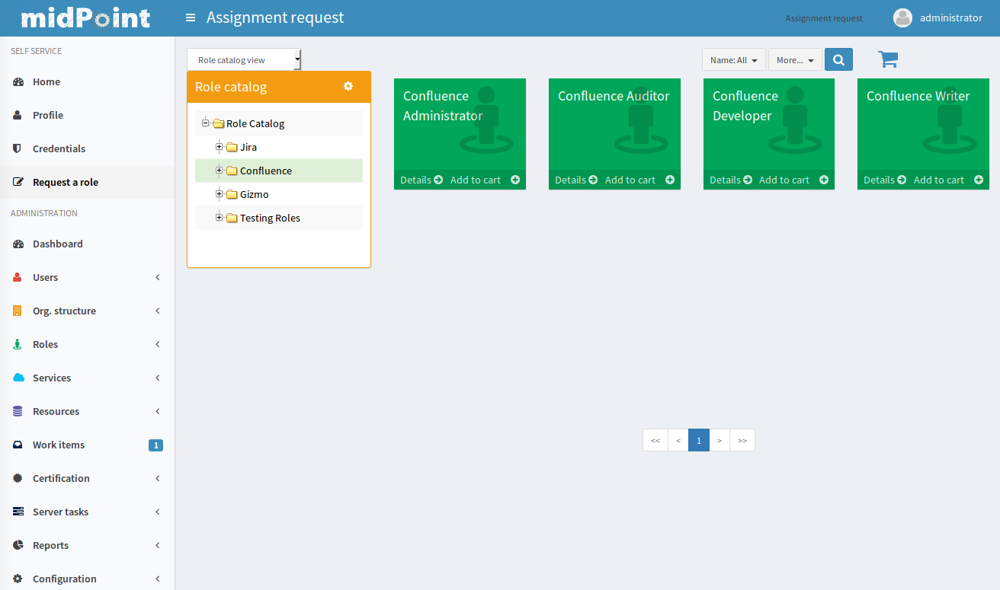

= What is Identity Governance?
:page-moved-from: /iam/identity-governance/
:page-display-order: 900
:page-wiki-name: Identity Governance
:page-wiki-id: 24085350
:page-wiki-metadata-create-user: semancik
:page-wiki-metadata-create-date: 2017-02-28T17:38:48.782+01:00
:page-wiki-metadata-modify-user: semancik
:page-wiki-metadata-modify-date: 2020-02-14T19:57:34.408+01:00
:page-toc: float-right
:page-upkeep-status: orange
:page-upkeep-note: Merge to IGA capabilities?

== Introduction

Management of identities is quite a challenging endeavour.
There are many technological aspects such as synchronization, connectors, attribute mapping and so on.
This technological part of the problem is what is usually called _Identity Management (IDM)_.
But the management of identities is not just about the technology.
There are business processes, rules and policies as well.
We might want to give some privileges to a new employee automatically, but we may want to assign other privileges in an _ad-hoc_ manner.
But we do not want to give any privilege to any user.
So we may want to set up an approval process to keep things under control.
And we want to keep track of the assignments and approvals so we can hold people accountable and make them responsible for their decisions.
We may want to set up re-certification campaign when the managers decide if people still need the privileges that they have.
We may need to evaluate how much is our system compliant with a new policy or regulation that is about to take effect.
We may want to prohibit that people who make decisions are the same people responsible for auditing and checking the decisions.
They are much closer to business than they are to the technology.
And this part of the solution is what we call _identity governance_.

Any complete solution for management of identities has two major parts:

[cols="h,1,1,1,1"]
|===
|   | Abstraction level | Major concerns | Value proposition | Primary users

| Identity Management
| Low

Close to the technology (IT)
| Data synchronization, system integration, data formats, data transformation, network protocols
| Speeding up IT processes, automation, reduction of IT cost, call center efficiency
| IT administrators

| Identity Governance
| High

Close to the business.
| Business processes, business rules, policies, organizational structures
| Regulatory compliance, information security, efficient organizational management
| Managers, security officers, auditors
|===

Identity management and identity governance seem to be very different at the first sight.
And indeed there is a lot of differences.
But both parts of the solution must very closely cooperate.
Even though it may not be obvious, there is a huge overlap between these two parts.
They are both based on the same concepts of what is an identity, what is a privilege, a role and so on.
In fact, there is no clear boundary between these two parts.
For example Role-Based Access Control (RBAC) is seen as an integral part of both identity management and identity governance.

We see identity governance as a natural extension of low-level identity management.
One cannot have a good life without the other.
Therefore, midPoint is designed and implemented to be both strong identity management system and identity governance system at the same time.
MidPoint is quite unique in this approach.
Most competing solutions have two different products for this: separate product for IDM and separate product for governance.
These products often originated in vastly different environments, they are using different technologies and they were put together only by a series of acquisitions.
Integration of these solutions is often very problematic - especially considering the huge overlap of IDM and governance concepts.
But this is not the case of midPoint.
MidPoint is a smooth product with a single all-encompasing architectural design that combines both IDM and governance features using a common data model.
This approach significantly simplifies the deployment.
But even more importantly: it is a huge difference for a long-term maintenance of the solution.

There are many terms that refer to identity governance and related concepts.
The terminology is not yet completely settled and therefore it may be quite confusing.
Many people refer to this field simply as _governance_. _Governance, Risk management and Compliance_ (GRC) is an older term that refer to the set of concepts and technologies described in this article.
Industry analysts tend to use the term _Identity Governance and Administration_ (IGA) to cover the functionality of both identity management and identity governance.
We have chosen to simply use the term _Identity Governance_. Whenever that term is used in this document it means the concepts and technologies of identity governance itself, identity-based risk management, compliance and all the related concepts that connect identity management with the organization and business structures that surround it.

== Role-Based Access Control

The role structures of Role-Based Access Control (RBAC) form one of the basic mechanisms on which the identity governance is built.
Strictly speaking it is hard to tell whether RBAC is part of identity management or identity governance because it is heavily used by both parts.
For the governance part the roles are usually the primary object that represent privileges.
Therefore, majority of the governance mechanisms works with roles.
Roles are used to implement several fundamental information security principles such as principle of least privilege and segregation of duties (see below).

From the governance perspective the midPoint RBAC mechanism provides a lot of useful features.
Of course midPoint roles may form hierarchies.
The hierarchy may have unlimited number of levels.
There may be application roles, several levels of business roles and so on.
MidPoint also supports parametric roles and meta-roles that are used to form smarter, expression-based role structures.
These roles are using expressions to dynamically compute the privileges based on the parameters.
Therefore one parametric role can provide the same functionality as many traditional roles.
Such smarter RBAC structure is much easier to manage and maintain.

== Organizational Structure

Organizational structure is another concept that is heavily shared between identity management and identity governance mechanisms.
Organization structure is essential for delegated administration.
In that case the organizational structure is used to delegate part of the identity management duties to administrators distributed through the organization.
But organizational structure is much more powerful than that.
MidPoint has a native functionality to designate managers of organizational units.
This can be used to define managers of functional organizational units (divisions, sections, ...), project managers and so on.
The managers can take place in business processes, e.g. approving role requests from the members of their organizational units.

MidPoint can synchronize the organizational structure from its source in the HR system or any other source.
However, too often there is no coherent source of organizational structure data.
Therefore midPoint itself can be an authoritative source of organizational structure.
Organizational structure can be maintained directly in midPoint and then synchronized to the target systems.
MidPoint has user interface that can be used to manually maintain the organizational structure.
However, the current user interface is targeted at the IT staff.
The improvement of the user interface that would allow easy use of non-technical staff (e.g. HR staff) is planed for the future.

MidPoint 3.5 has some features that support management of the organizational structure on a business level.
For example there are rules that specify how many managers the organizational unit must have.
Therefore midPoint can take action if there is not enough or too much managers for a specific organizational unit.
The functionality is currently (midPoint 3.5, 3.6) quite limited.
But improvement of that functionality is planned very soon (midPoint 3.7).
In the future it will be possible to start a new business process to specify a new manager for an organizational unit that has no manager, or to resolve a conflict if more than one manager is specified.

== Role Catalog

Role is one of the fundamental concepts of both identity management and identity governance.
Roles are used to create complex hierarchies that model the distribution of privileges in the organization.
But it means that every organization usually have quite a big number of roles.
When using traditional RBAC approach it is no surprise if the number of roles is higher than the number of identities.
MidPoint parameteric RBAC mechanism can be used to significantly reduce the number of roles.
But even in a mid-size organization there still be hundreds of roles to choose from.
It is difficult to navigate the roles without sorting them to groups, applications or categories.

MidPoint has a mechanism to create role catalogs.
The roles can be sorted to any kind of hierarchical structure for the purpose of presenting them to users.
This role catalog hierarchy is independent from the RBAC role hierarchy, therefore roles can be presented in any way that makes sense for the users.

image:role-catalog.png[]

The midPoint role catalog is actually implemented as organizational structure.
Therefore it has all the advantages and smart features that any other organizational structure may have.
E.g. the role catalog may be organized according to applications.
In that case the administration of each part of the role catalog can be automatically delegated to the application owner.
Each application owner will be able to add new roles, modify and delete roles, but only in the application that he owns.
MidPoint fine-grained authorization mechanism can be easily used to implement this scheme.

== Role Request and Approval Processes

The idealistic state for almost any identity solution is perhaps full automation.
Assignment of all roles automatically based on organization structure or job roles is a very common dream.
But in practice it is too often no more than a dream.
MidPoint is perfectly capable of fulfilling that dream.
However problem is with the input data and the policies - or rather in the absence of these.
In a practical case it is perfectly possible to automatically assign some portion of the roles.
E.g. in the case of a mid-size bank it is usually feasible to automatically assign roles for bank teller, supervisor and branch director.
However it is a completely different story when it comes to the "central" back employees such as back office, brokers and so on.
Many work responsibilities are usually cumulated to a single person, there are work positions with very dynamic responsibilities and all in all it is almost impossible to figure out algorithmic policies how to assign the roles automatically.

Therefore almost all of the organizations use the request-approval process for assignment of the roles.
The employee that needs the role can use midPoint user interface to request the role.
That will launch an approval process.
When the request is approved the role is assigned and the privileges are automatically provisioned.

The fist step in this process is role request.
The user is supposed to select the roles that she or he wants to request.
However it may not be easy to select the roles from hunderds of other roles.
MidPoint is using a proven _shopping cart_ paradigm to make that task easy.
The user is presented with an interface that looks like electronic shop.
The roles are presented in a way which is very alike to products in an e-shop.
The roles are sorted to categories based on the role catalog.
The user can browse the "shop" and put the roles in the shopping cart.
When the user is done then the request may be sent.

When the request is submitted then approval process starts.
It is usually the direct manager of the employee who is the first to approve the request.
Then the request is routed to application owner or security officer to additional approval.

MidPoint is very flexible and various multi-level approval schemes can be configured.
The approval scheme definition may be completely policy based (midPoint 3.6).
That means that the approval schemes may be configured by a set of global rules, rules in meta-roles, the approves may be defined statically (e.g. user Adam Andersen), based on organizational structure (e.g. any member of Security Office department) or dynamically (e.g. manager of the requesting user, owner of the application where role belongs to, etc.)

MidPoint 3.6 introduced an easy declarative method to specify escalation schemes.
Automatic escalation takes place when an approver does not decide in a specified amount of time.
MidPoint allow specification how the particular approval case on each particular step in the approval schema has to be escalated.
E.g. the first approval step may be escalated to the next level up the functional organizational structure.
Second approval step may be escalated to the senior security staff and so on.

There are cases when it is not enough for an approver to simply make a allow/deny decision.
In some cases approver must supply additional data.
Of course, there is a place where both the requestor and the approver may provide free-form comments, so they provide rationale or additional details about the request.
But sometimes there is a need to fill in missing structured data.
These are often user properties that are not available in the source system (HR) and they must be entered manually.
It is usually not feasible to enter the data for all the users at the time when the source data are first synchronized to midPoint.
This is simply too much work and it will cause unacceptable delays for the initial deployment.
The data need to be supplied on the fly - on "as needed" basis.
Therefore midPoint 3.6 introduced a new feature that allows approvers to specify the missing data during approval process.
A small form can be defined for each approval step.
The form can contain the crucial user data for the approver to review - or to fill in the data if they are missing.
This form may be specified only for the roles that really need that data.
Therefore the approval process may be used in a very natural way to gradually improve and maintain the identity data in midPoint deployment.

== Audit Data and Assignment Metadata

There is one principle of a good management: people that decide must be responsible for their decisions.
But for that to work the decisions must be _accountable_ in the first place.
This means that it must be obvious who has decided, what has decided and what the decision was.
MidPoint has several mechanisms for this.

Audit trail is the most powerful mechanism for accountability in midPoint.
Every external change in midPoint environment is recorded in the audit log.
There is no exception.
All changes caused by user actions are recorded: role assignments, unassignments, changes in role definitions, policy changes and even configuration changes ... everything.
Also the changes caused by automatic synchronization rules are recorded.
The audit trail records the time of the change, where it came from (user operation, automatic synchronization or API operation), who has made the change, what was changed and so on.
Also the approval actions are recorded in the audit log.
No important piece of information can escape.
MidPoint has built-in capabilities for inspecting the audit log and reconstructing object history based on the changes stored in the audit log.
This is some kind of a time machine that can be used to find out how object looked like in the past, e.g. what roles particular user had two months ago.
However, this capability is limited by the amount of audit data that is stored in midPoint database.
However, midPoint is identity management and governance system and not data warehouse.
It is not built for a long-term storage of vast amount of historical data.
It is rather designed to integrate with other specialized data-processing systems.
The audit trail is recorded in a well-structured and documented database table.
This table is part of midPoint public interface.
It may be used as a source of data for other systems: SIEM, data warehouse, reporting and analytic engines.

Audit trail is a very powerful mechanism.
But the audit data are strictly chronological.
It may not be entirely easy to get the information on who requested and approved this particular role assignment - especially if that happened several years ago and the audit trail has been moved to the data warehouse in the meantime.
Therefore in addition to the audit trail midPoint also maintains _assignment metadata_. The metadata includes the identifier of requestor and approver for each specific assignment as well as timestamps, owner of the process that actually executed the change and other additional data.
The metadata are maintained together with the assignment, therefore they are easily available for inspection.
Although the audit log data are the authoritative source of information, the metadata are a very convenient way how to get the information quickly and in a very convenient way.

== Deputy

There is often a need to temporarily delegate part of privileges of one user to another user.
This is often the case when a user leaves for a vacation or longer business travel and the user will not bee able to fully attend to his responsibilities.
This type of delegation is very difficult to address algorithmically because it usually happens on ad-hoc basis.
Therefore midPoint 3.5 has a special feature that enables this kind of temporary ad-hoc delegation: the user can make a temporary delegation of a subset of his privileges to his _deputy_. There is a special control for delegating deputies in midPoint user interface.

The deputy "inherits" part of the privileges for a temporary time period.
If these privileges defined new accounts or new entitlements for the user, these accounts will be created for the deputy and/or entitlements will be assigned.
The deputy will gain access to the parts of the midPoint administration interface that correspond to the delegated privileges.
The deputy will have access to the work items (approvals) of the delegating user, so he can tend to his responsibilities.
When the time set for the delegation expires then all those privileges will be automatically revoked.
The accounts that were created just because of the delegation will be disabled or deleted and the extra entitlements will be revoked.
The situation will automatically revert to the normal state.

The ability to delegate to deputies is controlled by midPoint fine-graned authorization mechanism. Therefore not all users can delegate any privileges to any deputy.
This ability can be strictly limited to only subset of users, subset of deputies and only to some selected roles.

== Personas and Identity Links

_Persona_ is a term that is often used for different facets of a physical person.
One physical person may have several _personas_ for use in different environments or for different responsibilities.
E.g. a user may have the usual "employee" persona which is represented by his employee HR record, ordinary account in Active Directory and so on.
These are accounts used to read company e-mail, do paperwork and so on.
Then he may have "administrator" persona and a special Active Directory account with elevated privileges.
Special accounts like this are very desirable especially in frequently used and less secure environments such as Windows.
Having a special account to carry out privileged tasks reduces risk of human errors, malware attacks and other threats.
Then the user may have another "testing" persona that is represented by testing accounts or access to the testing environments.
And so on.

Most midPoint deployment are perfectly happy with the simple user-account model that midPoint provides by default.
In this model each physical user in organization has exactly one midPoint user as his or her representation.
This is perfectly satisfactory for majority of deployments, even if the concept of personas is partially implemented.
MidPoint has a mechanism that allows to define account _intent_.
Therefore it is perfectly feasible for one user to have employee accounts, administration accounts and testing accounts.

However, there are cases when the intent mechanism falls short.
In midPoint default model all the accounts are _linked_ to one user.
Therefore if the user password is changed, the change will be propagated to all accounts.
Even if partial propagation is used, it is not easy to setup up different passwords and password policies for all administration accounts or testing accounts.
In the default model there is nothing that groups all the administration accounts together.
Therefore in some cases a more complex, multi-layered approach is needed.
And that approach is enabled by identity links.

Identity link is a mechanism that was introduced in midPoint 3.6. The identity link allows to link two midPoint users.
The identity link is a generic mechanism, but it is often used to implement the persona-based model.
In that case one side of the identity link is a user that represents physical person.
The other side of the link is a user that represents specific persona (employee, administration, testing, ...). These "persona" users are the users that are used for all practical operations.
These are the users that are used for logging-in to midPoint, resetting passwords, requesting roles and so on.
In this case accounts are linked to the persona users, not to the user that represents the physical person.
In that way the accounts are neatly separated - all employee accounts linked to employee persona, administration accounts linked to administration persona and so on.
Therefore setting different passwords and setting up different password policies is easy.
The user object that represents physical person is never used directly.
Its purpose is twofold.
Firstly, it is used as a data bridge for all the persona users.
When an HR account is updated then it is the physical user object that is updated.
Then the update is propagated to the persona users.
Secondly, the physical user and the identity links are traces about the object ownership and responsibility.
Every action in midPoint needs to be traceable to a physical person that is responsible for it.
And that is the primary purpose of the identity links.

== Access Certification

The request-approval process is very efficient mechanism how to add roles to the users.
A user that needs to access a particular system will ask for the role and drive the process.
However, this may lead to dangerous cumulation of roles as there is a very little motivation to give up a role that in no longer needed.
Therefore a very different approach is needed to revoke the surplus roles.
The process which is almost always used for this purpose is called access certification, re-certification or attestation.

Access certification process works in campaigns.
The campaign distributes the work accordingly to configured criteria.
The most scenario is to distribute the work to managers.
Each manager will get list of employees that they are responsible for.
The list will contain the roles that the employees have requested.
The employee must _certify_ that the employee still needs the role.
If the the role is not certified, it may be automatically unassigned.

See also link:https://evolveum.com/blog/access-certification-in-midpoint/[this blog post].

Certification mechanism is tuned especially to the case when a lot of decisions need to be done in a limited amount of time.
Everything is adapted to that purpose: certification is executed in campaign, the certifiers are presented with many cases at once, the user interface is designed in such a way that decisions can be made with a single click and so on.
As certification campaigns are usually executed at regular intervals and they need to process a lot of data everything is designed for the purpose of making this process as efficient as possible.

Despite the design of the certification mechanism there is still an eventuality that someone doest not make decision in time.
The campaigns are designed to be time-limited, they can have several stages and the campaign may be closed even if all the decisions are not in.
However there are cases when the policy requires that the decisions are made.
Therefore midPoint 3.6 introduced escalation mechanism even for the certification cases.
The cases that have not been decided in time may be escalated using the escalation scheme.

The certification is usually executed in campaigns.
But there are few exceptions when a limited certification decisions are needed.
One of the common cases is when a user is reassigned to a new organizational unit and gets a new manager.
The new manager is now responsible for the role assignments that the user has.
Some of the role assignments that the user had in his old organizational unit may still be needed, but other role assignments may not be needed any more and these should be removed.
Therefore midPoint 3.6 brough an ability to execute such limited certification in some cases - if it is configured.
For example if the user moves a to new organizational unit, midPoint will make the move and leaves all the requested and approved roles without change.
But immediately after that a certification of that specific user is started with his new manager.
The manager will decide which roles to keep and which to remove.
When the certification is closed then the user roles are automatically adjusted.

== Policy Rules

Policy Rules are the basic mechanism to implement many governance and compliance features in midPoint.
Policy rules are used for variety of purposes.
E.g. policy rules are used to check for the correct number of managers in organizations units.
Policy rules can be used to influence role approval.
Policy rules enforce role exclusivity (segregation of duties).
Policy rules define the baseline that is used by the compliance features.
All in all, policy rules are the "language" used to express identity governance policies in midPoint.

Policy rules are very flexible and they can be specified in several different ways.
There may be global policy rules that apply to all objects or subset of object selected by filter.
The policy rules may also be specified directly in roles or indirectly in meta-roles.
These mechanisms can be used to create very complex policies.
MidPoint will evaluate all the rules that apply to every object regardless how they are defined.
Therefore midPoint makes sure that all the rules are applied consistently.

Policy rules were introduced in midPoint 3.5 and their first use was to implement policy-based approvals.
The policy rules are used to specify the methods how specific roles should be approved.
Prior to midPoint 3.5 the approvers and approval schemes have to be defined in each role that was subject to approval.
Since midPoint 3.5 there may be a global (or meta-role-based) policy that specifies the approval schemes.
The functionality of policy rules is significantly enhanced in midPoint 3.6 and it is expected that further enhancements will come in midPoint 3.7.

== Segregation of Duties

Segregation of duties (SoD) is method of separating privileges to avoid dangerous privilege combinations.
For example employees that have the right to purchase material must not have the responsibility to also check those purchases.
Otherwise fraud or error may occur.
Usually the executive responsibilities and the controlling responsibilities need to be strictly separated.

The primary midPoint mechanism to implement SoD is role exclusivity.
Simply speaking each role may specify a list of role exclusion.
The roles that are in exclusion cannot be assigned to the same user at the same time.
MidPoint had this mechanism almost since its beginning.
However this mechanism was significantly improved in midPoint 3.5 and 3.6. The mechanism was aligned with policy rules in midPoint 3.5. So now we have a unified mechanism to specify all the governance and compliance policies.
Role exclusion capabilities were significantly extended in midPoint 3.6. Prior to midPoint 3.6 the only option was to _enforce_ the role exclusion: roles that were exclusive simply cannot be assigned at the same time and any attempt to do so resulted in an error.
While this is correct in theory it poses a significant obstacle in practice.
In practice there are usually several degrees of role exclusivity.
The exclusivity of very sensitive roles must be strictly enforced.
But there are also less sensitive roles that, in ideal case, should also be segregated.
But there are situations when this rule need to be relaxed.
There may be shortage of available employees and the exclusion may need to be suspended for a temporary period of time.
Or there may be situation when the exclusion simply does not make practical sense in some very specific situations.
Therefore midPoint 3.6 allows to drive role exclusion violations through additional approval.
If there is an attempt to assign those less-sensitive exclusive roles to one user then an additional approver can decide whether to allow or deny this operation.
If the approver allows the operation then an exception from the rule with be recorded in the role assignment.
Therefore midPoint knows that it should not bring up this specific case to attention during subsequent reconciliation tasks and recertification campaign.
As midPoint stores the meta-data for every assignment then it is also quite obvious when this exception was created, who requested it and who approved it.

The elementary role exclusion in midPoint allows to exclude roles by enumerating the roles which exclude each other.
However there may be more complex exclusion schemes in practice: a class of roles that exclude each other so only one of them can be assigned at a time, two classes of roles (executive, controlling) where user can have only roles from one class.
Such schemes can be implemented in midPoint by combing the role exclusion mechanism with a very powerful meta-role mechanism.

Enforcing SoD at the time when the roles are assigned is very useful.
But it is not enough to support efficient long-term maintenance the SoD policies.
All policies eventually change and the SoD policies are no exception.
SoD policies are usually modified with the goal to make them stricter, more restrictive.
But in that case some role combinations that were legal under the old policy are no longer legal under a new policy.
We cannot simply unassign the conflicting roles when the policy is changed.
Firstly, midpoint does not know which "side" of the conflict to unassign - and we definitely do not want to unassign all of them.
Secondly, such a move may have impact on business.
And midPoint philosophy is to always allow _business first_ approach: midPoint must allow configuration that does not destroy the _status quo_. Therefore in even if SoD policy becomes stricter the SoD violations are left unchanged to avoid any damage to the business.
But we do not want to keep it that way.
We need a way how to eventually resolve the conflicts.
And midPoint 3.6 has a mechanism for this: SoD certification.
Special certification campaign is started and the designated certifiers must decide what to do with the violations one by one.
This is an efficient method how to resolve the existing violations and at the same time minimize impact on business.

Role exclusion can be used to do one more trick.
There are often situations where there is a class of roles, but only one of these roles makes sense at any given time.
For example roles that define user quotas on filesystem.
Roles that define financial transaction limits.
Roles that specify basic customer program from which other variations are derived.
And so on.
These are sometimes referred to as "1 of N" schemes.
Role exclusivity can be used to implement such schemes.
These roles will be made mutually exclusive.
But instead or using enforcement or approval a special _prune_ action is used.
In case that a new role is assigned with is in conflict with existing role, the _prune_ action will trigger automatic unassignment of the old role (available in midPoint 3.6 or later).

== Role Lifecycle

Roles are one of the basic building stones of information security policy.
As all policies even security policies tend to change in time.
Therefore even roles are far from being constant.
New roles are defined all the time, old roles get deprecated and replaced by new ones.
The roles have a lifecycle: they are drafted, proposed, activated into the service, deprecated and finally taken out of service and archived.

MidPoint 3.5 introduced the concept of object lifecycle that can be applied to all the midPoint objects: users, roles, organizations, services and other objects.
However the most important application is role lifecycle. There several pre-defined lifecycle states and additional custom states may be used.
MidPoint 3.5 also introduced ability to drive role changes through an approval process.
These two features in combination can be used to implement controlled role lifecycle process: definition and proposal of new roles, replacement and deprecation of existing roles and so on.

The object lifecycle support in midPoint 3.5 is practically usable, but it is not yet perfect.
Improvements to the lifecycle mechanisms are planned in future midPoint versions based on the interest of midPoint subscribers.

== Remediation

_Remediation_ in midPoint terminology means a semi-formal action that remediates policy violation.
This is an action that fixes the policy violation and makes the situation fully compliant with the policy This is an action or decision that needs to be done by a physical person.
Remediation may be a selection of a new manager in case that the old manager left the company and now there is an organizational unit without a manager.
Remediation may lead to a change of role definition in case that the new role definition has unacceptable impact on business.
Remediation actions are "do something else" actions, those non-automatic non-algorithmic decisions that must be made by an intelligent human being.
In cases that midPoint can fix policy violation automatically we do not even call that remediation.
That case is just too easy.
It is normal midPoint behavior.
Business as usual.
The term _remediation_ is reserved to those things that midPoint cannot do automatically.

MidPoint 3.6 and earlier has a lot of mechanisms that can automatically handle policy violations.
There are also mechanisms that rely on human input to fix policy violations, such as approvals or certification.
But all of these mechanism have pre-defined options that the user can choose from.
There is no "do something else" option yet.
This kind of flexible remediation mechanism is tentatively planned for midPoint 3.7.

== Compliance

No organization exists in a vacuum.
There are always laws, regulations, external or internal policies and many of these affect the way how identities are managed.
What is even more important that that is that the policies are changing all the time.
It is not that difficult to set up a new system to manage identities on a green field.
But it may be very difficult to apply a new policy to an existing system.
Especially if there are many thousands of users that have thousands of roles assigned.
The users are doing their day-to-day jobs and almost every task that they do depends on the privileges controlled by the identity management solution.
This is a living breathing organism.
When a new policy is considered it cannot be simply applied to this living thing to see what happens.
New policy may put existing business processes in danger.
Maybe the policy cannot be practically applied in one step because the impact would be too severe.
Maybe we need a transition period and we need to implement the policy in several consecutive steps.
Maybe we need to find the policy violations and manually remedy them even before the policy is in full effect.
However, this is all very difficult to estimate just be looking at the policy.
Many effects of the policies are very subtle and they are extremely difficult to estimate.
And it is almost impossible to find all policy violations without any support from the IDM system.
And these are the reasons for the _compliance_ features.

The primary purpose of the compliance features is to track how well your system complies with a specific policy.
The policy is translated to the objects that midPoint can understand: policy rules, roles and so on.
However this policy is not fully enforced yet.
The first step is to use these rules to analyse the impact of the new policy on the system.
MidPoint can find policy violations and report them.
We can evaluate how many policy violations are there.
We could break down the policy to several steps and evaluate the impact of each individual step.
We can adjust the policy to make it more practical.
We can find the policy violations and remedy them even before the policy is fully enforced.
Compliance features assist in keeping track of the overall process of new policy adoption.
There may be compliance dashboards that show the number of policy violations and their progress over time.

Implementation of compliance features in midPoint is heavily based on the concept of policy rules. Policy rules are the most important part of the language used to specify the constraints given by laws, regulations and other policies.
Policy rules are available in midPoint 3.5 and they are heavily extended in midPoint 3.6. But even midPoint 3.6 still assumes that the policy rules define a policy that need to be enforced.
There is only a very basic compliance functionality in midPoint 3.6. Significant extension of compliance functionality is tentatively planned for midPoint 3.7 and later versions.

== Role Mining

Almost no identity management solution is deployed on a green field.
Even if midPoint is the first automated IDM solution that is deployed in an organization there always been some way how to manage identities before that.
It was often a paper-based process or a completely ad-hoc set of activities, but there always was something.
Therefore there is a lot of data that was produced by those activities.
Some data are easy to import to midPoint (such as HR data).
MidPoint has excellent tools to correlate accounts and make account attributes consistent.
These feature will dramatically improve the identity management process.
This is absolute requirement for any organization that needs to scale up and maintain information security at the same time.

MidPoint will use the existing data to bootstrap a next generation identity management solution.
However, there are also few buried treasures in these data: the privileges that are already assigned to accounts.
The privileges were not assigned in a an arbitrary fashion.
There was a reason for the assignment and that reason was that the user needed the privilege to do his job.
This is a very valuable information if used correctly.
We could correlate this information with the user data in midPoint and possibly also with other resources.
Result of that correlation may be suggestions how to create new roles.
The users that have similar set of existing entitlements are good candidates to be members new roles.
This method is called _role mining_.

MidPoint has information about all the users, accounts, roles and entitlements and they are presented in a way that can allow efficient role mining in the future.
MidPoint currently does not have role mining features.
But the basic infrastructure is prepared for that.
Role mining may be implemented in a near future either as native midPoint functionality or as an extension.
The implementation plan for role mining depends on midPoint subscribers and partners.

== Risk Management

Risk management is the bread and butter of information security.
Every information security professional knows the drill: assessment, planning, execution, reaction, ... It is perhaps the assessment step that is most demanding.
Howe can security officer assess risk of a system with tens of applications, hundreds of business roles and thousands of users? This means evaluating tens of thousands of accounts, thousands of groups and roles and other entitlements.
This means checking for orphaned accounts, checking for access to sensitive data, checking for accumulation of privileges, checking for dangerous combination of privileges and so on.
It is a super-human task to do that manually.
Even in mid-size organization it is clearly infeasible.
Therefore the common practice is to estimate the risk instead of analyzing it.
But how good is that estimate? And how good is the whole risk management process if its primary input - the risk assessment - is not reliable?

Yet, there is much better way.
Identity management system already has most of the data that are needed for this part of risk assessment.
IDM system know all the accounts, knows the owners, knows whether the accounts and the entitlements are justified by the roles.
And this can be further improved.
By assigning risk level to the roles we can easily assess risk posed by each individual user.
This can be used to find high-risk user with dangerous accumulation of privileges.
This approach can also be used to assess overall risk level for each application.
The governance mechanisms such as policy rules could be used to detect dangerous combinations of privileges.
Maybe there are conflicting role assigned to one user, but the SoD policy was overridden by an explicit approval.
While this may be compliant with the policy it is still a security risk and it should be accounted for in the risk assessment.
MidPoint can easily gather all such data because it maintains the data already.
All that is needed is to feed the data to a good risk assessment model.

Currently midPoint maintains all the data that could be used in the risk assessment model.
MidPoint allows to define policy rules and specify risk levels for the roles.
MidPoint is designed to function as an efficient tool so support semi-automatic risk assessment.
However the risk assessment model itself is not implemented yet.
It may be implemented in a near future.
But the specific implementation plan depends on midPoint sponsors, subscribers and partners.

== Information Security

Identity management is one of the foundation stones for information security.
There are critical information that any information security professional needs: who is responsible for a specific account, which accounts do not have owner, which system can this specific user access and so on.
There is only one feasible and scalable way how to answer these questions: identity management.
There is really no security without identity management and we have been telling that for years.
The identity management provides the very essential data for information security.
Good identity management is necessary condition for good information security.
There is no doubt about that.
But it is identity governance that makes the job of security officer efficient.
It is almost impossible to make any non-trivial system secure without identity management.
But it is the identity governance that allows to build and maintain really complex systems.
While identity management is a _necessary condition_, identity governance is an _enabler_ of growth and efficient long-term maintenance.

Role-Based Access Control (RBAC) is still the golden standard of enterprise information security.
And there are very good reasons for that.
There are younger models such as Attribute-Based Access Control (ABAC) that are in theory more flexible.
And they really are better in some cases.
But the very innovation that these models claim is also the primary problem of these models: there is no concept of role.
Without role it is quite difficult to find out the privileges that specific user has.
Without role there is nothing that the use may request.
It is difficult to evaluate the impact of changes on the system.
It is very difficult to evaluate compliance with policies.
And so on.
However, the flexible models such as ABAC has their merits.
That is also the reason why midPoint extends the traditional RBAC model with a lot of expressions.
The result is what we call _Advanced Hybrid RBAC_ model that incorporates the ides of ABAC into the RBAC model.
But our model is still based on roles as the primary "atom" of identity management and governance.

Information security professionals in a typical mid-size enterprise have to deal with hundreds or even thousands of roles.
It is very difficult to keep track of all these roles.
Many security officers keep track of the roles in spreadsheets or customized applications.
This is very difficult to maintain as based on manual work.
As this approach is inherently disconnected from the information systems it is very difficult to make sure that it reflects the reality.
Regular audits and manual reviews and synchronizations are required.
This makes the approach non-scalable.
It is very difficult to scale this approach beyond few hundreds roles without a loss in fidelity.
Few thousands of roles is the top limit even if fidelity is sacrificed and some inaccuracies are tolerated.
This is one of the limiting factors for the growth of the organization.

Of course, there is a solution: identity management and governance.
First part of the solution is to keep the roles firmly connected to the reality.
This is exactly what and identity management system does.
It maintains a "closed loop" of role design, privilege provisioning and auditing (reconciliation).
There is automatic bi-directional feedback: role changes are reflected in real systems and changes in real systems are detected and reported.
But that is only a part of the solution.
The second part is to make role management more efficient.
The very minimum is the ability to sort the roles into a role catalog.
MidPoint allows sorting the roles based on many independent criteria.
The roles can be sorted by application, by business area, by domain of influence and so on.
The role catalog can also be used to delegate partial control over role maintenance to application owners or business divisions.
The role catalog and other role management tools that midPoint provides are absolutely essential to enable scalable role maintenance which in turn enables efficient growth of the organization.

MidPoint is most efficient if the applications are connected using automated connectors.
In that case midPoint can automatically maintain the consistency of the policy with the reality.
But midPoint's ability to support role management is essential even in case that not all applications are connected to midPoint automatically.
MidPoint has an ability for non-automatic connection of resources from the beginning.
But in midPoint 3.6 this ability is significantly improved.
The _manual connectors_ are a convenient way how to connect system that do not have any automatic connector.
These may be a systems that are too small to justify the cost of building an automated connector.
Or these may be systems for which an automatic connector is planned in later phases of the project.

Whether automatic or manual connectors are used, it is always a benefit to design and maintain the roles in midPoint.
New regulation is introduced all the time and new policies need to be enforced.
Such as the General Data Protection Regulation that will come in force in mid-2018.
Is your organization prepared for GDPR? Is your role structure compliant? Are your policies compliant? What will it take to make them compliant? How many users are in currently in a violation of the new policy? How much work it is going to be to resolve these violations? It is almost impossible to get this information from a paper-based policies.
But midPoint governance and compliance features can be used to answer these questions easily.

== Manual Connectors and ITSM Integration

Typical enterprise needs to maintain many heterogeneous systems.
Even a mid-size enterprise typically maintains tens or hundreds of systems coming from wide range of vendors built on even wider range of technologies.
It is strongly preferred to connect all these systems to the IDM solution by using automated connectors.
This reduces the operational costs, speeds up the operations and it makes the governance mechanisms more reliable.
But this is not always an option.
There are small or deprecated systems that simply do not justify the cost of building an automated connector.
There may be systems for which an automated connector is desirable, but it is planned for later phases of the project.
There may be many reasons why all the systems cannot be connected directly to IDM.
And that is the reason for the _manual connector_ feature of midPoint 3.6.

_Manual connector_ is special type of resource connection.
In that case midPoint will not use automated connector to connect to the target system.
MidPoint will just remember how the account is supposed to look like, it will remember the pending operations.
MidPoint will notify the administrators to manually create, update and delete accounts.

Most organizations already have IT Service Management (ITSM) system that is used to allocate work to system administrators.
It is more than desirable for midPoint to be able to submit and manage tickets (issues) in the ITSM system, so the system administrators will have just one tool to work with.
This kind of integration is available in midPoint 3.6. However, integration with each individual ITSM system will require its own "plugin" (driver) in midPoint.
There is a plan for some plugins to be contributed by Evolveum partners for midPoint 3.6 and 3.7.

The manual connectors also have special uni-directional mode of operation.
This mode is used for systems where midPoint cannot write, but where we have read access or regular data exports.
In this mode midPoint will still issue tickets to create, modify and delete accounts.
But it will also check the state of the accounts retrieved directly from the target system or read from the export file.
This approach provides better visibility and security as it works with the real data from the target system.
But the integration is still easy, because what it usually takes is just regular text file export of the data.

== See Also

* xref:/iam/iga/[]

* xref:/iam/enterprise-iam//[Enterprise Identity and Access Management]

* xref:/midpoint/reference/roles-policies/roles/rbac/[Advanced Hybrid RBAC]

* xref:/midpoint/reference/roles-policies/policies/policy-rules/[Policy Rules]

* xref:/midpoint/reference/roles-policies/policies/segregation-of-duties/[Segregation of Duties]
