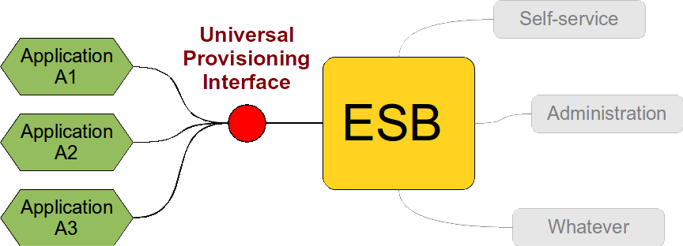
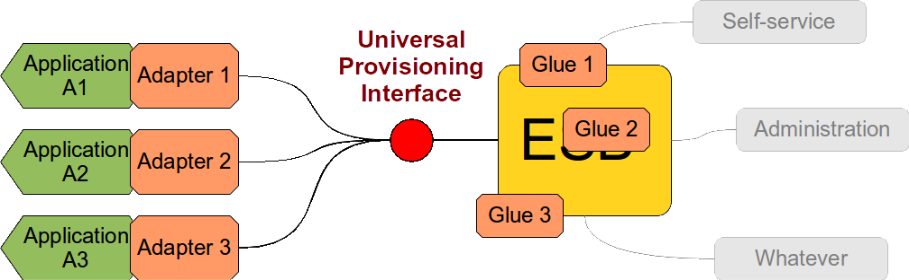
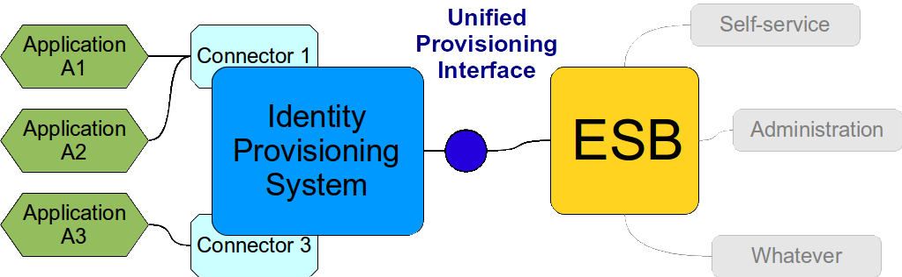

= Universal Provisioning Interface
:page-description: It is very tempting to design an universal provisioning interface, a standard way to provision accounts to any kind of system. However, it is much harder than it looks. Quite surprisingly, it is usually a very bad idea to even try.
:page-nav-title: Universal Provisioning Interface
:page-wiki-name: IDM over ESB
:page-wiki-id: 13991941
:page-wiki-metadata-create-user: semancik
:page-wiki-metadata-create-date: 2014-02-18T15:49:42.328+01:00
:page-wiki-metadata-modify-user: semancik
:page-wiki-metadata-modify-date: 2020-02-14T19:53:43.633+01:00
:page-moved-from: /iam/antipatterns/universal-provisioning-interface/
:upkeep-status: yellow

Identity management (IDM) is all about integration.
It's just about moving data and invoking services over the network, isn't it?
That exactly what integration tools are designed to do.
There are many systems designed for integration: Service buses, messaging systems, microservice coordinators and serverless integrators.
Enterprise Service Bus (ESB) was such kind of integration systems back when Service-Oriented Architecture (SOA) was fashionable.
We will use the example of ESB and SOA to demonstrate how to "improve" identity management using integration tools.
It makes perfect sense to use integration tools for IDM.
Or ... does it?

No.
Not really.

The basic idea of "IDM over ESB", "IDM over messaging" or even "Microservice IDM" goes like this:
Let's design a universal service for user management.
Every system that wants to connect to our _integrated solution_ has to implement that service.
Let's expose that service on ESB and let other components use it.
It should look like this:

This approach looks theoretically sound.
Single interface which is reused for many services.
It should work well.
Theoretically.
But it does not.
Why is that?

== Generic Interface

The "Universal Provisioning Interface" is the problem.
How to design such an interface? In fact it is very easy to design the operations.
These are mostly the basic four link:http://en.wikipedia.org/wiki/CRUD[CRUD operations]. But when it comes to operation parameters it gets really complicated.
For the sake of simplicity let's just focus on one operation: create.
What should be the parameters of this operation? Some identifier and some attributes.
And what attributes exactly? Every application needs different attributes.
So let's try to create some standard data model which will fit all the applications.
That's a great idea! It cannot be that difficult to do, can it? Well, it has been link:http://tools.ietf.org/html/rfc2798[tried a long time ago], once again link:http://www.foaf-project.org/[not so long ago] and there is also link:http://www.simplecloud.info/[one recent attempt]. While these experiments may have some substance and even some practical use they demonstrate one aspect very clearly: a practical system cannot be constructed by using _only_ the standard schema.
Practical solutions needs to extend the standard as there always a need for some unforeseen attributes `foo` and `bar` which are essential for the system to work.
And more curiously, application A1 needs attribute `foo`, application A2 needs attribute `bar` and application A3 also needs attribute named `bar` but it is a completely different attribute than the `bar` which application A2 needs.

But don't worry.
This is exactly what the integration tools (such as ESB) were designed to handle.
Isn't it? We can have nice XSLT or scripting to transform the requests and attributes which are parameters in services in all these systems ... but wait! .... what about our nice universal provisioning interface? It has the same operations but completely different parameters for each instance.
It seems like it's so universal that it is no longer an interface any more (does this ring a RESTafarian bell?). Therefore there is almost no benefit from reuse here.
Integration of any new system needs to be heavily XSLT-ed and scripted into the ESB fabric to the extent that nobody really knows what's going on...

So, let's go back to the drawing board.
Let's stick to the idea of an interface.
We have fixed operations and let's also fix the attributes.
At least formally.
Let's represent them as key-value pairs.
That should do it.
And it does - on the ESB level.
But that means we have lost unified interface on the other side of the system.
How does a self-service application knows the names of the attributes to use for application A1? And it all gets worse.
How does the application know attribute types? Oh yes, we can represent everything as strings.
That should do.
But how does the application knows that strings "2011-02-03 04:05:06+0000" and "2011-02-03 05:05:06+0100" represent the same value.
Or that identifiers "foo" and "Foo" should be considered equivalent? And it gets even worse still.
It turns out very soon that even the operations cannot be really fixed.
Application A1 expects that account identifier will be provided as parameter of create operation.
But application A2 generates identifiers and returns them from the create operation and they cannot be changed any more.
And identifiers in application A3 are also generated by the application but they change every time an account is renamed.

The whole idea of a simple universal provisioning interface is naive.
It ends up being either so trivial that it is useless or so complex that it is very expensive to implement.
It is very difficult to strike the right balance.
It also must have a very flexible definition with many dynamic parts, schemas that are only available at run-time and that even change in time.
SOA tools are *not* designed for this kind of dynamic and data-centric integration scenarios.
This is _Service_-Oriented Architecture and not _Data_-Oriented Architecture.
And it fails.
Miserably.

== Cost

Let's pretend for a while that we can design a practical and universal provisioning interface - however unlikely that is.
Even if have such an interface we still haven't got very far.
Interface is an abstraction.
It is just a definition.
No code.
It does not work by itself.
It has to be implemented.
Like this:

And it has to be implemented as many times as the number of applications.
Because implementation of the interface is a part of the application and therefore it is the responsibility of an application developer.
Application developers are chronically bad at cross-application reuse therefore it is very likely that the same code will be implemented over and over again in each application.
This is dramatically increasing the overall cost of the solution.
The applications also frequently use various platforms and operating systems practically prohibiting the code reuse even if the developers would like to do it.
The interface has no code therefore it is extremely difficult to test the implementations unless there is some kind of reference implementation of the interface.
This is increasing the cost of solution testing and integration bug fixing - which is the most expensive testing and bug fixing phase in the project and it is also the most frequent cause of delays and budget overruns.
This is also the time when the interface designers figure out that their definition was very vague and that the solution just cannot work as designed.
Therefore a "glue code" (read: dirty hacks) is being introduced in the system.
This creates a long-term maintenance nightmare.

Even though it may seem that the idea of an interface is reducing the cost the reality is often the contrary.
The interface is just splitting the cost to several pieces.
Each single piece is lower than the original cost.
But when they are all combined then the resulting cost is astronomical.

== But Does It Work At All?

It is very difficult to link:https://dracones.ideosystem.com/work/papers/2010-semancik-interface-definition.pdf[design a good interface]. And it is even more difficult to implement such an interface.
The "positive" side of the interface is often the easier part.
This defines what the interface does when everything works well.
But we are talking about integration, networking and distributed systems.
Hic sunt leones.
Things go terribly wrong on the network.
Things happen in parallel.
Operations fail or time-out.
Then they are re-tried, which is often hours later then the system state is already changed.
All of that needs to be reflected in the definition of good interface.
All the corner cases, race conditions, parallelism, error handling, ... and all of that needs to be implemented well.

There is one major pitfall here.
It is a crucial issue in any kind of distributed system.
Experienced software architects know this well.
But there are too many engineers that are ignoring it - and that results in severe damages during the lifetime of software system.
I'm talking about consistency, of course.
Data in the network cannot really be _moved_ or passed along.
They can only be _copied_. The more copies are there the higher is the risk that they will not be the same or that they stop to make sense when seen all together.
This is data inconsistency.
And it can happen very easily.
Let's assume we try to create an account in application A1 but the operation times out.
Can we assume that the operation failed and the account was not created? Or did the operation actually succeeded only the acknowledge message was lost on the network? Should we re-try the operation? If we do and the account was created then the re-try will fail.
If we don't and the account was not created then we have one missing account.
And this is actually xref:/iam/idm-consistency/[one of the simplest scenarios].

Consistency is a tricky thing.
It is extremely difficult to get it right.
The traditional way to deal with consistency is the use of transactions.
But these are impractical in SOA solutions as the transactions are usually introducing a tight coupling between systems.
Transactions over the network also tend to be quite fragile from the operational point of view.
They tend to slow things down, lock-out pieces of data, end up in states where a manual resolution is necessary and there is always a risk of deadlock.
Tight coupling and fragility is something that you definitely do *not* want in a Service-Oriented Architecture.
And there's the glitch: as consistency problem is inherently data-centric and SOA is inherently service-centric there is no easy solution for consistency in SOA.

And that's a bad news for SOA-based identity management.
The primary economic purpose of identity management is to cut down cost and effort.
But even a small risk of inconsistency is multiplied by the size of the data.
Therefore the consistency issues may not be so important if the scale is small (e.g. small enterprise).
But it gets much worse as the scale increases (e.g. cloud service).
Large-scale services cannot afford the risk of whole system grinding to halt because one transaction went wrong and locked-out important piece of data.
Cloud services cannot afford the cost of service desk calls because network failures cause inconsistencies that need to be manually resolved, and the system cannot heal itself it cannot efficiently scale.
And I would not bet my money on the success of non-scalable system in the Internet age.

== Solution

So, what's the solution? It is both simple and complex.

It is simple: use the right tool for the job.
A data-centric problem is best served with a data-centric solution.
Good IDM systems are designed to do that.
You also need much more than an interface.
An interface will not solve anything by itself because it is just an abstraction without any code.
You need an _implementation_ to do that job.
And once again a good identity provisioning system is such an implementation.
And this is where it becomes complex.
The identity provisioning system needs to deal with differences in application schemas.
It needs to process them in run-time, evaluate them, map the attributes, compare and transform the values and so on.
This means complexity: both complexity of the implementation and the configuration.
But a good identity provisioning system is hiding most of that complexity in its implementation.
Such a system is designed to be easily configured and managed - to efficiently handle configuration complexity.

When a provisioning system is deployed then the whole picture changes slightly:

* We do not have "universal" interface any more.
We rather have "unified" interface.
This is one interface with one implementation.
The interface provides a unified data model that is customized for this specific deployment.
Which is usually combination of some part of standard schema with couple of custom extensions.
But the extensions are practically fixed therefore the services on the ESB know exactly what is the data model and what to expect.

* The implementation of the interface is internally very complex.
It is the provisioning system itself.
It is also very flexible.
It maps the "standard" attributes used by the ESB services to specific attributes on the application side.
It hides the "implementation details" as each good interface should do.

* The provisioning system handles errors, data inconsistencies, reacts to changes on resources and overall makes a good guarantee of data consistency.
It is designed to do it.
It is data-centric by design.

* When a new system is connected to the solution its schema is mapped to existing "standard" schema.
As well as it is possible.
But this happens inside the provisioning system and it is hidden from other SOA services.
If there are any extra attributes that are needed but cannot be mapped to existing schema then the standard schema can be extended - in a backward-compatible way.
Therefore the rest of the system is not impacted and integration of new systems is easy.

* Provisioning system talks to the application using connectors.
Think of them as a "database drivers".
The connectors are usually very simple as all they do is the protocol translation.
All the magic of attribute and data type mapping is done by the provisioning system "implementation".

Provisioning connectors may look like services.
And very many SOA architects tend to model them as services.
But please do not fall into this trap.
They are not services.
They are _data access drivers_. And that's a major difference.
(Oh yes, technically they _are_ services because almost everything can be considered to be a service.
But that sounds to me very like a link:http://en.wikipedia.org/wiki/Golden_hammer[bang of a golden hammer].) The connectors are designed to work with the data.
The CRUD semantics are built-in and they are optimized for this.
E.g. they are built to support long iterative searches that are essential for efficient data reconciliation.
The connectors are also designed to work with an unknown dynamic schema, to expect and handle network failures and so on.
Also, the connectors are running in the environment of the provisioning system and therefore can rely on common functionality that provisioning system provides to all connectors.

The cost of creating a provisioning connector may be comparable to the cost of creating an ESB-based adaptation component.
It is comparable because the basic "positive" functionality is almost the same: implement four basic CRUD methods.
But there is huge difference in quality.
The ESB-based component will be fragile as ESB itself provides only a very little error recovery features.
On the other hand the provisioning connector can rely on robust error recovery features of the provisioning system.
Remember: ESB does not understand the data that it is processing.
It does not even know which part of the service invocation contains the data! But provisioning system understands the data almost completely.
Provisioning system can do much better error recovery, consistency guarantees, enforcement of policies, auditing, authorization and so on.
Building ESB-based provisioning components is mostly just a waste of resources.
They are going to fail anyway, sooner or later.
But the provisioning connectors do not cost more to create and they will work reliably for decades.