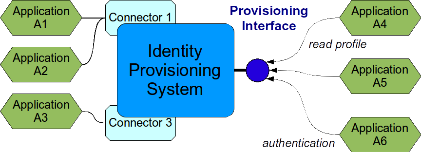
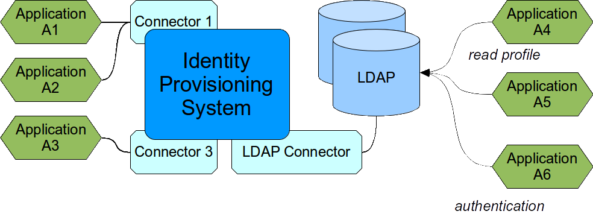
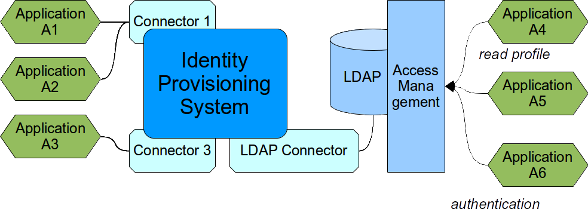

= Provisioning Interface Abuse
:page-description: Modern identity management systems have cool APIs, just waiting to be used for variety of purposes. However, such APIs are both easy to use and easy to abuse, leading to serious headaches down the road.
:page-wiki-name: Provisioning Interface Abuse
:page-wiki-id: 13992058
:page-wiki-metadata-create-user: semancik
:page-wiki-metadata-create-date: 2014-03-05T11:40:45.508+01:00
:page-wiki-metadata-modify-user: semancik
:page-wiki-metadata-modify-date: 2020-02-14T19:54:41.869+01:00
:page-moved-from: /iam/antipatterns/provisioning-interface-abuse/
:upkeep-status: yellow
:page-toc: top

We have this shiny omnipotent identity management system.
It has a really nice interface that can provide information about all the users in real time.
Let's just connect all the new applications to this interface, so they can authenticate and read user profiles.
It is elegant, architecturally clean, and it saves a huge amount of work.

However, in a common case, it creates more problems than it solves.

== Provisioning Interface

Each non-trivial IDM system has a remote interface that can be used to access information about the data stored in the IDM system.
This is typically information about users.
Most IDM systems also expose information about accounts that are fetched from resources that are behind the IDM system.
Therefore the IDM system can essentially act as a virtual directory.
This may be a very attractive way for an integration.
It is a very convenient "interface to do everything" after all, isn't it?

But there is a price to pay.
IDM systems are complex beasts.
They contain a lot of mappings, data transformation mechanisms and policies.
When the interface is not used properly then all this logic makes the use very expensive.

The performance usually suffers.
The IDM system are not built with performance as the highest priority.
It usually does not matter if a single account is provisioned in 1 second or in 0.01 second.
But it matters a lot if 10000 accounts are retrieved in 1 second each or in 0.01 second each.
The provisioning interfaces are not built for high-throughput use and usually should not be used in this way.

The availability may also suffer as well.
IDM systems are not considered to be mission-critical and therefore are usually not build for massive HA clustering.
And as many IDM systems are based on the "virtual identity" model and do not handle offline resources well then the data provided by the provisioning system may not be complete at all times.

Simply speaking the purpose of the provisioning interface is to *manage* the identities, not to expose identity data large number of applications.
The intended client of the provisioning interface is *not* a common application that wants to read user profile.
The intended client is a monitoring system, security analytics system, self-service system and so on.
These are special purpose systems that have two things in common: they need data aggregated from many systems and they make relatively small number of complex requests.
Large number of simple requests is not what IDM system interface is built for.

These are not theoretical limitations of IDM systems.
It is in fact perfectly possible to implement a scalable, available and reliable IDM system that could be used for this purpose.
But it is expensive.
Very expensive.
There needs to be a very proper error handling, intense caching, performance tuning and so on.
And most IDM vendors just do go this way because it does not make much sense from economic perspective.

== Proper use of the Interface

There is one way in which this approach may be partially feasible: query only the data that are stored locally by the IDM system.
This usually means querying just the "user" data (as opposed to "account" data).
The "user" data are the authoritative part.
A proper IDM system stores this data in its database and synchronizes them with "accounts" when needed.
These data are stored locally, they use a native data model and usually no complex logic is needed to post-process them.
Therefore reading such data is relatively cheap.
It may be feasible to read these data efficiently under some circumstances.
But a great care must be taken not to go over the limits.

== Couple with Directory Service

There is a much better way for an IDM solution: use each tool as it was designed.
IDM system is designed for flexibility and to handle complex logic.
It is not designed for performance.
But directory service is designed especially for performance and scalability.
Therefore let's couple these two system to emphasize the benefit of each of them:

In this case IDM system does what it does best: synchronizes the data.
It takes data from source system, transforms them as necessary and published them in directory service (LDAP).
The data are published in a form that is readily usable by the applications.
The IDM system also makes sure that the data are reasonably fresh.
It continually maintains the data.

The directory service is just a massive database.
It is simple and therefore it has excellent performance.
There is no heavyweight logic, the data are already pre-processed by IDM system before they are published in the directory service.
The directory service is also designed for a massive scalability.
Therefore it can take almost unlimited load.
The LDAP protocol also has a partially standardized data model and chances are that many application can integrate with LDAP seamlessly.

In fact the directory server in this case is just a massive, scalable, high-performance cache of the data from the IDM system.

This set-up usually significantly increases the overall quality of the solution: it improves performance, it opens up the data model using standardized LDAP schemas and it allows for almost unlimited and cheap scalability.
The additional cost of directory service is usually negligible.
The directory server does not need any special features in this case.
Therefore almost any existing directory service can be used (e.g. Active Directory).
Or there are several good open source directory server alternatives.

== Access Management

Directory service is an excellent technology.
But as all technologies even this xref:/iam/myths/everything-in-ldap/[has its limits].
Therefore it may be worth consideration to add yet another component to the solution: Access Management.

The access management systems usually use directory service as a back-end therefore it has similar performance and scalability characteristics.
The access management system are also much better for authentication, session management, authorization and so on.
This xref:/iam/best-practice/management-directory-access/[forms quite a complete solution].

== See Also

* xref:/iam/best-practice/management-directory-access/['Management, Directory, Access']
