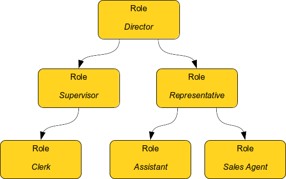
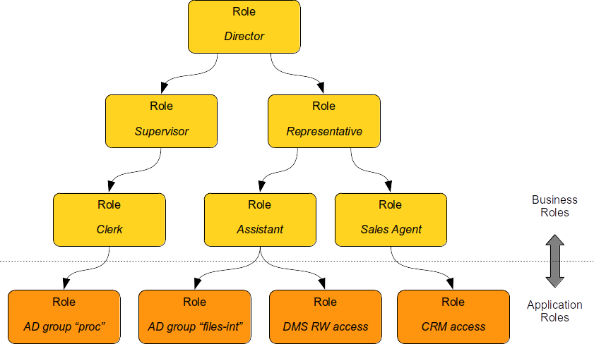

= Role-Based Access Control
:page-keywords: [ 'RBAC' ]
:page-toc: top
:page-upkeep-status: orange

NOTE: WORK IN PROGRESS

== Introduction

As the name suggests, role-based access control (RBAC) is an access control mechanism based on concept of _roles_.
In many organizations there are groups of permissions that are assigned to users over and over again.
Users that are doing the same job are likely to have the same permissions.
The idea of RBAC is simple: let's group this permissions into a _role_ and assign the role to the users.
This means that there are _less_ things to assign: instead of assigning a handful of permissions we assign a single role.
Less things to manage means less administration effort.
At least in theory.

// TODO: picture: Alice,Bob,Carol assigned to role "Sales Manager" which gives access to AD, ERP and CRM

As usual, the practice is slightly different.
RBAC works very well for organizations that are quite _regular_ and _static_ - organizations in which many people are doing the same job, and that job rarely changes.
In that case we need just a handful of roles, we will be assigning them to many users, and we will not need to update role definitions often.
Unfortunately, we are in 21^st^ century reality.
Organizations are not very _regular_ or _static_ anymore, they need to be flexible and efficient to survive.
Employees usually have several responsibilities which tend to change quite often.
This is not an ideal environment for RBAC.
Organizations need to manage large number of roles and role assignments, in a very dynamic environment.
Yet, RBAC can still bring a lot of value if used correctly.

Let's start with the basics first.

.Terminology
NOTE: The term _RBAC_ is many things to many people.
We use the term _RBAC_ in quite a broad sense.
We do not strictly mean NIST RBAC model.
What me mean by _RBAC_ is a generic mechanism that is based on the concept of roles.
Although the basic principles of midPoint RBAC are very similar to NIST RBAC model, we take the liberty to deviate from NIST model when needed.

== Basic Role Hierarchy

Ability to group permissions into roles is quite useful.
However, it is still not good enough unless your access control policy is extremely simple.
Most practical policies require placing roles into roles, thus creating role hierarchy.

Let’s consider two work positions: clerk and supervisor.
Clerk has some basic set of permissions.
Supervisor can do everything that a clerk can do, but supervisor has some additional permissions.
A naive way would be to simply copy all the clerk’s permissions in supervisor’s role.
However, permissions are seldom static.
Access control policies tend to change and evolve as much as the environment changes.
It is likely that a clerk’s permissions will change.
In that case we will need to update the supervisor’s role as well.
This would be a maintenance burden.
Now imagine hundreds or thousands of related roles that need constant maintenance.
Any person maintaining such a structure will need superhuman precision and patience to do that.

A more natural idea would be to include clerk’s role into a supervisor’s role.
If clerk’s permissions change, then also supervisor’s permissions are automatically updated.
Maintenance is much easier.
This is the basic idea of role hierarchy.
Basic permissions are placed into low-level roles.
Low-level roles are combined to create a higher-level roles.
Then those roles may be combined as well.

== Role Types

Not all roles are created equal.
In ideal case all the roles from the example above should be treated equally.
All of them should represent business position or responsibility, all of them should be assigned to users, all of them should be created and maintained using the same process and so on.
All the roles should contain the permissions necessary for that business position or responsibility.
However, that is usually not the case in the real world.

In "pure" RBAC theory, roles are supposed to represent business concepts.
This is indeed a good approach.
Roles work best when they represent something that business people can understand, work position, responsibility, organizational unit and so on.
It is all fine so far.
However, it gets complicated when we look inside the roles.
The roles are supposed to contain permissions, privileges that map to a real IT world.
However, it is difficult to construct roles that have both the business meaning and all the messy IT details.
Business people need to cooperate very closely with IT people to create roles like that.
However, cooperation of business with IT usually leaves much to be desired.
They use different concept and language, the cooperation is not entirely smooth.
Therefore, the common practice is to have (at least) two types of roles:

* *Business roles* represent business concepts, such as job or responsibility.

* *Application roles* represent IT concepts, usually technical access to particular application (hence the name).

Business roles can be composed of other business roles.
However, at the very bottom of hierarchy there are application roles.

*Application roles* are created by IT people.
They represent _technical_ concepts, such as `Active Directory account`, `Active Directory group "files-int"`, `DMS access to internal files (read-write)`, `CRM account with access to customer database`.
Application roles are the building blocks of the role hierarchy.

The recommended way is to "bind" application roles to the thing that they represent.
For example, application roles may be created by importing all Active Directory groups, creating application role from every group.
Even better, Active Directory groups should be created as a "projection" of application role.
IT staff creates an application role in IGA system, then the IGA system creates corresponding group in Active Directory.
This is a good method to maintain governance over the groups, e.g. make sure that every group has a responsible person nominated.
Unfortunately, application roles are too often maintained manually, which is labor-intensive, and it leaves significant room for errors.

*Business roles* should be created by business people.
They represent _business_ concepts, such as responsibilities required by a specific job, work position, business process or workgroup activity.
Examples include `Marketing Manager`, `Branch Supervisor`, `Claim Reviewer` and `Innovation Task Force Member`.
Business roles are usually _composites_, are built from application roles or other business roles.

There are several ways to construct business roles.
The classical method is to create business roles on a green field.
This includes business analysis of responsibilities of individual jobs, work positions and teams, formally specifying the permissions/privileges required to carry out the activities and grouping the permissions into business roles.
This is quite an exact method, however it is usually very slow, tedious and labour-intensive.
Other methods focus on discovering or _mining_ business roles definitions from existing data.
This method is not entirely exact, however it can provide results much faster.
Real-world practice often combines both methods together.

Sometimes there are also more types of role, not just _application_ and _business_ roles.
The other roles are much less common, yet they are used from time to time.
The table below summarizes role types:

|===
|Role type |Description |Content |Should be assigned to users? |Example

|Application role
|Role describing access to a single application.
Usually represents one specific _entitlement_ in the application, such as application group, privilege or role.
It is bound to one specific application (hence the name).

Application roles are often created automatically by importing/synchronizing entitlements, e.g. by importing Active Directory groups.
|Access to a single application.
| No.

Yet, they are quite often assigned to users.
|Active Directory Domain Administrators

Company Website Editors

Database `foo` read-only access

|Technical role

IT role
|Combines several application roles or low-level privileges into one unit that is easier to manage.
Often used for application roles that depend on each other, e.g. when operating system access is needed to perform database administration.
They are considered to be somewhere between application roles and business roles.
They are not application roles, as they can give access to several applications.
They are not business role either, as they do not describe a complete business responsibility, and they often use very technical and non-business-friendly terminology, which makes them a separate species on their own.
They are not used very often.
|Access to a couple of application that depend on each other, or make sense together.
| In exceptional cases, e.g. very specific and complex IT responsibility.
| Database `bar` administration with OS access

Backup/restore management

|Authorization role
|Provides internal authorizations or privileges in the system where it is defined.
In IGA platform, these are roles that provide access to parts of the platform itself.
Authorization roles do not grant access to any other systems.
|Authorization statements (grants).
|No.

Yet, some roles may be assigned to users in early stages of the deployment when business roles are not fully formed yet.
Especially superuser roles.
|`Superuser` role

Internal `Approver` role in IGA platform

|Business role
|Business role represent a business responsibility, function in a business process, business-related work position or similar business concept.
Business roles are supposed to be a combination of smaller "elemental" roles.
|Any other role type, including other business roles.
|Yes
|`Clerk`

`Branch Supervisor`

`Marketing Assistant`

`Call Center Operator`

|===

== Role Hierarchy

RBAC is hierarchical: there may be roles within roles.
When it comes to IGA, almost all role structures are, technically, hierarchical.
There are _application_ roles at the bottom of the hierarchy.
_Business_ roles are constructed from application roles.
While this is technically a role hierarchy, it does not have the benefits of role hierarchy as intended by the RBAC model.

Full benefits of the hierarchy are achieved when business roles are placed within other business roles.
For example `Sales Manager` role can contain `Sales Agent` role, including all the permissions of the agent into the permissions of the manager.
Such approach can, theoretically, reduce role maintenance.
In case of change in `Sales Agent` permissions, such change is automatically applied to permissions of `Sales Manager` as well.
However, this benefit is achieved only in cases where the role hierarchy is well constructed, avoiding role duplication or misuse.

== Access Request Process

Ideally, roles should be assigned to users automatically.
Business roles are supposed to correspond to business concepts.
Therefore, it should be straightforward to automatically assign business roles based on user's attributes, such as location, job code or project membership.
However, there are practical obstacles.
Job codes or locations may not be available, or may not be precise.
Similar problems may apply to other business data as well.
Overall data quality may be too low for such automation.
Also, not all the relevant business concepts may be covered by business roles yet.
Moreover, the mapping between business _data_ (e.g. location or job code) and business _roles_ may not be obvious.
In other words, nobody really knows what access a user should have.
This issue is, in fact, quite common.

Practical IGA deployments often resort to _access request_ process.
The process goes like this:

. User _requests_ a role.
IGA systems provide a special-purpose user interface for requesting roles.
The user is selecting a roles from _role catalog_.

. The request is submitted for _approval_.

. The role is _assigned_ to the user.
Access is provisioned, privileges are granted.

This is a universal process that can have many variations.
The user may request role for herself/himself, or a manager may request a role for user's behalf.
The approval step may be multi-stage, e.g. requiring approval from a line manager and application owner.
High-privilege roles may require additional approval by security office.

In an idea case, the _role catalog_ should contain only a selected set of _business_ roles.
However, the catalogs usually contain all business roles - and _application_ roles too.
Too many organizations do not know what access users _should_ have, which is usually the primary motivation to deploy of _access request_ process.
As nobody knows what access users should have, it also means that nobody knows how business roles should look like.
Therefore, users are requesting application roles instead.
This approach is way too common.
Such process is not right, it goes against best practices - and common sense as well.
However, it is often the only feasible process to apply any kind of semi-systemic access control policy.

The bottom line is that the _access request_ process often leads to _over-provisioning_ - granting more access that the users need.
Reasons for this problem are quite obvious.
It is very easy to get access, and there is no motivation to remove access.
Over-provisioning is usually addressed with _certification_ mechanism.
Simply speaking, certification is a process in which responsible persons must _certify_ that users still need the access that they requested.
The usual approach is to set up _certification campaigns_, regularly certifying access (e.g. annually).

== Role Governance

It is no easy task to define the roles, creating a practical RBAC model.
However, it is even harder to _maintain_ the model in good working condition.

The world around us is changing all the time.
Organizations change as well, including jobs and responsibilities of the users.
Applications are upgraded, new applications are introduced, old applications are decommissioned.
There are re-organizations, mergers, spin-offs and numerous unforeseen changes.
RBAC model has to adapt, updating role definitions.

Role management can be centralized, putting responsibility for RBAC model maintenance to a single team.
This approach is quite obvious, and it is quite wrong.
RBAC model works best when role definitions are aligned with the things that they represent.
Application roles should be aligned with application privileges, business roles should be aligned with business needs.
Except for very rare cases, there is no single team that can cover both the IT intricacies and business complexities across the entire organization.

Practical approach is to distribute role management effort.

*Application roles* should be management by the IT department.
They should be aligned with IT concepts.
Ideally, application roles should be managed automatically or semi-automatically.
The roles can be automatically synchronized from application entitlements, e.g. Active Directory application roles can be automatically created from Active Directory groups.
The other way around is also feasible: Active Directory groups are automatically created when a new application role is defined in the IGA platform.
Either way, application roles are _IT_ domain, they are good candidates for automated maintenance.

*Business roles* should be managed by business units.
As business role describe business concepts, they should be managed by business people.
There is nobody else to know the concepts and needs of the business well enough to define the roles - and to keep them updated.
It is possible to maintain business roles as a cooperative effort of business and IT, however the engagement of business people is crucial.

Unlike application roles, maintenance of business roles is very difficult to automate.
It requires a lot of effort, especially to keep the role definitions updated.
The usual practice is to assign _role owners_, especially for business roles.
Role _owner_ is a person responsible for the role definition.
For business roles, role owner is usually a business person responsible for the job or process that the role relates to.
It is expected that role owner updates role definition whenever business needs change.
Many IGA platforms allow specification of role _owners_ within the IGA platform itself.

Role owners are essential for maintenance of _business_ roles.
However, the owners may be necessary for _application_ roles as well, especially if application roles are often assigned to users directly.

Similarly to owners, IGA systems usually allow specifications of role _approvers_.
Approvers are persons responsible for approving role requests in _access request_ process.

== RBAC Policies

Role-based access control (RBAC) model formed in the 1990s and 2000s.
This is the "traditional" form of RBAC.
This form of RBAC is entirely _static_.
Assignment of roles are static, set of permissions in roles is static, access granted by the model does not change unless it is manually changed by an administrator.
This approach might be useful back in the 2000s.
However, we live in a very dynamic world now, two decades later.
Static access control model does not work very well any longer.
There are numerous problems of _static_ RBAC models, such as xref:/iam/role-explosion/[role explosion] and role abuse.

Despite all its drawbacks, traditional _static_ RBAC model was, and still is, quite popular.
However, static RBAC was criticised almost since its inception.
The critique resulted in mechanisms for making RBAC more dynamic, that were introduced as early as the 2000s.
Some identity management systems of the era supported dynamic assignment of roles to the user, based on simple rules.
However, this functionality was still quite rare.
Identity management systems matured in the 2010s and became known as identity governance and administration (IGA) systems.
At least a partial support for dynamic RBAC is now a part of many IGA platforms.
However, capabilities of individual products still significantly vary, and the dynamic functionality is not very popular outside the IGA field.
Despite that, dynamic RBAC approach provide numerous advantages, not only over static RBAC, but also over other access control models, such as ABAC or PBAC.
Now, in the 2020s, dynamic RBAC features are absolutely essential for any IGA platform to efficiently handle complex access control requirements.

One of the most practical and flexible approaches to dynamic RBAC is xref:/midpoint/reference/roles-policies/pdrbac/[Policy-Driven RBAC] as implemented in xref:/midpoint/[midPoint IGA platform].
Policy-driven RBAC provides flexibility at three levels:

* *Dynamic user-role assignment*.
Assignment (and unassignment) of roles to users can be controlled by rules.
The rules usually work with user attributes, such as job code or location.
Roles can be dynamically and automatically assigned to users based on business data stored in user attributes.
+
Moreover, in midPoint, roles can be directly linked to xref:/midpoint/reference/org/[organizational structure].
In such a case, membership in an organizational unit, team or project automatically implies certain roles or privileges.
+
Dynamic user-role assignment significantly reduces RBAC administrative burden, as significant part of role assignments can be managed automatically without explicit action of an administrator.

* *User-role assignment parameters*.
User-role assignment is not a simple binary relation as it was in traditional RBAC.
It is a rich data structure that can be parametrized.
For example, assignment can be parametrized, providing access only for a limited time period, or limit the access to a certain organization.
Special parameters (such as _relation_ parameter in midPoint) can be used to determine user's relation to a role.
This can be used to distinguish ordinary role member from role owner, read-only access to resources from read-write access and so on.
+
Moreover, in midPoint, other object types that roles can be assigned, with functionality similar to roles.
For example, xref:/midpoint/reference/org/[organizational units] can directly model access provided to departments, teams and projects, even distinguishing access to team members and managers using the _relation_ parameter.
Furthermore, concept of xref:/midpoint/reference/misc/services/[services] can model applications, mobile devices, APIs and similar entities, all behaving like roles.
+
Parametric role assignment is a very efficient tool to fight xref:/iam/role-explosion/[role explosion] problem.
Single role can be used under various circumstances, distinguished by assignment parameters.
Where traditional RBAC needs many roles, policy-based RBAC needs just one.

* *Dynamic role permissions*.
Roles are no longer just a static set of permissions.
While static permission sets can still be used, there is now an additional mechanism to determine permissions using dynamic _expressions_.
Such expressions take parameters from the user, role, role-user assignment and evaluation _context_.
The parameters are used to determine permissions granted by the role.
This is an efficient mechanism to determine various situation, usually based on assignment parameters.
For example, the expressions can be used to grant different permissions to ordinary role member, and different permissions to role owner.
Even more common case would be an expression that is using _location_ parameter to limit permissions only to specific physical location or country.
+
Moreover, in midPoint, the expressions can be used to set up entitlements and attributes of accounts provisioned by midPoint.
For example, it can be programmed to follow naming conventions for groups, automatically choosing correct group among `foo-reader`, `foo-writer`, `foo-admin`, all handled by a single role.
As midPoint treats organizational units as roles, this mechanism can be used to distinguish access of project members and managers without a need for complex policy definitions.
The possibilities are nearly endless.
+
Dynamic role expressions provide functionality that is very similar to dynamic access control models, such as ABAC or PBAC.
However, policy-based RBAC still maintains most of the benefits of RBAC.
Policies are neatly divided to roles, encapsulated in them.
Many roles can be maintained and updated independently of others, reducing the policy maintenance nightmare common to ABAC/PBAC models.

Policy-driven RBAC is a natural evolution of the RBAC concepts.
It still provides the advantages of RBAC, addressing the problems of traditional static RBAC models.
It brings the flexibility of dynamic access control models to the RBAC world.

// ----------------------------------------------------------------

// TODO: role mining, bottom-up approach to policy

// TODO: misc: SoD, role model versioning (note benefit from independenet roles)
// TODO: NIST RBAC sessions/active roles, which is seldom implemented
// TODO: RBAC important for calculating role exposure
// TODO: meta-roles, relation for role governance, roles+orgs
// TODO: roles *are* the policy

// TODO: == Common RBAC Problems:
// * Overuse of application roles - certification nightmare
// ** requesting roles "as my colleague has"
// ** approving when the request "looks good"
// * Business role duplication - employ hierarchy
// * Role explosion
// * Nobody knows anything
// * Disrepair - roles must be maintained, owners, etc.
// * Centralized role management by IT people
== See Also

* xref:/midpoint/reference/roles-policies/rbac/[RBAC implementation in midPoint]

* xref:/midpoint/reference/roles-policies/pdrbac/[]

* xref:/iam/[]
