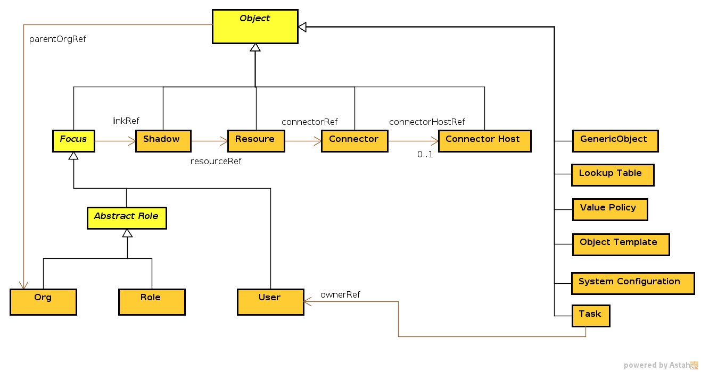

= Data Model
:page-archived: true
:page-obsolete: true

// We do not want wiki name here.
// This page is outdated. We do not want to redirect users here.
// The wiki name is assigned to a page that is a real replacement.
// :page-wiki-name: Data Model

== Introduction

This page describes the data model that is used across many components, e.g. wiki:Identity+Repository+Interface[Identity Repository Interface], wiki:Provisioning+Subsystem[Provisioning Subsystem], wiki:IDM+Model+Subsystem[IDM Model Subsystem], etc.
The data model is used both for data storage and data communication.
Most of the data model entities are supposed to be persistent, however some are transient.

== Objects and Properties

The most significant data structures in midPoint take the form of _objects_. midPoint objects are rich data structures that can be persistently stored and uniquely identified within the system.
They represent the entities that one would normally expect in an IDM system: users, account, roles, etc.
Objects are identified by wiki:Object+ID[Object Identifier (OID)], which is a unique, automatically generated, human-*un*friendly identifier.
Object also have _name_ property which is a more human-friendly description of the object.
Objects are of a specific _type_, e.g. a User, Role or Resource.

Objects contain _properties_. Properties are the elementary unit of information that midPoint understands.
Properties contain useful data elements of the objects such as user's first name, last name, role definition, hostname of a remote system and so on.
Properties are usually string data.
But they can also be of other types such as integer or enumeration and can even take form of complex data structures.
Properties that are tightly related to each other may be grouped into _containers_. This provides better readability of the data structures and allow to work around some technological limitations (such as XSD UPA problem).

An example of a simple object is provided below.
It describes midPoint object of type _user_ represented in XML.
This a non-complete illustrative example.
Namespace definitions are not shown and also some details were simplified for clarity.

.Simple midPoint Object
[source,xml]
----
<user oid="12345678-abcd-dcba-87654321">  <!-- XML element name determines object type -->
  <name>jack</name>                       <!-- "name" property -->
  <extension>                             <!-- This is a container -->
    <foo:tShirtSize>XXL</foo:tShirtSize>  <!-- Custom property "tShirtSize" in a property container -->
  </extension>
  <fullName>cpt. Jack Sparrow</fullName>  <!-- "fullName" property -->
  <givenName>Jack</givenName>             <!-- "givenName" property -->
  <familyName>Sparrow</familyName>        <!-- "familyName" property -->
  <parentOrgRef oid="343434343-11..."/>   <!-- reference to object with OID 343434343-11... -->
 </user>

----

Although the property names are shown as strings, they are in fact QNames or URIs - similarly to object types, property container names and actually almost everything in midPoint.
We need a globally-unique names because we expect that midPoint deployments may customize the system quite heavily.
Global uniqueness of the names avoids a conflict of customizations and future midPoint versions.
It also allows several customizations to coexist, which is important for customization "libraries" and reusable customization code.

Properties can be single-valued or multi-valued.
In the IDM field there are many good cases for multi-valued properties: group membership, properties related to organizational structure, user roles, entitlements, etc.
While it is usually easy to handle single-valued properties, multi-valued properties are traditionally difficult to deal with.
We are making the situation considerably easier by only allowing *unordered* multi-valued properties.
The primary reason for this is our wiki:Consistency+Model[Consistency Model] and the ability to merge values, which is much easier if the values are unordered.
Also, ordered multi-valued properties are very uncommon in general and they almost do not appear at all in the IDM deployments.
And even if they would appear, they still can be implemented as single-valued complex properties, although in a less convenient way.
Therefore the trade-off seems to be more than acceptable: sacrificing convenience in a rare case to get a less complex system in a common case.

== Representation

Objects in midPoint are identified by OIDs and consists of items (properties, references, containers).
And that's it.
Essentially.
No specific assumption about data format or representation of the objects is made.
The objects may be represented in XML, JSON, YAML or in any custom format if that would be necessary.
In fact, the objects are most frequently represented in a form of wiki:Prism+Objects[Java objects] in a computer memory.
The data model in midPoint tries to be independent of object representation language.

However, the most prominent object representation in midPoint is *XML*. The most important reasons are:

* XML is reasonably mature and universally quite well understood.

* There is a practical and well supported XML Schema language.

* It aligns well with the target environment of midPoint (enterprise and web services).

wiki:Objects,+XML,+JSON+and+others[XML is not perfect], but it is currently the best choice.
Therefore the primary way how to express midPoint data model are XML Schema (XSD) and Java code is generated from that.
This is required to maintain link:http://en.wikipedia.org/wiki/DRY[DRY] principles which in turn allow for reasonable development speed and sustainability of the development process.
The XML-orientation may change in the future if anything better comes around.
JSON and YAML support is in development, but this is unlikely to replace XML as the primary language.

See wiki:Objects,+XML,+JSON+and+others[Objects, XML, JSON and others] for more details.

== Model Layers

The data model used in midPoint is composed from several data modeling layers:

* *wiki:Prism+Schema[Prism Schema]* defines basic concepts of Object, Property, Extensible Object, etc.
It also defines some advanced primitive types.
The prism schema is very generic.
It has no special domain knowledge of identity management systems.

* *wiki:MidPoint+Common+Schema[MidPoint Common Schema]* defines basic concepts that almost all IDM deployments will use.
It defines the concepts as IDM system will see them, as will be stored in the repository.
It is independent of the environment and business logic.
It does not depend on what resources are used and what objects do they provide.
It also defines the structure of roles, policies, method of assignment of accounts and other resource objects and all the properties of access control model.
This is the _core_ model of our system.
Identity schema is _static_, it is known at compile time, it is part of interface definitions and it is pretty much hardcoded into the system.
Even though the schema is mostly hardcoded, it can be extended at a proper extension points.

* *wiki:Resource+Schema[Resource Schema]* defines how resources (resource connectors, adapters, frameworks) present the information to the IDM system.
Resource schema describes "live" objects on the resources, it always provides real-time authoritative information from the resource.
Resource schema is _dynamic_, it is provided in run-time and can vary for each _instance_ of resource.

* *Connector Schema* defines the structure of connector configuration properties.
It defines whether a connector needs a hostname configuration property, resource URLs, usernames, passwords, etc.

The layers of data model form a structure similar to the concept of link:http://en.wikipedia.org/wiki/Shearing_layers[shearing layers] known in the building architecture.
Each part of the schema forms a layer that can evolve with different dynamics.
The lower layer of identity model must be quite stable (as other layers depend on it), while the upper layers can evolve much faster.
This will give us both stability (in lower layers) and dynamics (in upper layers).
However, for the ease of use, common, identity and model schemas are grouped in one XML namespace (in XML representation).

[TIP]
====
For more details see the sub-pages:

* wiki:Prism+Schema[Prism Schema]

* wiki:MidPoint+Common+Schema[MidPoint Common Schema]

* wiki:Resource+Schema[Resource Schema]

====

== Diagram

The following diagram describes the structure of midPoint object types.

[TIP]
.Inline documentation
====
Most data types and items are documented in-line in the XSD schema definition files.
Please see the current link:https://github.com/Evolveum/midpoint/blob/master/infra/schema/src/main/resources/xml/ns/public/common/common-3.xsd[XSD definition from the source-code repository] for the latest version.
The processed documentation is available in a form of wiki:SchemaDoc[SchemaDoc].

====

== See Also

* wiki:Objects,+XML,+JSON+and+others[Objects, XML, JSON and others]

* wiki:Consistency+Model[Consistency Model]

* wiki:Object+References[Object References]

* Individual data model layers:

++++

++++
