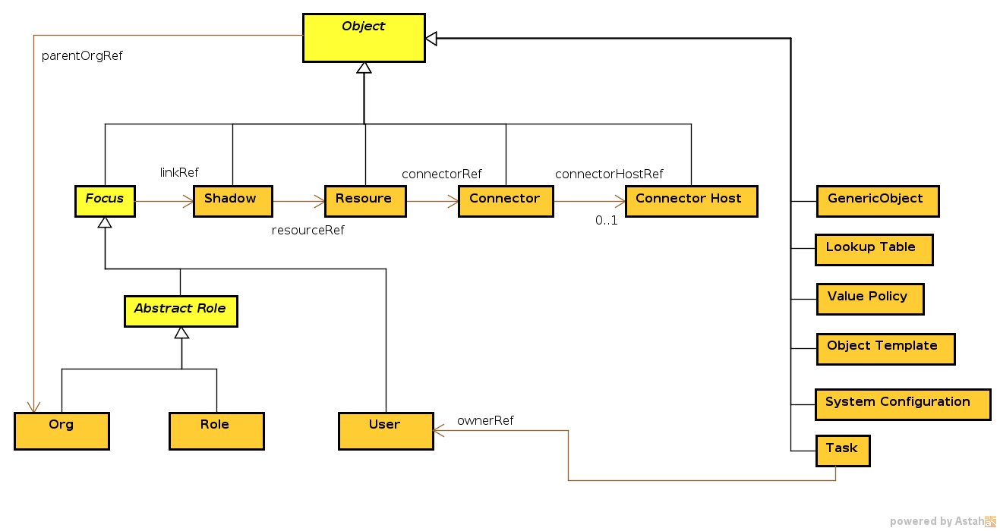

= MidPoint Common Schema
:page-archived: true
:page-obsolete: true
:page-wiki-name: MidPoint Common Schema
:page-wiki-id: 655393
:page-wiki-metadata-create-user: semancik
:page-wiki-metadata-create-date: 2011-04-29T12:00:44.189+02:00
:page-wiki-metadata-modify-user: peterkortvel@gmail.com
:page-wiki-metadata-modify-date: 2016-02-20T15:45:17.906+01:00
:page-toc: top

== Introduction

link:https://evolveum.com/midpoint[MidPoint] Common Schema defines basic concepts that almost all IDM deployments will use.
It defines the concepts as IDM system understands them such as user, account, role, organizational unit, etc.
It defines objects in a form that is used to store them in the repository and import/export them.
It is mostly independent of the environment and business logic.
It does not depend on what resources are used, what object types do they provide, how the approvals are implemented, etc.
This is the core model of our system.
This schema is _static_, it is known at compile time, it is part of interface definitions and it is mostly hardcoded into the system.
However even though the schema is hardcoded it is still extensible at the proper extension points.

=== Prism

As midPoint is based on wiki:Prism+Objects[Prism Objects] the MidPoint Common Schema is based on wiki:Prism+Schema[Prism Schema]. MidPoint Common Schema is using prism annotations to mark objects and property containers.
However, MidPoint Common Schema defines its own types for `ObjectType`, object references and so on.
The reason for this is twofold.
Firstly we want to keep a single namespace for the entire schema.
This simplifies the day-to-day work by avoiding a letter soup of various namespace prefixes.
Secondly, some of the Prism schema concepts are slightly extended in midPoint.

=== Summary

[%autowidth,cols="h,1"]
|===
| Namespace | http://midpoint.evolveum.com/xml/ns/public/common/common-3

| Recommended prefix
| none (default namespace) or `c`

| Current version
| 3.1

| Definition
| link:https://github.com/Evolveum/midpoint/blob/master/infra/schema/src/main/resources/xml/ns/public/common/common-3.xsd[infra/schema/src/main/resources/xml/ns/public/common/common-3.xsd] (master)

| SchamaDoc
| link:http://athena.evolveum.com/builds/master/latest/schemadoc/http---midpoint-evolveum-com-xml-ns-public-common-common-3/index.html[http://athena.evolveum.com/builds/master/latest/schemadoc/http---midpoint-evolveum-com-xml-ns-public-common-common-3/index.html] (master)

|===

== Diagram

== Schema Concepts

[TIP]
.Inline documentation
====
Most data types and items are documented in-line in the XSD schema definition files.
Please see the current link:https://github.com/Evolveum/midpoint/blob/master/infra/schema/src/main/resources/xml/ns/public/common/common-3.xsd[XSD definition from the source-code repository] for the latest version.
The processed documentation is available in a form of wiki:SchemaDoc[SchemaDoc].

====

=== Object, Property, Property Container, Generic Object, Object Reference, ...

MidPoint schema is based on wiki:Prism+Schema[Prism Schema]. Therefore please refer to the wiki:Prism+Schema[Prism Schema] page for description of the Basic Prism Schema concepts.

== Object Types

Following table summarizes links to wiki pages that provide detailed explanation of selected object types.

[%autowidth,cols="h,1,1"]
|===
|   | Wiki page | Other related pages

| User
| wiki:UserType[UserType]
|

| Resource
| wiki:ResourceType[ResourceType]
|

| Shadow
| wiki:ShadowType[ShadowType]
| wiki:Shadow+Objects[Shadow Objects]

| Connector
| wiki:ConnectorType[ConnectorType]
|

| Connector Host
| wiki:ConnectorHostType[ConnectorHostType]
|

| Role
| wiki:RoleType[RoleType]
|

| Org
| wiki:OrgType[OrgType]
|

| Object supertype
| wiki:ObjectType[ObjectType]
|

|===

All the object types are described inline in XSD schema files or you can access the formated documentation in wiki:SchemDoc[SchemDoc] form.

== See Also

* wiki:Data+Model[Data Model]

* wiki:Basic+Data+Model[Basic Data Model]

* wiki:Resource+and+Connector+Schema+Explanation[Resource and Connector Schema Explanation]

* wiki:Object+References[Object References]

* wiki:Shadow+Objects[Shadow Objects]

== External links

* What is link:https://evolveum.com/midpoint/[midPoint Open Source Identity & Access Management]

* link:https://evolveum.com/[Evolveum] - Team of IAM professionals who developed midPoint