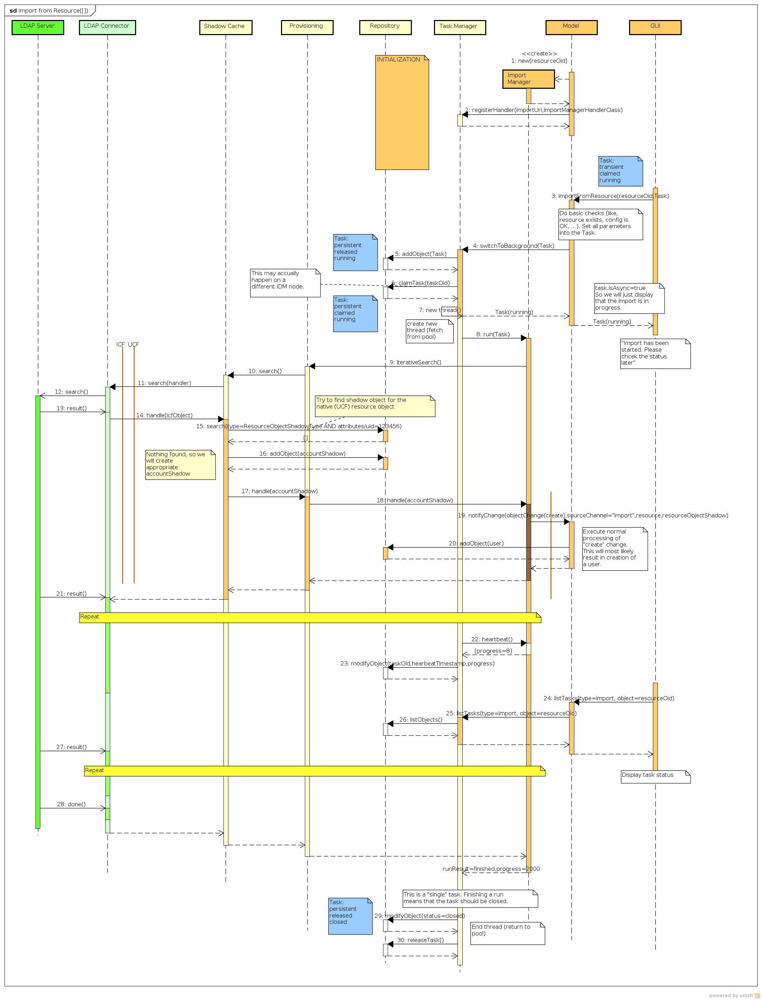

= Import Interactions
:page-wiki-name: Import Interactions
:page-wiki-id: 2654230
:page-wiki-metadata-create-user: semancik
:page-wiki-metadata-create-date: 2011-06-09T14:41:44.393+02:00
:page-wiki-metadata-modify-user: semancik
:page-wiki-metadata-modify-date: 2011-06-09T14:43:07.207+02:00
:page-archived: true
:page-outdated: true
== Import from Resource

The import is started by manual GUI action.
The import is executed in a new thread, as it typically takes minutes or hours to complete.
The diagram shows start of the import, one import step and GUI queries regarding import status.

The most recent version of the diagram is link:https://svn.evolveum.com/midpoint/design/images/architecture/Architecture/System%20Interactions/Import%20from%20Resource.png[in the SVN] (may be work in progress).