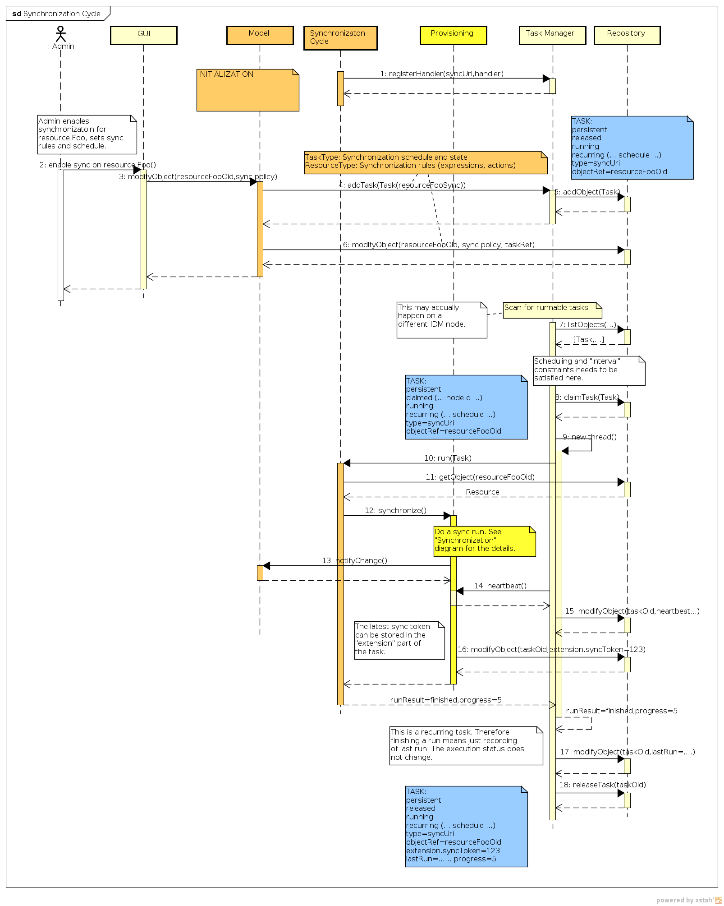

= Synchronization Interactions
:page-wiki-name: Synchronization Interactions
:page-wiki-id: 2654225
:page-wiki-metadata-create-user: semancik
:page-wiki-metadata-create-date: 2011-06-09T14:01:57.143+02:00
:page-wiki-metadata-modify-user: mederly
:page-wiki-metadata-modify-date: 2012-04-26T12:10:26.798+02:00
:page-archived: true
:page-outdated: true
== Synchronization

The diagram illustrates a single run of a synchronization "cycle".
The activities depicted in the diagram are executed regularly, usually every few seconds/minutes.

image::Synchronization.png[]

The most recent version of the diagram is link:https://svn.evolveum.com/midpoint/design/images/architecture/Architecture/System%20Interactions/Synchronization.png[in the SVN] (may be work in progress).

== Synchronization Cycle

The diagram illustrates the setup of synchronization "cycle" and the interactions with a xref:/midpoint/architecture/archive/subsystems/repo/task-manager/[Task Manager (original version)].

The most recent version of the diagram is link:https://svn.evolveum.com/midpoint/design/images/architecture/Architecture/System%20Interactions/Synchronization%20Cycle.png[in the SVN] (may be work in progress).