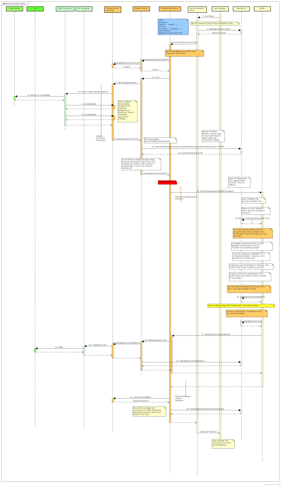

= Synchronization Interactions
:page-wiki-name: Synchronization Interactions
:page-archived: true
:page-obsolete: true

== Synchronization

The diagram illustrates a single run of a synchronization "cycle".
The activities depicted in the diagram are executed regularly, usually every few seconds/minutes.

The most recent version of the diagram is link:https://svn.evolveum.com/midpoint/design/images/architecture/Architecture/System%20Interactions/Synchronization.png[in the SVN] (may be work in progress).

== Synchronization Cycle

The diagram illustrates the setup of synchronization "cycle" and the interactions with a wiki:Task+Manager+(original+version)[Task Manager (original version)].

The most recent version of the diagram is link:https://svn.evolveum.com/midpoint/design/images/architecture/Architecture/System%20Interactions/Synchronization%20Cycle.png[in the SVN] (may be work in progress).

