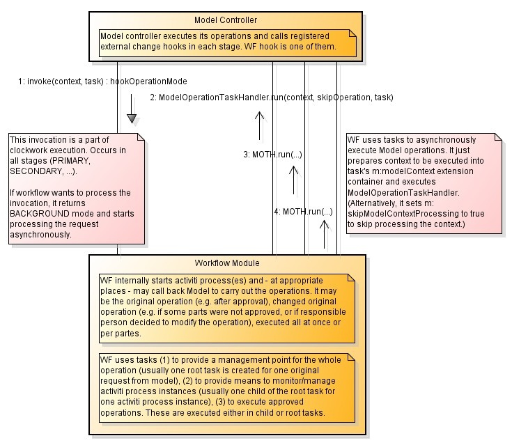
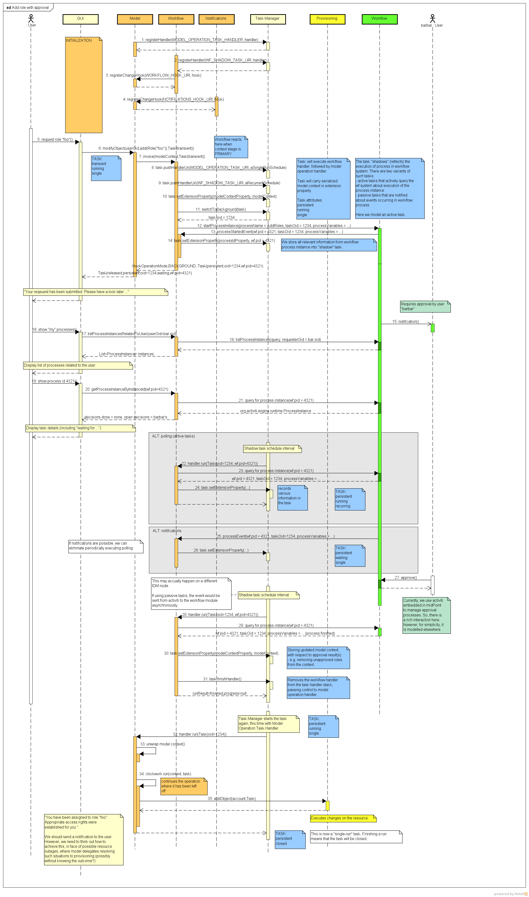

= Workflow Interactions
:page-wiki-name: Workflow Interactions
:page-wiki-id: 2654314
:page-wiki-metadata-create-user: semancik
:page-wiki-metadata-create-date: 2011-06-27T17:42:06.997+02:00
:page-wiki-metadata-modify-user: mederly
:page-wiki-metadata-modify-date: 2013-09-06T10:51:45.367+02:00
:page-archived: true
:page-obsolete: true

== Add Role with Approval

First, an overall schema of communication between model and workflow module.

A detailed description follows.
In this scenario, user requests assignment of a new role.
The role assignment is a subject to approval.
Approval is being executed by handing the request to embedded workflow system (activiti).
This is an example of an asynchronous user modification process.

Warning: this detailed diagram is, in a way, obsolete. Although it show the basic idea of the interaction subsystems interaction correctly, many details (e.g. that individual assignments are being approved in separate subtasks) are not correct w.r.t. current version of midPoint.

As time would allow this diagram will be updated.

The most recent version of the diagram is link:https://svn.evolveum.com/midpoint/design/images/architecture/Architecture/System%20Interactions/Add%20role%20with%20approval.png[in the SVN] (may be work in progress).