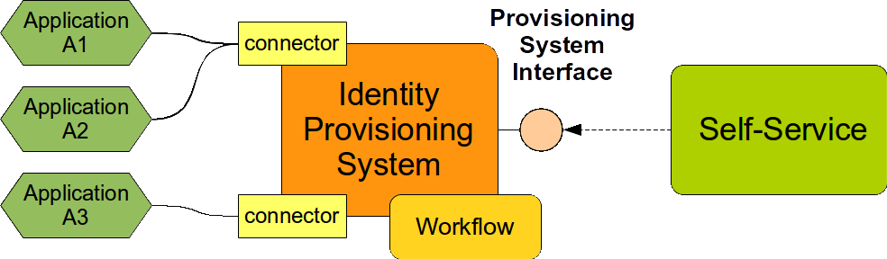
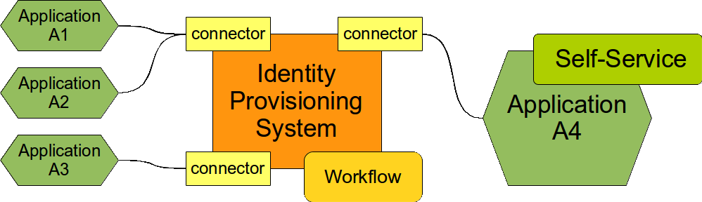
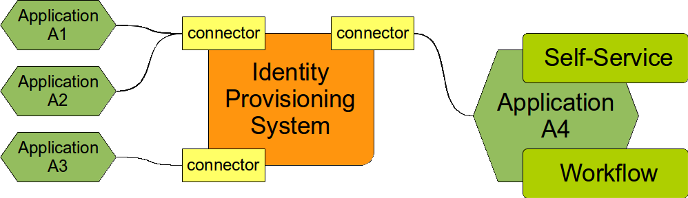

= Approval Integration
:page-wiki-name: Approval Integration
:page-wiki-id: 13992006
:page-wiki-metadata-create-user: semancik
:page-wiki-metadata-create-date: 2014-02-21T16:25:47.168+01:00
:page-wiki-metadata-modify-user: peterkortvel@gmail.com
:page-wiki-metadata-modify-date: 2016-02-20T15:31:01.671+01:00
:page-archived: true
:page-obsolete: true

Approval of access requests is an important part of many IDM solutions.
The usual scenario goes like this: A user requests access to X. This "X" is usually represented as role, group, resource, organizational unit, etc.
The IDM policies specify that any access to X has to be approved before it can be granted.
Therefore a proper approver is determined, the request is passed to the approver, it is signed in triplicate, sent in, sent back, queried, lost, found, subjected to public inquiry, lost again, and finally .... approved.
Once the request is approved it is automatically provisioned.
Most IDM systems are built to do this and therefore they contain a workflow engine or can integrate with one.

The interesting part of the solution is the method by which the request gets to the provisioning system in the first place.
While this may seem as a trivial issues it is in fact a very serious concern.

== Good Methods

*Good methods* how to get the request to the IDM system are:

* *User interface of the IDM system.* The user logs into IDM user interface, composes a request and submits it.
This is perhaps the easiest and most frequently used method.

* *Custom user interface and IDM system interface.* Custom application (self-service, portal, external workflow) is used to compose the request.
When the request is submitted the application explicitly invokes the service interface of IDM system.
The request is passed to the IDM system in a form of *event*. The interface must support asynchronous interactions.
Which means there must be a method to submit a request and then another method to get the results.
As we are dealing with approvals here the response will not be immediate.
The result of the process can take days or weeks to finish.
We will see later that this asynchronous event-oriented approach is critical.

The following diagram illustrates the use of IDM interface.
There is a custom self service system which is used to compose and submit a request.
This system is using a provisioning system interface to pass the request to the IDM system.
The IDM system will process the request, do any approval for which it is configured (which may take days), provisions what needs to be provisioned and provides the status back to the custom system.
The custom system can correlate the result with the original request and display an information to the user in appropriate way.

There are two important aspects of this technique: asynchronism and feedback.
Obviously the invocation needs to be asynchronous.
Approvals take a lot of time.
But there feedback aspect is as important.
The reason is in the "negative" part of the problem.
Many engineers tend to think only about the "positive" side: how the system behaves when everything goes well.
However this positive execution path is usually quite simple.
It gets much more interesting when things do not go well.
This is the negative side of the use case.
E.g. what happens if the request is refused.
One part of that is quite clear: nothing gets provisioned.
But the user needs to know about this.
Otherwise the user could wait for a long time until he realizes what happened and starts to investigate only to find out that the request was denied just because there was a formal mistake and it has to be re-submitted.
This approach is dramatically reducing the usability of the system, making it very link:http://en.wikipedia.org/wiki/Vogon[Vogonic]. Therefore a proper feedback is crucial for this integration to work well.

== Bad Methods

*Bad methods* of integration are:

* *Using a provisioning connector to pass the requests.* This approach may seem very attractive but it is results in complex and fragile solutions.
More on that later.

* *Using a synchronous interface.* This is perhaps obvious.
Approvals can take a long time.
A synchronous invocation just cannot wait _that_ long.
Synchronous interface is a show-stopper.
There is no way around that.

A straightforward way of thinking can go like this: We have an IDM system.
The IDM system has connectors that are used to integrate to the applications.
The connectors are easy to build.
So, let's use the connector to pass access requests from out self-service application to the IDM.
Like this:

Yes, this is a simple way and it is even quite easy to make work.
But only partially.
It actually works well only for positive scenarios.
It fails miserably for negative scenarios because it is very difficult to implement the _feedback_ channel.

The basic problem is that the connector is built for data-centric integration and not event-centric integration.
However the access requests are _events_. They come in specific time and are bound to that time.
And they may be repeated.
Even worse the access requests that are subject to approvals are also _conditional_. It means that they may be or may be not applied.
And two requests that contain the same data may even have two different results at two different times.
E.g. a request for a role X may be denied because it was issued before the user satisfied all requirements, e.g. he does not have a security clearance yet.
But the very same request may be approved few days later when the clearance is already processed.
This conditional event-based character makes it very difficult to model the communication in a data-centric fashion.

It is very difficult to pass this communication over the connector and to do it well.
Try to avoid it if it can be avoided.
If you do not avoid it this is what happens:

Let's assume that the account in application A4 contains an attribute "projects" that contains a list of projects that the user should belong to.
When user requests a membership in the project a new value is added to the "projects" attribute.
But we do not want to assign any user to any project automatically.
We want this to go through an approval.
And we want the IDM system to do this.
Perhaps the first solution that appears in engineer's mind is this: Let us represent each project by a single role in the provisioning system.
But assignment of the project role will be a subject to approval.
And we bind the values of the "projects" attribute to the roles and ... we are done!

Oh yes.
This solution works very well in positive scenarios.
All goes well while every access is approved.
But let's have a look what happens if a request is denied.
Obviously the role is *not* assigned and no access is provisioned.
So far so good.
But the corresponding value of the "projects" attribute is still there.
The next reconciliation run will find out that we have value "foobar" in the "projects" attribute, that value corresponds to role "FooBar" but that role is *not* assigned to the use as it should be.
We have a data inconsistency.
And we need to fix it.
Therefore IDM will try to assign the "FooBar" role again.
And it goes for an approval.
Again.
And it gets denied.
Again.
And then it all repeats during the next reconciliation run.
And again.
And again.

This can be improved a bit in the IDM.
The IDM can remember that the role was already passed through an approval process and it was denied.
Therefore it will ignore the "foobar" value on any subsequent reconciliation runs.
However this complicates the configuration of the IDM system quite a bit and it is still a very naive solution and non-systemic solution.
Because it means that the access to the project cannot be re-requested.
Denied once means denied forever.
Of course, this can be further complicated with a system of time-outs, watching the value for removal and re-adding and so on.
But the code required to implement the solution will be very complex, it will be nightmare to test it well and the resulting solution will always have uncomfortable limitations and drawbacks.

The crucial thing which is missing here is feedback.
The application which is a source of the data does not know anything about the denial of the request.
And that's the problem.
It is a usability problem: the user does not know what's going on, whether to wait, re-submit the request, bribe someone, pray or start a private investigation.
But this is also a technical problem.
This can be partially solved by introducing an artificial feedback to the system: delete the value "foobar" from "projects" when the request is denied.
However this is a show-stopper for vast majority of IDM systems as the "projects" attribute needs to be an authoritative source and a target at the same time.
But it not a straightforward configuration even advanced provisioning systems such as link:http://midpoint.evolveum.com/[midPoint]. It requires a lot of testing and it is inherently hard to debug (was the value added and deleted right away or it was not added at all? which side has deleted it?).

This has quite little to do with capabilities of any specific IDM system.
Oh yes, some IDM systems may need 1000 lines of code while other will need 100k lines of code in a secret language, extension to support agreement which is more expensive than unicorn blood and a bloody sacrifice to a three-headed pagan deity.
Some systems allow to create an acceptable automatic solution while other will break every other day and will require constant manual monitoring.
But that does not change anything on the fact it is not an easy feat for any existing IDM system.
Avoid this approach if you can and rather use the right tool for the job.
Use event-based integration interfaces for event-based communication.

But, if you are stuck to a connector-based integration these are the options:

. Use real-time synchronization only.
Do not use reconciliation.
The real-time synchronization is somehow event-based so it may work.
But the real-time sync is also not 100% reliable.
Messages may get lost.
That's the reason why modern IDM systems use reconciliation as a safety net even for resources for which a primary synchronization mechanism is a real-time sync.
There is a risk of inconsistencies if using real-time sync only.
But this may be a viable short-term solution.

. Complicate the IDM system with internal state (remember denied roles, time-outs, watch the input data) or implement feedback to the original attribute.
This may or may not be feasible to do with your IDM system.
But we know for sure that it will *not* be quick and cheap solution and it is almost certain that there will be some painful drawbacks (such as inability to quickly re-request access).

. Consider moving the approval process out of IDM completely.
Maybe the source system can do approval by itself and then only pass approved values into the attribute? This is illustrated in the following diagram.
It is always better to implement interactive processes close to the user.
Approval is an interactive process and IDM is usually part of the _infrastructure_ which is architecturally quite far away from the user.

