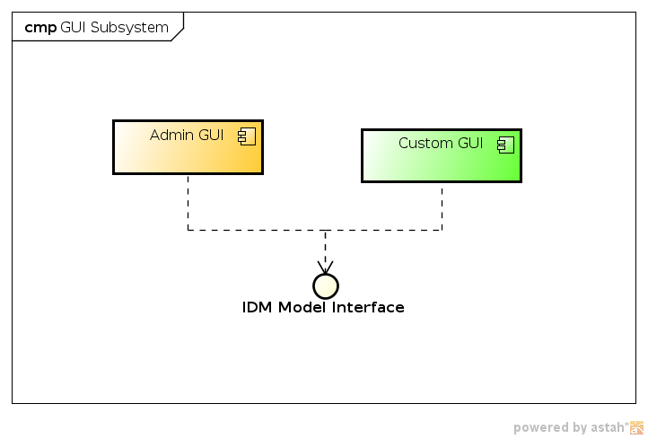

= GUI Subsystem
:page-archived: true
:page-obsolete: true
:page-wiki-name: GUI Subsystem
:page-wiki-metadata-create-user: semancik
:page-wiki-metadata-create-date: 2011-04-29T12:12:56.264+02:00
:page-wiki-metadata-modify-user: lazyman
:page-wiki-metadata-modify-date: 2011-05-10T10:46:37.868+02:00

== Introduction

GUI subsystem interacts with the users.
It interacts with various user types: administrators, end users, help desk operators, etc.
This subsystem may in fact contain several GUI applications for a different purposes.
There is a stock rich system administrator interface used for system configuration and monitoring.
But it is expected that other interfaces will come in the future or will be created as part of system customization, e.g. a simple portlet for end-user password reset.

== Responsibility

* User authentication

* Administrator interaction

** System configuration and customization

** System monitoring

** Managing any user/account record

** Troubleshooting

* End-User interaction

** User self-service

** Checking own assignments

* Fine-grained authorization

== Component Diagram

== Data Structures

GUI subsystem, and especially the administration interface, is using all the objects of the wiki:Data+Model[Data Model]. This includes dynamic interpretation of the wiki:Resource+Schema[Resource Schema] and possibly other dynamic schemas.
This happens especially when a dynamic form is presented to the user and validated after submit.

== Description

Our web application administration interface takes advanage from JSF 2.0 in cooperation with Spring.
We are using IceFaces 2.0 as basic JSF tag library which provides many AJAX enabled components.
Web application also contains several special components, e.g. generated forms component or XML editor based on CodeMirror JavaScript library.
JSF together with templates provides powerful page design customization possibilities as well as localization to many different languages.
Currently we support English, Slovak, Czech, German, Norvegian, Swedish.
Spring is used for controllers, backing beans.
Spring Security is gread framework for securing web application, it's resources and fine-grained authorization based on predefined roles.