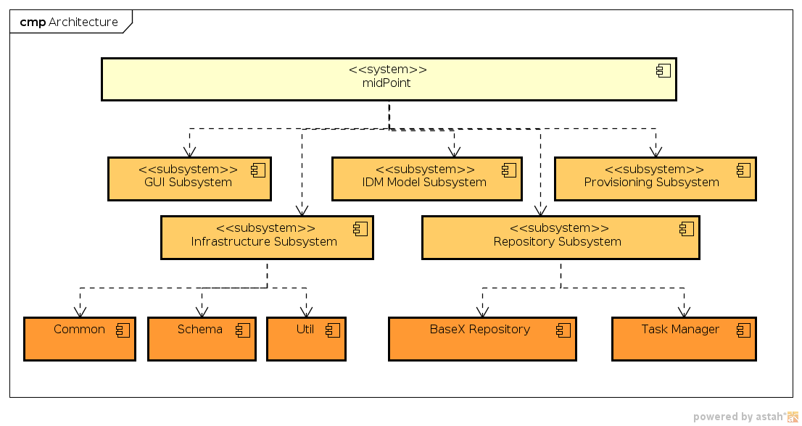

= Subsystems
:page-archived: true
:page-obsolete: true
:page-wiki-name: Subsystems
:page-wiki-id: 655413
:page-wiki-metadata-create-user: semancik
:page-wiki-metadata-create-date: 2011-04-29T12:12:17.647+02:00
:page-wiki-metadata-modify-user: semancik
:page-wiki-metadata-modify-date: 2011-08-05T16:05:56.443+02:00

The pages in this section provide detailed description of individual midPoint subsystems.

++++

++++

== System Decomposition Diagram

