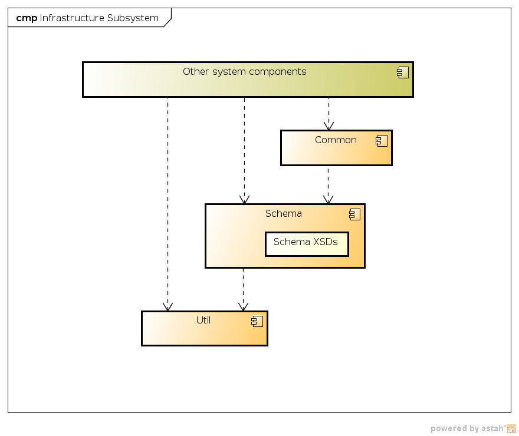

= Infrastructure Subsystem
:page-wiki-name: Infrastructure Subsystem
:page-wiki-id: 655419
:page-wiki-metadata-create-user: semancik
:page-wiki-metadata-create-date: 2011-04-29T12:14:19.906+02:00
:page-wiki-metadata-modify-user: semancik
:page-wiki-metadata-modify-date: 2012-06-25T12:04:31.169+02:00
:page-archived: true
:page-obsolete: true

== Introduction

Infrastructure subsystem provides a platform for the rest of the system.
It contains "real" infrastructure components such as spring or slf4j logging library.
But it also contains many utilities that are conveniently used through the entire system.
One of the primary responsibilities of the infrastructure subsystem is to maintain complete midPoint wiki:Data+Model[Data Model].

Parts of infrastructure subsystem are used by components in all other subsystems.

== Responsibility

* Maintain common data model

** Parsing dynamic parts of schema

** Data representation (XML parsers and writers)

* Provide a "platform": basic set of libraries and low-level services

** logging

** tracing

** auditing

** dependency injection

** diagnostic utilities (such as pretty-printing)

== Component Diagram

== Data Structures

Complete wiki:Data+Model[Data Model] is maintained in the infrastructure subsystem, however the infrastructure subsystem understands and uses only a small portion of that (usually parts of wiki:Prism+Schema[Prism Schema]).

== Description

Infrastructure subsystem is in fact just a bunch of library code.
It has three "layers" with a slightly different purposes:

* *Common* is a set of library functions that depend on schema or are otherwise tied to the midPoint data model.

* *Schema* layer contains the midPoint data model in form of XSD schemas.
These schemas are transformed into a Java classes using JAXB during system build.
The Schema layer also contains library functions that supplement the functions that JAXB cannot do.
It also contains a library that dynamically interprets the schema.

* *Util* is very generic layer that provides low-level functions independent of the schema and also mostly independent of midPoint.
There are utilities that make the work with XML easier, logging, i18n tools, etc.