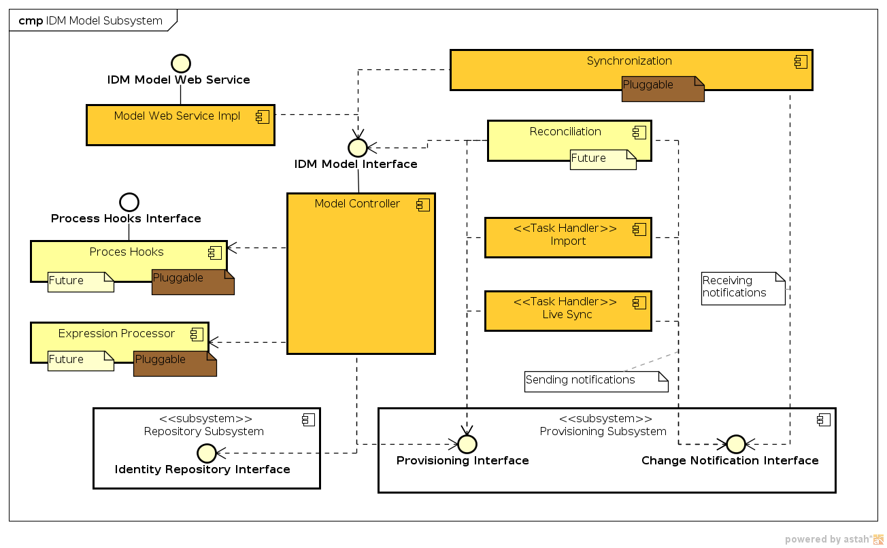

= IDM Model Subsystem
:page-archived: true
:page-obsolete: true
:page-wiki-name: IDM Model Subsystem
:page-wiki-id: 655417
:page-wiki-metadata-create-user: semancik
:page-wiki-metadata-create-date: 2011-04-29T12:13:37.333+02:00
:page-wiki-metadata-modify-user: semancik
:page-wiki-metadata-modify-date: 2013-01-16T17:15:12.480+01:00

== Introduction

IDM Model subsystem implements the theoretical security and access control model that is applied to the system.
It implements logic to synchronize users and accounts, fill in the missing values, validate existing values, direct the propagation of changes and so on.
Generally speaking, it is enforcing overall identity management policy.
IDM Model is the real heart of the system.

Currently the IDM model evaluates a set of expressions that can be used to guide provisioning and synchronization.
Later the model will implement a dynamic variant of Role-Based Access Control (RBAC) model.
The IDM Model is theoretically replaceable with entirely different implementation, bringing quite an extreme flexibility to the system.

== Responsibility

* Hiding the low-level components behind a single facade

** The distinction between repository and provisioning is partially hidden from the clients therefore model provides a kind of location transparency.

** Provisioning functionality is not be exposed directly.
The provisioning actions are carried out by a modification of user or account object.
Therefore the model provides (partial) uniformity of access to all objects.

* Enforce access control policies (with respect to target resources)

** RBAC-based models will maintain roles, their definitions, etc.

** RBAC-based models will enforce creation/deletion of accounts based on role membership

** RBAC-based models may enforce account attributes based on role membership

** the model may implement any mechanism to enforce policies (RuBAC, ABAC, ...) as long as it is usable and consistent.

* Only one model can be active in a specific deployment (models cannot be mixed in the same system)

* Maintain values of virtual attributes

** e.g. attributes implied by role membership, organization, policy, ...

* Handle synchronization changes

* Manage reconciliation

== Component Diagram

== Data Structures

The objects defined in the IDM Model Schema is specific for IDM model component.
However, it is also using other parts of the wiki:Data+Model[Data Model], especially the dynamic wiki:Resource+Schema[Resource Schema]. IDM model is interpreting the schema and also evaluating the expressions specified in the wiki:Resource+Schema+Handling[Resource Schema Handling] part.

One of the most important data model concepts that is processed by IDM model is a concept of wiki:Assignment[Assignment].

== Description

Model is the very core of midPoint with regard to the "identity logic".
Model is dealing with all the algorithms and processes that are specific to identity management domain, common for all the resources and vast majority of deployments.
Therefore Model implements mechanisms like attribute value computation, RBAC, handles synchronization changes, etc.

Current implementation of the model is quite simplistic one.
It is only processing Inbound and Outbound Expressions and handles wiki:Synchronization+Examples[Synchronization Examples]. RBAC or other "advanced" mechanisms are not yet implemented.

From the implementation perspective the IDM model is a monolithic component now, but that should change soon link:https://jira.evolveum.com/browse/MID-67[MID-67].

=== Role-Based Access Control

There is no RBAC implementation in the midPoint now.
It is designed (see wiki:Advanced+Hybrid+RBAC[Advanced Hybrid RBAC]) and the implementation awaits prioritization in the wiki:Roadmap[Roadmap].

=== IDM Model and Busines Logic

wiki:IDM+Model+Web+Service+Interface[IDM Model Web Service Interface] is probably an interface that will often used by business logic to invoke provisioning operations.
This can be used in case that midPoint is a provisioning component of a more complex solution.
However, there are limits to this usage.
For example an "approval" scenario commonly seen in the IDM deployments may be quite difficult to implement in this way.

Current design is documented in the wiki:System+Interactions[System Interactions] section.

Currently there is no practical way how to integrate business logic into the IDM model component.
But that should change in the future link:https://jira.evolveum.com/browse/MID-68[MID-68]

=== Replacing the Model

The complete IDM Model component is theoretically replaceable - it can be exchanged for a different implementation if needed.
However, as the IDM model implements mechanisms common to vast majority of IDM deployments, we expect that this may happen only in a very extreme case.

Please note that both business logic and GUI depends on the model.
Therefore replacing the model may break both default GUI and default business logic.

== See Also

* wiki:IDM+Model+Web+Service+Interface[IDM Model Web Service Interface]

* wiki:Advanced+Hybrid+RBAC[Advanced Hybrid RBAC]