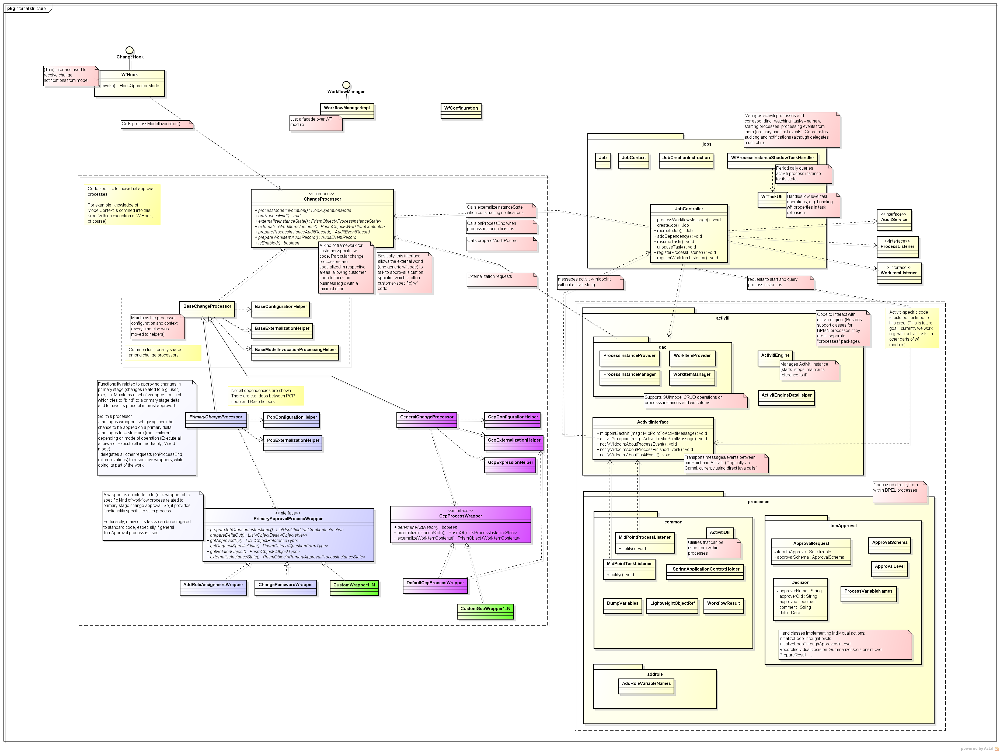
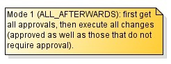
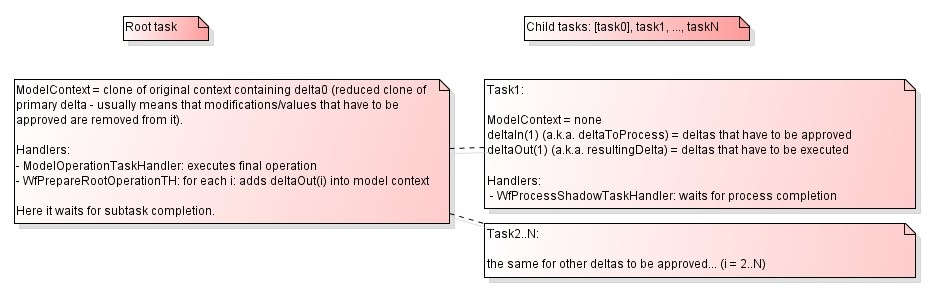
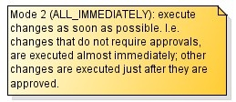
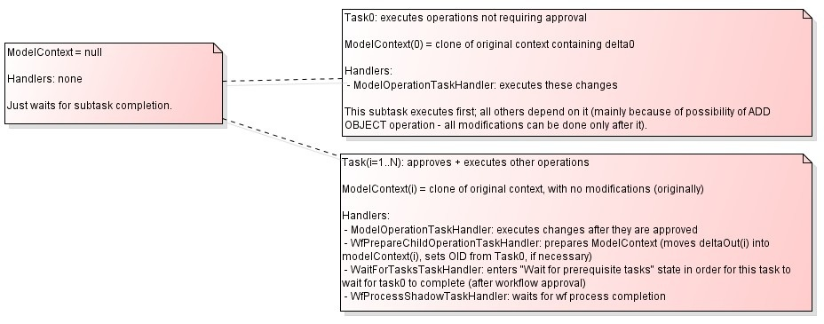
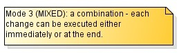
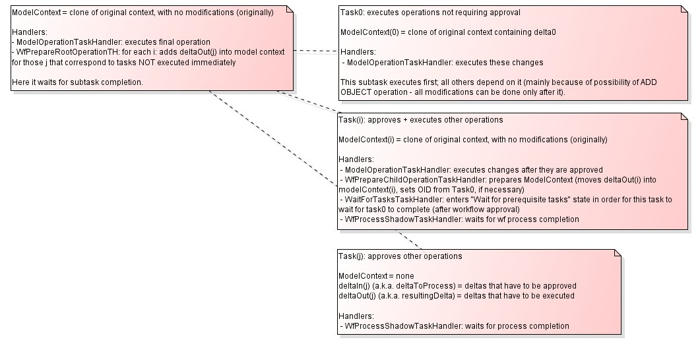
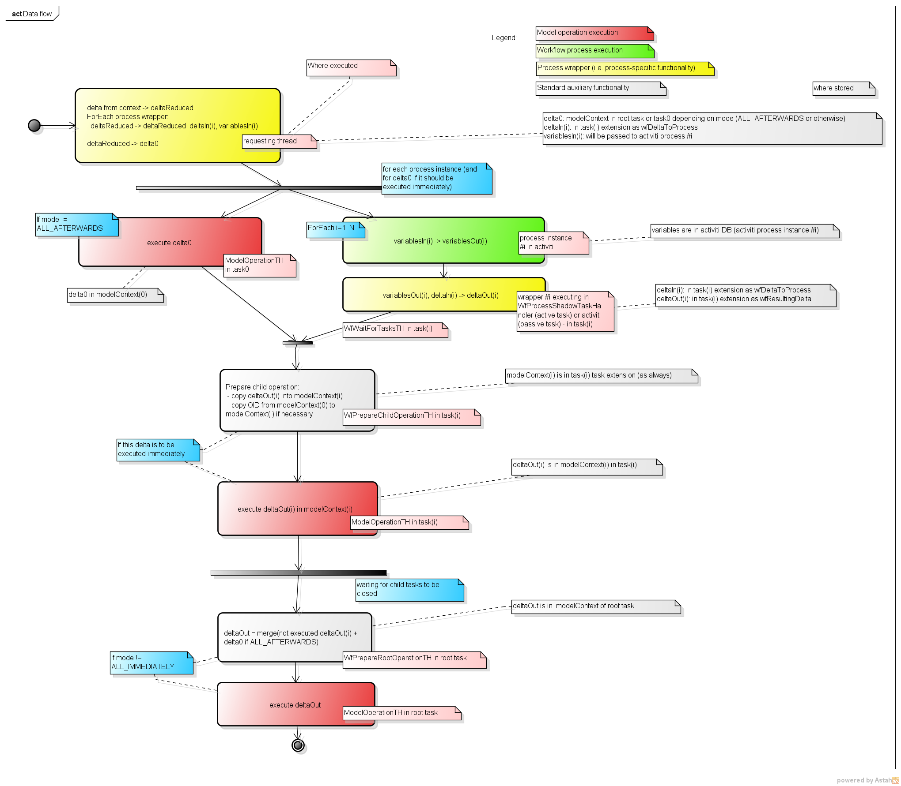
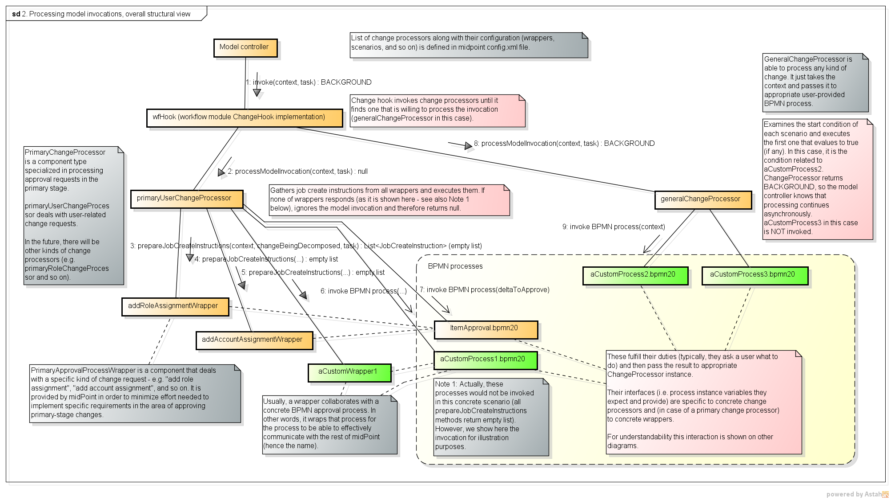

= Workflow Management
:page-wiki-name: Workflow Management
:page-wiki-id: 8061093
:page-wiki-metadata-create-user: mederly
:page-wiki-metadata-create-date: 2013-03-24T01:21:54.691+01:00
:page-wiki-metadata-modify-user: semancik
:page-wiki-metadata-modify-date: 2019-10-08T15:31:51.250+02:00
:page-archived: true
:page-obsolete: true
:page-obsolete-since: "4.0"
:page-toc: top

[WARNING]
.MidPoint 3.9 or earlier
====
This page applies to midPoint 3.9 or earlier.
Embedded workflow engine was removed in midPoint 4.0 and midPoint is now completely wiki:Workflowless[workflowless]. If you still need manual processes as part of IDM interactions please see wiki:Policy-based+approvals[Policy-based approvals] and wiki:Workflow+Integration[Workflow Integration].
====

== General information

Workflows are closely related to the model: when model executes an operation, it may require that some of its parts would be approved by a human users.

Here are some technical information related to workflows.
For other related information, please see the following pages:

* wiki:Workflows+(midPoint+3.x)[general information about workflow feature],

* wiki:Workflow+Interactions[cooperation between midPoint subsystems when workflow is employed] (a sequence diagram),

* wiki:(Idea+of)+Communication+with+Remote+Workflow+Management+System[a sketch of (planned) asynchronous communication between midPoint and an external workflow management system].

== Overall context

This is how workflow module interacts with other modules.

image::1.-Workflow-module-interactions.png[]

In following sections we will describe how all these interactions work.
But before that, let us explain the role of workflow processes and midPoint tasks in the system.

== Workflow processes

Asynchronous interaction with the user is carried out within workflow processes and their instances, managed by workflow management system.
Currently, we use link:http://www.activiti.org[Activiti] to manage workflow processes in midPoint.

Each process consists of BPMN 2.0 code (for overall control and data flow, for carrying out user interaction) and supporting Java code (implementing individual processing components that e.g. prepare data for user tasks and manage users' responses).

Currently, there is one generic "approve any item" process (link:https://github.com/Evolveum/midpoint/blob/master/model/workflow-impl/src/main/resources/processes/ItemApproval.bpmn20.xml[ItemApproval]). It should cover majority of all requirements, as it is highly configurable with regards to how should an item be approved (using various approval levels, each level having defined a set of approvers with a strategy how final decision depends on individual approvers' decisions).
However, if necessary, it is possible to create a custom workflow process using BPMN and Java.

As a note, there are two kinds of processes in the workflow module, related to how they pass an information to midPoint.
A process is either:

. "smart" - it actively pushes the information to midPoint;

. or "dumb" - the only thing what it does is setting some of its variables.
It depends on midPoint to actively query the process instance state and act upon values of these variables.

At the midPoint side, the main difference is in child tasks that monitor these workflow process instances (see below).

== Workflow-related midPoint tasks

There is a fundamental mechanism for carrying out and monitoring long-running, asynchronous operations in midPoint (such as operations that require human approval): wiki:Task+Manager[tasks].

"Normal" operation in model is carried out completely in the caller's thread, whereas "asynchronous" operation, e.g. the one that contains elements that have to be manually approved, starts in the caller's thread, but continues asynchronously within a task.
The idea is that *one operation is represented by one task*, potentially having subtasks for partial operations.

In the case of human approvals, there are the following tasks present:

. the *root task*, which serves as a central point of monitoring (e.g. seeing how things are going), management (e.g. cancelling the whole operation), and sometimes execution (e.g. executing approved request),

. *child tasks*, serving auxiliary purposes, namely monitoring individual workflow approval processes, and sometimes executing approved parts of the original request.
As a rule, *each workflow process instance is assigned one midPoint task* that is "watching" (or "shadowing") the execution of the process instance.
For smart processes, these tasks are passive (in WAITING mode), until the process instance finishes.
For dumb processes, these tasks are active (in RUNNABLE state), waking each wiki:Legacy+(pre-3.5)+workflow+configuration[processCheckInterval] secods, and actively checking the wf process instance state.

There are two basic strategies related to execution of operations with approvals:

. *"execute all afterwards"* - all approvals are collected, and then the operation (as a whole) is carried out;

. *"execute all immediately"* - partial operations are executed as soon as possible, i.e. as soon as they are approved (or immediately, if no approval for specific partial operation is required).

These strategies can be combined, whereas some of partial operations are executed immediately, while others are executed after all approvals are collected.

If you want to create your own approval processes, it is necessary to understand the architecture of the workflow module.

== Architecture of the Workflow module

Workflow module has a flexible architecture, that is (at least we hope so) able to fulfill many current or future requirements.
It is shown in a following figure (TODO present a simplified schema first.)

Basic architectural pieces are the following:

. Change processors

. Job management

. Activiti interface

. BPEL processes with supporting code

=== Change processors

A change processor can be viewed as a kind of framework supporting customer-specific workflow code.
Individual change processors are specialized in their areas of applicability, allowing customer code to focus on business logic with minimal effort.

The name "change processor" is derived from the fact that primary purpose of this framework is to process change requests coming from the model.

However, a change processor has much broader duties, e.g.

. it recognizes the instance (instances) of given kind of change within model operation context - see processModelInvocation method,

. it processes the result of the workflow process instances when they are finished - see onProcessEnd method,

. it presents (externalizes) the content of process instances to outside world: to the GUI, auditing, and notifications - see externalizeInstanceState/externalizeWorkItemContents methods, and prepareProcessInstanceAuditRecord/prepareWorkItemAuditRecord methods.

Currently, there are the following change processors implemented or planned:

* *PrimaryChangeProcessor*: manages approvals of changes of focus objects (in model's primary stage) - *implemented*.

* *GeneralChangeProcessor*: manages any change, as configured by the system engineer/administrator - *implemented*.

* *ResourceModificationProcessor*: specifically manages approvals of changes related to individual resources (in model's secondary stage) - *planned.*

Each change is processed by *at most one* change processor.
They are tried by the workflow module in the order prescribed by the system administrator in midPoint configuration file.

It is expected that change processors are more or less fixed.
However, nothing prevents a developer from creating his own, if necessary.

=== Job management

This module manages Activiti processes and midPoint tasks that cooperate in workflow processing.
Its primary tasks are:

. starting process instances and midPoint tasks,

. processing events from process instances (ordinary and final events),

. coordinating auditing and notifications; although this module delegates much of it to a change processor.

Why "jobs"? Tasks and workflow process often work in pairs: Activiti executes a given process instance, and midPoint monitors this instance using a dedicated task.

. For "smart" processes this task sits in WAITING state and is being modified by a code that executes in the context of Activiti process.

. For "dumb" processes this task is RUNNABLE and periodically queries Activiti for information about particular process instance, recording that information in the task.

We view such a pair as an entity, called "a job".

There are also jobs that have no Activiti workflow part, only a midPoint task part - these are used e.g. for managing a set of related jobs (see the discussion on root and child tasks), or for executing changes that do not require approvals.

Jobs are dealt with by a package com.evolveum.midpoint.wf.jobs; namely by the following classes:

* *Job*: represents a given job (task-process instance pair).

* *JobController*: manages jobs and various aspects of their execution (e.g. starts them, treats messages coming from wf process instances, including final messages when process instances end, manages auditing and notifications, etc.)

* *JobCreationInstruction*: quite complex data structure carrying all information necessary for starting a job - i.e. starting Activiti wf process instance as well as corresponding midPoint task.

=== Activiti interface

We tried to make workflow module as independent of particular workflow engine as practically possible.
So we placed Activiti-related code to the "Activiti interface" module (com.evolveum.midpoint.wf.activiti package).
This module is responsible for:

. starting activiti process instances,

. querying for activiti process instances state,

. catching events coming from activiti process instances and activiti tasks,

. querying activiti for running and historical process instances and tasks, to be shown in midPoint GUI,

. starting and stopping activiti engine.

=== BPEL processes with supporting code

Finally, the workflows are implemented using processes.
They are entities that drive the whole approval interactions.

Along with BPEL processes and code that is called from these processes, a code that provides low-level interface to midPoint is also put here.
It is contained in ProcessMidPointInterface and its implementing classes.
(Serves primarily to interpret process internal state, but provides also helper methods e.g. for starting a process instance.)

Processes reside in *resources/processes* directory, whereas the supporting code is in *com.evolveum.midpoint.wf.processes* package.

== PrimaryChangeProcessor details

This change processor provides functionality related to approving changes in primary stage (changes related to e.g. user, role, ...). It does so by maintaining a set of *change aspects*, each of which tries to "bind" to a primary stage delta and to have its piece of interest approved.
Along with all related duties.

So, this processor

. manages a set of change aspects, giving them the chance to be applied on a primary focus delta,

. manages task structure (root, children), depending on mode of operation (Execute all afterward, Execute all immediately, Mixed mode - see below),

. delegates all other requests (onProcessEnd, externalizations) to respective change aspects, while doing its part of the work.

What's a change aspect, then?

=== Change aspect

Change aspect deals with a given (elementary) kind of primary-stage change.
Examples of change aspects:

* AddRoleAssignmentAspect - implemented

* CreateUserAspect - planned

* ChangeAttributeXAspect (X is an attribute of a user) - planned

* ...

It plays a role on these occasions:

. When a change arrives - change aspect tries to recognize whether the change contains relevant delta(s); if so, it prepares instruction(s) to start related workflow approval process(es).

. When a process instance finishes,

.. change aspect modifies the delta(s) related to particular process instance and passes them along, to be executed,

.. provides a list of approvers that is to be stored in modified object's metadata.

. When a user wants to work on his task, the change aspect prepares a form to be presented to the user.

. When a user asks about the state of process instance(s), the change aspect prepares that part of the answer that is specific to individual process.

It is easy for a developer to create his own, specific change aspect.

=== Task execution strategies

Individual execution strategies shown in following figures. In order to understand it, it is good to know the following fundamental parts that participate in execution of operations with approvals:

. *ModelContext* - it is a context of the operation in the midPoint Model subsystem.
This context can be "frozen", e.g. by serializing and storing into a task extension item, and after a while, "unfrozen" - retrieved, deserialized, and sent into Model clockwork for the operation to be resumed.
In "execute all afterwards" situation, there is only one ModelContext, and it is stored in the root task.
In "execute all immediately" situation, each task has its own (partial) ModelContext.

. *Task handler* - it is an object that carries out specific functionality when called.
Main task handlers used in approval scenarios are:

.. *ModelOperationTaskHandler*: deserializes and executes model operation related to context stored in the task (in the modelContext property of task's extension),

.. *WfProcessShadowTaskHandler*: is responsible for watching execution of workflow process instances and reacting to situation when such instance produces a result (more on that later),

.. besides them, there are *auxiliary task handlers* (e.g. WfPrepareRootOperationTaskHandler, WfPrepareChildOperationTaskHandler, WaitForTasksTaskHandler) that are used e.g. to manipulate data or state of particular task or tasks.

. Primary delta and its parts. (This one is specific to PrimaryChangeProcessor.) Primary delta describes the request that has to be carried out.
It may be a request to create an object ("add" delta) or a request to modify or delete an object ("modify", and "delete" delta, respectively).
Some parts of the delta may be a subject of approval.
Therefore, when evaluating the primary delta, we apply a set of components (called change aspects) on the delta, from which each one may "tear off" one or more parts of the original delta.
In the following, delta1..N denote such "torn off" parts, each of which is independently approved.
Delta0 then denotes the remaining parts of the original delta, that do not require approval.

.. An example: if original delta instructs to modify a user's full name, and to add three roles to him (Role1, Role2, Role3); and if Roles 2 and 3 are security-sensitive, the decomposition could be:

... delta0 = modify full name, add Role1

... delta1 = add assignment of Role2

... delta2 = add assignment of Role3

So, here are the strategies:

*"Execute all afterwards"*

Child tasks here serve only the purpose of monitoring execution of approval workflows. All follow-on processing is done in the context of root task.

*"Execute all immediately"*

Child tasks here monitor execution of approval workflows (except for Task0), as well as execute the operations (all of them). Root task serves only as a point of monitoring and management (e.g. when canceling the whole operation).

*"Mixed mode"*

This is a combination of previous two approaches.

Currently, this mode cannot be started from GUI, but the architecture is prepared for such a solution.

When looking at the processing as such, and data that flow between individual processing steps, the situation is following:

 +
(click to enlarge).

== GeneralChangeProcessor

TODO

 +

 +

== Some unsorted notes

(TODO: put the following remarks into solid context)

=== Tasks in even more detail

==== Task extension elements

Related to *model operations*:

[%autowidth]
|===
| Name | Type | Cardinality | Description

| *m:modelContext*
| LensContextType
| 0..1
| holds serialized model context of the current operation

| *m:skipModelContextProcessing*
| Boolean
| 0..1
| if TRUE, model context processing within ModelOperationTaskHandler is skipped

|===

 +

Related to *workflows* - present in tasks that watch workflow process instances (child tasks):

[%autowidth]
|===
| Name | Type | Cardinality | Description

| *wf:processInstanceId*
| String
| 0..1
| Contains relevant activiti process instance ID (when known).

| *wf:processInstanceFinished*
| Boolean
| 0..1
| Just a flag whether the process instance related to the task has already finished (used e.g. to determine if the shadowing handler should end or not).

| *wf:changeProcessor*
| String
| 0..1
| Contains name of class that manages this particular model operation ("change", thus "change processor"). See below.

| *wf:status*
| String
| 0..N
| Contains history of process status messages.
Such messages can contain any process-related messages that should be visible to the user (e.g. "your request was approved by engineering group, and is being sent to the management"). For simple processes, the status has mostly the value "Workflow process instance has proceeded".
In order to be able to sort these status messages chronologically, each is prefixed by a timestamp (long value + formatted string value).
Storing of these wfStatus values can be simply turned off in WfTaskUtil class.

| *wf:lastVariables*
| String
| 0..1
| A dump of recent process instance variables (for diagnostic purposes).

| *wf:lastDetails*
| String
| 0..1
| String representation of recent process instance information (for diagnostic purposes).

| [.green]#*wf:deltaToProcess*#
| [.green]#ObjectDeltaType#
| [.green]#0..N#
| [.green]#Contains deltaIn(i), i.e. delta(s) that has to be approved.#

| [.green]#*wf:resultingDelta*#
| [.green]#ObjectDeltaType#
| [.green]#0..N#
| [.green]#Contains deltaOut(i), i.e. delta(s) that are the result of the approval process (most common situation is that deltaOut(i) = either deltaIn(i) (if approved), or null/empty delta (if rejected).#

| wf:approvedBy
| ObjectReferenceType
| 0..N
| Contains a set of approvers who approved the delta(s). The change processor should put here those approvers that will be stored into approvers list in metadata when the operation is really executed.

| [.green]#*wf:changeAspect*#
| [.green]#String#
| [.green]#0..1#
| [.green]#Name of class that provides an interface between midPoint and activiti process. +
#

|===

Status, LastVariables, and LastDetails are currently used only for diagnostics.
They are visible only via debug pages.

 +

== How to write and manage workflow processes

When creating your own workflow processes, there are a couple of conventions to be held. One of them are the variables with which a process should work. Most of them are described in CommonProcessVariableNames file, here repeated for clarity.

Note: "Set by" column denotes who is responsible for setting and maintaining the value of particular variable. "Processor/wrapper" means the wrapper or change processor, "process" means the process (via BPMN or Java code).

*[.underline]#Process instance variables#*:

[%autowidth]
|===
| Name | Type | Set by | Content

| *processInstanceName*
| String
| processor/wrapper
| Process instance name, e.g. "Approving adding Webmaster to JoeDoe".

| *startTime*
| java.util.Date
| processor/wrapper
| When the process instance was started.

| *midPointTaskOid*
| String
| processor/wrapper
| OID of task related to the process instance.

| *midPointChangeProcessor*
| String
| processor/wrapper
| Java class name of the change processor (the same as wf:changeProcessor task property)

| [.green]#*midPointProcessWrapper*#
| [.green]#String#
| [.green]#processor/wrapper#
| [.green]#Java class name of the process wrapper (the same as wf:processWrapper task property)#

| *midPointRequesterOid*
| String
| processor/wrapper
| OID of the user who requested the particular operation (e.g. adding of a role to another user).
Used e.g. for searching for process instances requested by particular user.

| [.green]#*midPointObjectOid*#
| [.green]#String#
| [.green]#processor/wrapper#
| [.green]#OID of the object (typically, a user) that is being changed within the operation (null for ADD operation).#

| [.green]#*midPointObjectToBeAdded*#
| [.green]#ObjectType#
| [.green]#processor/wrapper#
| [.green]#Object that is about to be added (for ADD operation).#

| [.green]#*midPointDelta*#
| [.green]#String#
| [.green]#processor/wrapper#
| [.green]#XML representation of the delta to be approved. (Note that technically a process can approve more deltas; if necessary, this variable would have to be changed.)#

| *util*
| ActivitiUtil
| processor/wrapper
| Object that provides various utility methods for use in processes, e.g. getApprover(RoleType r).

| *midPointState*
| String
| process
| Variable reflecting the process status, like "your request was approved by engineering group, and is being sent to the management".
Stored into wfStatus task extension property.

| *midPointAnswer*
| String
| process
| Textual representation of the decision obtained via wf process instance.
For some processes, it is a simple pass:[__APPROVED__/__REJECTED__] flag.
For others, here could be any string information.

| *[H]decision*
| Boolean
| process
| Decision whether to approve or reject particular work item - set by user task (form).

| *comment*
| Boolean
| process
| Comment related to that decision - set by user task (form).

|===

[.underline]#*Variables specific to the standard ItemApproval process (see link:https://fisheye.evolveum.com/browse/midPoint-git/model/workflow-api/src/main/java/com/evolveum/midpoint/wf/processes/general/ProcessVariableNames.java?hb=true[ProcessVariableNames]):*#

[%autowidth]
|===
| Name | Type | Set by | Content

| *approvalRequest*
| ApprovalRequest
| wrapper
| A data structure that describes the request to approve something.
Contains item that has to be approved (e.g. assignment) and approval schema.

| *approvalTaskName*
| String
| wrapper
| How the user task (work item) should be named.

| *allDecisions*
| List<Decision>
| process
| List of all decisions done within this process instance.

| *loopLevels_stop*
| Boolean
| process
| Whether we have to stop approving at the current level (means the approval was rejected at this level).

| *level*
| ApprovalLevel
| process
| Information about currently active level of approval.

| *approversInLevel*
| List<LightweightObjectRef>
| process
| Approvers that should be consulted within this level.

| *decisionsInLevel*
| List<Decision>
| process
| List of decisions done in this level.

| *loopApproversInLevel_stop*
| Boolean
| process
| Whether we have to stop evaluating current level (e.g. because strategy was 'firstDecides' and the first person decided (approved or rejected).

|===

[.underline]#*Variables specific to "add roles" approval process(es):*#

[%autowidth]
|===
| Name | Type | Content

| *userName*
| String
| Name of user to which an assignment is to be made.

|===

== Processing model invocations

The model invocations are processed as shown in the following figure.
It captures the use of both currently implemented change processors (see below): PrimaryChangeProcessor and GeneralChangeProcessor.
(Note that this figure corresponds to midPoint version 2.3-SNAPSHOT.
In version 2.2, there is no GeneralChangeProcessor and the names of some methods are slightly different.)

