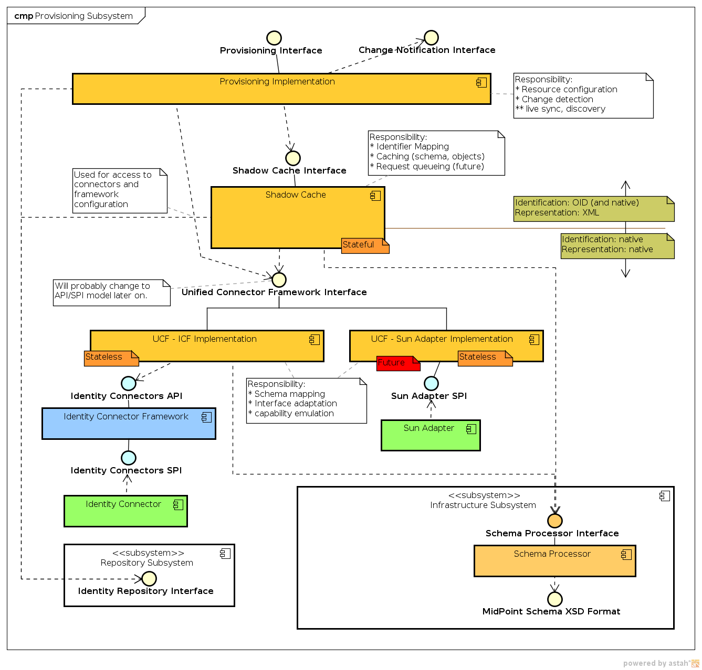

= Provisioning Subsystem
:page-wiki-name: Provisioning Subsystem
:page-wiki-metadata-create-user: semancik
:page-wiki-metadata-create-date: 2011-04-29T12:16:34.816+02:00
:page-wiki-metadata-modify-user: semancik
:page-wiki-metadata-modify-date: 2012-06-25T12:06:15.250+02:00
:page-archived: true
:page-obsolete: true

== Introduction

The goal of the Provisioning Subsystem is to talk to the external Resources.
It connects to the directory servers, HR systems, mainframes and other types of systems.
It retrieves information from Resources and also modifies the information as necessary.
Provisioning subsystems do care only about information related to identity management, that means accounts, groups, roles, entitlements and similar objects.

The provisioning subsystem hides the details of the connections to the Resources.
I.e. it does not matter whether LDAP, telnet or SSH is used to connect to the target system.
It is a sole responsibility of the Provisioning Subsystem to deal with the communication protocol, fault handling, network connectivity and so on.

All identity-related entities of the Resources are presented as _resource objects_ by the Provisioning subsystem.
An application account is a resource object as is a UNIX group.
The objects have the same form, but may be of different types and may have different content (schema).
While the provisioning subsystem hides the details regarding _communication protocol_ used to connect to the resource, it only partially hides the details of the _identity database structure_ on the resource.
For instance the fact that user's accounts are stored in `the /etc/passwd` file on UNIX machines will be hidden in the Provisioning Subsystem as well as the commands which are natively used to maintain the users there.
On the other hand the fact that UNIX user accounts have string login names and numeric UIDs will be exposed outside the Provisioning Subsystem.
The Provisioning Subsystem is exposing the wiki:Resource+Schema[Resource Schema] which describes types and content of all resource objects for each resource instance.

== Responsibility

* Manage objects on the Resources (target/source systems).

** _Objects_ means any entities related to identity management, especially accounts, groups, roles, entitlements, account attributes, credentials, etc.

** _Manage_ means retrieving, creating, modifying and deleting objects (CRUD-like operations)

* Provide ability to search resource objects

* Provide schema of resource objects

** The Provisioning subsystem must be able to provide the schema definition for resource objects which each resource instance supports.

* Detect changes on the Resource (target/source systems)

* Cache information obtained from the Resources (if needed)

== Component Diagram

== Component Structure

Provisioning subsystem is divided into several sub-components that are weakly separated into layers.

See wiki:Provisioning+Interactions[Provisioning Interactions] page for illustrations how the layers work together.

=== Provisioning Service

Provisioning service is a *facade* provided to other midPoint subsystems.
From the implementation side it is just a "dispatcher" that routes interface calls to appropriate places.
E.g. the operations regarding resource definitions are routed directly to the repository, operations of shadow objects are routed to the shadow cache and so on.

The components governing synchronization, import and parts of reconciliation also belongs into this layer.

This layer deals with "XML" objects identified by OID.
Except for few special cases that the "native" resource object are exposed to other subsystems e.g. for diagnostic purposes or for a special customized business logic.

=== Shadow Cache

Shadow cache handles Resource Object Shadows (see wiki:Shadow+Objects[Shadow Objects]). These "shadows" are stored partially in repository and partially on the resource.
The responsibility of the Shadow Cache is to merge these representations into a single, consistent view.
In short, Shadow Cache takes care of aligning the shadow objects in repository with the real state of the resource.

The repository content is considered a "cache" when it comes to Shadow objects.
That's why they are called "shadow" objects after all.
When a new state (values) of the resource object is detected, the shadow in the repository should be updated.
No matter if that was detected by synchronization, reconciliation or an ordinary get from resource.
The shadow cache is supposed to keep repository state and resource state as consistent as practically possible.

Shadow cache is translating "native" representation of resource object (as seen by UCF) to a "XML" representation (as seen by repository and higher layers).

The component is not really caching anything now.
But the name "cache" is supposed to refer to the future expected use of this component.
The Shadow Cache should take care of "caching" the resource state in the repository for faster access and for the "offline" cases.
See wiki:Virtual+and+Meta[#Virtual and Meta] below for more details.

=== Unified Connector Framework (UCF)

Unified Connector Framework (UCF) is a layer supposed to expand and unify capabilities of existing connector frameworks.
It is an embryo of "ideal" connector framework interface.

This is work in progress.
Current UCF interface design should not be seen as public, it is midPoint-internal interface.
It is not even a standard draft.
It is just a prototype, an experiment of a practical unified connector framework interface.
We are sure that _it will change_ and it may change quite a lot.

The current implementation of the UCF is quite hardcoded to the ICF layer below, tries to improve it and also work around some of the known ICF issues.
The implementation will change to something more "pluggable" in the future.

UCF is dealing only with "native" representation of resource objects.
It has (almost) nothing to do with the "XML" and does *not* use OID for identification.
The identification of the resource objects is native, without any fixed predetermined identifier.
See wiki:Shadow+Objects[Shadow Objects] for more details.

The UCF is something that Identity Connector Framework ICF should provide wiki:ICF+Issues[but it failed to do so]. UCF is a work towards a better solution.

=== Specific Connector Frameworks

This layer contains Identity Connector Framework (ICF) now.
More implementations may come in the future.

=== Connectors

Connectors of the specific framework belong in this layer.
For now it is just ICF connectors.

=== Other components.

Schema processor from the wiki:Infrastructure+Subsystem[Infrastructure Subsystem] is used to handle the dynamic wiki:Resource+Schema[Resource Schema]. It is used by almost all provisioning layers.

== Data Structures

The Provisioning Subsystem is responsible for managing the following objects from the wiki:Data+Model[Data Model]:

* wiki:MidPoint+Common+Schema[Resource Object Shadow] including all subtypes

* wiki:MidPoint+Common+Schema[Resource]

* Connector [.red]#TODO#

* Resource objects that conform to a (dynamic) wiki:Resource+Schema[Resource Schema] for a particular Resource

There is an important distinction between objects from Resource Schema and other objects.
Resource schema is dynamic and it is only available in run-time.
The Provisioning Subsystem is using the wiki:Identity+Repository+Interface[Identity Repository Interface] to store the static objects (objects from wiki:MidPoint+Common+Schema[MidPoint Common Schema]). Provisioning Subsystem is regarded to be the "owner" of these object types, it may transform these objects, add or remove attributes, synchronize them with target systems, etc.
Dynamic objects (from wiki:Resource+Schema[Resource Schema]) are not stored directly.
If they are stored, they take form of wiki:MidPoint+Common+Schema[Resource Object Shadow]. See wiki:Shadow+Objects[Shadow Objects] for more details.

=== Resource Schema

Resource schema represents the objects on the resource, therefore it depends on resource type and also resource configuration.
E.g. the schema for directory server might depend on the LDAP schema applied to that directory server.
The resource schema is available only at run-time.
As it depends on a specific deployment of midPoint system, Resource Schema cannot be available at compile-time, it cannot be part of interface definitions and cannot be used to generate the code (e.g. by using JAXB).
The resource schema is also dynamic and may change during run-time, for example if the LDAP schema of directory server is updated.

Resource schema is either part of resource connector code or configuration (if it is reasonably fixed) or it may be dynamically generated (or mapped) from the native resource schema (e.g. from LDAP schema).

Resource schema will be exposed to the IDM model, business logic and GUI.
Therefore these components can take advantage of the schema in run-time.
For example GUI framework can iterate through the schema and dynamically create forms based on the properties of resource objects.

Stock midPoint components that work with resource schema are interpreting the schema dynamically at run-time.
The custom components in a deployment may either be hard-wired to a schema of the resource instances in a specific deployment or be able to parse the resource schema dynamically.
In the former case is quite easy to implement, but the system may break if resource schema is modified.
The customizations will need to be changed to adapt to the changed schema.
The latter case can adapt automatically, but may be more difficult to implement and test.
The implementer has a free choice which path to take.

== Interfaces

The Provisioning subsystem is exposing the following interfaces:

* wiki:Provisioning+Service+Interface[Provisioning Service Interface]

== Future Plans

=== Virtual and Meta

Provisioning Systems should be able to operate using two rather distinct approaches:

* *Virtual approach*: Retrieving the data directly from the resource whenever they are needed.
Modification operations write data directly to the resources.
The IDM system does not store any information about resource data except for identifiers needed to link accounts to users.
This approach provides good consistency.
The fetched data are always fresh and there is no need to maintain copies and synchronize them.
However such system may be quite slow and unreliable, especially if we there are many resources and the resources fail from time to time.
Creating comprehensive reports is also very difficult and extremely slow.

* *Meta approach*: Store copies of all resource data in the IDM database.
Synchronize the stored data with the resource as frequently as possible.
This approach gives us fast access to all the data.
However, the data may become stale.
Also it is very difficult to reconcile changes, as they may happen in both the IDM system and on the resource.
There is also a higher requirement on storage capacity and performance of the IDM system.

In practice we need both approaches; we even expect that some deployment will use both approaches at the same time.
The responsibility of the Provisioning Subsystem is to implement these approaches.
The clients of the Provisioning Subsystem should not care what approach is used.
That should be just a matter of provisioning subsystem configuration.
The clients of the Provisioning Subsystem should just get the data - no matter if they are cached or freshly retrieved from the resource.

== See Also

* wiki:Shadow+Objects[Shadow Objects]

* wiki:Provisioning+Interactions[Provisioning Interactions]

== TODO

* sync vs async