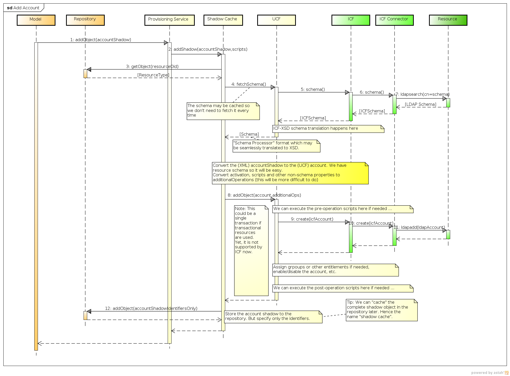

= Provisioning Interactions
:page-wiki-name: Provisioning Interactions
:page-wiki-id: 2654221
:page-wiki-metadata-create-user: semancik
:page-wiki-metadata-create-date: 2011-06-09T13:55:42.588+02:00
:page-wiki-metadata-modify-user: semancik
:page-wiki-metadata-modify-date: 2011-06-09T14:45:22.824+02:00
:page-archived: true
:page-obsolete: true

== Add Account

The diagram illustrates a sequence of adding new account initiated from the Model.
It shows how the call is sequenced between individual provisioning layers.

The most recent version of the diagram is link:https://svn.evolveum.com/midpoint/design/images/architecture/Architecture/Provisioning%20Subsystem/Add%20Account.png[in the SVN] (may be work in progress).

== Synchronization

See xref:/midpoint/architecture/archive/interactions/synchronization-interactions/[Synchronization Interactions]

== Import from Resource

See xref:/midpoint/architecture/archive/interactions/import-interactions/[Import Interactions]