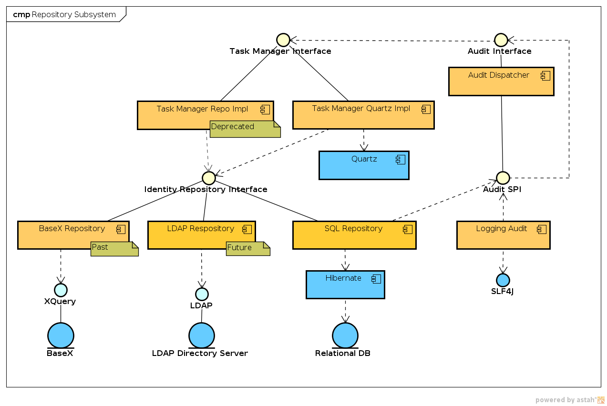

= Repository Subsystem
:page-wiki-name: Repository Subsystem
:page-wiki-id: 655433
:page-wiki-metadata-create-user: semancik
:page-wiki-metadata-create-date: 2011-04-29T12:20:05.081+02:00
:page-wiki-metadata-modify-user: semancik
:page-wiki-metadata-modify-date: 2012-06-25T11:44:18.389+02:00
:page-archived: true
:page-outdated: true

== Introduction

The repository subsystem is storing midPoint objects into a persistent data storage.
The input and output data to the xref:/midpoint/architecture/archive/subsystems/repo/identity-repository-interface/[interface of the repository subsystem] are objects from the xref:/midpoint/reference/schema/[Data Model]. The data model objects may be represented in XML and the repository may take advantage of that.
But the actual storage of the data may be implemented using whatever data format is native for the storage, which may not necessarily be XML.
Therefore the data may be stored in tables in a relational database, in LDAP objects in a directory server or in raw XML in the XML database.

The repository subsystem is hiding most of the data storage details.
The clients of the repository subsystem should not need to know where and how the data is stored and retrieved.
The xref:/midpoint/architecture/archive/subsystems/repo/identity-repository-interface/[Identity Repository Interface] is designed to be a kind of common denominator of features of all practical data stores that could be used with midPoint.
Therefore changing the data store type (e.g. from relational database to LDAP) should not influence the code of the higher components.

The repository subsystem is also responsible for low-level task management.

== Responsibility

* Storing (extensible) identity objects, e.g. users, roles, accounts, ...

* Storing extensible generic objects.

* Provide durability, atomicity and weak consistency

* Do *not* provide any special logic or handling for the objects

** No business logic, only very basic (and necessary) transformations or validations

* Task management

* Auditing

== Component Diagram

== Interfaces

The subsystem provides one major interface:

* The xref:/midpoint/architecture/archive/subsystems/repo/identity-repository-interface/[Identity Repository Interface] is used to access this subsystem.
It can be used to store objects which are common in most identity management deployments, such as `User`, `Account`, `Resource`, `Role`, etc.
It is following quite a strict (yet extensible) XML schema.
Operations of this interface return a typed object instance; therefore it should be easy to use and reasonably type-safe.
Existing object types may be extended.
New object types cannot be directly created, but these may be stored in a generic object type.

== Major Data Structures

The repository subsystem is storing and retrieving data objects that belong to the xref:/midpoint/reference/schema/[Data Model]. However, the repository subsystem is just storing and retrieving the data objects, it does not implement any special logic or special behavior.
These data objects are then used by other subsystems, most notably xref:/midpoint/architecture/archive/subsystems/provisioning/[Provisioning Subsystem] and xref:/midpoint/architecture/archive/subsystems/model/[IDM Model Subsystem].

=== Data Extensibility

There are two rather distinct ways of how to extend the basic data model: extend existing objects and create new objects.
The following sections describe both of them.

==== Extending Existing Objects

Extending existing objects is quite straightforward.
The majority of the objects in the standard xref:/midpoint/reference/schema/[Data Model] have a special `extension` XML element.
Any non-standard property can be placed in this element and it will be handled almost like a standard property.
The off-the-shelf model or provisioning subsystem will not understand such custom properties and will ignore them.
But expressions, custom business logic, GUI or customized midPoint components may understand such custom properties and may take advantage of them.

==== Creating New Objects

Creating new object types requires a different approach.
There is the xref:/midpoint/reference/schema/[Generic Object] type which is designed especially for the purpose of holding custom data.
Generic objects can store any properties and will also remember a custom object type.
Therefore the easiest way of how to create a new object type is to map it to the Generic Object type.

However, that will not provide any schema validation and only minimal type safety for new objects.
There are several ways on how to improve that and some of them will be implemented later in the project, but the Generic Object mechanism should be enough for now.

== Task Management

Repository subsystem is also responsible for low-level task management.
This management includes:

* Executing one-shot (single) tasks such as imports and approvals

* Executing recurring tasks such as synchronization and attestation

* Distributing tasks between several nodes

* Reliability and failover of tasks

* Provide interface to deal with asynchronous tasks

The task management is part of repository subsystem.
Although it may not be perfect fit, this have been decided for several reasons:

* The task management is not stateless infrastructure functionality as it needs to use repository state.
Therefore it has to be implemented on top of the repository interface.

* Task management is used by all system components above the repository subsystem, namely provisioning (async provisioning) and model (import, synchronization).

* Ideally the task management needs either its own subsystem, but that would complicate the system.
It makes no sense to have a subsystem for every component.

* Task manager needs some low-level functionality to synchronize several nodes.
Basic mechanism for this is provided by repository and is expected to be used only by task manager (claimTask, releaseTask).
Although now they are part of a public repository interface, they may be moved to a intra-subsystem interface later.

* It is expected that the repository implementations may provide more efficient mechanisms to distribute and coordinate tasks.
Therefore it may be expected that the repository and task manager implementations might be more tightly coupled in some cases.

See xref:/midpoint/architecture/archive/subsystems/repo/task-manager/[Task Manager (original version)] page for more details.

== See Also

* xref:/midpoint/reference/schema/[Data Model]

* xref:/midpoint/architecture/concepts/consistency-model/[Consistency Model]

* xref:/midpoint/architecture/archive/subsystems/repo/task-manager/[Task Manager (original version)]