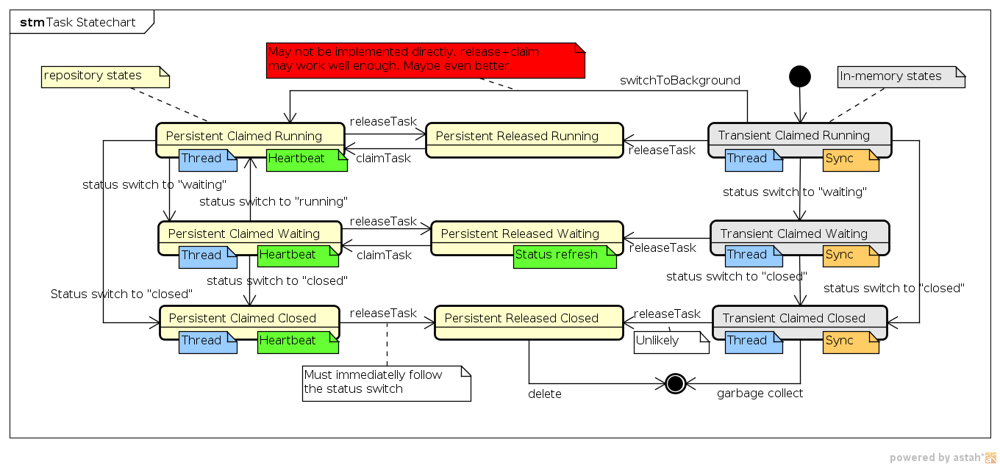

= Task Manager (original version)
:page-wiki-name: Task Manager (original version)
:page-wiki-metadata-create-user: semancik
:page-wiki-metadata-create-date: 2011-06-27T10:40:19.344+02:00
:page-wiki-metadata-modify-user: mederly
:page-wiki-metadata-modify-date: 2012-04-26T12:10:27.817+02:00
:page-archived: true
:page-obsolete: true

Task Manager is controlling tasks.
It is kind of smart "cluster-aware" scheduler combined with a thread pool.
It will scan for tasks to execute, coordinate with other hosts in the cluster, allocate a thread for execution, execute the task and monitor it.
It will also make sure that the task entry in the repository is updated accordingly.

Note: The coordination capabilities of the Task Manager depend on the capability of Repository to claim and release the tasks.
That's also one of the reasons to put it into the Repository Subsystem.

== Task

Task is a logical unit of work or a "thread of execution" that takes non-negligible amount of time.
E.g. modification of user object with subsequent provisioning, optionally including approvals.
The "tasks" in midPoint are usually either hidden inside the system and cannot even be seen or they are executed asynchronously.
Good examples for asynchronous tasks are approvals that wait for interaction of (several) users and therefore cannot be executed synchronously.
Another example are data imports which usually takes a lot of time and also synchronization and reconciliations that needs to be scheduled.

Task state must be completely serializable (able to be stored in the repository).
The tasks move between IDM nodes, may be passed to non-IDM node, may be suspended, resumed and must survive even a sudded restart of all nodes.
Therefore the task must be able to store a complete state to the repository and also recover the state back to memory.
The tasks should also survive system upgrades.
Therefore an approval process that started in version X must be able to finish after upgrade to version X+1. These requirements are placing a significant constraints of the design of task mechanism and task flexibility and also impact performance.
Therefore tasks are *not* suitable for every operation.
We definitely do not want every "read" operation to be such a heavyweight task.
Only operations that are making significant changes to the IDM state should be implemented as tasks.
And also operations that needs to be asynchronous, of course.

Task is a data structure that can be stored in memory or in the repository.
The in-memory tasks are usually used for synchronous operations.
In such a case storing task state in the repository would be unacceptable overhead.
The repository tasks are stored in cases of synchronous, background or scheduled tasks.
In such cases storing the task state in the repository is necessary.

TODO: more info

=== Task State

Task state may be quite complicated, as it is composed of three "dimensions" with additional fourth custom/business dimension.
Following statechart and subsequent subsection attempt to illustrate the concepts of task state.

The tasks state is a superposition of persistence status, exclusivity status and execution status.

TODO: more info

==== Persistence Status

Persistence status tells whether the task is in-memory or persisted in the repository.

* *Transient*: The task is in-memory only, it is not stored in the repository.
Only synchronous foreground tasks may use this approach.
As the task data only exists while the task is being executed, the user or the client application needs to (synchronously) wait for a task to complete.
Transient tasks can only exist in a "claimed" exclusivity state, as there is no way how to release them without storing them to a repository first.

* *Persistent*: The task is stored in the repository.
Both synchronous (foreground) and asynchronous (background, scheduled, etc.) tasks may use this approach, however it is used almost exclusively for asynchronous tasks.

==== Exclusivity Status

Exclusivity status tells about task "locking" to a particular node.

* *Claimed*: The tasks is being held by one of the IDM nodes.
The node is either executing the task or making some kind of "exclusive" operation on the task.
Only one node may "claim" a task.
Claimed tasks has an allocated *thread* that is used for task execution.

* *Released*: The task is free for all nodes to participate.
Any node may try to "claim" the task to execute it or make another step in the task lifecycle.
Released task is not being executed by an IDM node and therefore does not have an allocated thread.

==== Execution Status

Execution status provides information about the task overall high-level execution state.
It tells whether the task is running/runnable, waits for something or is done.

* *Running*: The task is running or is ready to be executed.
This state implies that the task is being actively executed by IDM nodes, e.g. there is a thread on one of the IDM nodes that executes the task or the system needs to allocate such thread.

* *Waiting*: The IDM system is waiting while the task is being executed on an external node (e.g. external workflow engine) or is waiting for some kind of external signal (e.g. approval in internal workflow).
The task may be running on external node or blocked on IDM node.
One way or another, there is no point in allocating a thread to run this task.
Other task properties provide more information about the actual "business" state of the task.

* *Closed*: The task is done.
No other changes or progress will happen.
The task in this state is considered immutable and the only things that can happen to it is a delete by a cleanup code.

==== Exclusivity and Execution Status

[%autowidth,cols="h,1,1"]
|===
|   |  Claimed  |  Released

|  Running
|  IDM node is executing the tasks.

|  Task is ready to run, but nobody executes the task.

|  Waiting
|  Temporary "lock" on the task while one of the IDM nodes is updating Task status or executes another exclusive operation.

|  Task is being executed on a non-IDM mode (e.g. on external workflow engine) or it is being blocked at IDM node.

|  Closed
|  Almost illegal state.
It can appear only for a short time if the next operation is task release.

|  Task is finished.
Nobody is doing anything and will not do anything with the task.
Except for cleanup.

|===

==== Business Status

TODO: blocked by ....

=== Handler URI

Handler URI indirectly specifies which class is responsible to handle the task.
The handler will execute reaction to a task lifecycle events such as executing the task, task heartbeat, etc.

Handler URI can be also understood as a specification of task _subtype_.

The task handlers will register themselves with appropriate URI at midPoint initialization.
The URI is used instead of a direct class name to provide additional robustness during system upgrades.

=== Associated Object

Tasks may be associated with a particular objects.
For example a "import from resource" task is associated with the resource definition object that it imports from.
Similarly for synchronization and reconciliation tasks (cycles).
This is an optional property.

The object could be also specified using usual extension mechanism.
But it would be difficult to search for all the tasks that work on a particular resource or other object.

=== Task Owner

usually IDM user that initiated the task

TODO