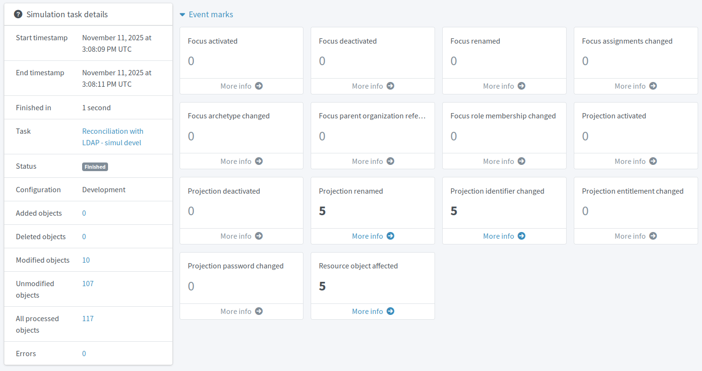

= Simulation
:page-toc: top
:page-since: "4.7"
:page-description: This article introduces the midPoint simulation feature and explains how it removes the "fear factor" from deploying new configurations or connecting new resources.
:page-keywords: simulation, test, testing, preview, development environment, task, activity, preview mode, development configuration, simulation result

Simulation in midPoint is the feature that removes the "fear factor" from deploying new configurations, connecting new resources, or adjusting the production environment in general.

MidPoint is an identity governance and administration system and as such, it is designed to play the mission-critical role in the ecosystem of your organization safely, helping you avoid stressful situations as much as possible.
This article describes how midPoint lets you _look before you leap_.

When developing or managing an application or website, for example, you typically try new things first in a separate development environment before launching them into the production.
With midPoint, one would desire to do the same.
The trouble with identity management is, though, that creating an _identical_ mirror system with which you can play reasonably safely is next to impossible because the identity data continuously change.
At the same time, the last thing you want is to accidentally deny thousands of employees access to an application because of one change in a role definition you though was completely harmless.
That is where simulation comes in.

== What-if analysis on real data

Before the simulation capability was introduced to midPoint (xref:/midpoint/release/4.7/[version 4.7]), the only way to simulate the trajectory of any change in your midPoint deployment was to have a separate test instance.
While variants of this approach may work in factories or for "usual" software development, mirroring live system such as midPoint is cumbersome, to say the least.
Any discrepancy in data between the instances may lead you to think that the change you are testing has no ill side effects only to face catastrophic consequences after deploying it to production.

With simulation, you safely test on the real production system, no artificial environment required.
The simulation feature works with import, reconciliation, recomputing focal objects and shadows, changes in roles or assignments, i.e., most of the devices your midPoint deployment uses on day-to-day basis.

Importantly, simulation does not run in an artificial sandbox;
midPoint uses the production data, it just does not change them in the simulation mode.
A simulated task yields exactly the same results as if it was not a simulation, except that it is only to report what the outcome _would_ be.
Nothing is written to the feature:identity-repository[repository] or remote glossref:resource[resources].

== Controlling the simulation scope

You may be asking, "How do you differentiate the production configuration from the one you are preparing and want to use in a simulation?"

The answer is straightforward.
Whatever configuration you want to test (use in a simulation), be it a mapping, role, or resource, you set it to the _proposed_ feature:object-lifecycle[lifecycle state] instead of the usual _active_ one.
No _proposed_ objects are used for any production operation.
They constitute a virtual testing environment and cannot cause any harm until _activated_.

In tandem with lifecycle states, simulated tasks use different feature:task-management[task execution] settings in regards to mode and configuration.
Tasks handling production run in the _full_ execution mode with the _production_ configuration.
When you need to simulate a task, you use the _preview_ execution mode with the _development_ configuration.
The difference between the two is that the former works with objects in _active_ and _deprecated_ lifecycle states and actually executes the computed changes, while the latter uses objects in _proposed_ and _active_ states to compute what _would_ happen.

== Detailed reviewable results

After a simulated task finishes, you get a detailed report of what would have been done were it not a simulation.
The report is not a raw log file you would need to decipher laboriously.
Simulated tasks produce an object called xref:/midpoint/reference/simulation/results/[simulation result] which is then presented to you in a structured form in the midPoint graphical user interface (GUI).
You can review it thanks to easy to skim tiles and tables with the numbers of affected repository objects, glossref:shadow[shadows], changes that would be done on the objects, as well as how long the simulation took or where it failed, should that happen.

This means that before you go live with your adjustments to the configuration, you know exactly what is going to happen.
No blind spots, no all nighters fixing an edge case you got no warning about.

When you spot anything out of place, you adjust the proposed configuration and then run the simulated task again.
This way you immediately get updated results of your configuration and quick feedback based on the real living data in your midPoint repository.

Once you get the results you expect, you switch the lifecycle states from _proposed_ to _active_ on objects you want to deploy, and you are done.
The new configuration is live.
No environment cloning, no configuration transfer between repositories.

== Limitations

The simulation feature has certain limitations of which it is good to be aware, particularly in more advanced deployment configurations.

Refer to xref:/midpoint/reference/simulation/#limitations[] for details.

== See also

* xref:/midpoint/reference/simulation/[] to dive deeper into simulation usage and configuration options
* xref:/midpoint/reference/admin-gui/simulations/[] to learn about the GUI around simulated tasks
* xref:/midpoint/reference/concepts/object-lifecycle/[] for details on object lifecycle states
* xref:/midpoint/architecture/concepts/task/[] for information about tasks and their management
* xref:/midpoint/reference/tasks/synchronization-tasks/import-and-reconciliation/gui/[] for information about tasks in the GUI