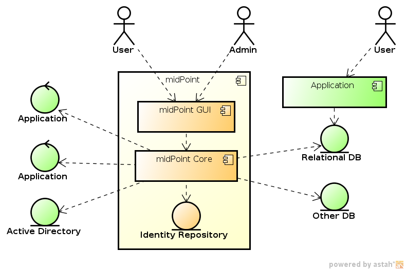
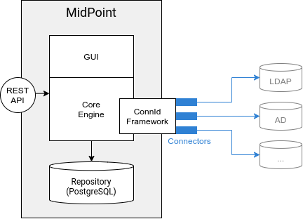
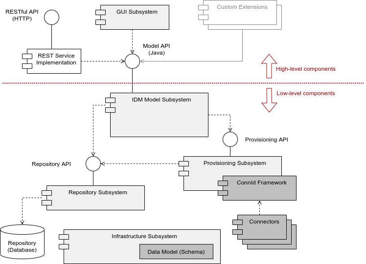

= MidPoint architecture and design
:page-nav-title: Architecture
:page-display-order: 85
:page-wiki-name: Architecture and Design
:page-wiki-id: 655364
:page-wiki-metadata-create-user: semancik
:page-wiki-metadata-create-date: 2011-04-29T11:41:52.801+02:00
:page-wiki-metadata-modify-user: peterkortvel@gmail.com
:page-wiki-metadata-modify-date: 2016-02-20T15:39:26.432+01:00
:page-toc: top

== Project goals

The primary goal of midPoint project is to create and maintain a state-of-the-art open source identity governance and administration (IGA) system.

MidPoint is designed and built as a modular and extensible system.
This is necessary to support a plethora of unforeseeable scenarios in the identity management field.
Flexibility is not the only goal of midPoint; even the most flexible system is useless if it cannot be deployed on time and budget.
Deployment efficiency and usability is even more important than flexibility.
Therefore, the primary tools for midPoint customization is _configurability_.
The majority of common identity management (IDM) scenarios can be _configured_ in midPoint without any need for programming (except, perhaps, for one-line scripting expressions in xref:/midpoint/reference/expressions/mappings/[mappings]).

This article provides an overview of midPoint architecture.
The goal here is to explain both _how_ is the system structured and _why_ it is structured that way.
It is not going into all the details; it describes just the basic ideas for you to get the big picture.

== Big picture

MidPoint is an identity management system designed to fit into existing IT environment of enterprises, universities, and similar organizations. Although midPoint can work for small organizations, its primary goal is to work for mid-size and large organizations.

The goal of midPoint is to synchronize and manage many identity repositories, stores and databases.
It can manage systems like Active Directory, applications based on relational databases, applications that expose services for user management, and many other system types.
MidPoint communicates with such systems primarily by using _connectors_.
This approach is illustrated in the following diagram.

.Foundational architecture of midPoint

MidPoint is designed with the assumption that the data in the various identity stores *are not consistent*. For example, a single user may have account `smith` in one system, `jsmith` in another and `js432543` in yet another one.
A user's name could be stored in the `cn` attribute in one system and could be allowed to contain national characters (e.g., "Řezníček"), while it could be stored in the `gcos` attribute in another system, being restricted to us the ASCII character set and obligatorily supplemented with the user's organizational unit name.
The goal of midPoint is to merge these data and keep them as consistent as practically possible.
MidPoint has many controls, rules, expressions, and pre-built identity management logic to assist in solving this difficult problem.

.MidPoint communicates with external systems using connectors

Connectors are the primary and the most frequently used integration points in midPoint deployments.
However, they are not the only integration points.
MidPoint has a RESTful API that exposes most midPoint functions to be used by external applications, user interfaces, mobile applications, and so on.
There are also additional integration means, such as using message-based asynchronous communication channels, or managing a manual tasks done by system administrators.

MidPoint is not all about integration and synchronization.
MidPoint is in an ideal place to apply policies, such as the role-based access control (RBAC), segregation of duties (SoD), and various policies for compliance with regulations and best practices.
Such capabilities make midPoint an _identity governance_ platform, in addition to classic identity management.

== Component structure

Even though midPoint may look like a single monolithic application from the outside, it is far from being a monolith.
MidPoint is composed of well-designed components separated by clean interfaces.
Each component has a clear purpose and responsibilities in the system.
MidPoint is a substantial software system composed of approximately a million lines of code written by midPoint developers, in addition to many open source libraries and other dependencies.
Good architecture, clear component structure, interfaces, and sound principles of software architecture are essential to keep midPoint code-base maintainable.

MidPoint is Java-based system.
MidPoint structure, build system, and wiring are based on a common open source toolchain.
The basic skeleton of midPoint is built on the Spring framework which may be considered an industry standard for building "lightweight" Java applications.
While midPoint has some characteristics of a web application, it is in fact a completely stand-alone application that includes web components.

=== Component structure

MidPoint is composed of several subsystems, each subsystem contains several components.
The high-level architecture is illustrated in the following diagram.

.High-level component architecture of midPoint

The system core consists of infrastructure, repository, provisioning, and model subsystems.
Repository subsystem is storing authoritative identity data, pointers to identity objects in other systems (such as accounts), definition of roles, expressions, synchronization policies, configuration, and almost all of the persistent data structures in the system.
The data are stored in a relational database.

The provisioning subsystem can talk to other systems, can read data, and modify the data.
It is doing so by using the _connectors_.

The IDM model subsystem is gluing everything together.
It is a component through which all activities pass, therefore it is an ideal place to enforce policies, fill-in missing data, xref:/midpoint/reference/expressions/[map attributes and properties], govern processes, and do all the identity management logic.

The infrastructure system provides common data structures, code, and specifications that are used by all other components.
This is the place where midPoint data model (xref:/midpoint/reference/resources/resource-schema/[schema]) is defined.

The structure of the system core (low-level components) is mostly fixed.
Some customization is possible, but this is mostly achieved by changing the configuration of components, not their structure.
For example, the customization may be to add a new attribute expression, change the definition of a role, introduce a new attribute in the schema, etc.

On the other hand, there are components that change a lot, both with respect to their behavior, and their structure.
User interface is a component well-know for the need to adapt to any whim a customer may have.
There may be custom services, special-purpose business logic, even a completely custom user interfaces.
It is expected that the structure and behavior of high-level components may change significantly.

The IDM model subsystem is the real heart of the system.
The Model API that the subsystem implements is a major boundary in the system:

* The components _below_ the Model API are expected to change little in the code and structure but change a lot in configuration.
This is the domain of a MidPoint core developer.
New connectors can be added, schema can be modified, passwords changed, policies adjusted, expressions modified.
However, no real heavyweight system code is changed here.
There is little need to change the code, as the low-level components implement a logic that is common to the vast majority of IDM deployments.

* The components _above_ Model API are expected to change in code and structure.
This is the domain of an engineer customizing the system to fit a particular need.
New components can be added here.
The system places little constraints on creativity of engineers in this domain.

Both layers are connected by the Model API.
This is the most important interface in the system.
A form of this API suitable for network remoting is available as MidPoint RESTful API.

=== User interface subsystem

The user interface subsystem implements a web-based administration and configuration interface.
This subsystem does not contain any business logic.
However, it contains a sophisticated presentation logic.
It interacts with the IDM model subsystem using the Model API.

The user interface is constructed as a web user interfaces with dynamic interaction elements.
It is written using the link:https://wicket.apache.org/[Apache Wicket] framework.
The "look and feel" is implemented by utilizing the link:http://getbootstrap.com/[Bootstrap Framework].

// TODO: expand this section

=== IDM model subsystem

Every identity management solution has some kind of a model, an abstraction that it is built around.
This "model" takes care or representing the users, accounts, roles, policies, and controlling their _behavior_.
In MidPoint, this is implemented in the IDM model subsystem, which is a true heart and brain of the system.
The logic that maps account attribute values to user properties is implemented in this subsystem.
The mechanism of the xref:/midpoint/reference/roles-policies/roles/rbac/[midPoint role-based access control model (RBAC)] is here.
Identity correlation logic, approval mechanisms, reporting routines, identity governance mechanisms, they are all implemented here.

// TODO: expand this section

=== Provisioning subsystem

Provisioning and deprovisioning are the basic functions of the provisioning subsystem.
This means managing accounts, account attributes, groups, organizational units, and similar objects on the target systems.

There are numerous strategies on how to provision accounts on target systems.
The accounts can be provisioned directly and synchronously, while the acting user is waiting for the result.
Alternatively, the request can be placed in the queue and processed later.
The provisioning system may maintain only the account identifiers and fetch all the attributes from the target system when needed.
Another option for the provisioning system is to create a copy of all resource objects and synchronize them.
Specific strategies are good for specific situations and, in practice, all of them are needed.
Therefore, the provisioning system must be flexible enough to support most of them, sometimes even combine them in a single deployment.

Provisioning system maintains xref:/midpoint/reference/resources/shadow/[shadow objects], which are pre-presentations of accounts, groups and similar objects residing on source and target systems.
The "shadows" are used for loose but reliable linking between midPoint concepts (such as _user_) and resource objects (such as _account_).
The provisioning subsystem provides transparent access to the resource objects attributes.
The attributes are usually fetched right when they are needed by the model logic.

The provisioning system executes the operations on source and target systems (known as "resources") by using _identity connectors_. xref:/midpoint/reference/resources/connid/[ConnId connector framework] is used to manage the connectors.

The provisioning system also implements live detection of changes, simulation of capabilities that resources do not have, adaptation of schemas, and similar mechanisms.

Even though it is usually not seen directly, _error handling_ is one of the big responsibility of the provisioning subsystem.
The connectors are reaching out to remote systems.
Network communication may fail, the data may get out of sync, there may be configuration issues, and so on.
Most such problems in detected and handled by provisioning subsystem.

=== Repository subsystem

The repository subsystem takes care of storing the identity data.
It takes the data objects used by other subsystems and converts them to any format appropriate for the data storage.
The primary purpose of the repository subsystem is to store a well-known set of IDM objects, such as User, Resource, Role, etc.
The data are stored in a relational database.
There are currently two repository implementations:

* PostgreSQL repository implementation.
    ** This implementation takes full advantage of PostgreSQL database, including database-specific features and optimizations.
    ** PostgreSQL is recommended for all midPoint deployments, small or big.
    ** This implementation is currently in development.

* Generic repository implementation that works with several databases (PostgreSQL, MS SQL Server, Oracle).
    ** This implementation can work with several databases.
    ** However, as it is limited to the mechanisms that all the databases share, it cannot take advantage of database-specific features.
        Therefore, it does not do its job particularly well.
    ** It is suitable for smaller and mid-size deployments without significant performance requirements.
    ** Use of the generic repository implementation is not recommended because its xref:/midpoint/release/4.9/#generic-database-support-deprecated[support is deprecated].

=== Infrastructure subsystem

The infrastructure subsystem contains components and utilities that are used by the rest of the system.
Logging, tracing, simple utilities, component wiring, and similar pieces belong there.

Infrastructure subsystem is also a place where the xref:/midpoint/reference/schema/[data model] is materialized.
It is present there both in the form of XML schema (XSD) and in Java classes.

// TODO: expand this section

== Data model

The main page: xref:/midpoint/reference/schema/[]

Design of data structures is one of the most important parts of the system architecture.
MidPoint is a _schema-based system_.
All major data structures that flow in the system are defined by the _data model_, a.k.a. the _schema_.

* The _schema_ specifies what the data structures look like in memory in the form of Java classes.
* The _schema_ dictates the form in which the data are stored in XML, JSON or YAML.
* The _schema_ is used to render user interface interactions.
* The _schema_ is everywhere.

The schema defines a _common data model_, which includes a well-known IDM concepts, such as _user_ and _role_.
The basic data model has origins similar to the SCIM data model.
However, MidPoint data model is much bigger, much more comprehensive and intense.
There are tens of object types with a very rich internal structures.
The data model specifies all the important parts of midPoint: IDM concepts (user, role, organizational unit), integration points (resource, shadow), configuration, policies - everything is described by the _schema_.

MidPoint schema is extensible.
Every object can be extended with custom data items.
As midPoint is completely schema-based system, such extensions are immediately known to the entire system.
Data extensions are immediately used by the user interface, they can used in data mappings, reports, exports, and any other part of midPoint.

The schema is specified in the XML Schema Definition (XSD) language, mostly due to historic reasons.
However, midPoint needs outgrew the capabilities of XSD a long time ago, and midPoint XSD definition relies on numerous custom extensions.
There is an ongoing effort to specify the schema in xref:/midpoint/devel/axiom/[Axiom], a next-generation data modeling language.

== Design principles

There are several principles that apply to the system design as a whole.
These form kind of "philosophy" for the system.

* xref:/midpoint/architecture/principles/form-follows-purpose/[]

* xref:/midpoint/architecture/principles/idm-means-integration/[]

* xref:/midpoint/architecture/principles/separation-of-concerns/[]

* xref:/midpoint/reference/concepts/data-representation-formats/['Objects, XML, JSON and others']

* xref:/midpoint/architecture/concepts/consistency-model/[]

== Toolset

MidPoint is an open source project.
However, it is just an open source project, it is a native in the open source world.
MidPoint completely relies on open source libraries, dependencies, tools, and build systems.
Even related projects, such as the xref:/midpoint/tools/studio/[midPoint integrated development environment], are based on open source roots.
There is no closed part of midPoint, or any of its surroundings.

Living in an open source world gives us strong synergies.
MidPoint projects can be extended using common overlay mechanism of Apache Maven.
Open source interpreters for languages, such as Groovy, can be easily integrated into midPoint.
A plethora of open source development tools can be used to speed up midPoint development and testing.

MidPoint is an open source project in an open source world.
This works perfectly, and we are fully committed to keep it that way.

== See also

* xref:/midpoint/devel/[]

* xref:/midpoint/reference/schema/[]

* xref:/midpoint/devel/design/[]