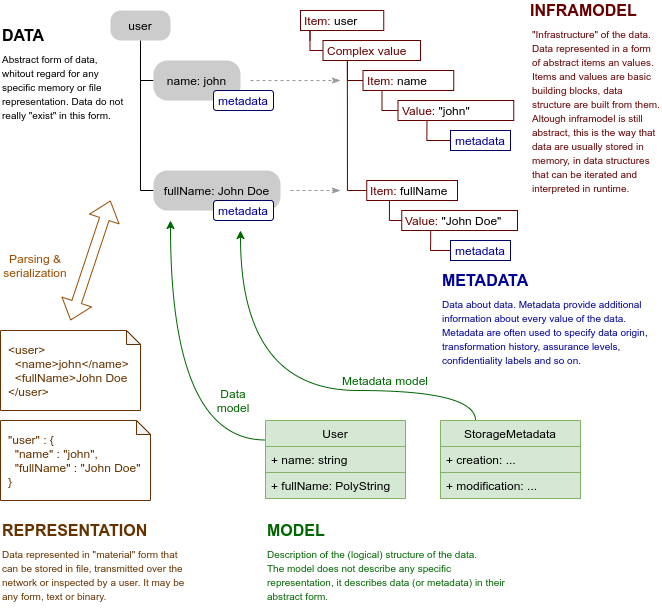

= Axiom Concepts

Axiom is a language based on the concepts that are quite abstract and may be hard to understand.
We will try to explain the concepts and their role in the Axiom world.

== Data

Data are a very abstract thing in the Axiom world.
In fact, the data are such an abstract concept that it is not even a thing.
The data almost do not exist at all, they are just something that we think about.
Axiom deals with data that are well structured, described and organized.
But this is all abstract, it is just an imagined data structure that does not really exist in any specif form.

Data are separated from their representation.
Unlike other languages, Axiom does not model data in a specific format, such as XML or JSON.
Axiom is used to model data in their abstract form.
Such data can them be represented in a variety of forms (or _representations_), all described by a single model.

== Representation

Data can be _represented_ in concrete, tangible forms.
XML file or JSON data structure transferred over the network are data representations.

Representations are used to store the data, transfer them over the network, display them to the user, record them into the database and so on.
As Axiom data are abstract and intangible, representations are often necessary to make any practical use of the data.

The concept of _abstract_ data and _concrete_ representations give us a great degree of flexibility.
Axiom data can have variety of representation formats and structures: XML, JSON, binary formats, relational databse structures and so on.
As those are representations of the same data structures, Axiom processors can seamlessly convert the data between representations.

An application can read the data from the relational database record, process them and serialize them to dense JSON format in a REST service response.
Or the application can serialize the data in YAML format to display them the user.
It won't be difficult to support new data format next year as it becomes the latest and most fashionable replacement for XML.
It is all the same data for Axiom processor.
Just the representation format is different.

== Model

_Axiom model_ describes the structure of data.
The model describes what _items_ are data composed of.
It describes data types of the item _values_, types such as _string_ or _integer_.
It describes whether the items are multi-valued, whether they are optional or mandatory.
The model describes how the data structures relate to each other, combines them to form a structure of the data.

Axiom model describes the structure of _abstract_ data.
It does not describe how the data will look in JSON or XML.
Not directly, anyway.
Of course, data model is a significant influence on how the concrete data _representation_ looks like.
But it is only an indirect influence.
Axiom model sets (abstract) structure of the data, data follows that structure and then the data are serialized to concrete representation.
This makes Axiom fundamentally different from "schema" languages such as JSON Schema or XML Schema Definition (XSD).

Axiom can be used to model the data, but it can also be used to model everything else that looks like data.
For example, Axiom model can specify structured of _metadata_ or _inframodel_ (see below).
And as Axiom models are also data, Axiom model can be used to describe structure of Axiom models.
Which means that Axiom is _self-describing_.
This does *not* means that Axiom is so simple that it can be understood intuitively and it requires no documentation.
It means that Axiom modeling language can be specified using Axiom modeling language.

In Axiom terminology a _model_ is one unit that specifies a tightly-coupled and consistent set of concepts.
A _model_ is meant to be a (reusable) component for data modeling.
Models can use and extend other models.
Practical solutions will need to combine several models.
Some of those models can define framework data structures, other models can specify application data structures and yet another set of models can describe user customizations.
A collection of such models that are combined to form a complete system is what we call a _schema_.

Axiom does not deal just with _here and now_, Axiom is also concerned about the future.
The world is changing all the time, which means that data models have to change as well.
There are features that are specifically designed to support evolution of data models.

Models are identified by their link:../namespaces/[namespace].
Namespace is a mechanism how to separate models and data, allowing evolution and reliable extension of data models.
Unlike JSON, namespaces are a very native concept in Axiom. Not just an afterthought.
And unlike XML, namespaces are not overused.
Namespaces are used only in places where it is absolutely necessary to use them.

Models can be _versioned_ by using semantic versioning scheme.
This allows data processors to evaluate compatibility of data models.
Elements of the model can be annotated with versions in which they were introduced.
New elements that are just evolving may be marked as _experimental_.
Old elements may be marked as _deprecated_ and their removal may be planned.

== Metadata

_Metadata_ are data about data.
Metadata often describe how we learned about the data, e.i. metadata describe origin of data.
But metadata may also describe trustworthiness of the data (e.g. "level of assurance"), data confidentiality, metadata may record transformation history of data and so on.
Metadata are often created automatically by systems that process and transfer the data.

Metadata are often as flexible as the data.
As Axiom is used to create a model of the data, it can also be used to create a model of metadata: _metadata model_.

Metadata are optional for data processing.
Axiom processors should be able to fully process the data even if metadata are removed.
Of course, removal of metadata may mean that some nuances of data _interpretation_ are lost.
E.g. we may not know how reliable are the data, where they came from and whether we are entitled to process the data at all.
But the Axiom processor should still be able to parse the data.

Metadata are still data, therefore they can be modeled in the same way as data are modeled.
Axiom models can be applied to metadata as well, resulting in _metadata model_.

The term _metadata_ is often used in a very generic sense, as the Greek _meta_ is used to mean a lot of different things.
But in the Axiom world, _metadata_ are always just _data about data_.
If there was an English term for Axiom metadata, it would probably be "aboutdata".
We do not use terms such as "metamodel" or "metastructures" as the meaning is not very clear.
We are using different terms for this (see below).

== Inframodel

Axiom _data_ are abstract. No specific _representation_ is assumed for the data.
The logical structure od the data is described by a _model_, which means it can be (and indeed is) different for every application.
All of that makes Axiom world very dynamic, polymorphic and abstract.
However, there is deeper structure of data that is mostly fixed.
Axiom data are composed of items and values.
These are the fundamental building blocks of Axiom universe.
The structure of items and values is what we call _inframodel_ - a fundamental data model that lies under all Axiom data.
An appropriate English word would perhaps be "undermodel".

Most aspects of inframodel are hidden from ordinary user of Axiom data.
Most Axiom users won't have any idea about inframodel at all.
However, knowledge of inframodel is necessary to implement Axiom processors, frameworks build on Axiom and Axiom language extensions.

Unlike metadata, the inframodel is essential for data processing.
Even though inframodel details are hidden from the users, the users still interact with the inframodel indirectly.
Representation special characters such as `@` or `_` usually indicate that parts of inframodel are involved.

.Metamodel, metametamodel, metadata model and other long words
TIP: _Meta-_ is absolutely exciting but also desperately overloaded prefix.
When we designed Axiom, we have used _meta_ a lot.
But the more we used it, the more we have realized that we are using it for different concepts.
Some things are _meta_, meaning they are beyond the data.
Such as _metadata_.
But other things are _under_ the data, rather than beyond them.
Such as the underlying structure of items and values.
This is oftern referred to as _metamodel_.
But then we will get into a lot of confusion as we will have _metamodel_ (model of underlying data structure) and _metadata model_ (model of metadata).
Axiom is not a simple thing already and this confusion won't really help to make it any mode understandable.
We have also realized that there are two dimensions denoted by this dual use of _meta_: horizontal and vertical.
Therefore we have decided to adjust the terminology.
We will keep the term _metadata_ to denote the horizontal dimension.
It is an established and quite well understood term.
And we invented a new term _inframodel_ to denote the vertical dimension (latin _infra_ for _below_).
We also hope that there may be some intuitive understanding of the term as _infrastructure_ of data.
_Inframodel_ might be a bit unusual term, but it is much better as to have the metamodel confusion.
And in addition, we can get rid of the _metamodel_ term altogether.
That term is all wrong.
Combination of greek and latin words is an abomination.
