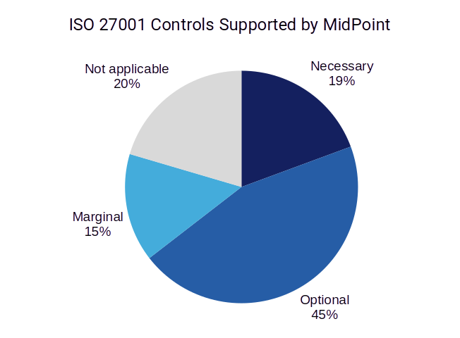

= ISO/IEC 27001 Statement of Applicability
:page-nav-title: SOA
:page-upkeep-status: green

This is a Statement of Applicability (SOA) of midPoint to ISO/IEC 27001:2022 standard.

// TODO: More intro: how it is supposed to be used, etc.
Applicability (SoA) explains how midPoint can assist a company in aligning with ISO/IEC 27001:2022. While midPoint is a software tool and cannot provide compliance on its own, proper configuration can significantly aid in achieving ISO/IEC 27001:2022 compliance. This document, along with the accompanying Excel file, maps midPoint features to each ISO/IEC 27001:2022 control and evaluates the potential assistance midPoint offers for each control.

How to Interpret the Necessity of a Tool like midPoint:

* Necessary: Achieving compliance for these controls would be very difficult without a tool like midPoint, often requiring extensive manual work, especially for companies with complex internal structures or a large number of employees. 
* Optional: midPoint can partially assist with these controls by providing necessary information, monitoring control implementation, and partially implementing control measures. 
* Marginal: midPoint can typically provide data to support decision-making for these controls. 
* Not Applicable: midPoint offers no assistance for these controls (primarily physical controls). 

How to Read the Attached XLSX File:

* ISO270012022: Columns A-I contain information about the controls (including hashtags). This is followed by information on the necessity of a tool like midPoint for implementing each control (Column J) and a list of midPoint features that can be helpful for implementing each control (Column K).
* midPoint: This sheet lists midPoint features (Column A), the controls where they appear (Column E), and the number of occurrences (Column F). You can choose an implementation strategy that prioritizes features frequently used across controls.
* Statistics: This sheet provides a summary of all controls, categorized by domain (Organizational, People, Physical, and Technological controls).
* Tags: This sheet contains tags for the spreadsheets and from ISO/IEC 27001:2022.

== Download

Statement of Applicability can be downloaded using following links:

++++
<ul class="book-dl-links">
  <li><a href="iso-27001-midpoint-soa.xlsx"><i class="icon far fa-file-excel"></i>XLSX</a></li>
</ul>
++++
