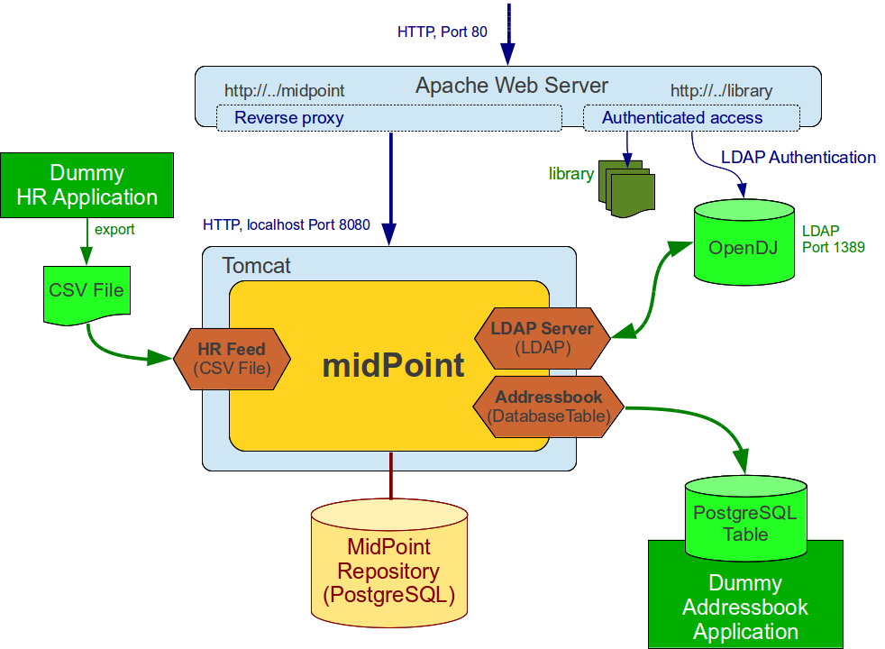

= Live Demo
:page-wiki-name: Live Demo
:page-wiki-id: 7667745
:page-wiki-metadata-create-user: semancik
:page-wiki-metadata-create-date: 2013-02-19T17:37:31.548+01:00
:page-wiki-metadata-modify-user: semancik
:page-wiki-metadata-modify-date: 2020-12-11T17:54:10.158+01:00
:page-toc: top

== Introduction

The Live Demo environment is an installation of https://evolveum.com/midpoint[midPoint] in a very small deployment.
However, we have tried to make this deployment like the typical deployment for the enterprise environment, using an LDAP server, databases, HR integration, RBAC, organizational structure and also other aspects of typical provisioning solution deployment.

The demo environment provides a simple identity management solution for a fictitious organization _Leonardo's Workshop_.
This organization has several employees and contractors sorted out to a simple organizational structures.
The primary source of employee and contractor data is HR system.
Most of the existing information systems in the Workshop is LDAP-enabled and it is integrated with a central LDAP server.
The LDAP server contains partially authoritative data, e.g. for e-mail addresses.
There is also a handful of systems that cannot be integrated with LDAP server, e.g. database applications.

== Usage Notes

The live demo environment is deployed on a Kubernetes cluster.
If you want to deploy your own midPoint demo environment head to https://github.com/Evolveum/midpoint-kubernetes/tree/main/midpoint-live-demo[this] github page.
The machine is restored to its original state every night (Midnight European Central Time).
The same environment is shared by all the users therefore please be nice and try not to spoil the work of others.
Try to create your own users, account and roles and do not considerably modify existing users, roles or resources.
We would like this description to hold at least roughly even after a few users played a bit with the demo machine.
If you find the machine in a bad shape please contact us.
We will fix it as soon as possible.

URL: https://demo.evolveum.com[https://demo.evolveum.com] +
Login: administrator +
Password: IGA4ever

== Situation and Requirements

The demo environment implements identity management functions in a fictive enterprise *Leonardo's Workshop*.
The workshop has artists and craftsmen that work on extraordinary things, renaissance miracles.

It takes more than one genius to achieve renaissance excellence.
Therefore, the workshop has a Human Resource (HR) system that keeps track of all workshop employees.
Being a real renaissance think-tank, the workshop aspires to implement a concept of extended enterprise.
Therefore, the HR system also records contractors and external cooperators, the HR system is an authoritative source.

But there are identities that are not in the HR system.
The workshop does not only need to create miracles, it also needs to sell them.
Some customers, patrons and fans of the workshop also need to be managed, e.g. to provide them appropriate loyalty discounts on state-of-the-art siege machines.
These identities do not have an authoritative source, and they are manually managed in the provisioning system.

Leonardo's workshop has an address book application that is used to record contact information of all identities.
The data of employees, contractors and even patrons and customers should be provisioned there and kept up-to-date.
This is good for business.

The workshop integrates most simple applications using the most practical way: LDAP server.
There is a central LDAP server that maintains entries for each identity.
LDAP group memberships determine authorization and grant access to individual applications.
Therefore, identities of all employees and contractors need to be provisioned to the LDAP server and the IDM system needs to manage LDAP group membership.

The workshop has quite stable functional organizational structure consisting of several departments and divisions.
There is also project organizational structure that is orthogonal to the functional organizational structure.
Automation of the organizational structure is a very progressive concept for a renaissance workshop and is still semi-formal.
There is no authoritative computer-readable source for this information.

We want to automate all that is practical to automate.
We want to use RBAC concepts for identities and privileges that can be automated.
We also want to gradually automate implementation of organizational structure.

== Implementation Outline

The central piece of the implementation is obviously midPoint.
MidPoint is deployed in embedded Tomcat web container which is also used to expose the midPoint administration console.
MidPoint is using appropriate connectors to manage the other systems.
All the connectors are agent-less and some standard connectors are bundled with midPoint (more info on them can be seen xref:/connectors/connectors/[here]).

The HR system is an authoritative source.
HR system is deployed in Tomcat web container together with address book system.
MidPoint scans for changes of the CSV file that the HR system exports.
All identities that midPoint finds in the export file are pulled into midPoint and are used to create new midPoint users.

MidPoint maintains several role definitions that implement the RBAC structure.
The roles are used to automatically assign resources to midPoint users.
Roles can be assigned either manually using midPoint GUI or automatically.
The automatic role assignment is defined in the user template.
This automatic process is used mostly to assign roles for new users that are created from the HR export.

Roles determine whether a user should have record in the Address-book system (which applies to all users) and account in LDAP directory.
The roles also determine LDAP groups.

== Deployment

The technical components of the demo environment are illustrated in the following diagram.

Following table provides an overview of each of the component's role in the demo system.

|===
| Component | Implemented by | Description | Access

| Provisioning server
| midPoint
| The primary object of the demo environment.
MidPoint integrates user databases of other systems in the solution.
| https://demo.evolveum.com/midpoint/[https://demo.evolveum.com/midpoint/] +
Login: administrator +
Password: IGA4ever

| MidPoint native identity repository
| PostgreSQL Database
| Storage of midPoint data such as user data, accounts, roles, resource definitions, etc.
|

| LDAP Server
| OpenLDAP
| Central LDAP directory server for the organization.
Other applications connect here for simple password-based authentication and group-based authorization.
| https://demo.evolveum.com/ldapadmin/[https://demo.evolveum.com/ldapadmin/]

| Dummy HR Application
| Simple web application, export to CSV file
| Simple application that mimics an older legacy HR system.
We assume that only textual (CSV) exports are available as an integration alternative for this system.
The HR application is authoritative for employees and contractors, yet it contains only a very basic information.
| https://demo.evolveum.com/hr/[https://demo.evolveum.com/hr/]

| Dummy Addressbook Application
| Simple web application, table in PostgreSQL
| Addressbook-like database application that stores the data in PostgreSQL table.
We want all users in the system to be present in the address book and have a basic access there.
We want everybody to know the e-mail address and phone number of everybody else.
This helps cooperation in our renaissance workshop.
The application is not authoritative for anything.
It just reflects the information available from other sources.
| https://demo.evolveum.com/addressbook/[https://demo.evolveum.com/addressbook/] +
Username: leonardo +
Password: IGA4ever

| Java Web Container
| Apache Tomcat
| Tomcat is a simple and lightweight Java web container that is used to host midPoint and some other small applications.
It is used in embedded form with midPoint and as standalone server for HR and address book applications.
It provides Java environment for midPoint.
|

| Engineering library
| Apache HTTP server
| A fictive application that is supposed to hold a library of books available only to some users.
It is connected to LDAP server for authentication and basic authorization which is implemented using Apache HTTP server with LDAP modules.
The library is only accessing to the members of LDAP group `library`.
| https://demo.evolveum.com/library/[https://demo.evolveum.com/library/] +
Username: leonardo +
Password: IGA4ever

|===

The demo configuration is available directly in the demo midPoint instance (menu Configuration / Repository Objects / All objects).
However, all the files are also available here:

https://github.com/Evolveum/midpoint-kubernetes/tree/main/midpoint-live-demo/kustomize-base/renaissance-demo-config

== Walkthrough

This section provides several simple scenarios that demonstrate basic midPoint features.
These scenarios are by no means comprehensive, quite the contrary.
They were chosen for simplicity.
Once you get the right feel about how midPoint works feel free to alternate the scenarios and experiment.

The scenarios focus on midPoint features and they provide only a very little information about the implementation.
The implementation details are described and explained in the next chapter.

[TIP]
.The demo environment is shared
====
Please keep in mind that the demo application is shared among many users.
Therefore, please be nice to others.
This walkthrough will instruct you to create your own user.
Please do that and try to make the vast majority of your experiments using this user.
Use something unique for username to avoid clashes with other users such as your name or name of your favorite character.
Please feel free to have a look around as wide and deep as you wish.
It may be especially helpful to have a look the pre-created users `leonardo`, `donatello`, `michelangelo` and `raphael`.
They have a description that describes their purpose in the demo.
But please do not modify the users, resources, roles and org.
units that you have not created yourself.

====

=== Login

. Login to midPoint console (https://demo.evolveum.com, login: administrator password: IGA4ever)

=== Have a Look Around

. Navigate to the _Users / All users_ menu.
Look at users in midPoint.
Some of these were created in by the HR feed, others were created manually in IDM.

. Open user `leonardo`.
You can see:

.. User profile is listed at the _Basic_ panel.
These are attributes of the user that are stored in midPoint internal repository.

.. Next two menu items are dedicated to _Projections_ and _Assignments_.
While these may seem to be the same there is a subtle difference: assignments define what user *should have*, projections describe what user currently *has*.
The difference is crucial for handling inconsistencies, policy violations and various system failures.
(see xref:/midpoint/reference/roles-policies/roles/assignment/assigning-vs-linking/[Assigning vs Linking] page for details).

.. Open the _Projections_ menu.
Click on any of user accounts to expand it.
You can see account attributes.
These are *not* stored in midPoint, they are freshly fetched from the resource.
You can edit and change user attributes (e.g. telephoneNumber) by filling an appropriate field and pressing button "Save" at the top of the page.

. Navigate to _Roles / All roles_ in the main menu.
List of roles should appear.

. Navigate to the _Resources / All resources_ menu.
List of resource should appear.
These are the source and target system that midPoint connects to.

.. Click on any of the resources.
Resource details should be displayed.

.. Click on `Test Connection` button.
This check whether the resource has a valid definition and that midPoint can connect to the resource.

. Look to the _Configuration_ section in menu.
This is used to modify midPoint configuration.

.. Perhaps the most important part of configuration is _Repository Objects / All objects_ panel.
This page is used to manipulate midPoint configuration and data in XML form.
Feel free to have a look around and open any object.
But do not change anything (yet).
This method of configuration is somewhat rough and needs some time to get used to and some skills.
But bear with us please.
We are gradually creating more convenient configuration pages to make midPoint configuration easier.

=== Create user in HR

. Create new user in the HR application and create new export file...
Go to the dummy HR application by following URL https://demo.evolveum.com/hr.

.. Click "Register user", fill out the details.
Choose "FTE" as employee type (you can try different types later).
Submit the form.

.. Click "Export users to CSV file" button (click this button every time some change is made).
This creates new export file in `/var/opt/hr/export.csv`.

. The export file should be picked up by midpoint in few seconds.
MidPoint determines that the HR "account" is new and that it should create new user.
The user appears in the list of users.
If opened the user is almost fully initialized.
However, the process the actions that took place behind the scenes are somehow complex:

.. MidPoint detected a new account on HR resource.
MidPoint tries to match the new account to an existing user using xref:/midpoint/reference/synchronization/correlation-and-confirmation-expressions/[correlation expression]. It fails and therefore determines that the xref:/midpoint/reference/synchronization/situations/[situation] of the account is `unmatched`.

.. HR resource is configured as authoritative.
The configuration says that for each `unmatched` account a new midPoint user should be created (this is called "reaction").
Therefore, midPoint tries to create a user.

.. MidPoint cannot create just any user.
The new user needs to be initialized with the data from the account that caused all this in the first place.
Therefore, xref:/midpoint/reference/expressions/mappings/inbound-mapping/[inbound mappings] are used to initialize the new user.
This sets username, given name, family name and other user attributes.
They also assign an https://docs.evolveum.com/midpoint/reference/schema/archetypes/[archetype] to a user.
This archetype is assigned based on user's employment type, and it induces roles that users with a given employment type should have.
Please note that these roles are indirectly assigned to a user, so they would not appear in _all_ section of _assignments_ section but only in _all direct/indirect assignments_ section.

.. xref:/midpoint/reference/expressions/object-template/[User template] processing takes place now.
User template is processed every time user is created or modified.
User template completes the user by computing full name from given name and family name.

.. User is now fully initialized and it is created.

.. As the created user has role assignments the resources associated with the roles gets provisioned.
That will be explained later.

.. All of that happens automatically in less than a second.
This is the ordinary workflow mostly ensured via a careful configuration of midPoints resources.
More details how is it done you will find in _Implementation Details_ section (subsection _Resource Setup_) of this manual.

. Check that the new user has appropriate roles and accounts...
The user should have _Full Time Employee_ role if you have chosen a `FTE` type in the HR application, and _HR Feed_ resource assigned.
Check that by opening user details and switching to _All direct/indirect assignments_ in _Assignments_ panel.

.. User has 3 projections (read this as accounts or user records) in resources_.
_All are visible on _Projections_ panel.
Full_ Time Employee_ role gives him access to LDAP server and Address-book application.
_HR Feed_ resource assignment ensures user's projection in _HR Feed_ resource (this assignment is somehow technical, but enables clear view of where the user is projected)

.. Check if a matching account was created in the Address-book application by accessing it at https://demo.evolveum.com/addressbook/.
You need the user's password to log into the Addressbook application; the users created from HR system have generated password, so you may postpone this until you change user's password (see below).

.. Check if the matching LDAP entry was really created for the user.
You may use LDAP administration web application that is accessible at https://demo.evolveum.com/ldapadmin/.

=== Change User Password

. Open the details of the user that you have created in the previous step (in midPoint).

. Navigate to _Password_ panel in user details.

. Click on a _Change_ button next to the password value field.
Additional fields will appear.

. Supply and confirm new value of the user password.
The password should contain only letters and  numbers, its length must  be  between 5 and 12 characters and must contain at least one and no more than five digits to pass through system.
See xref:#passwords[password policy] section for more info.

. Click Save.
The password should be changed in midPoint and also for the accounts.
It means all accounts should have same password.
This is what happens:

.. Usual user recomputation takes place (user template, inbound, roles, outbound).
But as only the password was changed then only the password is recomputed.

.. Both Address-book and LDAP resource has outbound mapping for password.
The mappings will be applied and the change of user password will be propagated to the resources.

.. Password for both LDAP and Addressbook accounts are changed.

.. If you want to keep distinct passwords among accounts, change them on accounts only (and do not in user).
A way of changing account password only is very similar.
Open users  account (e.g. on  Addresbook  resource).
Click on small _Show empty fields_ text in _Password_ section of the  account and fill the appropriate fields.
Click Save button.

. Check that the password was changed.
Try to access Addressbook application at https://demo.evolveum.com/addressbook/.
The password field is displayed in a cleartext for clarity.

.. Access the LDAP administration tool at http://demo.evolveum.com/ldapadmin/.
Find the account that belongs to your user.
The account details form has a _Check_ button next to the password field.
This can be used to check if the password was changed.
[TIP]
.Note
====
====

As soon as you insert new password for user in midPoint, the password in LDAP is overridden because midPoint is set as master for password attribute in LDAP.*Do not forget to refresh php LDAP admin after any change.*

=== RBAC

. Navigate to the _Roles_ / All roles menu and examine the list of roles.
Their description should be helpful.

. The `Full Time Employee` and `Contractor` roles are assigned automatically using a user's archetype.
The user that was created in the previous steps should have one of them already.
Therefore, there will not be much fun with this user anymore ...

. Create a new user without any account or role.
(E.g. via HR app and set EmpType to PTE - Part time employee)

. Open the user's detail.
Go to _Assigments_ panel and click on _Role_ button to filter just roles assigned to the  user.
The list should be empty.

. Assign one of the roles to the user by clicking on the _New Assignment_ button (the button just below the empty list).
Choose a role (e.g. `Full Time Employee` again), click _Add button._ Then click _Save_ button at the top.

. The role is now assigned.
All the accounts that the role specified should be provisioned automatically.
You can check that by opening a user and looking into _Projections_ section.
What you see there are account shadows (see xref:/midpoint/reference/resources/shadow/[here]).
They persist even in case a resource is down.
Then you can verify on the resource, that an account exist there.
If you check LDAP server (https://demo.evolveum.com/ldapadmin/[https://demo.evolveum.com/ldapadmin/]), you may need press refresh button to see up to date changes.

. Go to _Assignments_ panel.
Unassign the role by clicking the _Unassign_ button (the minus icon) on the end of the line with role and then clicking _Save_.

. If user has no role all the accounts created by the role should be gone.

=== Governance - Role request process

Following scenario demonstrates governance over the requests to assign _Patron_ role to users.
Requests are approved in the *workflow*.

. Navigate to _Request access_ menu in _Self service_ section of the main menu.
The wizard for requesting access will guide you though the process.

. In first step _Person of interest_ select _Group/Others_, type _Raphael_, and select `Raffaello Sanzio da Urbino (Raphael)`.
Then click on _Next: Relation_ button.

. Select _Default_ relation and continue to _Role catalog_.

. Find _Patron_ role and click _Add to cart_ button next to it.

. Go to the shopping cart using the button in the top right corner of the screen.

. You may provide _Validity_ and _Comment_ and then submit the request.

. Check that case management that is handling the request.
Navigate to _Cases / All cases_ menu in _Administration_ section.
Open the case named _Assigning role Patron to user Raphael_ , to visualize whole approval workflow.
Switch to _Workitems_ panel.
Here you can see actual approval stage (Manager).
It is first of two approval stages (1/2).

. Open the approval stage.
Click _Approve_ button to approve the request.

. Wait few seconds and open the case again.
You can see, that approval process moved to stage 2 - approval by Council of Patrons.
Switch to _Workitems_ panel again.

. Open one of the workitems (approval by `francis` or by `borgia`) and approve it.

. After approving the final stage of the workflow, wait few moments and then visit `Raphael` user profile to see that the Patron role has been assigned.

[TIP]
This guideline walked you though access request process form midPoint administrator point of view.
You can follow the same example as individual actors in the process.
Meaning sign in as a user and request a patron role for yourself.
Then sign in as approver to approve the request.
You will see simplified interface because of restricted access rights in comparison to midPoint administrator.

Even such marvelous organization like Leonardo's Workshop needs some extra security.
From time to time, auditors from respected Council of Patrons need to review all existing user-role assignments as experience shows that users tend to cumulate privileges over time.
The review process is started by midPoint feature called *Access Certification*.

. Navigate to _Certification - Campaign definition_ menu and click the Create campaign button next to Certify user-role assignments campaign.

. After new campaign is created, click the Show campaigns button.

. New campaign instance is created and to start the approval process, you need to click _Start campaign_ button.

. Logout from midPoint and login under user borgia/IGA4ever - one of the campaign reviewers.

. Navigate to _Certification - My work items_ menu and make your review decision.
Keep in mind that revoking the role will lead to user losing the role and possibly being deleted from target systems.

. Each campaign has predefined timeframe which can only be shortened manually by campaign administrator (by closing the stage).
Before the stage is closed, reviewers can still change their mind about their approval action.
Only the very last choice is accounted.

. Logout from midPoint and login as administrator.
You can review campaign in _Certifications / Campaigns_ menu_._

=== Segregation of duties (SoD)

Some roles are mutually exclusive.
Sometimes it is because we want to prevent accumulation of critical privileges in hands of a single user.
Another time, we just want to deny non-compatible combinations, for example mutually exclusive licences for target software.

In our fictive workshop, we have are using the former example for segregation of duties.
_Patron_ and _Philistine_ roles have the exact opposite meaning, therefore it doesn't make sense to have them both at the same time.

Try it yourself by adding _Philistine_ role to a user and then try to request _Patron_ role using steps from the previous section.
When you get to the shopping cart, midPoint will detect the conflict and offer you smart _Conflict solver_ which will let you select which role you want to keep.

=== Governance - Visibility

The key question that Identity governance need to answer is: Who has access where and why? That will provide necessary visibility useful for not technical and business people.

MidPoint offers you option to visualize accesses directly in GUI or create a comprehensive report, that you can analyze in your favourite tool.

To see accesses of individual users follow these steps:

. Open User's detail.
Go to menu `Users` -> `All users` and select any user.
. Open `All accesses` panel.
. You can now see accesses to roles, organization units, applications etc. of the selected user.
You can also see metadata why is the access there and since when.
. Notice in the _Source_ column, you can use _Magnifying glass_ icon to display the whole chain of objects (e.g. roles) that is leading to given access.
Also, if the given access is given though multiple sources/chains, there are displayed as multiple lines.

If you want rather to generate report that can be analyzed outside midPoint, follow there steps:

. Open `Reports` -> `All reports` and open _IGA: Who has access to what and why_.
. Click on _Run original report_ button.
. On the bottom of the preview page click on _Run report_
. You will see a bar on the top of the screen informing you the report was processed in background task.
Click on _(show task)_.
. The tasks should be complete by now.
Click on `Download report` button.
. Use your favourite tool to analyze the report outside of midPoint.

CAUTION: The current role and application structure in this demo is not completed yet.
That doesn't cause any problem with the visualization feature itself, but the results might be hard to interpret or sometimes even illogical.
The next update of the demo will improve this and bring a systematic approach to application and role structure.

=== Create person in LDAP

When you create a person in LDAP, midPoint will soon realize such an action.
LDAP writes every change in its entries into the external change log (ECL).
ECL is LDAP subtree with base DN of cn=changelog.
MidPoint checks this subtree for changes permanently.
After a change is caught, the correlation rules from synchronization section of a resource configuration will take part (see xref:#ldap-directory-server[LDAP directory server] section for more details).
The situation is recognized as unmatched and action addUser is invoked.
So a new midPoint user aligned with a default user template is effected.
According to schemaHandling section the name of a newly created midPoint user match the uid attribute of a LDAP person.

To create a new person navigate yourself into http://demo.evolveum.com/ldapadmin/[ldapadmin] application:

1. In ou=People branch select Create new entry here - click Default - select inetOrgPerson object class - Proceed

2. At least fill values (examples in brackets are not compulsory) cn (Testcn), sn (Testsn), givenName (Testgivenname) and User Name - uid (testuid).

3. At the top select RDN - User Name(uid) - at the bottom press Create Object - Commit

4. User uid=testuid should be created in ou=People branch and also in midpoint.

At the same time when a new midPoint user is created, an LDAP account that started this action is deleted.
This synchronization behavior is conditional and it depends on midPoint global settings.
It is assignmentPolicyEnforcement option that can be set in System Configuration object (choose Configuration from the midPoint menu bar and then System Configuration from the List objects).
You will find more info on assignment policies xref:/midpoint/reference/synchronization/policies/[here].

Please, take into consideration that matter with change log checking is not so simple.
Your LDAP server has to be configured in proper way.
We usually use OpenLDAP and you will find https://docs.evolveum.com/connectors/resources/ldap/openldap/config/[here] how to configure it for external change log availability.

=== Attribute synchronization

Midpoint is synchronizing attributes between user and the accounts.
Part of this was obvious when a user was created from the HR record.
Some user attributes were synchronized into midPoint.
This scenario demonstrates a slightly more complex synchronization.

. In midPoint, select a user that has an LDAP and Addressbook account.
Open user details.

. Click on the _Show empty fields_ link below the user properties.
Fill in the telephone number.
Click Save.

. The telephone number should be propagated to the LDAP and addressbook resource.
Check it directly within LDAP and addresbook.

. The propagation of a telephone number is bi-directional.
Try to change the telephone number directly in the LDAP directory (using https://demo.evolveum.com/ldapadmin/[https://demo.evolveum.com/ldapadmin/])

. After few seconds the change should be propagated to the user in midPoint.
Check that in a user details page.

. The change is also propagated to the Addressbook application.
Check that the telephone number was also changed.

*Do not forget to refresh LDAP after any change.*

=== Organizational Structure

. Have a look at organizational structure.

.. Navigate to _Org. structure / Organization tree_.

.. Expand the individual nodes of functional organizational structure tree to have some idea about the divisions and section of Leonardo's Workshop.

.. Note that there are two types of organizational structure:

*** Hierarchical _functional_ organizational structure named _Leonardo's Workshop_

*** Flat _project_ organizational structure named _Projects_

. Assign user to an organizational unit.
Navigate to _Users / All users_ menu and open user details.
Switch to the _Assignments - Organization_ panel.

.. Click _New Assignment_ button (the button below list of assignments).

.. In the new window switch to the _Org_ or _Org. tree view_ tab.

.. Select one or more organizational units to assign.
At this point it might be good to assign organizational unit `Department of Machines (F0200)` as this well demonstrates advanced features of organizational structure.
You can also define assignment relation (Member or Manager) at this point.
Click _Add_.

.. The new organizational units should appear in _Assignments_ section and should be highlighted.
Click _Save_ to make the change permanent.

. Check the results of the assignments.

.. All the assignments should be displayed on user details page.

.. If `Department of Machines` unit was assigned then the user should have LDAP resource even if he hasn't got that one before.
The `Department of Machines` is both org.
unit and a role.
It assigns access to LDAP server for all members of the org.
unit.
In addition to that it also assigns membership in the `library` LDAP group.
You can check it when expanding user's LDAP account in midPoint.
Group `cn=library,ou=groups,dc=example,dc=com` should be listed  in the Associations section.

.. The LDAP entry is used to secure access to engineering library.
To access the library a valid LDAP account is needed.
The account also needs to be a member of LDAP group `library`.
The `Department of Machines` assigns just that.
Therefore, a user that is assigned to the `Department of Machines` org.
unit should have access to the Engineering Library at https://demo.evolveum.com/library/[https://demo.evolveum.com/library/].
You can login into library only when org.
unit F0200 was assigned to user.
Do not forget to insert correct password from midpoint user.

=== Licences management

MidPoint offers rich set of features that can be combined for various use-cases.
An example of that is a licence management.
In this demo we are using an example service for which we have only licences for 5 users.
To enforce this, we will limit number of assignments for the service.

. Open `Dashbords` -> `Licences dashbord` to check of currently used licences.

. Assign user to a licensed application `Science Hub`

.. Navigate to _Users / All users_ menu and open user details.
Open _Assignments / Role_.

.. Click _New Assignment_ button.

.. In the new window select `scienceHub:basic` or `scienceHub:premium` and click _Add_.

.. The new service should appear in _Assignments_ section and should be highlighted.
Click _Save_ to make the change permanent.

. Open `Dashbords` -> `Licences dashbord` to check of if the number of used licences has increased.
(Note: This change is not provisioned to any target resources.
It's only visible on this dashboard.)

. You can assign additional users to `scienceHub:basic` or `scienceHub:premium` and observe changes in the dashboard.
If you try to assign more than 5 users for basic or 2 for premium, you will get an error message.

=== Simulations

Executing changes in production environment is always stressful process.
Even a tiny mistake can have catastrophic consequences.
MidPoint introduces _Simulations_ as advanced feature which enables you to deploy new configuration with confidence.

In the Leonardo's Workshop we have decided to deploy a corporate email identity generated from users artistic name.
This is already preconfigured in _Proposed_ lifecycle state, therefore it won't affect the current configuration, but we can simulate it.

. Generating the corporate email address is done during synchronization process from HR system.
Open `Resources` -> `All resources` -> `HR Feed` -> `Accounts` -> `Configure` -> `Mappings`.
Then find the mapping with name _Corporate email address_ and you will see it's indeed in _Proposed_ lifecycle state.

. Optionally, you can check outbound mapping named _Email address_ in `LDAP Server` resource.
Just don't forget to switch to `Outbound mappings` on `Mappings` page.

. Will we run a complex simulation by recomputing all users.
Open `Server tasks` -> `All tasks` and select `User Recomputation Simulation`.
Then click on _Resume_ button and after a while click on _Refresh button_.
If the task already finished _Show simulation result button_ will appear.
Click on it.

. You will see detailed screen with all simulation results.
Feel fee to browse all details and get familiar with the reporting style.

. Our main interest lays in _Resource object affected_ tile.
Open it.

. You should see that our new email address will be changed for users _Raphael_ and _King Francis_.
You can click on both to see the details.

. We conclude that _Raphael_ will have to get used to his new email address _King Francis_ might have objection to such change (accentuated by french invention guillotine).
To prevent any incidents, including future ones,  we decide to "lock" king's account.
Click on the small button at the end of the line to _Add mark_ and select _Do not touch_.

. You can run the same simulation again using the same steps as before and then you will see the king's account won't be affected.

. Optionally you can go to the resources mappings configuration (as you did at the beggining) and switch both mappings to _Active_ lifecycle state.
Then run _User Recomputation_ task to apply the changes in email addresses handling.

=== Orphaned accounts

When connection a new resource you might encounter an account that doesn't have owner in midPoint, but you don't want to delete/disable it yet.
Maybe you just need find the owner manually later, maybe you don't have all users imported from sources yet...
There might be several reasons.

. Go to `Resources` -> `All resources` -> `Addressbook` -> `Accounts`.
You will see user _paciolo_ in _UNMATCHED_ situation.
That is our orphaned account.

. Our identity engineers team is eager to automate and they already prepared configuration in _Proposed_ lifecycle state that will remove all orphaned accounts.
This is a good practice when you have all accounts in order because you will effectively prevent creating new orphaned accounts.
They will be deleted before anyone will have the chance to start using them.
Let's check what the engineering team prepared.

. Above the table with account click on `Tasks` -> `Create task`.
Select `Reconciliation task` and swith `Simulate task` to _ON_.
Fill in the _name_ of the task and continue by clicking on `Next: Resource Objects`.
Go though all following screens (Resource objects, execution, schedule and distribution) and keep default setting in all of them.
Finalize the task creation by clicking `Save & Run`.

. Click on `Tasks` button again, select `View simulated tasks` and then click on the task that you've just created.
It should be completed by now.
Click on _Show simulation result_ button.

. On simulation result screen click on `Projection deactivated` tile.
You can see that account `paciolo`  would be deleted.
Paciolo was Leonardo's dear friend, therefore we don't want to delete his account.
Click on _Add mark_ button at the end of the row and add _Correlate later_ mark.

. Now the account is marked to be correlated later and therefore won't be affected by planned configuration change which should delete all orphaned accounts.
You can verify it by running the simulation again.

. Go back to Resource's accounts page, click on _Tasks_ button and select _View simulated tasks_.
Select the simulation task that you've created before.
Click on _Run now_ and wait until the task will be completed.
After that click on _Show simulation result_.

. Paciolo's account should not be affected now.

. The engineers can deploy the change preventing occurrence of new orphaned account.
Paciolo's account is still marked and should be resolved manually later.
It's important to not forget about such accounts and process them properly.
Don't keep such exception forever!

== Implementation Details

=== Schema Extension

MidPoint has quite a rich xref:/midpoint/architecture/archive/data-model/midpoint-common-schema/usertype/[user schema] with many attributes that are common for most IDM deployments.
This suits the needs of Leonardo's workshop quite well.
But there is one attribute that is not really common in IDM deployments: Artistic Name.
One option is to map this attribute to a suitable standard attribute such as `additionalName`.
But that can clash with future extensions as additional name is more suitable to patronymic/matronymic and similar purposes.
Therefore the best option is to extend user schema.
It is quite easy.

User schema is extended by adding appropriate XSD file to the midPoint installation.
The schema extension is not stored in the database because it may influence the database schema and therefore may create a chicken-egg problem.
The schema extension file for the demo environment is very simple:

./opt/midpoint-home/schema/extension-electra.xsd
[source,xml]
----
<xsd:schema elementFormDefault="qualified"
            targetNamespace="http://prism.evolveum.com/xml/ns/demo/extension-electra"
            xmlns:tns="http://prism.evolveum.com/xml/ns/demo/extension-electra"
            xmlns:a="http://prism.evolveum.com/xml/ns/public/annotation-2"
            xmlns:c="http://midpoint.evolveum.com/xml/ns/public/common/common-2a"
            xmlns:xsd="http://www.w3.org/2001/XMLSchema">

    <xsd:complexType name="UserExtensionType">
        <xsd:annotation>
            <xsd:appinfo>
                <a:extension ref="c:UserType"/>
            </xsd:appinfo>
        </xsd:annotation>
        <xsd:sequence>
            <xsd:element name="artisticName" type="xsd:string" minOccurs="0" maxOccurs="1">
                <xsd:annotation>
                    <xsd:appinfo>
                        <a:indexed>true</a:indexed>
                        <a:displayName>Artistic Name</a:displayName>
                        <a:displayOrder>120</a:displayOrder>
                        <a:help>The name by which is the artist commonly known in the art community</a:help>
                    </xsd:appinfo>
                </xsd:annotation>
            </xsd:element>
            <xsd:element name="artMovement" type="xsd:string" minOccurs="0" maxOccurs="unbounded">
                <xsd:annotation>
                    <xsd:appinfo>
                        <a:indexed>true</a:indexed>
                        <a:displayName>Art Movement</a:displayName>
                        <a:displayOrder>130</a:displayOrder>
                        <a:help>A tendency or style in art with a specific common philosophy or goal, followed by a group of artists during a restricted period of time, (usually a few months, years or decades) or, at least, with the heyday of the movement defined within a number of years.</a:help>
                    </xsd:appinfo>
                </xsd:annotation>
            </xsd:element>
        </xsd:sequence>
    </xsd:complexType>
</xsd:schema>
----

This file is all it takes to extend the schema.
It extends user with two custom attributes:

|===
| Attribute | Display name | Type | Description

| `artisticName`
| Artistic Name
| string
| Optional, single-value

| `artMovement`
| Art Movement
| string
| Optional, multi-value

|===

Attribute name is the name by which midPoint knows the attribute.
It is used in xref:/midpoint/reference/expressions/[mappings] and configuration.
Display name is what midPoint will display in forms and reports.
Attribute type determines the type and range or attribute values.
The schema may also define attribute multiplicity, whether it is mandatory or optional, define order in which it will be displayed in forms, define a help text, etc.
Most of that is defined using XSD annotations and it is optional.

Defining the schema extension is all that midPoint needs to make full use of the attribute.
Once it is defined in the schema midPoint will display the attribute in the GUI and it will be displayed using suitable user field, checked for mandatory value, the attribute may be used in mappings, etc.
It will behave as if it always was a part of midPoint.
The small additional configuration is required only when these attributes are used in mappings.
Then you have to give configuration know in which namespace it should look for an attribute definition.
This is namespace introduced in field targetNamespace from a header of the extension xsd file.

=== Resource Setup

This section describes the setup of individual resources.
This page does not provide a complete configuration.
Only the relevant parts are shown for clarity.
The complete configuration can be examined directly in the demo midPoint.
Just go to the _Repository objects / All objects_ and select `Resource` object type.

==== Dummy HR Application

[cols="h,1"]
|===
| Type | CSV File

| File name
| `/opt/midpoint/var/import/midpoint-source.csv`

| Configuration
| Authoritative source

| Synchronization
| LiveSync

|===

The resource is reading export files from the dummy HR application.
The resource is configured in a one-way fashion.
MidPoint reads the data from the file but does not write to the file.

First part of the resource definition defines the type of connector to use for this resource:

.HR resource connector reference
[source,xml]
----
<connectorRef oid="107d5d13-267e-410f-9721-fb34dbe94b97" type="ConnectorType"/>
----

This resource definition item is an object reference.
It points to an object with xref:/midpoint/devel/prism/concepts/object-identifier/[OID]`107d5d13-267e-410f-9721-fb34dbe94b97`.
This object defines the connector that will be used - CSV Connector v2.3.
You can find its definition in _Repository objects_.

The next resource definition section provides configuration of the connector:

[source,xml]
----
<connectorConfiguration xmlns:icfc="http://midpoint.evolveum.com/xml/ns/public/connector/icf-1/connector-schema-3">
        <icfc:configurationProperties xmlns:gen593="http://midpoint.evolveum.com/xml/ns/public/connector/icf-1/bundle/com.evolveum.polygon.connector-csv/com.evolveum.polygon.connector.csv.CsvConnector">
            <gen593:multivalueDelimiter>;</gen593:multivalueDelimiter>
            <gen593:fieldDelimiter>,</gen593:fieldDelimiter>
            <gen593:quote>"</gen593:quote>
            <gen593:filePath>/opt/midpoint/var/import/midpoint-source.csv</gen593:filePath>
            <gen593:quoteMode>ALL</gen593:quoteMode>
            <gen593:encoding>utf-8</gen593:encoding>
            <gen593:nameAttribute>empnum</gen593:nameAttribute>
            <gen593:uniqueAttribute>empnum</gen593:uniqueAttribute>
        </icfc:configurationProperties>
</connectorConfiguration>
----

This object describes the actual connector configuration.
In this case it is xref:/connectors/connectors/com.evolveum.polygon.connector.csv.CsvConnector/[CSV connector] from the ConnId framework.
See xref:/midpoint/reference/schema/data-model-essentials/[Basic Data Model] page for more details.

Every connector has its own configuration properties and therefore this section will be different for each resource type.
This is configuration for the CSV connector that is used by the HR resource.
The most important configuration item is perhaps the `filePath` property that specifies the path to the CSV file.
The other properties define specifics about the format of the CSV file.
The `uniqueAttribute` attribute item is also quite important.
It specifies which of the CSV file columns will be used as primary identifier.

The HR export CSV File has the following columns:

|===
| Column | Description

| `empnum`
| Employee number.
This is configured as the primary identifier.

| `firstname`
| First name

| `lastname`
| Last name

| `artname`
| Artistic name

| `emptype`
| Employee Type.
It is an enumeration of `PTE`, `FTE`, `CONTRACTOR` and `RETIRED`

|===

MidPoint needs schema for account attributes for the resource to be fully operational.
It means that midPoint needs to know names and types of the account attribute, because this may be different for every resource.
The CSV connector is intelligent enough that it can determine names and types of account attributes from the CSV file header.
MidPoint is happy to use this connector capability to make an administrator's life easier and automatically generate the schema.
This happens on the first use of the resource, which is typically the click on `Test Connection` button.
At that time midPoint initializes the connector, uses it to fetch schema from the resource (in this case by parsing the file header) and then generates the following XML fragment (simplified):

.HR Resource schema (simplified)
[source,xml]
----
<xsd:schema targetNamespace="http://midpoint.evolveum.com/xml/ns/public/resource/instance-3">
    ...
    <xsd:complexType name="AccountObjectClass">
        <xsd:sequence>
            <xsd:element name="empnum" type="xsd:string"/>
            <xsd:element minOccurs="0" name="firstname" type="xsd:string"/>
            <xsd:element minOccurs="0" name="lastname" type="xsd:string"/>
            <xsd:element minOccurs="0" name="artname" type="xsd:string"/>
            <xsd:element minOccurs="0" name="emptype" type="xsd:string"/>
        </xsd:sequence>
    </xsd:complexType>
</xsd:schema>
----

The schema is cached by midPoint and reused whenever possible.
This makes midPoint efficient.
The schema is also used to display account attributes in the GUI.
Therefore midPoint does not require any additional manual configuration to correctly display accounts and other resource objects.
The schema is in standard http://www.w3.org/standards/xml/schema[XML Schema Definition (XSD)] format.
That's almost all you need to know about schema, just keep in mind that it is usually *generated* and you do not need to create or edit it.
You can check generated schema clicking through the path Repository objects / All objects - Resource (from List objects)- resource of your choice (from a resource list on the right pane).
The resource definition in provided in form of xml object that you can view in xml-editor.
Simply search it for schema section.

The most important and also the most complex part of the resource definition is xref:/midpoint/reference/resources/resource-configuration/schema-handling/[schema handling].
While resource schema defines what resource *can* do, schema handling part defines how administrator *wants* it to behave.
While schema is usually generated, schema handling needs to be configured by the administrator.
Schema handling is optional.
The resource will usually work well without any schema handling.
But schema handling is a powerful tool to automate management of accounts and other resource objects.
Therefore at least some simple schema handling specification is usually present for each resource.

Schema handling contain mostly definition of account types.
Account type definition contains specification of individual account attributes.
Each attribute specification can override or supplement definition of the attribute that is given by the schema.
But the most important part that also usually takes most of the schema handling definition are mappings.

Mappings define how attribute values flow between midPoint and resources.
Mappings can be specified for each attribute in two directions:

|===
| Direction | Source | | Target
| inbound
| Resource (account)
| ->
| midPoint (user)

| outbound
| midPoint (user)
| ->
| Resource (account)

|===

The HR Resource is an authoritative source.
The data are fetched from it but they are not provisioned to it.
Therefore HR resource has only _inbound_ mappings.
Following table summarizes mapping configuration:

|===
| Columns | Target

| `empnum`
| $focus/employeeNumber

| `firstname`
| $focus/givenName

| `lastname`
| $focus/familyName

| `artname`
| $focus/extension/artisticName, $focus/nickName (weak), $focus/name (weak, script)

| `emptype`
| assignment - archetype with a matching name

|===

Mappings are very flexible.
There are options for specifying fixed values, point to other attributes using path or even using script expressions.
Mappings are the brain of all synchronization functions, they are used in RBAC and user templates, they are everywhere.
They are also intelligent.
Mappings are not only aware of the source values, but they also know how the source values are changed and can efficiently reflect that change to the target values.
Therefore maintaining the xref:/midpoint/reference/concepts/relativity/[relative change model] through the entire midPoint system.

Following slightly simplified code snippet illustrates inbound mapping for the `firstname` account attribute.
It is mapped to the `givenName` user attribute.

.Schema Handling for the firstname attribute
[source,xml]
----
<schemaHandling>
    <objectType>
        <intent>default</intent>
        <displayName>Default Account</displayName>
        ...
        <attribute>
            <c:ref>ri:firstname</c:ref>
            <displayName>First Name</displayName>
            <description>Definition of Firstname attribute handling.</description>
            <inbound>
                <target>
                    <c:path>$focus/givenName</c:path>
                </target>
            </inbound>
        </attribute>
        ...
    </objectType>
</schemaHandling>
----

There are two types of mappings that are slightly different than all the others: credentials mapping and activation mapping.
Activation mapping defines how account activation mapping is propagated.
Simply speaking this influences how disabling a user affects the accounts (or vice versa).
This mapping is used in even if the HR resource has no concept of user activation.
We use it to disable user in midPoint if the account is marked as RETIRED in HR resource.
We're doing this by configuring this simple mapping:

.Activation mapping for HR resource
[source,xml]
----
<schemaHandling>
    <accountType>
        ...
        <activation>
            <administrativeStatus>
                <inbound/>
            </administrativeStatus>
        </activation>
        ...
    </accountType>
</schemaHandling>
----

and by configuring the _activation_ capability in the `configured` section.
This capability tells about enable/disable activation flag:

.HR resource capabilities section
[source,xml]
----
<capabilities>
    <configured ...>
        <!-- This section is manually configured -->
        <cap:activation>
            <cap:status>
                <cap:attribute>ri:emptype</cap:attribute>
                <cap:enableValue>FTE</cap:enableValue>
                <cap:enableValue>PTE</cap:enableValue>
                <cap:enableValue>CONTRACTOR</cap:enableValue>
                <cap:disableValue>RETIRED</cap:disableValue>
                <cap:ignoreAttribute>false</cap:ignoreAttribute>
            </cap:status>
        </cap:activation>
    </configured>
</capabilities>
----

The `<cap:ignoreAttribute>` deservers a few more words.
If this definition is set to `true` or missing, the emptype attribute would not be imported while synchronization of the user - no matter what schema handling rules define.
If you change this attribute, you need also refresh the schema of the resource.

The credentials mapping determines how passwords (and other credential types in the future) are synchronized between accounts and users.
Even though the HR resource does not support passwords we still need this mapping.
As HR resource is an authoritative source it is triggering creation of new users.
And we want to set passwords for new users.
There is perhaps no option other than to generate random passwords for the users.
To do this we are using a kind of a trick: we have mapping that takes nothing as an input and sets user password as an output.
It is using a `generate` expression that creates a random value.
It has to be _inbound_ mapping so it will take place at the right moment (when new user is initialized from the account).
It simply looks like this:

.Credentials mapping for the HR resource
[source,xml]
----
<schemaHandling>
    <objectType>
        ...
        <credentials>
            <password>
                <inbound>
                    <strength>weak</strength>
                    <expression>
                        <generate/>
                    </expression>
                </inbound>
            </password>
        </credentials>
    </objectType>
</schemaHandling>
----

The mapping is marked as _weak_ which means it will not overwrite a password that user already might have.
There is no realistic chance that user would have a password during create operation from HR resource therefore this has no special effect for new user creation.
But this mapping will be also applied during modify operations when the HR record is updated.
And we don't want to re-generate user password at that time but rather keep the one user already has.
The _weak_ setting will do exactly that.

When it comes to passwords they usually must comply to some kind of password policy.
Therefore generating just any random value won't do.
MidPoint takes password policies into consideration when generating passwords.
In this specific case midPoint knows that it generates user password.
It also knows what policy applies to that password.
In this case it is a system-wide default password policy specified in global System Configuration object.
Therefore midPoint automatically generates a password that complies with that policy.

There is a xref:/midpoint/reference/synchronization/introduction/[synchronization] active for the HR resource.
It is a live synchronization which means that changes are detected in almost real time.
MidPoint checks for changes every few seconds.
The task that does the checking is named `HR Feed Live Sync` and can be seen in the Server Tasks menu in the administration console.

When the live sync task detects a change, midPoint determines what to do with it.
The HR resource is configured as an authoritative source.
It means that midPoint will create user when a new record is found and it will update the user when a record is updated.
This is defined in the `synchronization` section of resource configuration.

The first part of the synchronization section is xref:/midpoint/reference/synchronization/correlation-and-confirmation-expressions/[correlation expression].
This expression is used to match HR records to midPoint users.
It looks like this:

.HR resource correlation expression
[source,xml]
----
<synchronization>
    <objectSynchronization>
        <enabled>true</enabled>
         <correlation>
            <q:equal>
                <q:path>employeeNumber</q:path>
                <expression>
                    <path>$projection/attributes/ri:empnum</path>
                </expression>
            </q:equal>
        </correlation>
        ....
    </objectSynchronization>
</synchronization>
----

Correlation expression is used when midPoint detects account that does not belong to any specific user.
It is used to determine potential account owner.
The correlation expression is a xref:/midpoint/reference/concepts/query/xml-query-language/[search query] that is spiced up by a simple xref:/midpoint/reference/expressions/expressions/[expression].
The expression takes the value of ICF name attribute from the account, it will use that value to create an search query and then the query is executed over all the known users.
In this case ICF name contains the primary identifier of HR record which is an employee number.
Therefore the correlation expression is set to look up this value in the `employeeNumber` user attribute.

The number of the results of the search together with the fact whether the account was linked before determine account xref:/midpoint/reference/synchronization/situations/[synchronization situation].
MidPoint can be configured to react to some or all of the situations.
The reactions are defined in the next part of the synchronization section: +

.HR resource synchronization reactions
[source,xml]
----
<synchronization>
    <objectSynchronization>
        <enabled>true</enabled>
        ...
        <reaction>
            <situation>linked</situation>
            <synchronize>true</synchronize>
        </reaction>
        <reaction>
            <situation>deleted</situation>
            <action>
                <handlerUri>http://midpoint.evolveum.com/xml/ns/public/model/action-3#deleteFocus</handlerUri>
            </action>
        </reaction>
        <reaction>
            <situation>unlinked</situation>
            <action>
                <handlerUri>http://midpoint.evolveum.com/xml/ns/public/model/action-3#link</handlerUri>
            </action>
        </reaction>
        <reaction>
            <situation>unmatched</situation>
            <action>
                <handlerUri>http://midpoint.evolveum.com/xml/ns/public/model/action-3#addFocus</handlerUri>
            </action>
        </reaction>
    </objectSynchronization>
</synchronization>
----

As the HR resource is authoritative it has the reactions set up in such a way that the users follows the HR records.
Following table summarizes the setup:

|===
| Situation | Situation description | Action | Action description

| `linked`
| There is already a user associated with the account for which a change was detected
| `synchronize`
| Synchronize HR data modifications to the appropriate (linked) user

| `deleted`
| The HR account that the user had before was deleted right now
| `deleteFocus`
| Delete the midPoint user that was associated with this HR record

| `unlinked`
| There is this HR record which is most likely a new one.
We have used a correlation expression and we have found an existing user that matches to this HR record.
The HR record and the user match, but they are not linked.
| `link`
| Create the missing link

| `unmatched`
| There is this HR record which is most likely a new one.
We have used a correlation expression and we have found no matching user.
| `addFocus`
| New user will be created based on the data from the HR record.
It will also be linked to the HR record.

|===

==== LDAP Directory Server

[cols="h,1"]
|===
| Directory server | openLDAP (ldap-service)

| Root suffix
| `dc=example,dc=com`

| Configuration
| Target, Partial source

| Synchronization
| LiveSync

| Management URL
| https://demo.evolveum.com/ldapadmin/

|===

LDAP Directory Server resource is meant as a general-purpose central directory server for Leonardo's workshop.
It is much easier to integrate simple applications to LDAP than to use provisioning (see xref:/iam/enterprise-iam/[Enterprise Identity Management]).

The LDAP directory server is implemented by using openLDAP directory server.
In this case the LDAP tree is very simple and it is using standard objectclasses.
There is no custom schema extension installed on the server.

|===
| Suffix | RDN | Objectclass | Naming attribute | Description

| `dc=example,dc=com`
| `ou=People`
| `inetOrgPerson`
| `uid`
| Subtree for accounts.
Managed by midPoint

| `dc=example,dc=com`
| `ou=Groups`
| `groupOfUniqueNames`
| `cn`
| Subtree for groups.
Managed manually, midPoint manages group membership

| `dc=example,dc=com`
| `ou=Administrators`
| `inetOrgPerson`
| `uid`
| Subtree for special-purpose privileged accounts

|===

MidPoint connects to the server simply by using LDAP protocol.
It uses a special-purpose account `uid=idm,ou=Administrators,dc=example,dc=com`.
Appropriate ACIs are configured for this account to allow midPoint read and write as needed.

The contents of the LDAP server can be inspected and modified using LDAP administration web application that is available at https://demo.evolveum.com/ldapadmin/.
This is a simple administration tool for LDAP servers.
When creating an account please select the `Generic: Account (inetOrgPerson)` template.
Please do not forget to fill in the `uid` attribute.
Although this attribute is optional in LDAP the midPoint configuration in the demo environment is using it.

The resource is using ConnId LDAP Connector and therefore first part of configuration points to that connector (see HR resource definition above for an explanation).
The configuration section of resource definition defines parameters that are needed to connect to the server and also parameters that describe the directory tree structure.
Password is encrypted.
Its clear text value is secret.

.LDAP resource configuration section
[source,xml]
----
<connectorConfiguration xmlns:icfc="http://midpoint.evolveum.com/xml/ns/public/connector/icf-1/connector-schema-3" xmlns:xsi="http://www.w3.org/2001/XMLSchema-instance" xmlns:c="http://midpoint.evolveum.com/xml/ns/public/common/common-3" xsi:type="c:ConnectorConfigurationType">
        <icfc:resultsHandlerConfiguration>
            <icfc:enableNormalizingResultsHandler>false</icfc:enableNormalizingResultsHandler>
            <icfc:enableFilteredResultsHandler>false</icfc:enableFilteredResultsHandler>
            <icfc:filteredResultsHandlerInValidationMode>false</icfc:filteredResultsHandlerInValidationMode>
            <icfc:enableAttributesToGetSearchResultsHandler>false</icfc:enableAttributesToGetSearchResultsHandler>
        </icfc:resultsHandlerConfiguration>
        <icfc:configurationProperties xmlns:gen604="http://midpoint.evolveum.com/xml/ns/public/connector/icf-1/bundle/com.evolveum.polygon.connector-ldap/com.evolveum.polygon.connector.ldap.LdapConnector" xmlns:xsi="http://www.w3.org/2001/XMLSchema-instance" xsi:type="icfc:ConfigurationPropertiesType">
            <gen604:port>389</gen604:port>
            <gen604:host>ldap-service.mp-demo.svc.cluster.local</gen604:host>
            <gen604:bindDn>cn=admin,dc=example,dc=com</gen604:bindDn> <!-- todo aci and idm account -->
            <gen604:bindPassword>
                <clearValue>secret</clearValue>
            </gen604:bindPassword>
            <gen604:baseContext>dc=example,dc=com</gen604:baseContext>
            <gen604:pagingStrategy>spr</gen604:pagingStrategy>
            <gen604:vlvSortAttribute>uid,cn,ou,dc</gen604:vlvSortAttribute>
            <gen604:vlvSortOrderingRule>2.5.13.3</gen604:vlvSortOrderingRule>
            <gen604:operationalAttributes>memberOf</gen604:operationalAttributes>
            <gen604:operationalAttributes>createTimestamp</gen604:operationalAttributes>
        </icfc:configurationProperties>
    </connectorConfiguration>
----

The next part of resource definition is resource schema.
Similarly to other resources the schema is generated.
But unlike most resources the LDAP schema is huge and only a very small fraction of it is really used.
Although midPoint can deal with the full schema there may be some inconveniences associated with that.
Therefore the schema was manually trimmed after it was generated to maintain readability.
The schema was also manually enriched to support LDAP groups (see below).

LDAP server is both target and a source for midPoint.
MidPoint provisions accounts to LDAP using roles.
MidPoint also create users when a new LDAP user is found.
Therefore LDAP directory is both a provisioning target and an authoritative source.
LDAP directory is also authoritative for some user attributes and management of yet another user attributes is split done jointly by LDAP and midPoint.
This is quite a tricky setup but it works surprisingly well because of midPoint's xref:/midpoint/reference/concepts/relativity/[relative change model].
Let's explain that bit by bit.

First part is defined in the schema handling section.
It contains mappings that define how attribute move from LDAP to midPoint (inbound) and also the other way around (outbound).
Just to remind which is which the following table summarizes it:

|===
| Direction | Source | | Target

| inbound
| Resource (account)
| ->
| midPoint (user)

| outbound
| midPoint (user)
| ->
| Resource (account)

|===

The individual mappings in the LDAP resource are still quite simple but there is a lot of them.
Following table provides summary:

|===
| LDAP attribute | Inbound mapping (target) | Outbound mapping (source) | Description

| `dn`
|  +

| $focus/name (script)
| Distinguished name constructed using Groovy script

| `entryUUID`
|  +

|  +

| Attribute just read, not synchronized

| `cn`
| $focus/fullName (weak)
| $focus/fullName
| Synchronized both ways, authoritative in midPoint

| `givenName`
| $focus/givenName (weak)
| $focus/givenName
| Synchronized both ways, authoritative in midPoint

| `sn`
| $focus/familyName (weak)
| $focus/familyName
| Synchronized both ways, authoritative in midPoint

| `uid`
| $focus/name (weak)
| $focus/name (weak)
| Only provides  default value to the  attribute - both ways

| `description`
|  +

| $focus/description (weak)
| Only provides default value of the attribute - from midpoint

| `l`
| $focus/locality
|  +

| Synchronized only from LDAP to midPoint

| `telephoneNumber`
| $focus/telephoneNumber
| $focus/telephoneNumber
| Synchronized both ways, both authoritative

| `employeeNumber`
| $focus/employeeNumber (weak)
| $focus/employeeNumber (strong)
| Synchronized both ways, authoritative in midPoint

| `employeeType`
| Assignment - archetype with a matching name (weak)
|
| Synchronized both ways tho only one way is defined in this schema, authoritative in midPoint.

|===

Most mappings go outbound: from midPoint to LDAP.
But some of the mappings are bi-directional.
Good example is mapping of `telephoneNumber` attribute.
This propagates the change both ways: if the telephone number changes in midPoint it will be propagated to LDAP.
And if telephone number changes in LDAP, it is propagated to midPoint.
MidPoint will make sure that the change will not echo back and will avoid the loops as much as possible.
The mechanism of xref:/midpoint/reference/concepts/relativity/[relative changes] also helps in transparently merging values of multi-value attributes.

One of the most interesting mappings is the mapping of `dn` attribute which represents LDAP distinguished name (DN).
DN is a structured attribute and it needs to be constructed using an expression.
In this case a Groovy script expression is used.
The expression simply concatenates several strings to create DN.

.Mapping for LDAP distinguished name
[source,xml]
----
<attribute>
    <c:ref>ri:dn</c:ref>
    <displayName>Distinguished Name</displayName>
    <limitations>
        <minOccurs>0</minOccurs>
    </limitations>
    <outbound>
        <source>
            <c:path>$focus/name</c:path>
        </source>
        <expression>
            
        </expression>
    </outbound>
</attribute>
----

The second part of the semi-authoritative setting of the resource is defined in the synchronization section.

.LDAP resource synchronization section (part)
[source,xml]
----
<synchronization>
    <objectSynchronization>
        <name>sync account</name>
        <objectClass>ri:inetOrgPerson</objectClass>
        <kind>account</kind>
        <intent>default</intent>
        <enabled>true</enabled>
        <correlation>
            <q:equal>
                <q:path>name</q:path>
                <expression>
                    <path>$projection/attributes/ri:uid</path>
                </expression>
            </q:equal>
            ...
        </correlation>
        <reaction>
            <situation>linked</situation>
            <synchronize>true</synchronize>
        </reaction>
        <reaction>
            <situation>deleted</situation>
            <action>
                <handlerUri>http://midpoint.evolveum.com/xml/ns/public/model/action-3#unlink</handlerUri>
            </action>
        </reaction>
        <reaction>
            <situation>unlinked</situation>
            <action>
                <handlerUri>http://midpoint.evolveum.com/xml/ns/public/model/action-3#link</handlerUri>
            </action>
        </reaction>
        <reaction>
            <situation>unmatched</situation>
            <action>
            <handlerUri>http://midpoint.evolveum.com/xml/ns/public/model/action-3#addUser</handlerUri>
            </action>
        </reaction>
    </objectSynchronization>
    ...
</synchronization>
----

The correlation expression simple matches `uid` account (projection) attribute to the user property `name`.
Reactions are set in a way that is very alike to the one used in the HR resource.
The only difference is perhaps the reaction to `deleted` situation which usually happens when LDAP account is deleted.
The LDAP resource reaction is set up to keep the midPoint user but only unlink the deleted account.

The reaction settings means that LDAP user will normally follow the midPoint user.
However, if a new LDAP account is found that cannot be matched to any existing midPoint user then such user will be created.

==== Addressbook

[cols="h,1"]
|===
| Type | Database table, PostgreSQL database (addressbook-db-service)

| Database server
| addressbook-db-service

| Database name
| addressbook

| Table name
| people

| Configuration
| Target

| Synchronization
| none

|===

Addressbook is a simple database application that is used to gather and display contact information about all identities in the system.
Its role in the demo environment is to demonstrate a pure, one-way provisioning target.
The addressbook is not a source for any single information.

Addressbook application also demonstrates integration of typical legacy application: There is an application that existed in the Leonardo's workshop for such a long time that nobody even remembers when exactly it was originally deployed.
There is nobody to maintain that application and nobody even wants to.
It works, people are using it and we need to connect it to the IDM system in the simplest possible way.

The addressbook application stores its data in a simple relational table.
MidPoint is using DBTable connector to read and modify that table directly.
This requires no modification to the existing application.
And as the table is simple the connector is very easy to set up as well.

The table structure:

|===
| Columns | Type | Constraint | Description

| username
| VARCHAR(64)
| PRIMARY KEY
| Primary identifier (ICF NAME and also UID)

| first_name
| VARCHAR(100)
|  +

|  +

| last_name
| VARCHAR(100)
| NOT NULL
|  +

| tel_number
| VARCHAR(32)
|  +

|  +

| fax_number
| VARCHAR(32)
|  +

|  +

| office_id
| VARCHAR(32)
|  +

|  +

| floor
| INTEGER
|  +

|  +

| street_address
| VARCHAR(100)
|  +

|  +

| city
| VARCHAR(100)
|  +

|  +

| country
| VARCHAR(100)
|  +

|  +

| postal_code
| VARCHAR(16)
|  +

|  +

| validity
| BOOLEAN
|  +

| Activation column.
Defines whether account is enabled or disabled.

| created
| TIMESTAMP
|  +

|  +

| modified
| TIMESTAMP
|  +

|  +

| password
| VARCHAR(64)
|  +

| Password column.
Store in cleartext for simplicity and visibility.

|===

The resource configuration is as follows:

.Addressbook resource configuration
[source,xml]
----
<connectorConfiguration>
        <icfc:configurationProperties
				xmlns:icscdbtable="http://midpoint.evolveum.com/xml/ns/public/connector/icf-1/bundle/com.evolveum.polygon.connector-databasetable/org.identityconnectors.databasetable.DatabaseTableConnector">
			<icscdbtable:user>midpoint</icscdbtable:user>
            		<icscdbtable:password><clearValue>T0p-secret</clearValue></icscdbtable:password>
            		<icscdbtable:jdbcDriver>org.postgresql.Driver</icscdbtable:jdbcDriver>
            		<icscdbtable:jdbcUrlTemplate>jdbc:postgresql://addressbook-db-service.mp-demo.svc.cluster.local:5432/midpoint</icscdbtable:jdbcUrlTemplate>
			<icscdbtable:port>5432</icscdbtable:port>
			<icscdbtable:host>addressbook-db-service.mp-demo.svc.cluster</icscdbtable:host>
			<icscdbtable:database>addressbook</icscdbtable:database>
			<icscdbtable:table>people</icscdbtable:table>
			<icscdbtable:keyColumn>username</icscdbtable:keyColumn>
			<icscdbtable:passwordColumn>password</icscdbtable:passwordColumn>
			<icscdbtable:enableEmptyString>false</icscdbtable:enableEmptyString>
			<icscdbtable:rethrowAllSQLExceptions>true</icscdbtable:rethrowAllSQLExceptions>
			<icscdbtable:nativeTimestamps>true</icscdbtable:nativeTimestamps>
		</icfc:configurationProperties>
    </connectorConfiguration>
----

The DBTable connector is using JDBC layer to connect to relational databases.
Therefore it needs specification of the JDBC driver to use and the database URL.
It also needs username and password that midPoint will use to authenticate to the database.
The connector can support almost arbitrary database table format but it needs to know some basic data.
It needs to know which column is the primary identifier and it also usually needs to know what column stores user password.
These two data units are handled specially in xref:/connectors/connid/1.x/openicf/[ICF framework] therefore they need to be explicitly configured.
Usually connector can discover the rest of the database schema and use it to generate resource schema.

|===
| DB column | Outbound mapping (source)

| `icfs:name` (originally `username` column)
| $focus/name

| `first_name`
| $focus/givenName

| `lastname`
| $focus/familyName

| `tel_number`
| $focus/telephoneNumber

| `city`
| $focus/locality

|===

Credentials and activation is also mapped directly from the user to the addressbook account.

Account activation is simulated by setting  value of` validity` DB column to `true` or `false`.

[source,xml]
----
<capabilities>
    <configured>
        <cap:activation>
            <cap:status>
                <cap:attribute>ri:validity</cap:attribute>
                <cap:enableValue>true</cap:enableValue>
                <cap:disableValue>false</cap:disableValue>
                <cap:disableValue/>
            </cap:status>
        </cap:activation>
    </configured>
</capabilities>
----

There is no synchronization setting for the Addressbook resource.
There is also no synchronization task.

=== User Template

Simply speaking xref:/midpoint/reference/expressions/object-template/[Object Template] is set of mappings that are applied any time user is created or modified.
The purpose of user template is to keep user consistent and to process any instructions for user management automation.
This is exactly the reason why user template is used in the demo environment.

The template alone can be accessed through clicking the path Configuration-Repository objects-User template (from objects list).
The first mapping in user template provides an initial value for user `fullName` property consistent.
It simply does it by concatenating users `givenName` and `familyName` with a space:

.User template fullName mapping
[source,xml]
----
<mapping>
        <strength>weak</strength>
        <source>
            <path>$user/givenName</path>
        </source>
        <source>
            <path>$user/familyName</path>
        </source>
        <expression>
            
        </expression>
        <target>
            <path>fullName</path>
        </target>
    </mapping>
----

The mapping is _weak_ therefore it will be applied only if `fullName` has no value.
Even though this mapping is considered every time the user is created or modified, it will most likely be applied only when a user is created and fullName is not filled in.
If the mapping will be switched to _normal_ or _strong_ strength then it will be applied every time and it will force `fullName` consistency.

== Archetype

Archetype is simply well-defined object subtype.
In this demo, we use archetypes for users but there can be archetypes for organizations, roles, or services.
Typical archetypes are Employee, Partner, Company, Department, Business role, or Application.
In this demo, we use archetypes `Full time employee`, `Part time employee`, `Contractor`, and `Retired`.
Archetype is assigned to a user during import from resource based on his employment type.
This archetype then induces roles, which users with a given employment type should have.
The archetype also induces weak construction of an account with `employeeType` value on OpenLDAP resource.
This does not create a new account rather it will change/add `employeeType` value on an existing account.

[source,xml]
----
<inducement id="1">
    <construction>
        <resourceRef oid="ebd0bf7b-7e80-4175-ba5e-4fd5de2ecd62" type="c:ResourceType"/>
        <strength>weak</strength>
        <kind>account</kind>
        <attribute>
            <ref>ri:employeeType</ref>
            <outbound>
                <strength>strong</strength>
                <expression>
                    <value>RETIRED</value>
                </expression>
            </outbound>
        </attribute>
    </construction>
</inducement>
----

=== RBAC implementation

The RBAC structure in the demo environment is very simple.
The basic structure of main roles is summarized in the following table.

|===
| Role | Resource |  |

| Full Time Employee
|
|
|

|
| Addressbook
| `office_id`
| `Employee`

|
| LDAP
| `ldapGroups`
| `cn=employees,ou=Groups,dc=example,dc=com`

| Contractor
|
|
|

|
| Addressbook
| `office_id`
| `Contractor`

| Patron
|
|
|
|

| Addressboook
| `office_id`
| `Patron`

|===

Each role assigns one or more resources.
It means that if an role is assigned to the user midPoint will make sure that the user has accounts on the resource specified by the role.
The role may also specify value for account attributes.
The value specification used in the demo environment is very simple and the roles use only static (literal) values.
But the value assignment in a role is essentially a xref:/midpoint/reference/expressions/mappings/[mapping] therefore the roles may use a full range of options available to the mappings.
Please have a look at the examples of outbound mappings above to have some idea about how broad the possibilities are.

Although the demo illustrates only a simple flat RBAC structure midPoint has much richer possibilities.
The roles may also be hierarchical which means that the roles may be nested in other roles.
When combined with xref:/midpoint/reference/roles-policies/roles/assignment/[assignment] the roles may be parametric as well.
It means that a single role may be used where many roles will otherwise be needed.
This helps to prevent xref:/iam/iga/rbac/role-explosion/[role explosion].
Overall midPoint has one of the best RBAC engines that are currently available in the IDM field.

For more information about roles and RBAC in midPoint please see xref:/midpoint/reference/roles-policies/roles/rbac/[Advanced Hybrid RBAC].

=== Passwords

Security related configuration is defined in xref:/midpoint/reference/security/security-policy/[Security Policy object].
The security policy can define security settings for the whole system.
Such security policy is known as global (default) security policy.
Specific security policies may be defined also for each organizational unit.

The demo environment uses the basic approach - defines one _Default security policy_.

.Default Security policy
[source,xml]
----
<securityPolicy oid="00000000-0000-0000-0000-000000000120">
    <name>Default Security Policy</name>
    <credentials>
        <password>
            <lockoutMaxFailedAttempts>3</lockoutMaxFailedAttempts>
            <lockoutFailedAttemptsDuration>PT3M</lockoutFailedAttemptsDuration>
            <lockoutDuration>PT15M</lockoutDuration>
            <valuePolicyRef oid="2d4e2528-9090-11e2-95d4-001e8c717e5b"/>
                            <!-- Alphanumeric Password Policy →
        </password>
    </credentials>
</securityPolicy>
----

This policy defines directly basic constrains of password lockout and  duration.
The duration times are defined using https://en.wikipedia.org/wiki/ISO_8601#Durations[ISO8601 notation].
The detail value constrains for passwords are defined in another object - value policy referenced from this  security policy.

Value policy is a more generic term because such policies may also be applied to other values not just the passwords.
The actual password policy, or rather _value policy_ which is a more generic term) is also quite simple.
(Check through clicking the path Configuration->Repository objects->Value policy (from List objects)).

.Value policy: Alphanumeric Password Policy
[source,xml]
----
<valuePolicy oid="2d4e2528-9090-11e2-95d4-001e8c717e5b">
    <name>Alphanumeric Password Policy</name>
    <description>Password Policy for user passwords.
The password:
- must be at least 5 and at most 12 characters long
- must contain at least 2 letters
- must contain at least 1 and at most 5 digits
    </description>
    <stringPolicy>
        <limitations>
            <minLength>5</minLength>
            <maxLength>12</maxLength>
            <minUniqueChars>3</minUniqueChars>
            <limit>
                <description>Alphas</description>
                <minOccurs>2</minOccurs>
                <characterClass>
                    <value>abcdefghijklmnopqrstuvwxyzABCDEFGHIJKLMNOPQRSTUVWXYZ</value>
                </characterClass>
            </limit>
            <limit>
                <description>Numbers</description>
                <minOccurs>1</minOccurs>
                <maxOccurs>5</maxOccurs>
                <characterClass>
                    <value>1234567890</value>
                </characterClass>
            </limit>
        </limitations>
    </stringPolicy>
</valuePolicy>
----

The policy specifies overall constraints for the value.
In this case the value must be at least 5 characters long and must not have more than 12 characters.
It also needs to have at least three unique characters.
The policy may also contain one or more limitations that constraint the possibilities that the value can take.
In this case there are two limitations:

* At least 2 _alpha_ characters (letters)

* At least 1 but at most 5 numeric characters.

Finally, to  have the _Default Security policy_ applied globally, it is referenced in system configuration object:

[source,xml]
----
<systemConfiguration oid="00000000-0000-0000-0000-000000000001">
   ...
   <globalSecurityPolicyRef oid="00000000-0000-0000-0000-000000000120" relation="org:default" type="c:SecurityPolicyType"/>
   ...
</systemConfiguration>
----

=== Governance

Approval workflow is enabled on one specific role - _Patron._ Workflow is set to have 2 steps, first is manager (if target user does not have manager, step is skipped), second step is any member of _Council of Patrons _organization.
These steps are enforced because _Patron_ role is assigned to two meta roles, which each induce policyRule object:

* Metarole: Approval by Manager

* Metarole: Approval by Council of Patrons

If you would like to enable workflow for other roles, you may assign them to one/both meta roles.
Please note, that midPoint also has capability of xref:/midpoint/reference/roles-policies/policies/policy-rules/#global-policy-rules[globally] defined workflows in system configuration object.

Certification campaign _Certify all user-role assignments _is set to iterate over all user objects in midPoint.
Each user assignment is checked in itemSelectionExpression and only roles that match certain OID are advanced to the actual campaign scope.
You may try playing around with stage outcomeStrategy and e.g. set it to allMustAccept - so ALL reviewers must approve (instead of ANY).

== And Many More

There are many more aspects of midPoint that are beyond the scope of this demo.
Features that are used in the demo but are not covered by this document include:

* xref:/midpoint/reference/synchronization/projection-policy/[Assignment enforcement modes]

We will try to expand the demo in the future but there still will be more that it can cover.
One of the midPoint development methods is to do more things under the hood as is publicly visible.
Therefore if you are interested in any specific functionality please have a look at the following sources:

* xref:/midpoint/features/current/[List of major midPoint features]

* xref:/midpoint/[midPoint documentation], especially xref:/midpoint/reference/[Administration and Configuration Guide]

* xref:/faq/[Frequently Asked Questions]

* Ask the midPoint team using a http://lists.evolveum.com/mailman/listinfo/midpoint[mailing list] or a http://evolveum.com/contact-us.php[direct contact form]

== Notes

The demo environment will be expanded for each midPoint release as a new features will be introduced.
It will also be expanded if someone proposes an interesting extension to the existing demo environment, something that would nice to show in this simple environment.
If you have an idea please do not hesitate to contact us.

== External links

* https://evolveum.com/midpoint/midpoint-guide-about-practical-identity-management/[The book] - the best overview is in this Practical Identity Management with midPoint

* What is https://evolveum.com/midpoint/[midPoint Open Source Identity  Access Management]

* https://evolveum.com/[Evolveum] - Team of IAM professionals who developed midPoint
