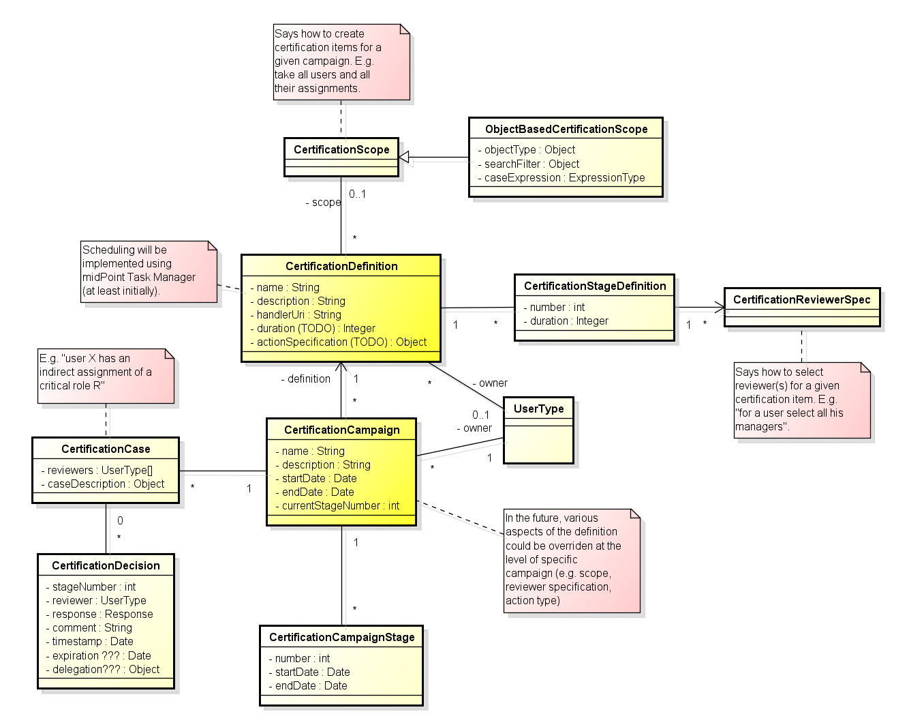
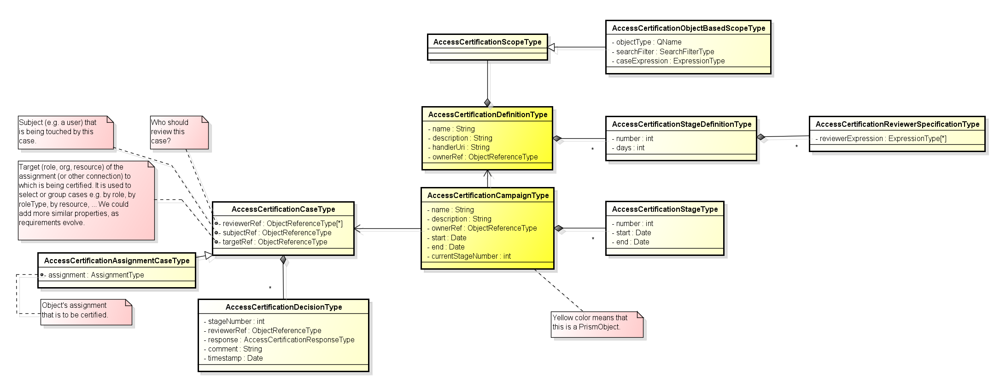

= Access Certification - requirements draft
:page-wiki-name: Access Certification - requirements draft
:page-wiki-metadata-create-user: mederly
:page-wiki-metadata-create-date: 2015-02-13T09:41:07.342+01:00
:page-wiki-metadata-modify-user: peterkortvel@gmail.com
:page-wiki-metadata-modify-date: 2016-02-20T15:47:08.067+01:00

== Basic concepts

. Certifications run in the form of *certification campaigns*. Each campaign has:

.. name + description,

.. owner (a user),

.. start + end time,

.. campaign definition,

.. state information (namely, current stage number indicating whether it is in a given stage, before the first stage, or after the last stage).

. *Campaign definition* specifies what has to be certified and how.
Specifically, it has the following attributes (described below):

.. name + description,

.. handlerUri - used to denote the type of certifications, e.g. user-assignment ones,

.. scope,

.. stage(s) specification, including how reviewers should be selected for each stage,

.. action specification (what should be done with identified certification cases),

.. typical duration,

.. schedule for automated scheduling of certification campaigns (if necessary).

_An example: "Standard recertification of users regarding security-critical roles."_

. *Certification scope* specifies the following:

.. type of access certification - in midPoint 3.2 at least the following types must be supported:

... user-centered certification - i.e. for selected users it will be possible to certify their user assignments (role, org, resource).

... abstract-role-centered certification (i.e. for Role as well as for Org) - i.e. for selected roles/orgs it will be possible to certify their role/org assignments and inducements (role, org, resource).

.. specification of focal objects (users, orgs, roles),

... all objects of a given type,

... or using search filter (this includes specifying a set of objects by name or by OID),

.. specification of assignments/inducements to be taken into account for certification (typically by using an expression).
Note that assignments/inducements pointing to roles/orgs marked as non-certifiable (certifiable==false) are by default excluded from the certification.
(Note that the _certifiable_ attribute probably won't be part of midPoint 3.2.)

A special case of certification cases are policy violations.
For example, violations of number of assignees, or SoD violations, and so on.
Contrary to the other certification cases (e.g. role assignments), these ones are - by default - suspicious; and generally it is expected that they will be marked as "reduce".

_An example: "All users; taking assignments of roles with risk level 'critical'"_

. *Reviewer specification* says who should review each certification case.
There should be at least the following options:

.. user's managers (in case of user-centered certification),

.. owners or approvers of target objects (role, org, resource) - may be different for specific kinds of target objects (e.g. roles / role types, orgs / org types / trees),

.. specific users,

.. generic expression specifying the reviewers.

Note that in case of multiple reviewers, there should be a policy saying whether all of them should respond, or anyone's opinion suffices.
If there are more responses, it should be specified how these should be merged to provide resulting opinion (in case of conflict).

Things to consider:

.. explicitly specified user's certifier

.. explicitly specified certifier for an org (for users in that org)

_An example: "First stage: at least one manager of a user must approve. Second stage: security admin must approve."_

. Reviewer specification can be separated into *multiple stages*, if necessary.
For example, in the first stage the users' managers may be queried.
After approving cases at this level, the owners of target objects might be queried.
And so on.
Each stage would have the following attributes:

.. number (1, 2, ...),

.. duration (e.g. number of days),

.. reviewer specification.

. *Action specification* says what is to be done after the review:

.. report only: all findings are summarized and presented in the form of a report,

.. automated adjustment: fix automatically everything that can be done, report the rest (or use workflows to provision the rest)

== General schema for the certification process

. A certification campaign is created and started (manually or automatically).

. *Certification cases* are identified.
A certification case is an item that has to be certified.
For example, a specific assignment of a given user.
Majority of cases is probably quite tangible and directly addressable (e.g. via user OID + assignment ID).
Other, however, might be more elusive.
For example, the fact that user U has been (indirectly) assigned role R. We cannot point to the repo at any specific place where this is defined.
Even for tangible cases there are questions like what if the assignment with a given ID would be replaced in the meanwhile? Shouldn't we use a value to point to the given assignment?

. The first certification stage starts.
Each case gets a set of reviewer, based on reviewer specification in stage definition.
Certification owner is notified.
Also reviewers obtain notifications about cases they have to review.

. Reviewers use a specially created GUI to enter their decisions.
A decision may be:

.. *Accept* (aka maintain, confirm, certify, approve, OK) - the situation was approved and can be left as it is.
It is possible to enter a date when the approval will *expire*. Until this time the item will be considered approved and will not be shown in the certification list for the given certifier.
(We have to decide how to implement this feature.
The most simple but not entirely correct solution is to set "validTo" date for a given assignment.
But it wouldn't work e.g. for indirect assignments.)

.. *Revoke* (aka reject, remove, "not OK") - the situation is unacceptable and has to be eliminated or disabled.
E.g. the assignment has to be removed or disabled.

.. *Reduce* (aka update) - situation is not acceptable; however, simple elimination/disabling is not necessary or not appropriate - someone has to look at this and try to find another solution.

.. *Not decided* (aka abstain) - responsible person says he/she is not able to decide

.. *Delegate* - responsible person delegates the decision to someone else

.. *No response* - nothing is entered in the given time frame

Decisions are attached to cases to which they are related.
Each decision is marked with the stage number, so it is possible to see what decisions were taken in which stage by which reviewers.

. Stage ends either when the specified time comes, or manually by certification campaign owner.
(In the future, the stage could have potentially its own owner.)

== Remediation

Remediation can be automated or manual.
Manual remediation is suitable e.g. in case when an indirect assignment is to be revoked.

Before remediation (automated or manual) there could be some simple approval process - e.g. user could be notified about coming action(s) and he/she can object against it.
There can be some resolution process for that.

After some remediation cases (mainly manual ones) the recertification could be requested.
Exact details are to be specified.
(Could we consider it to be like a separate certification stage, along with manual remediation being the stage before it?) Also, what if the recertification results in another "reduce" or "revoke" state?

== TODO - Monitoring / reporting

*This part is yet to be specified. The following are preliminary ideas only; not supported by conceptual nor design model.*

Reports should be able to tell the number of cases (or give a list of cases) by their state, e.g.:

. closed

.. certified "as is" (without manual/automated correction)

.. rejected and then automatically corrected

.. rejected, then manually corrected, and then certified (with any number of iterations)

. in-progress

.. awaiting initial certification request

.. awaiting additional certification request (after manual correction)

.. marked as "not decided" within initial certification

.. marked as "not decided" after manual correction

. Additional filters that should be possible:

.. by certifier decided - all cases where a certifier provided a decision

.. by certifier waiting - all cases where a certifier is requested to provide a decision

== TODO - further ideas

. Some roles are assigned via *rules*. (In midPoint these rules are typically included in object templates.) Would it be possible to review these rules instead of specific roles they create?

. Triggering certification of a user when a specified event occurs (e.g. user changes an org membership?)

== Conceptual Model

== Preliminary design model

'''
For the future:

. User-related certification cases other than assignments, e.g.

.. user accounts (all or specially-selected, based on: resources, groups, attribute values) - this implicitly includes user entitlements -  +
*(RS)* Do we need this? I see recertification as a policy thing.
MidPoint policy is formed by assignments.
Certification of assignments should be enough.

.. selected user attributes  +
*(RS)* We probably need this.
But it can be tricky to implement.
This will require attribute metadata.
This is looks like it will come beyond 3.2.

. Abstract role-related certification cases other than assignments/inducements, e.g.

.. users that have been assigned this role/org (directly or indirectly, in case of orgs treat also suborgs because of security implications)

.. roles/orgs that are inducing this role/org (directly or indirectly, in case of orgs treat also suborgs because of security implications)

.. selected role attributes (e.g. risk level, category, ...) *(RS)* Same as user attributes.

. Account-centered certification - i.e. for selected accounts it will be possible to certify their: +

.. owner midPoint user (or a lack thereof) *(RS)* Yes, but beyond 3.2.

.. attributes *(RS)* Not sure.
We should somehow utilize what we already have (mappings, links, assignments).

. Entitlement-centered certification - i.e. for selected groups/other entitlements it will be possible to certify their: *(RS)* This is definitely something for later.
If we need it at all.
Assignments should be quite well.

.. member accounts - which accounts are associated with this entitlement (e.g. which accounts belong to particular group, directly or indirectly)

.. member users - which midPoint users have this entitlement (?)

.. member accounts without midPoint user (?)

.. member entitlements - e.g. in case of groups: in groups is this particular group included (directly or indirectly (?))

.. contained entitlements - e.g. in case of groups: what groups are member of this particular group (directly or indirectly (?))

. Certification can be run in "campaign" or "continual" mode.

.. Campaign means that there is a defined time period during which a given certification runs: it has a defined start time, at which certification processes are started, and a defined end time, when all of them are expected to be successfully finished (and a certification report is produced).

.. Continual mode means the certification processes can be started at any time, subject to given requirements (e.g. that each user must be certified w.r.t. his role assignments at least once a year; that administrator groups membership must be certified at least once per month, etc) +
(Note: continual mode can perhaps be seen as frequently occurring campaigns, each of which selects only those objects that have not been certified for a given time.)