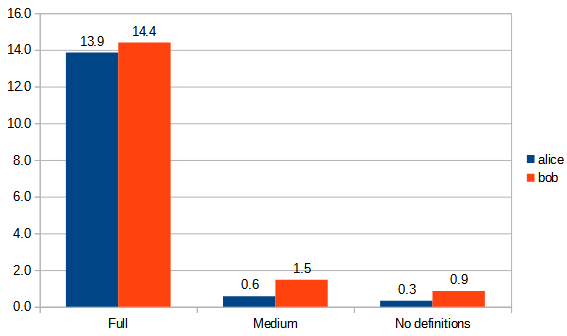
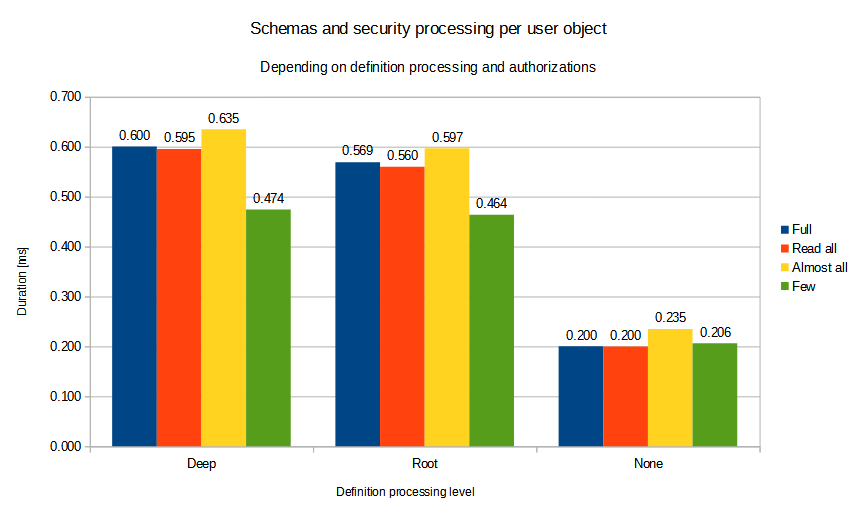
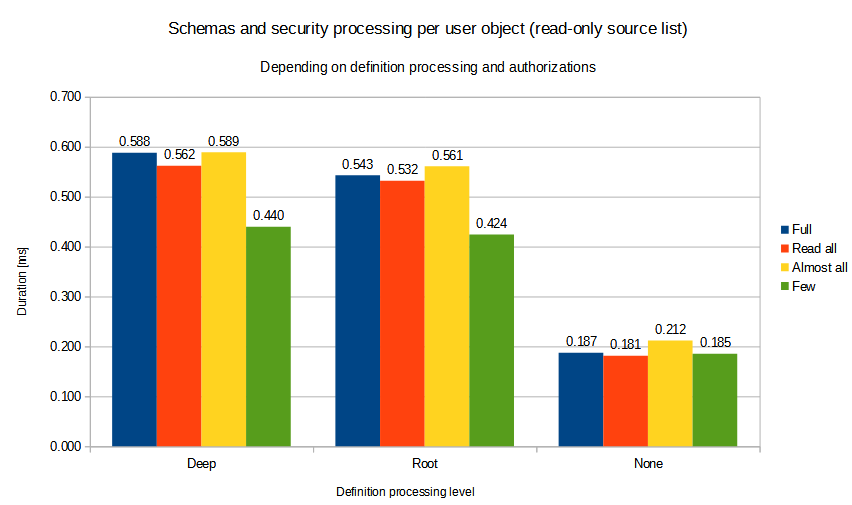
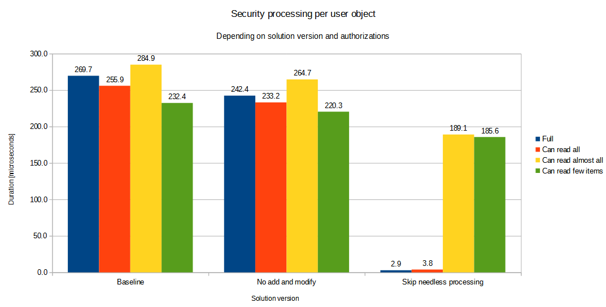

= Performance Evaluation
:page-toc: top

This is a slightly expanded, internal version of xref:summary.adoc[].
It contains details about variants of the solution that were considered and measured during the development.

There are two scenarios: the whole "get object" operation and the sole post-processing.
For their description, please see xref:summary.adoc[].

== Initial Measurements of the Whole "Get Object" Operation

First, we tested the overall performance of repeated `getObject` operation using the following three scenarios concerning `applySchemasAndSecurity` method:

. Full updating of both data and definitions (as in 4.7).
. Updating the data, with all definitions switching to transformable ones (to do template/archetype refinements if there were any).
No application of authorizations to definitions.
. Updating the data only.
Definitions were not touched.

At this point, we were not certain whether we will want to refine the schema by templates and archetypes.

[%autowidth]
|===
| Scenario | `alice` | `bob` | Improvement (`alice`) | Improvement (`bob`)

| Fully updating data and definitions (4.7)
| 13.862 ms
| 14.397 ms
|
|

| Updating data, switching definitions to transformables
| 0.577 ms
| 1.472 ms
| 95.8%
| 89.8%

| Updating data, ignoring definitions
| 0.334 ms
| 0.856 ms
| 97.6%
| 94.1%
|===

Later, we moved to lower-level measurements concentrated solely on the post-processing, because that parts of the code we planned to optimize.

== Initial Measurements of the Post-Processing

First of all, xref:design-meetings.adoc#_2023_04_19[it was decided] that midPoint will _not_ update the definitions, both top-level and at the level of individual items, with the result of authorization processing.

There are four authorization scenarios:

. superuser;
. role that can see https://github.com/Evolveum/midpoint/blob/master/model/model-impl/src/test/resources/perf/role-can-read-all.xml[the whole user object];
. role that can see https://github.com/Evolveum/midpoint/blob/master/model/model-impl/src/test/resources/perf/role-can-read-almost-all.xml[almost all the items] (all except one);
. role that can see https://github.com/Evolveum/midpoint/blob/master/model/model-impl/src/test/resources/perf/role-can-read-few.xml[only a few items] (one extension and one assignment property).

Concerning the definitions, we run the execution in three modes:

[%autowidth]
|===
| Mode | Description

| Deep
| Schema refinements are executed deeply:
Both in the object-level definition and in lowest item-level definitions (where they are defined).
For example, if `assignment/description` is refined, both object definition and the definitions of individual `description` properties in 51 assignments are modified.
| Root only
| Schema refinements ara executed only in the object-level definition.
| None
| Schema refinements are not applied.
|===

See also experimental https://github.com/Evolveum/midpoint/blob/b5db18c587dd73b7c3f3f0597275a83117d5f537/infra/schema/src/main/java/com/evolveum/midpoint/schema/DefinitionUpdateOption.java[DefinitionUpdateOption] class.

The tests were run three times, with the average values summarized here:

[%autowidth]
|===
| Definitions \ Authorizations | Full | Can read all | Can read almost all | Can read few items

| Deep | 0.600 ms | 0.595 ms | 0.635 ms | 0.474 ms
| Root only | 0.569 ms | 0.560 ms | 0.597 ms | 0.464 ms
| None | 0.200 ms | 0.200 ms | 0.235 ms | 0.206 ms
|===

Later, the test was slightly optimized:
The original list (containing immutable objects) was frozen and re-used, so the real test execution is now much faster.
(Creation of test objects, even if done in memory, takes considerable time.)

This had small influence on the performance:

Now, let us concentrate on optimizing the pure authorization application phase, without considering the definitions.
(We suppose this will be the mode in the real operation.)

== Further Improvements of the Post-Processing

The authorization application was improved in the following stages:

. Baseline: https://github.com/Evolveum/midpoint/commit/e828b741[e828b741]
. Elimination of needless `add` and `modify` authorization decision computations: https://github.com/Evolveum/midpoint/commit/64b6f210[64b6f210]
. Checking if authorization applications would yield any change and optimization of internal data structures: https://github.com/Evolveum/midpoint/commit/604d874d[604d874d]

Now the tests were executed as follows:

. They were run on a separate idle machine (slightly less performant).
. Each test was run 16 times, with two worst and two best times ignored.
. Schema refinements from object template and archetype were not applied - i.e., only authorizations were.
. In order to measure microsecond-level times, the fast tests were executed 20x more times.
Moreover, tests in step 2 and 3 were run with detached (and regularly thrown away) operation result objects to avoid out-of-memory conditions.
This may have a minor influence on the results.
(Testing code for step 2 was back-ported.)

The results are the following:

[%autowidth]
|===
| Version | Commit | Full | Can read all | Can read almost all | Can read few items

| Baseline | https://github.com/Evolveum/midpoint/commit/e828b741[e828b741] | 269.7 µs | 255.9 µs | 284.9 µs | 232.4 µs
| No `add` and `modify` checks | https://github.com/Evolveum/midpoint/commit/64b6f210[64b6f210] | 241.8 µs | 233.2 µs | 266.2 µs | 221.5 µs
| Skip needless autz processing | https://github.com/Evolveum/midpoint/commit/604d874d[604d874d] | 2.9 µs | 3.7 µs | 188.3 µs | 183.4 µs
|===

== Note about the Improvement Achieved

Overall, the observable performance improvement is mainly due to the elimination of processing that is currently seen as not strictly necessary:

. tailoring the object definition with authorizations (R - A - M flags) - this made the biggest difference;
. application of template/archetype refinements to the definition;
. simplification of internal data structures;
. using the simplified structures to determine if the authorization application can be skipped altogether.
