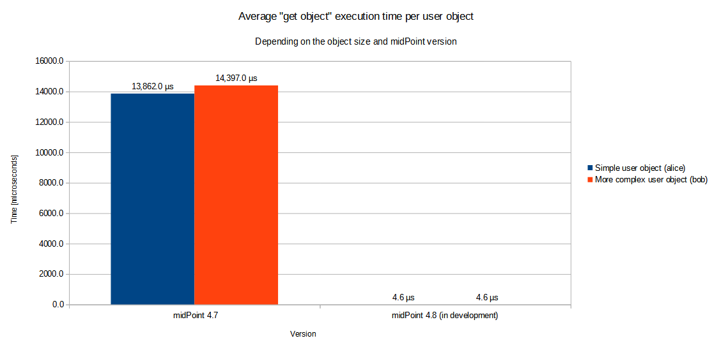

= Change Summary
:page-since: 4.8
:page-toc: top

In midPoint 4.8, we optimized the post-processing of retrieved objects that is executed in the xref:/midpoint/architecture/[IDM Model subsystem].
It was requested, for example, by bug:MID-8479[] and bug:MID-8370[].

Shortly put, we reduced the scope of post-processing in order to improve the performance.
The details are described below.

== Reduction of Processing

In midPoint up to 4.7, the post-processing includes the following:

. The application of _authorizations_ to the object _data_:
If a user has no rights to see a particular item, the item is removed from the object before it is passed from the IDM Model subsystem to the caller.

. The application of information from _object template_ and (sometimes) the _archetype_ to the object _definition_:
If a template overrides, for example, an item's display name, help text, cardinality (`minOccurs`, `maxOccurs`), and so on, the definition of the object and the particular item are updated with this information.

. The application of _authorizations_ to the object _definition_:
Besides the removal of the specified data items as mentioned above, the object definition is updated as well.
For example, if the logged-in user has no rights to see a particular item, the definition of that item is removed or marked as not readable.
If there is no right to add or modify the item, the item is marked as not applicable for add the or modify operation in the definition.

This provides a lot of interesting information for the caller.
Unfortunately, the price paid in terms of performance is enormous.

Hence, starting with 4.8, only the absolute minimum is carried out:
the application of authorizations to the object data (i.e., the first point).

The updated definition can still be obtained by calling `getEditObjectDefinition` method in the `ModelInteractionService`.

[NOTE]
====
Temporarily, at least during the development of midPoint 4.8, we provide a new `GetOperationOption`: `definitionUpdateOption`.
It drives the behavior related to the application of information from an object template to the object definition.
By setting its value to `FULL` one can restore the original functionality in the post-processing of objects returned.
(The authorization information is still not applied to the definition, though.)

This option is meant just for the purpose of experimentation during development.
We assume it will disappear before the release of midPoint 4.8.
====

=== Read-Only Objects

In 4.7 and before, when an object was requested in read-only mode, it was returned as mutable.
It is because the post-processing always created a copy of the object, and there was no point in freezing that unique copy.

Starting with 4.8, however, the post-processing tries to determine if there is any need to modify the object.
If not, and if the read-only option is selected, the object may be returned as immutable.
(For example, if it was fetched from a repository cache.)
This can provide substantial performance improvements, as described below.

== Performance Gains

Preliminary measurements indicate that the gains in post-processing performance are in the range of 50x to 5,000x (approximately).
Please see below for more details.

[NOTE]
====
The overall effects on performance in a specific deployment may vary from substantial to negligible.
It depends on how intensively the post-processing code is invoked.
In particular, if `midpoint.getObject` or `midpoint.searchObjects` methods are called frequently (for example, in mappings), the effects may be highly visible.

We consider measuring the effects using more real-world testing scenarios.
====

=== Evaluation Scenarios Description

We carried out two evaluation scenarios.

==== Measuring "Get Object" Operation
The first one deals with the whole "get object" operation.
This operation has two main components: retrieving the object from the repository and its post-processing.
The real-world experiences with midPoint 4.7 and earlier versions indicated that, mainly if the repository cache was used, the post-processing could take 10 to 100 more time than the cached repository access.

Our testing consisted of the repeated reading of two differently sized users via `getObject` method.
The repository cache was set up so that the time spent in the repository is minimized.
(This is a typical case when getting, e.g., roles with role caching enabled.)
The logged-in user was the `administrator` having full authorizations.

==== Measuring Post-Processing in Isolation
The second scenario deals with the post-processing (`applySchemasAndSecurity` and related methods) in isolation.

There were four variants tested, differing in the authorizations of the logged-in user:

. full (superuser) authorizations,
. an authorization to see the whole user object,
. an authorization to see almost all the items,
. an authorization to see only a few items.

=== Results

.Average "get object" operation execution time per user object
[%autowidth]
|===
| User object size | midPoint 4.7 | midPoint 4.8 (in development) | Improvement

| Simple user object
| 13,862.0 µs
| 4,6 µs
| 3,013x

| More complex user object
| 14,397.0 µs
| 4,6 µs
| 3,130x
|===

.Average post-processing execution time per user object
[%autowidth]
|===
| Authorizations | midPoint 4.7 | midPoint 4.8 (in development) | Improvement

| Full | 12,213.5 µs | 2.9 µs | 4,212x
| Can read all | 12,450.2 µs | 3.7 µs | 3,365x
| Can read almost all | 14,206.8 µs | 188.3 µs | 75x
| Can read few items | 15,683.3 µs | 183.4 µs | 86x
|===

=== Detailed Description

Here we provide a more detailed explanation of the above measurements.

==== Measuring "Get Object" Operation

The setup is as follows:
`TestOperationPerf` (in `story` module) creates two users, `alice` and `bob`.
They have five common properties each: `name`, `givenName`, `familyName`, `credentials/password/value`, and `activation/administrativeStatus`.
They have a defined number of single-valued extension properties.
Also, they have a defined number of values in `organization` property, mapped into respective role assignments.
Finally, there are standard midPoint-produced items (metadata, `roleMembershipRef` and so on).

.Differences between simple and more complex user object
[%autowidth]
|===
| User | Extension properties | Organizations/assignments

| `alice`
| 10
| 3
| `bob`
| 50
| 40
|===

The user logged in is `administrator`, so in fact, no items are removed because of authorizations.
This is the most common case, as usually all tasks and reports are run with full authorization.

There is neither a template nor an archetype to be applied.
The costs incurred are solely from the data traversal and definition wrapping and/or cloning.

Each test is run three times and consists of 1,000 calls to `model.getObject` that include fully cached H2 repository "get" operation followed by post-processing.
In 4.8, we increase the number of calls to 5,000,000 in order to measure the execution times with adequate precision.
(There are other required small changes that should have no significant effect on the results.)

==== Measuring Post-Processing in Isolation

In order to measure the post-processing code performance more precisely, a low-level `TestPerformance` class in `model-impl` module was created.

The test creates a list of 400 (in 4.7) or 4,000 (in 4.8) user objects, each having:

- 50 single-valued extension properties,
- 51 assignments (1 archetype and 50 roles),
- corresponding values in `archetypeRef` and `roleMembershipRef` items.

Each user has an archetype of `person` that is connected with the object template `person`.
The object template refines the definitions of 14 items.
Some of them are present in user objects, some are not.
There is a refinement of `assignment/description` that is present 51 times in each user object.

The user objects are immutable because we plan to prefer this mode of operation in the future.

Now the `applySchemasAndSecurityToObjects` method is called on the user list.

There are four authorization scenarios:

. superuser;
. role that can see the whole user object;
. role that can see almost all the items (all except one);
. role that can see only a few items (one extension and one assignment property).

We hope that scenarios 1 and 2 will be the usual ones for running reports and other read-intensive tasks.

One test execution consists of a heat-up cycle and then a number of measured cycles (10 for slower scenarios, 200 for faster ones).
The time for the execution is summed up and averaged per object processed.
Each scenario is run 16 times, with two worst and two best times ignored.

== References

For more information, please see the following commits: https://github.com/Evolveum/midpoint/commit/[1eefcaee], https://github.com/Evolveum/midpoint/commit/20302b00[20302b00], https://github.com/Evolveum/midpoint/commit/64b6f210[64b6f210], https://github.com/Evolveum/midpoint/commit/5752527e[5752527e], and https://github.com/Evolveum/midpoint/commit/08438ea6[5752527e].
