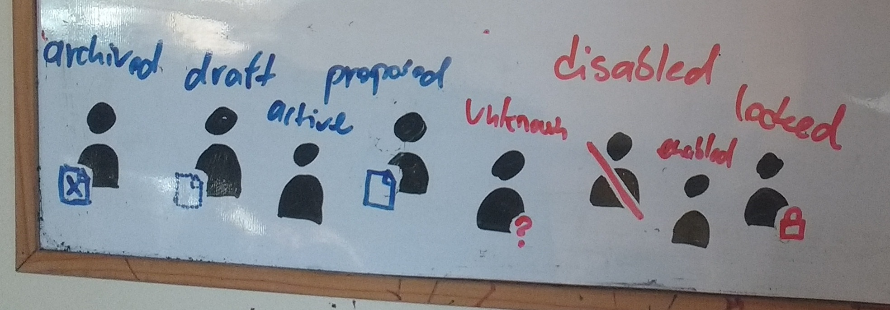

= Archetypes Design Notes
:page-wiki-name: Archetypes Design Notes
:page-wiki-id: 26870304
:page-wiki-metadata-create-user: semancik
:page-wiki-metadata-create-date: 2018-11-22T09:45:17.834+01:00
:page-wiki-metadata-modify-user: semancik
:page-wiki-metadata-modify-date: 2019-01-31T18:09:49.046+01:00
:page-toc: top

[NOTE]
.Partially implemented
====
This page describes a partially-implemented feature.

This feature is designed and some parts of it are implemented.
In case that you are interested in improving the implementatation please refer to xref:/support/subscription-sponsoring/[].
====

Planned feature description: wiki:Archetypes[Archetypes]

Archetypes define type/subtype of an object.
E.g. employee, project, business role, ... TODO

== Design Thoughts And Decisions

=== Archetypes as Abstract Roles

ArchetypeType is a special type (subclass) of AbstractRole type.
In that aspect it is very similar to Role, Org or Service - and it behaves in that way.
But in addition to normal role-like behavior archetype is giving the objects some character.
Or identity.
Archetype determines how the objects should be displayed (icon, color).
Archetypes may later determine schema extension of the object.
Archetypes may dictate object templates and lifecycle model.
Therefore lifecycles are quite special, because they defined *fundamental character* of an object.

In essence, archetypes work as other role-like objects.
Object is associated with an archetypes by using ordinary assignment:

[source,xml]
----
<user>
   <name>foo</name>
   ...
   <assignment>
       <targetRef oid="7135e68c-ee53-11e8-8025-170b77da3fd6" type="ArchetypeType"/> <!-- "employee" archetype -->
   </assignment>
</user>
----

Archetypes are defined almost like ordinary role:

[source,xml]
----
<archetype oid="7135e68c-ee53-11e8-8025-170b77da3fd6">
   <name>employee</name>
   ...
   <!-- definition of archetype icon, color and labels will be here -->
   ...
   <inducement>
       <!-- whatever roles, rules and privileges that an employee needs to have -->
   </inducement>
</archetype>
----

However, there are few differences.
Fist of all, archetypes needs to be processed by user interface in a very efficient way.
Archetypes define object icons, colors and other presentation aspects.
If the user interface is supposed to have any reasonable performance this needs to be determined very efficiently.
But archetypes are role-like objects, they can be assigned directly, indirectly, conditionally, they can even change (although this may be limited).
User interface cannot afford to evaluate all of that for every row of in a search results table.
Therefore there is short-cut: `archetypeRef`. This is a reference that is automatically computed by midPoint (similar to roleMembershipRef).
The `archetypeRef` reference points to all applicable archetypes for that specific object:

[source,xml]
----
<user>
   <name>foo</name>
   <archetypeRef oid="7135e68c-ee53-11e8-8025-170b77da3fd6" /> <!-- "employee" archetype -->
   ...
   <assignment>
       <targetRef oid="83614aaa-ee57-11e8-b770-7f3cb1d00719" type="RoleType"/> <!-- some role, that includes another role, that includes "employee" archetype -->
   </assignment>
</user>
----

Based on the information in `archetypeRef` reference the user interface can easily determine all applicable archetypes.
And therefore user interface can quickly display appropriate icon, color and label.

=== Archetypes Define Character And Behavior

Archetypes define how objects looks like and how they behave.
More specifically:

* icon, color, labels and similar presentation properties

* object template

* lifecycle model

* applicable policies (simplified "policies" tab in user interface)

* relations that can be used with the object type, e.g. whether objects can have owners, managers, etc.

* property constraints, conflict resolution, etc.

There is a special `archetypePolicy` item to specify archetype-related configuration:

[source,xml]
----
<archetype oid="7135e68c-ee53-11e8-8025-170b77da3fd6">
    <name>employee</name>
    ...
    <archetypePolicy>
        <display> <!-- icon, colors, etc. --> </display>
        <objectTemplateRef oid="..."/>
        <!-- lifecycle model, etc. -->
    </archetypePolicy>
    ...
</archetype>
----

Content of `archetypePolicy` container is very similar to `defaultObjectPolicyConfiguration` container in system configuration.
It essentially defines the same thing.
The `defaultObjectPolicyConfiguration` in system configuration is based on subtypes and it will probably get deprecated in some point in 4.x lifetime.
Archetypes should be a replacement for subtypes.

=== Chicken-Egg Problem Of Archetype Evaluation

Archetypes are really neat mechanism.
However, there is problem related to the way how midPoint wiki:Clockwork+and+Projector[Clockwork and Projector] works.
Projector needs to evaluate object template first.
Because object template may influence assignments (e.g. automatic assignment mappings).
Assignments are evaluated after object template.
But archetype is specified in an assignment.
And we need to evaluate archetype to determine object template.
But we need object template to evaluate assignments.

This is not archetype-specific problem.
Similar problem exists in case if we would want object template to be specified in organizational structure (e.g. per-tenant object template).

This can be obviously solved (or at least mitigated) with re-structuring projector and evaluating the assignments in two passes.
But that is likely to complicate projector code.
Significant refactoring may be needed to achieve full functionality.
And it might not be solved completely, as we may need some kind of priority evaluation of some assignments.
We can hardcode priority evaluation of archetypes in 4.0 - especially given the limitations described below.
However, this problem will need a complete solution sooner or later.

=== Archetypes And Views

Archetypes are concepts of midPoint object structure and typing.
Although it contains some parts related to presentation, archetypes in themselves are core midPoint concept.
There will be quite a lot user interface code related to artifacts.
But there is almost no default user interface behavior when archetypes is added to the system.
In fact, such archetype will be almost invisible for the user interface.
User interface needs to be configured to take full advantage of archetypes.

By default, archetypes should be properly displayed when listing objects.
E.g. there should proper icons and colors for users.
But that is pretty much all about the default behavior.
There will be no extra links in the menu, no buttons and so on.
All of that depends on the configuration of wiki:Object+Collections+and+Views[views]. And there are several good reasons for that behavior:

* Archetypes are midPoint objects.
They are not listed in system configuration or anywhere else where we can easily get them in sorted, annotated manner.

* Different user roles may need to display data in a different way.
It will be in fact more difficult to turn off all the default automagic behavior.

* It may be confusing to define default views directly in archetypes (see "considered and refused" below).

However, it is actually easy to properly display an archetype in the user menu using a view:

[source,xml]
----
...
<adminGuiConfiguration>
    <objectCollectionViews>
        <objectCollectionView>
            <identifier>empls-view</identifier>
            <type>UserType</type>
            <display>
                <label>Employees</label>
            </display>
            <collection>
                <collectionRef oid="7135e68c-ee53-11e8-8025-170b77da3fd6" type="ArchetypeType"/> <!-- "employee" archetype -->
            </collection>
        </objectCollectionView>
    </objectCollectionViews>
</adminGuiConfiguration>
...
----

This can be defined in global system configuration or in a role.
Such view should create "Employees" link in the menu in the "Users" section.

Collection reference may get quite complex (see below).
But in this case a simple `collectionRef` pointing to an archetype should be enough.

The view specifies a way how a collection of objects is displayed.
Creating appropriate menu item is just one of the aspects.
The view may also define how the actual list of objects looks like.
The view specifies the columns, defaults search settings and so on.
However, when the view is bound to an archetype, it can do even a bit more.
Such view can automatically render buttons to create new objects.
It is quite simple for views that use just one archetype.
It may be more complex for mixed views, such as organizational structure views (see below).

TODO: archetypes as top-level menu items

=== Archetypes And Collections

We already have mechanism for explicit filter-based wiki:Object+Collections+and+Views[explicit filter-based object collections]. However, it would not be convenient if we had to define explicit collection for each archetype.
And listing objects based on archetypes is going to be a very common operations.
Therefore archetypes will work as implicit collections.
Configuration of a _view_ can point directly to archetype definition and it will work as a collection of an objects of that type (see above).

Archetypes cat act as collection in two slightly distinct ways:

* Select objects of a particular archetype (_archetype_ interpretation of a collection).
This is the most natural way.
It is also a default interpretation in case that archetype is used as an implicit collection.

* Select objects that are assigned to an archetype (_assignment_ interpretation of a collection).
This may be used to select owners or approvers of an archetype definition.
This is seldom used.

TODO: explicit collection that use archetypes as base, e.g. "active employees"

=== Archetypes Display

Definition of archetype display properties:

[source,xml]
----
<archetype oid="7135e68c-ee53-11e8-8025-170b77da3fd6">
    <name>employee</name>
    ...
    <archetypePolicy>
        <display>
           <label>Employee</label>
           <pluralLabel>Employees</pluralLabel>
           <icon>
               <cssClass>fe fe-employee</cssClass>
               <color>blue</color>
           </icon>
        </display>
        ...
    </archetypePolicy>
    ...
</archetype>
----

The definition above specifies that this archetype should be referred to as "Employee".
When displaying the name in plural, then it should be "Employees".
The plural form is used for example in views.
There is also icon, specified as an cssClass.
And when the icon is displayed is should be displayed in blue.

It is important to remember that those display properties specify properties of the type.
Those are not properties of the archetypes object itself and those are not properties of each individual object either.
The display properties are interpreted in different ways depending on when they are defined:

[%autowidth]
|===
| Display properties | Path | Used when displaying | Example look for "employee" | Description

| Archetype display properties
| `$archetype/archetypePolicy/display`
| collection of objects of given archetype; or +
single object of given archetype (under some circumstances).
| Blue icon of a user (fa-user).
| Definition that should be used for objects of a particular type.
It has two related uses:

** Used when displaying lists and views.
E.g. menu or dashboard link to "Employees" can use this icon.

** Default icon for objects of that type.
E.g. if an employee does to have individual photo set up then this icon will be used.

** Efficient icon for object.
E.g. employees have photos set up, but displaying each individual scaled-down photo in a long list would not be efficient.
In that case archetype icon is used as an optimization.

This icon can also be used in situations when object archetype is more important than individual presentation (photo).

| Object display properties
| ``$object/display``
| Single object
| Photo of a user
| Optional definition that can be used to set individual presentation for each and every object.
This is often too difficult to maintain - unless it can be synchronized automatically or set up using a self service.
Typical use is to set up photo for each user.

| Archetype definition display properties
| `$archetype/display`
| Archetype definition
| Icon of archetype definition (fe-archetype)
| Icon of the archetype definition itself.
This is usually the same for all archetype definitions.
But as this is in fact just special case of the "iobject display properties" above, it can be used to set up individual presentation for each archetype definition.
However, this icon will be used only when displaying the definition itself.
It will never be used for any object that the definition applies to.

|===

Archetypes display the shape and color of a base icon for that particular archetype.
However, user interface can decorate the base icon with a couple of overlays.
The overlays specify object lifecycle state, wiki:Activation[activation status] or operation (if used in buttons and links).

=== Relations

Archetypes are supposed to also define relations, e.g.:

* Projects are organizational units that can have members, managers and owners.

* Business roles have members, owners and approvers.

* Departments are organizational units that may contain other organizational units (but only if they are of Section archetype), users and business roles.

In fact, this is not really specific to archetypes.
Any object which could be a target of an assignment should be able to specify constraints about the type (and archetype) of assignment holder.
And types of allowed relations.
This just gets much more interesting when archetypes are used.

Assignment and relation constraints can be specified using `assignmentRelation` container:

[source,xml]
----
<archetype oid="f0c8f25a-ef01-11e8-ac8a-0756607f94da">
   <name>business role</name>
   ...
   <inducement>
       <assignmentRelation>
           <holderType>UserType</holderType>
           <relation>default</relation>
       </assignmentRelation>
       <assignmentRelation>
           <holderType>UserType</holderType>
           <relation>approver</relation>
       </assignmentRelation>
       <assignmentRelation>
           <holderType>UserType</holderType>
           <holderArchetypeRef oid="7135e68c-ee53-11e8-8025-170b77da3fd6"/> <!-- "employee" archetype -->
           <relation>owner</relation>
       </assignmentRelation>
   </inducement>
</archetype>
----

The `assignmentRelation` mechanism can be used to limit assignment of the archetype itself.
E.g. we may want to limit _employee_ archetype in such a way that it can only apply to UserType:

[source,xml]
----
<archetype oid="7135e68c-ee53-11e8-8025-170b77da3fd6">
   <name>employee</name>
   ...
   <assignment>
       <assignmentRelation>
           <holderType>UserType</holderType>
           <relation>default</relation>
       </assignmentRelation>
   </assignment>
</archetype>
----

Initial implementation of assignmentRelation in midPoint 4.0 can be very simple, e.g. it can be limited:

* only archetypes may have assignmentRelation

* assignment/inducement that contains assignmentRelation must be always active (non-conditional)

* inducement order is always 1

Post-4.0: Later midPoint versions will probably relax those limitations.
Therefore we will need a mechanism to compute effective assignment constraints as operational property - in a similar way as we compute roleMembershipRef.
We can use `effectiveAssignmentRelation` element for this purpose.
However, what needs to be figured out is how GUI could discover assignable objects for a particular holder type.
Therefore it can be expected that at least `effectiveAssignmentRelation/holderType` will need to be indexed.

Another concern is compatibility.
Before 4.0, when no assignmentRelation existed, all objects could be assigned freely with any relation.
However, after 4.0 we want to be able to specify that a particular object type (archetype) is not assignable at all.
Therefore it would be better to assume that the object cannot be assigned unless there is an explicit assignmentRelation specification.
Yet, that would conflict with default behavior of midPoint 3.x. And in fact this default behavior may be too strict.
Default midPoint configuration would be almost useless.
Therefore we need some kind of setting to control the default behavior: allow any assignment (compatibility), allow no assignment (strict).

TODO Q: can "default archetype" (see below) be used for this purpose?

=== Archetypes In Organizational Structure

Archetypes can be used together with organizational structure in two related, but somehow different ways:

*Heterogeneous mode:* organizational unit may contain objects of many archetypes.
E.g. employees, external workers, business roles, resources, applications.
In this case each object must have explicitly assigned archetype.
Therefore each object will have at least two assignments: archetype assignment and organizational unit assignment.
This cannot be really simplified, as there may be too many combinations of archetypes and organizational structure placement.
This approach is ideal for functional organizational trees, multi-tenant organizations and so on.

In hetero-mode will user interface render a selection of various "create" buttons in organizational tree: create employee, create external user, create business role and so on.
User interface will need to analyze assignmentRelation of the parent organizational unit to find out which specific buttons to render.
If such a button is used, then user interface will prepare new object with two assignments: assignment to organizational unit and assignment to archetype.

*Homogeneous mode:* organizational unit may contain objects of a single archetype (or a handful of well-defined archetypes).
E.g. all organizational units in project-based organizational structure are projects.
In this case the project will only have one assignment - assignment to "project root" organizational unit.
The "project root" org will have inducement that sets _project_ archetype for every sub-org.

In homo-mode the user interface does not really know what are the archetypes induced by the "project root".
Therefore it can only render a generic "create suborg" button.
If that button is pressed the GUI will pre-populate new object with a single assignment to the "project root" org.
There will be no archetype information.
Which may be a problem, because GUI may take advantage of archetype information, e.g. to render a proper icon for a new object.
But this mode can still be useful.
And this can be improved later by introducing "inducedArchetype" informational property in assignmentRelation structure.

Hetero-mode is usually preferred.
It is almost certain, that homo-mode will not even work properly in 4.0.

=== Archetype Subtyping

Post-4.0

TODO: structural, auxiliary, abstract

=== Archetypes And Schema Extension

*Post-4.x*: Later (5.0) it may be possible for an archetype to define its own schema extension.

Similar functionality should be possible even in 4.x. But the deployer need to define all possible extension items in the schema extension in midPoint home.
Then per-archetype object templates can be used to limit the number of extension items applicable for each archetype.
But this "add all, remove excess" approach is quite troublesome to maintain - especially for large schema extensions.

In midPoint 5.0 this should be reversed: midPoint should start with empty schema extension, then archetypes will add only those extension elements that are needed.
Archetype definition will contain schema definition snippet.
This means that all archetype definitions will need to be pre-processed and the schema definition snippets injected into Prism schema registry.
But this should work well.
We are doing similar thing for relation definitions already.

However, even in 5.0 we may still need to define all those "flexible" extension elements on schema top-level (global) - similarly to LDAP schema.
This may be needed to properly process search queries.
Or alternatively we may need to extend search queries to be archetype-aware.
This needs to be further analyzed.

=== Misc

TODO: "Default archetype" in system config? E.g. to specify default assignmentRelation for all non-archetyped objects.

== Further Explanation

=== Why archetypeRef and not just roleMembershipRef?

We needed to know all applicable archetypes for each object.
And we need to have that stored.
RoleMembershipRef would work quite well for that with simple archetypes.
But once we have type hierarchy, then roleMembershipRef won't work.
There (most likely) won't be assignment/inducement relation between archetypes in type hierarchy.
Therefore the supertypes won't make it into roleMembershipRef.
Therefore we need archetypeRef.
We need all supertypes there.
We need that for searching.
E.g. searching for "person" archetype should also return objects that have "employee" archetype.
That information may not be in roleMembershipRef.

=== Legacy Subtypes

Subtypes will work in midPoint 4.x in the same way as they worked in 3.x. But they are no longer recommended and their use will be deprecated sometime during the 4.x midPoint development.
Subtype functionality will no longer be exteded.
Archetypes are supposed to completely replace subtypes.

=== Inspired by LDAP

Clever reader will surely notice similarity to LDAP object classes.
Indeed, LDAP was quite a big inspiration.
Why reinvent the wheel? LDAP principles work quite well.
Therefore it is better to reuse them than to reinvent the ideas.
Of course, we have made full validation of the approach that it actually matches the purposes of midPoint design.
And it does.

=== Archetypes, Collections and Types

Collections do not explicitly define type (e.g. UserType).
Types are specified when a collection is used.
This makes sense, as there may be collections that work with many types, e.g. organizational structure collections.

Therefore also archetype do not explicitly define type to which they can apply.
The type can be specified indirectly with assignmentRelation.
Theoretically, archetype may be applied to several types.
But that is not supported yet.
And not sure whether this is a good idea at all.

== Limitations

For now (4.0) at most one archetype for each object will be supported.
This is planned to be extended later.

Do not create too many archetypes.
They all need to be cached in RAM.
Tens or even hundreds are perfectly fine.
Thousands or more may be a problem.

Initial implementation of assignmentRelation in midPoint 4.0 can be very simple, e.g. it can be limited:

* only archetypes may have assignmentRelation

* assignment/inducement that contains assignmentRelation must be always active (non-conditional)

* inducement order is always 1

== Considered and Refused

Archetype-Metarole Duality: The original idea was to make archetype definition global (system configuration).
But that would mean that would mean duality of archetype definition and metarole (it is expected that archetypes will always come with role/metarole).
Having archetype definition as abstract role can solve this quite elegantly.

Subtype: The original idea was to use `subtype` instead of `archetypeRef`. But as the archetype design went on, it became quite clear that it is much better to identify archetypes using an OID, because:

* Archetypes need to be midPoint objects, e.g. to have owners, delegated administration, etc.

* We can use assignments/inducements to work with archetypes.

* No problem with subtype renames.

Archetypes are complete replacement for subtypes.
Subtypes will be deprecated in the future.
But they will stay for now and they are supposed to work in 4.0. They will get deprecated very soon, probably in 4.1. But they will work maybe all the way up until 5.0 (depends on subscriptions).

Archetype as a special case of Role, Org or Service (a la tenant): This may result in really complex and confusing situation.
E.g. in that case we might routinely apply archetypes to distinguish archetypes (meta-archetypes).
Also, simplifications that are needed for 4.0 may be quite difficult to implement.
User interface is likely to be confusing.
And there may be problems with archetype type hierarchy.
Having separate ArchetypeType seems to be simpler and cleaner solution.

Placing archetypePolicy into assignment/inducement: This would be strange.
Actually, it will only work for archetypes, but it will be in the schema for all objects that have assignments.
And we do not really need this - and it can even be harmful.
If we want to define behavior of objects on several "orders" we can do it with several archetypes, glued together in a metarole.
That would be cleaner.
And in that case we will also have proper OIDs in archetypeRef.

Default view in archetypes: archetype definitions may contain a "default view" definition.
Not sure whether this is a good idea.
Archetype should define a type of objects that are displayed, e.g. "customer roles".
But the administrator that is actually looking at the list of "customer roles" will not be member of any of those roles.
The administrator will not have the "customer role" archetypes assigned.
Therefore placing default view definition in the archetype can be very confusing.
The archetype is in itself an abstract role, therefore it can contain adminGuiConfig, which may contain view definition.
But that view will be applied to objects that have the archetype assigned and it is not applied when someone else is looking at the objects.
This is confusing enough.
Placing second view definition in the archetype definition may be even more confusing.
However, this may be reconsidered in the future.

== See Also

* wiki:Archetypes[Archetypes]