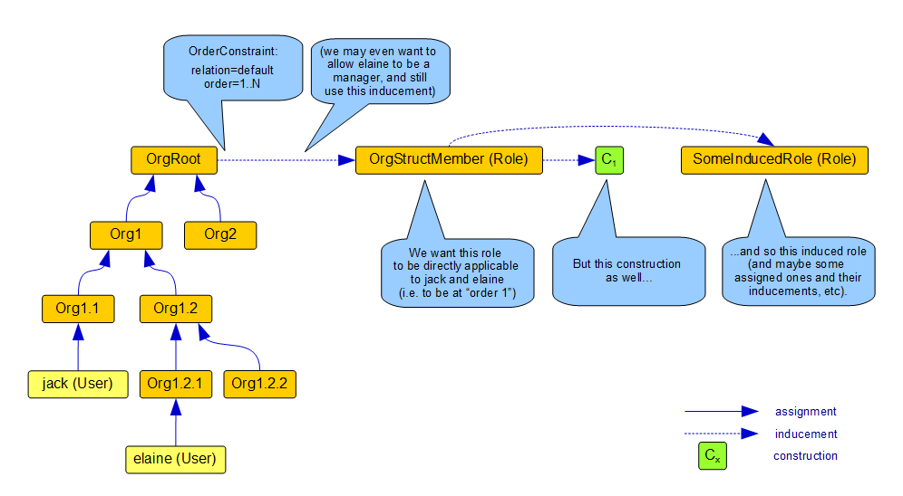

= Assignment Evaluator Questions and Ideas
:page-wiki-name: Assignment Evaluator Questions and Ideas

== Could metaroles induce roles? (RESOLVED)

Imagine this situation:

// Broken link, image seems to be lost
// image::assignments-variables.png[]
[ Image missing ]

Could MetarolePerson induce the Human role? It could, if we could manipulate evaluation order (the number of assignments) when we came across such "metarole to role" inducement.

Actually, such manipulation is already implemented.
When finding inducement with an order of N > 1, the overall order of the assignment path is lowered by N-1. So, e.g. when N=2, then metarole level becomes role level, meta-metarole becomes metarole, etc.

In the presence of various relations, things get a bit more complex, but not too much.
Currently implemented algorithm is: "when lowering order by M, take the last M non-delegation assignments on the path, and lower the corresponding evaluation order components".

== What about complex order constraints? (RESOLVED)

Now imagine this situation (inspired by link:https://jira.evolveum.com/browse/MID-3815[MID-3815]):

We want `OrgStructMember` to be induced to all users that are members or managers for any org unit under `OrgRoot`.

This could be done like this:

[source,xml]
----
<inducement>
  <orderConstraint>
    <relation>default</relation>
    <orderMin>0</orderMin>
    <orderMax>unbounded</orderMax>
  </orderConstraint>
  <focusType>UserType</focusType>
  ...
</inducement>
----

However, we want more: we need to attach some constructions to `OrgStructMember`, as well as some induced roles.
And here comes the problem.
We would need more generic version of evaluation order manipulation algorithm.
Basically, we want to tell the evaluator: when arriving at `OrgStructMember` role, reset the evaluation order to 1 ("role level").

It could be implemented like this:

[source,xml]
----
<inducement>
  <orderConstraint>
    <!-- no relation would be "summary order" (i.e. all non-delegation relations) -->
    <orderMin>1</orderMin>
    <orderMax>unbounded</orderMax>
    <resetOrder>1</resetOrder>
  </orderConstraint>
  <focusType>UserType</focusType>
  ...
</inducement>
----

The resetOrder instruction would tell the assignment evaluator to rewrite evaluation orders.
There are two possibilities:

. resetOrder is present on the summary order constraint.
This is the preferrable way.
The algorithm uses "go back N" approach described above: it takes current summary evaluation order, the new one (given by resetOrder value), and computes N as the difference of new-old.
Then it goes back N assignments.
(Taking into account other "go back N" inducements that might occur on the way backwards.)

. resetOrder is present on some of the relation-qualified components.
For example, one could rewrite the order by setting default := 1, manager := 0. Although this might be useful on some occasions, there could be problems when:

.. Another "go back N" inducement is positioned after this one; and the stepping backwards would include this inducement.
For such cases, the resulting evaluation order will be undefined.

.. When using this kind of resetOrder, it is sometimes not possible to correctly compute "evaluation order for target", which is necessary in order to collect target policy rules.
See also TestAssignmentProcessor2.test520.

