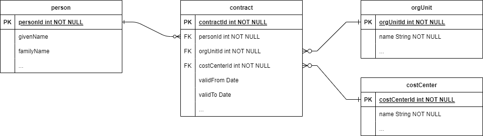

= Some Thoughts on Associations in 4.9
:page-toc: top

== Use Cases

The following use cases should be supported both in ConnId and in midPoint.

=== Structured Source Information

Consider HR system that models persons and their contracts to the organization, connected to organizational unit plus an independent structure of cost centers:

.HR structure

There are many more conceivable types of objects, like addresses of a person: permanent, temporary, correspondence, and so on.

.Addresses in HR

=== Rich Membership

Consider a target resource that does not model accesses using traditional membership relation between users and groups, but using more elaborate structures.
For example, let's have a document management system (DMS) that has users, document stores, and access rights.

.Document management system structure

=== Plain Membership

We still want to support "plain" membership information, i.e., one without any additional data.

Like in Active Directory:

.AD structure
image::target-ad.drawio.png[AD structure]

NOTE: This is an entity-relationship diagram but not for a database, so it's somehow tweaked.
"Sec" means the secondary identifier there.
Also, the two relations are, in fact, two manifestations of a single conceptual many-to-many relation: group membership of a user.

== Required ConnId Support for Querying and Updating

At the level of ConnId, we need to query and update individual data elements.

=== Plain Membership

We need to support these simple relations bidirectionally, that is, they should be queryable and updatable potentially from both sides:

- when reading user-side attribute (e.g., `memberOf`), we would like to get all the groups the user is member of;
- when updating this attribute (e.g., adding or removing DNs from `memberOf`), we would like to modify the group membership of this user.

We need to be aware that:

. There are resources that provide no user-side information at all.
. There are resources that provide user-side information only for querying, not for updating.
. There may be some limitations, like in AD, where the `memberOf` attribute provides DNs of all the groups the user is member of, _except for_ the user's primary group.
+
NOTE: That's why we probably should not reuse `memberOf` for the purpose of this connector-managed query-and-update-membership feature, but provide a different name.

=== Structured Source Information & Rich Membership

Again, also here we would like to query, and probably update the associated objects (`contract` in the HR case, `accessRight` in the DMS case) right on the owning object: `person` in HR, `user` in DMS.

== Proposed ConnId Design

There are two new concepts there:

. Associated objects
. Associations

=== Associated Objects

==== Structured Source Information & Rich Membership Cases

. The `contract`, `address`, `accessRight` will be fully functional connector objects.

. To distinguish them from the ordinary objects, let us call them _associated objects_.
They have their object class definitions, with a flag that indicates that the object class is an _associated object class_.

. The ordinary objects that are connected to the associated objects are called _owning objects_, or _owners_.

. These associated objects will be accessible as part of their owners' search operations.
(Not necessarily from all the sides, though.)
+
For example, when retrieving a `person`, the client could request returning also the values of (multivalued) `contract` item: either identifiers (`contractId` values), or the whole `contract` objects.
The client would request which behavior (ignore, return identifiers, return full values) it desires.
The full objects could be returned in the form of `ConnectorObject` instances, embedded in the item values being returned.
+
NOTE: It is not clear if the item containing reference or references to the associated objects (e.g., the `contract` item) should be an attribute or something different, like an association, or a reference.
It could be an attribute of a specific non-primitive type: `ObjectAssociation` or maybe `ObjectReference`.
There are reasons for both approaches.
For the time being, let us talk about them as association attributes or reference attributes.

. In theory, the client could request also deeper resolution, like providing also resolved `orgUnit` objects in the `contract` objects returned.
But in the near future this probably won't be necessary.

. When updating, there are three cases:
.. _Adding associated objects_.
This is most naturally done by providing the association/reference attribute values with the embedded objects (in object `create` or `modify` operation).
.. _Deleting associated objects_.
This can be done by providing identifiers of the embedded objects to be dis-associated from the owning object.
(The question if the associated objects should be deleted or not.
It depends on whether relation between subject and the associated object is mandatory at the associated object's side.
If so - and this is perhaps the most usual case - the associated object will need to be deleted.)
.. _Modifying associated objects_.
This will have to be a modification operation against the associated object class.
But the primary identifier (`Uid` in the ConnId language) won't be necessarily a single attribute.
For associated objects like `accessRight` in the DMS example, it will be a composite identifier, consisting of `uid`, `storeId`, and `accessLevel` attributes.

==== Plain Membership Case

There won't be any extra object classes.

=== Associations / References

What is needed, though, is a new concept of an _association_ / _reference_ [_attribute_].
It is a kind of link between objects that can be queried and updated in a flexible way.
For example, a link between AD user and AD group is an association/reference.

An association/reference always has two ends.
It can be one-to-one, one-to-many, or many-to-many.
If it's one-to-X, the "one" end may be optional or mandatory.

The association/reference will have a name that is potentially different on its ends.

==== Plain Membership Case

For example, the association/reference implementing the group membership in AD can be named `member` or `members` on the group side and `group` or `groups` on the user (member) side.
Both these sides will be multivalued.

==== Structured Source Information & Rich Membership Case

Here, there will be associations/references between the ordinary objects (`person`, `orgUnit`, `costCenter` in HR, and `user`, `documentStore` in DMS) and the associated objects (`contract` in HR, `accessRight` in DMS).

For example, a `person` will have an association/reference named `contract` that will point to its associated `contract` objects.
There may or may not be a manifestation of this association/reference at the `contract` side.
(It is not necessary mainly because it probably won't be addressed, as it is not updated from the outside.)

The `contract` will have associations/references named `orgUnit` and `costCenter` pointing to the `orgUnit` and `costCenter` objects, respectively.
Again, there need not be manifestations of these associations/references at the target sides, for the same reason as above.

For the DMS case, the `user` will have an association/reference named `accessRight` pointing to its associated `accessRight` objects.
As the `accessRight` objects will be probably queried and/or updated separately from the `user` objects, this reference will be represented also in `accessRight` object, probably as `user` item. The same is true for the `documentStore` side of `accessRight`.

=== Summary

For ConnId, we need two more or less independent new concepts:

. association/reference,
. associated object class.

The association/reference can exist without an associated object class, like in plain membership cases.
But associated object class requires associations/references to bind the associated objects to their owners.

== Proposed MidPoint Design

How should all of this be represented in midPoint?

=== Sources with Associated Object Classes

For strictly source resources, like HR, this situation is quite simple.
For each associated object class, we can define object type (or types), and create the binding to midPoint data.

For simplicity, we can assume that the associated objects will be retrieved together with the owner object.
(This means that there won't be any import tasks dealing with `contract` object class.
But that's OK.)

Each associated object type will be mapped to a specific focus item.
For example,

* The `contract` will be mapped to `assignment`, with the subtype (in the future, archetype) of `contract`.
* The `permanentAddress` (if specified as an association) will be mapped to `extension/primaryAddress` of type `ext:AddressType`.
* The `correspondenceAddress` (again, if specified as an association) will be mapped to `extension/correspondenceAddress` of type `ext:AddressType`.

Notes:

. There may be items of the associated object that will get mapped directly into the user's properties.
For example, we may want to fill-in `organizationUnit` property with the values of `orgUnit` attribute in `contract` object.
This can be configured simply by specifying `$focus/organizationalUnit` as the target in the corresponding mapping.
(Because the default will be `$focus` no longer!
It will be the `assignment` value into which we are mapping the respective `contract`.)

. We assume that the target item values (e.g., assignment values) will be created and deleted along with the appearance and disappearance of the source values.
(This is very similar to the behavior of `addFocus` and `deleteFocus` synchronization reactions at the ordinary resource object level.)
So, we only need to know what are the _keys_ for the target item, i.e. when there is a change in the `contract` object - assuming that it has no externally visible ID - whether we have to create a new assignment, or just update the existing one.

=== Sources with Plain Associations/Relations

#TODO#

=== Targets

There are a lot of open questions here.

#TODO#
