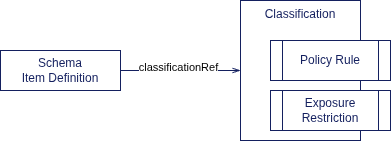
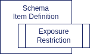

= Classification Design Notes
:page-nav-title: Classification
:page-toc: top

== Introduction and Motivation

Data _classification_ is a process of organizing data into categories,
according to their sensitivity, intended purpose, business value, impact, and (indirectly) the risk they pose, their compliance and security requirements.

Classification process relies on an organized system (classification scheme) and policies.

Proper classification mechanism can be used to detect possible policy violations and potential data leaks, such as:

* Detecting users who have access to sensitive data, yet they are not meeting the requirements (external user without signed DNA, internal user without proper training).

* Detecting dangerous or illegal data flows, e.g. confidential data flowing into a system used to store public data, risking unintentional exposure of confidential data.

* Identification of risk hot-spots, e.g. many users have access to applications storing sensitive data.

In simple cases the classification scheme can detect such cases and report them.
In mature cases the classification schema can be coupled by a policy which prohibits illegal or dangerous data flows, e.g. prohibit assignment of a role which gives access to a system storing sensitive data, unless the target user meets proper requirements (has appropriate _clearance_).

=== Classification Scheme

_Classification scheme_ is a definition of classification classes, or _levels_ as they are frequently called.
While in theory the classification scheme is specific to each organization, or even use case, many classification schemes are based on a common set of levels:

* _Public_: Data that were published, acquired from public sources, etc.
No special protection is usually required.

* _Community_: Data shared with students, customers, partners, etc.
There may be several separate community classifications.

* _Internal_: Data shared with an organization.
These data are shared more-or-less freely with any member of the organization (e.g. employees, staff).
Such data must not be shared with anyone who is not a member of the organization.

* _Restricted_: Data shared with selected people or teams with an organization.
In almost all the cases there are several "shades" of the _restricted_ level, restricting the data to specific teams, areas or purposes.

=== Classification Hierarchy

_Classifications_ are categories into which the data are organized.
Classifications usually form a hierarchy: "higher" levels are used for very sensitive data, "lower" levels are used for data that are not sensitive at all.

This hierarchy is usually not an simple ordered list or a tree.
It is usually a directed acyclic graph (DAG), forming a partially-ordered set of classifications.

The usual rules are as follows:

* Data classified at specific level may be freely re-classified at "higher" (more sensitive) level.
E.g. _public_ data may be freely stored in a system that contains _internal_ data, which effectively re-classifies the _public_ data as _internal_.

* Data classified at specific level must not be freely re-classified at "lower" (less sensitive) level.
E.g. _restricted_ data must not flow into a system that contains _internal_ data, unless there are specific security controls in place (e.g. review and approval).

== Classification in MidPoint

_Classifications_ (classification classes or levels) are represented as policy (`PolicyType`) objects with `Classification` archetype.

It is expected that the _classifications_ will be assigned to other objects that they relate to (e.g. applications).

As _classifications_ are policies, they act as meta-roles.
This allows classifications to express policy rules and requirements.
See xref:/midpoint/reference/roles-policies/policies/classification/[].

Classification hierarchy is only partially designed/implemented in midPoint, by using inducements between classifications.
This will most likely need to be improved in the future.

== Classification of Data

Currently (June 2026), there is no mechanism to classify _data_ in midPoint:

* *Schema annotation*: specifying classification for all data stored in specific item.
This can be simple and relatively powerful mechanism.

* *Metadata*: value metadata could be used to specify data classification on a per-value granularity.
This may be very powerful mechanism.
However, it is likely to have performance and storage impact.

Both mechanism can work on a similar principle, referring to a particular classification (archetyped policy object) using an object reference:

== Classification of Applications

Applications can be _classified_ similarly to data.
Classification of an applications means:

* Application contains data classified at this level.
The application may also contain data classified at "lower" (less sensitive) levels.
The classification reflects level of the most sensitive data stored in the application.

* Application classification also specifies _default classification level_ for any data originating from the application.
I.e. unless the data originating from the classification are explicitly labeled, application classification level is assumed as classification level for the unlabeled data.

WARNING: Classification of application does *not* automatically mean that the application meets requirements for storing data at the specified classification level.
Capability of application to meet security requirements is not expressed by _classification_.
This should be expressed by _clearance_.
E.g. the application should have a _clearance_ specifying appropriate certification or attestation to process data at particular level.
Applications classified at certain levels should be checked whether they have appropriate _clearances_.

== Classification of Roles

Roles may have classifications too.
In this case, the classification of the role specifies the "highest" (most sensitive) level of data that the role grants access to.

NOTE: This is just a rough idea now.
It may not be entirely correct.
We need to express the classification level of data that the role grants access to.
However, default assignment of a classification may not be appropriate.
Maybe we will need to use a special relation to express that.

== Exposure Restriction

Perhaps the most important purpose of classifications is to limit exposure of classified data.

We propose `exposureRestriction` element that could be placed at appropriate places: policies and assignments most likely.

Exposure restriction should have the following items:

* `sharing`: enumeration, specifying sharing restriction.
Values:

** `unrestricted`: No sharing restrictions, data could be shared as needed.
This is the default mode if no `exposureRestriction` exists.

** `limited`: Limited sharing.
Data may be shared only with systems that match the criteria specified in the `exposureRestriction` container.
If at least one criterion is specified and no value for `sharing` is specified, value of `limited` is implied.

** `confined`: Sharing not allowed.
The data must not be shared with any system.
I.e. the data must not leave midPoint and midPoint repository.

* `allowedClassification` (multivalue): Reference to classification where sharing is allowed.
The data may be shared with systems that are classified at this classification level or higher.

NOTE: This is just a rough design, it needs further refinement.

== MidPoint 4.11

*Use case:* Limit processing of certain schema items by AI mechanisms.
The AI mechanisms are not part of midPoint, may be hosted externally, which may lead to exposure of sensitive personal data (special categories of personal data or sensitive identifiers).

There is not enough capacity in midPoint 4.11 development plan to implement full data classification.
Therefore, simplified approach is proposed for midPoint 4.11.
Instead of using classifications and data classification references, _exposure restrictions_ could be placed directly into schema item definitions, in a form of schema annotation.

Only `unrestricted` and `confined` exposure restrictions will be implemented, and they will be used only for AI mechanisms in midPoint 4.11.

E.g. processing of specific items can be disabled by using the following schema annotation:

[source,xml]
----
        <xsd:annotation>
            <xsd:appinfo>
                <a:exposureRestriction>
                    <a:sharing>confined</a:sharing>
                </a:exposureRestriction>
            </xsd:appinfo>
        </xsd:annotation>
----

Simply speaking: if an item is annotated with the above annotation, the data stored in this item must never be used to processing by a remote service, especially not the remote LLM.

== Open Questions

* How to annotate built-in schema?
