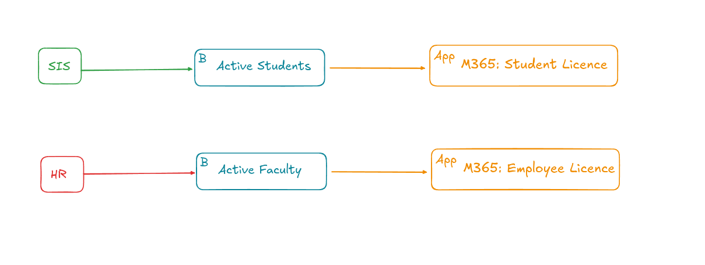
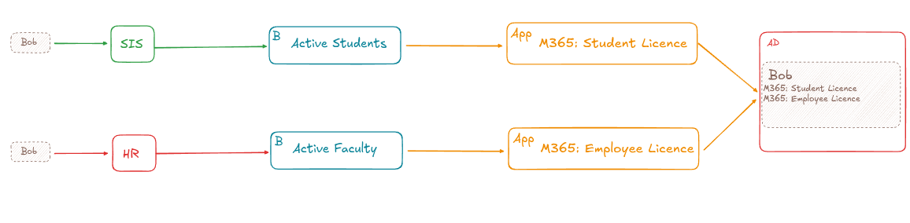
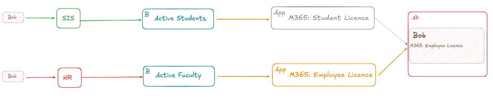

= Concurrent License Management
:page-toc: top

== Introduction

We have multiple use cases where we need to manage software licenses by midPoint.
Each license is represented by an application role.
Licenses are granted by indirect application role memberships through business role assignments.
Business role assignments are created automatically through the AssignmentTargetSearch feature.
There can be multiple inbound resources creating such assignments.

.Example university scenario

In general, this works fine.
However, we have more advanced use cases that we are not able to address for now.
For example, it is common for a student to be a university employee.
In the generic scenario, such a user would gain both licenses.

.Generic behavior

However, we do not want to assign both the M365 Student License and the M365 Employee License to the user (licenses are expensive so we do not want to waste them).
In such a case, we want to use only one of them (i.e., only the employee license as it also covers all student privileges).

.Desired behavior

Unfortunately, we are not able to create a configuration that would consistently provide the desired result.

== Desired Behavior

What we want to achieve is to be able to choose what role assignments are active/inactive in case multiple concurrent roles are assigned to a user.
This has to work for both direct and indirect role assignments.
The order, in which assignments are created, must not affect the result and the resulting state must be provisioned to target systems.

In our scenario:

- When a user becomes an active student, he/she is granted the _M365 Student License_.
- When such a user becomes also an active faculty, he/she is granted the _M365 Employee License_ and the _M365 Student License_ becomes _inactive_.
- When such a user loses the active faculty role, he/she loses also the _M365 Employee License_ but the _M365 Student License_ becomes _active_.
- The desired state is granted also if a user becomes both an active student and an active faculty during one reconciliation process.
- When a user is already an active faculty and becomes an active student, the _M365 Employee License_ stays _active_ and the newly created _M365 Student License_ assignment is _inactive_.

== Tested Configurations

MidPoint version 4.9.3

=== Conditional Inducement

We have created a conditional inducement from the Active Student role to the M365 Student License role:

[source,xml]
----
<inducement id="35">
    <targetRef oid="fe79f511-bfa2-4018-9fce-caddd31fe1f9" relation="org:default" type="c:RoleType"/>
    <condition>
        <expression>
            
        </expression>
    </condition>
</inducement>
----

The inducement should be applied only if a user does not have the _M365 Employee Licence_ assigned.
This configuration almost worked.
However, if both the _Active Student_ and _Active Faculty_ roles are assigned during a single user reconciliation process (These assignments are created through different inbound resources), then the condition was not applied and the user received both the _M365 Student License_ and the _M365 Employee License._
This was not visible at first because users' _All Accesses_ seemed to be correct, but within the AD projection, the user had still both licenses.

It happened because during the reconciliation, the assignments and the conditions were evaluated in an unfortunate order:

1. The _Active Student_ assignment was created.
2. The user does not have the employee license yet, therefore the _M365 Student License_ membership was created.
3. The _Active Faculty_ assignment was created.
4. The _M365 Employee License_ membership was created.
5. The AD provisioning was processed.
6. The second round of assignments evaluation corrected the licenses in midPoint.
7. *There is no second round of provisioning.*

Therefore, if assignments created by different resources are evaluated in the opposite order than we would want, the projection entitlements are not provisioned correctly to the AD.
To fix the inconsistency in the AD, a second reconciliation is needed.

In addition to the conditional inducement, we have also tried to create a mapping within the _PersonObjectTemplate_ which would be triggered after the assignments but before the provisioning phase.
The mapping should fix the licenses.
This approach was probably completely wrong and in the end, it did not work at all.
In the example below, the mapping recognizes that there are both the student and employee licenses assigned, but when trying to recompute the user again, it gets stuck in an infinite loop as the repetitive re-computations have no effect.

Example mapping (there were many more similar ones….):

[source,xml]
----
<mapping>
    <name>m365-mapping</name>
    <expression>
        
    </expression>
    <evaluationPhase>afterAssignments</evaluationPhase>
</mapping>
----

As another complementary configuration to the conditional inducement, we have also tried to hook up a policy with a policy rule to the _M365 Employee License_.
This policy rule (again probably completely wrong) should remove the _M365 Student License_ as a reaction to assigning the _M365 Employee License_.

[source,xml]
----
<policyRule>
    <name>Licence Policy Rule</name>
    <policyConstraints>
        <assignment id="7">
            <operation>add</operation>
        </assignment>
    </policyConstraints>
    <policyActions>
        <scriptExecution id="8">
            <executeScript xmlns:s="http://midpoint.evolveum.com/xml/ns/public/model/scripting-3">
                <s:action>
                    <s:type>execute-script</s:type>
                    <s:parameter>
                        <s:name>script</s:name>
                        <s:value xsi:type="c:ScriptExpressionEvaluatorType">
                            <code>
                                import com.evolveum.midpoint.xml.ns._public.common.common_3.AssignmentType
                                import com.evolveum.midpoint.xml.ns._public.common.common_3.ObjectReferenceType
                                import com.evolveum.midpoint.xml.ns._public.common.common_3.ActivationType
                                import com.evolveum.midpoint.xml.ns._public.common.common_3.RoleType
                                import com.evolveum.midpoint.prism.equivalence.EquivalenceStrategy

                                STUDENT_LICENCE_ROLE = "fe79f511-bfa2-4018-9fce-caddd31fe1f9"

                                user = input
                                userBefore = user.clone()

                                user.getRoleMembershipRef().removeAll {
                                    STUDENT_LICENCE_ROLE == it.getTargetRef().getOid()
                                }

                                delta = userBefore
                                        .asPrismObject()
                                        .diff(user.asPrismObject(), EquivalenceStrategy.IGNORE_METADATA)
                                midpoint.modifyObject(delta)
                            </code>
                        </s:value>
                    </s:parameter>
                </s:action>
            </executeScript>
        </scriptExecution>
    </policyActions>
</policyRule>
----

=== Segregation of Duties

As a different approach, we have tried to set up a pruning for the _M365 Student License_ as follows:

[source,xml]
----
<role xmlns="http://midpoint.evolveum.com/xml/ns/public/common/common-3" xmlns:c="http://midpoint.evolveum.com/xml/ns/public/common/common-3" xmlns:icfs="http://midpoint.evolveum.com/xml/ns/public/connector/icf-1/resource-schema-3" xmlns:org="http://midpoint.evolveum.com/xml/ns/public/common/org-3" xmlns:q="http://prism.evolveum.com/xml/ns/public/query-3" xmlns:ri="http://midpoint.evolveum.com/xml/ns/public/resource/instance-3" xmlns:t="http://prism.evolveum.com/xml/ns/public/types-3" xmlns:xsi="http://www.w3.org/2001/XMLSchema-instance" oid="fe79f511-bfa2-4018-9fce-caddd31fe1f9">
    <name>m365-student-licence</name>
    <assignment id="1">
        <targetRef oid="85680d53-ba0e-45c1-8fec-f7ffc0ad1a9f" relation="org:default" type="c:ArchetypeType"/>
        <activation/>
    </assignment>
    <assignment>
        <policyRule>
            <name>excluded-role</name>
            <policyConstraints>
                <exclusion>
                    <targetRef oid="0ec4d9cb-2c55-4efa-a655-e9341fddc0e2" type="RoleType"/>
                </exclusion>
            </policyConstraints>
            <policyActions>
                <prune/>
            </policyActions>
        </policyRule>
    </assignment>
    <activation/>
    <displayName>M365 Student Licence</displayName>
</role>
----

However, this does not work for two reasons:

1. The pruning cannot work with indirect assignments.
Not only does it remove the license role, but it also removes the directly assigned role which induces this role.
In this case, it removes the _Active Student_ assignment.
2. The pruning is bi-directional.
Meaning that you cannot tell that you prefer the _M365 Employee License_ over the _M365 Student License_.
It always removes the currently assigned role when trying to assign the other one.

=== Conditional Role

The same results as with the conditional inducement were produced also with the conditional role setup.
We have created a condition within the M365 Student License, with the same script as in the previous conditional inducement.

[source,xml]
----
<condition>
    <expression>
        
    </expression>
</condition>
----