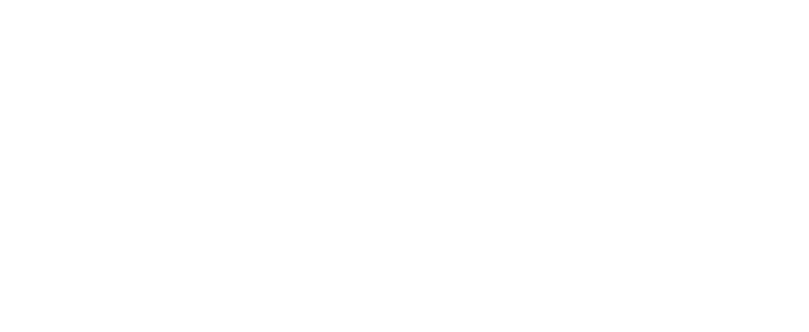
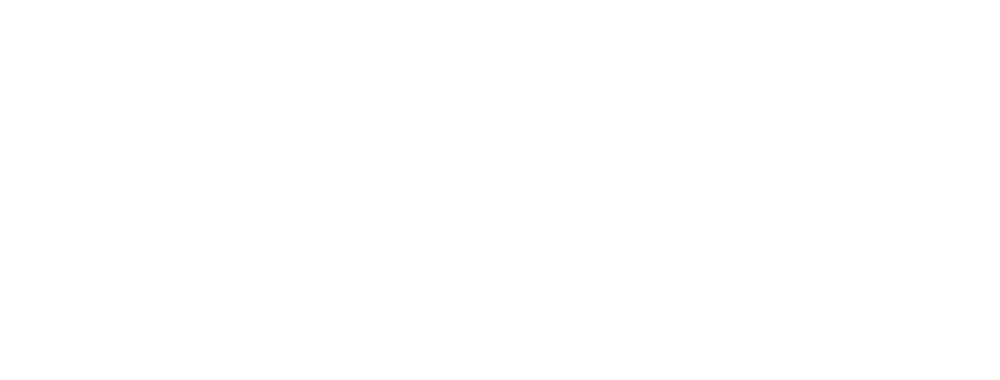

= Content assistant of Axiom Query language

The Content assistant is new feature of PRISM framework. Content assistant provides services for working with Axiom Query Language. Services such as semantic validation of language and automatic code completion are currently implemented.
The Content Assistant was designed to be easily scalable, allowing for the implementation of new services to enhance work with language in Midpoint web application and Midpoint studio also.

== Architecture
The architecture of Content Assistant in the *PRISM framework* is simple. In the link:./contentAssistUMLDiagram.png[UML diagram of classes] you can see mainly classes and relationships between them, the diagram is to provide a quick and accurate overview of the implementation. Internal methods and fields have been omitted for simplicity in the diagram.

The basis is class *AxiomQueryContentAssistImpl* which provides the implementation of the method *process()* which processes the input Query code and provides a list of semantic errors or generate suggestions at the cursor location. Errors are presented by the *AxiomQueryError* class and suggestions by the *Suggestions* class. Parameters AxiomQueryError and Suggestions you can see in diagram of classes. To provide semantic validation and code completion an input query input parse process needs to be performed. This process is performed only once for performance optimization. For the purpose of semantic analysis use the visitor pattern, as it's more flexible and it's full control of the traversal in tree. Semantic rules for validation and generate suggestions are implemented in the *AxiomQueryContentAssistantVisitor*. After a successful analysis by the visitor, a list of semantic errors and suggestions of code completions is available.

The services are available through the *AxiomQueryContentAssist* interface in the *prism-api* package.

== Semantic validation
The Visitor Pattern is a behavioral design pattern used to separate algorithms from the objects they operate on. In the context of ANTLR4, it allows you to traverse a parse tree and perform actions depending on the type of node encountered. This is particularly useful for interpreting or evaluating expressions, performing semantic validation, or translating DSLs into executable code.

Visitor *AxiomQueryContentAssistantVisitor* implementations semantics validation of Axiom Query language.Validation takes place by traversing the analysis tree, and at each node a check of the semantic rules of the input query is performed. This control of individual nodes of tree is implemented in the corresponding visit() methods.

The definition of PRISM is very important for semantics validation of axiom query language. Item definition can be updated several times during tree traversal. The initial definition is the input parameter *rootItemDefinition* of the constructor *AxiomQueryContentAssistantVisitor*, which is provided by the *schemaContext annotation* from schema. Previous definitions will also be needed to validation some concepts of language, therefore it cannot overwrite the definition, because of that it's necessary to save each changed definition. Definitions do save to table hash *itemDefinitions* of type *HashMap<ParseTree, Definition>*
in the subchapter below, is shown the mapping of the item definition based on the abstract syntactic tree (AST).

Unsuccessful validation of the semantic rule is recorded in the *errorList*, which is later provided to the visitor as a result of the semantic validation

=== Item definitions mapping by AST
When the semantic validation of concepts such as path, filterName, filterNameAlias ​​or subfilterOrValue needs to be performed on the basis of a correct definition, it is not possible to update the definition by rewriting. It is necessary to store a definition for each key concept of the language. The current key concepts of the language are *root*, *filter* and *itemFilter*.

The image below shows the do save of the table hash definition by AST for basic language concepts. Item definition is searched in the schema based on the context.

== Code completions
Code completion is the second service provided by the content assistant for Axiom Query Language. There are two ways to solve code completion with antlr4.

.  Visitor Pattern
* Code completions can be solved using the transition of the provided code, and proposals are generated based on a set of conditions that determine the next code completion. This method is easier to implement but has many negatives:
** mechanical set condition that determines the following completion of the code.
** complicate scaling when changing the grammar of the language or expanding the language
** with the complexity of the language, the performance decreases and the complexity of implementation is increasing

. ATN (Augmented Transition Networks) - state machine simulation
ANTLR provide ATN network from version 4. ANTLR4 whit ATN provides the option to simulate a state machine.
* simple scalability in the case of editing the grammar or expanding the language, it is not necessary to intervene in the implementation. Code completions will also work with new language edits in most cases. Dull implementation changes code completions depend on language modifications.
* higher level of clean and quality code
** complicate implementation

Correct localization of the cursor is an essential part of code completions. The input parameter postiion curtor specifies the number of characters after which code completions are called. Based on the number of the cursor position, a node is searched for in the analysis tree, which contains a branch that exactly corresponds to the cursor position. This node is represented with a PositonContext data structure. *PositionContex* contains two parameters first node from parse tree and index which present branch in the node. Invoke state is obtained based on the position context. From Invoke state stated searching expected tokens in ATN network. During the transition, the rules are also recorded, which later correspond to the found token.

Expected tokens are searched for in 2 phases, in the first phase, superior language concepts such as root and filter are processed, and next, low level language concepts such as itemFILter are processed.
It is not correct to use AST and nice functions that ANTLR4 provides us for working with the tree because we have to rely on the position of the cursor and not that the code ends at the position of the cursor. Because we need the context of the left and right side of the cursor for correctly searching for the definition in the scheme. The definitions are used from the table hash *itemDefifnition* after semantic validation, but in some cases it is necessary to find a better definition with better of the context from the right side of the code from the cursor.

In case the processed code is incomplete or incorrect from the point of view of syntax, we need to obtain an analysis tree. In this case, challenge the default antlr error strategy, which continues the analysis despite syntax errors. Then we have access to the analysis tree and can identify the node in which the syntax error is located.

After all epected tokens have been found, tokens are modified with semantic rules in the generateSugestion method. Semantic rules must also be taken into account in searching the ATN network. Then the method returns a generated suggestion of code completions from cursor position.

=== Exceptions
. code completions for dereference path & matches filter
. code completions for complications filter queries

== Integration in Midpoint studio

Content assistant is currently integrated in the midpoint studio Intellij IDEA.

Semantic validation runs automatically and provides quick responses with underlined code and error messages. A few errors were also added.

Code completion is triggered by a shortcut, usually *⌃⇧␣ (macOS) / Ctrl+Shift+Space (Windows/Linux)*
