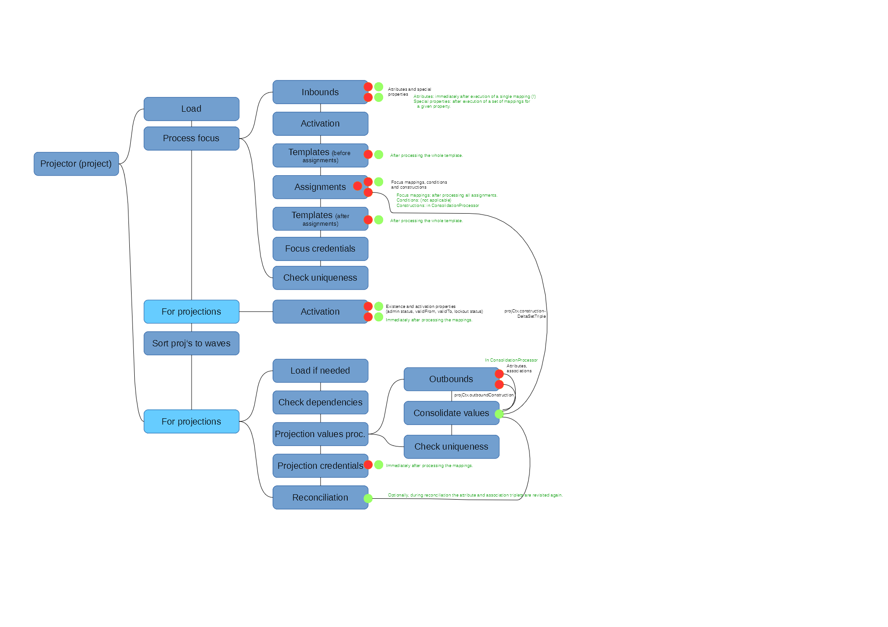

= Mapping Notes

WARNING: This is outdated. But it may still be worth updating someday.

[%autowidth]
|===
| Place | What | Method | Default source | User, Focus | Source | Iteration+Token | Configuration | Assignment path variables | Containing object,"thisObject" | Projection, shadow,account | Resource |  Other | Uses MappingEvaluator | Notes

.2+| AssignmentEvaluator
| condition
| `evaluateMappingAsCondition`
|
| Y
| Y
| -
| -
| Y
|
|
|
|
| Y
|

| focus mappings
| `evaluateFocusMappings`
|
| Y
|
| Y
| Y
| Y
|
|
|
|
| Y
| uses LensUtil.createFocusMappingEvaluated mappings are stored into EvaluatedAssignment.

| ObjectTemplateProcessor
| focus mappings
| `collectTripleFromMappings`
|
| Y
|
| Y
| Y
| -
|
|
|
|
| Y
| uses LensUtil.createFocusMapping

| Construction
| attributes, associations
| `evaluateAttribute``evaluateAssociation`
|
| Y
| Y
| -
|  Y
| Y
| Y
|
|  Y
| associationTargetObjectClassDefinition
| N/A
| Evaluation is postponed.
(To AssignmentProcessor.)

| CredentialsProcessor
| password mapping
| `processProjectionPassword`
| input (user password)
| Y
| -
| -
| Y
| -
| -
| Y
| Y
| -
| Y
|

.2+| InboundProcessor

| attributes
| `evaluateInboundMapping`
| input (attribute value)
| Y
| -
| -
| -
| -
| -
| Y (except projection)
| Y
| -
| Y
|

| password, admin status, validFrom, validTo
| `processSpecialPropertyInbound`
| input (particular special property)
| Y
| -
| -
| -
| -
| -
| Y (except projection)
| Y
| -
| Y
| uses MappingEvaluator.evaluateMappingSetProjection (quite sophisticated code)

| OutboundProcessor
| attributes, +
associations
| `processOutbound`
| -
| Y
| -
| Y
| Y
| -
| -
| Y (except shadow)
| Y
| associationTargetObjectClassDefinition,operation
| Y
|

.2+| ActivationProcessor
| existence
| `evaluateExistenceMapping`
| legal
| Y
|
|
|
|
|
| Y (only shadow)
| Y
| assigned, focusExists
| Y
| uses MappingEvaluator.evaluateMappingSetProjection (quite sophisticated code)

| administrative status, validFrom, validTo, lockout status
| `evaluateActivationMapping`
| input (various)
| Y
|
|
|
|
|
|
| Y
| administrativeStatus, legal, assigned, focusExists
| Y
| uses MappingEvaluator.evaluateMappingSetProjection (quite sophisticated code)

| TODO
|
|
|
|
|
|
|
|
|
|
|
|
|
|

|===

== Processing of mapping output triplets

[%autowidth]
|===
|  Place | What | Where consolidated to delta(s) | See | Notes

.3+| AssignmentEvaluator, +
AssignmentProcessor, +
Construction
| condition
| N/A
|
|

| focus mappings
| After processing all assignments.
| `ObjectTemplateProcessor.computeItemDeltas`
|

| attributes, associations from assignments
| Later in ConsolidationProcessor/ReconciliationProcessor.
Triples are stored in projCtx.*constructionDeltaSetTriple*.
|
|

| ObjectTemplateProcessor
| focus mappings
| After processing a template (still within processTemplate method).
| `ObjectTemplateProcessor.computeItemDeltas`
|

| CredentialsProcessor
| password mapping
| Just after evaluation.
Very special code because of the nature of resource object passwords.
| `CredentialsProcessor.processProjectionPassword`
|

.2+| InboundProcessor +
 +

| attributes
| Immediately after executing a single mapping (should be perhaps fixed).
| `InboundProcessor.evaluateInboundMapping`
|

| password, admin status, validFrom, validTo
| Immediately after executing a set of mappings for a given special attribute.
| `MappingEvaluator.evaluateMappingSetProjection``InboundProcessor.processSpecialPropertyInbound`
| Existing secondary deltas are removed, why? (line 667, 728)

| OutboundProcessor
| attributes, associations
| Later in ConsolidationProcessor/ReconciliationProcessor.
Triples are stored in projCtx.*outboundConstruction*.
|
|

.2+| ActivationProcessor
| existence
| Immediately after mapping evaluation.
| `MappingEvaluator.evaluateMappingSetProjection`
|

| administrative status, validFrom, validTo, lockout status
| Immediately after mapping evaluation.
| `MappingEvaluator.evaluateMappingSetProjection`
|

| TODO
|
|
|
|

|===

Places where triplets are processed:

. MappingEvaluator -> evaluateMappingSetProjection

. InboundProcessor -> evaluateInboundMapping

.  ObjectTemplateProcessor -> computeItemDeltas

.  ConsolidationProcessor, ReconciliationProcessor (for accounts).

TODO

. AssignmentProcessor.collectFocusTripleFromMappings always returns null - why?

== Where mappings are evaluated (red circles) and resulting triples processed (green ones)

